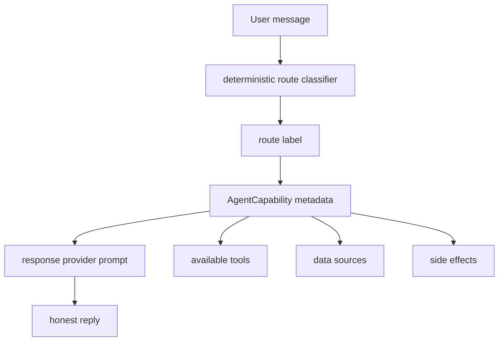

# Agent capability model: route honesty and tool boundaries

## Current decision

`my-agents` now keeps runnable practice/simulation agents out of this repository. Those live in `~/Git/Playground/langgraph-playground`.

Inside this backend, `AgentCapability` no longer distinguishes `real_world` vs `simulation`, and it no longer tracks toy/prototype maturity. It is now a smaller route-metadata object for the production `general_assistant` graph.

The purpose is still honesty, but the honesty target changed:

```text
old question: is this route backed by a real-world agent or a simulation?
new question: what tools, data sources, and side effects can this route actually use?
```

## Why this still matters

Route labels alone are not enough. A route such as `research_helper` means “use source-oriented answer behavior,” but it does not automatically mean that a separate research agent ran or that every research tool is available.

The graph should preserve the distinction between:

- **route label** — classification metadata for choosing response behavior;
- **capability metadata** — what the selected response path can use or claim;
- **service-layer work** — retrieval, authorization, persistence, citations, and events handled outside the graph.



## Current metadata shape

`my_agents/agents/capabilities.py` records only fields that provider guidance can use directly:

```python
class AgentCapability(BaseModel):
    name: str
    route_label: RouteLabel
    purpose: str
    tools: tuple[str, ...] = ()
    data_sources: tuple[str, ...] = ()
    side_effects: tuple[str, ...] = ()
```

Field meanings:

| Field | Meaning |
| --- | --- |
| `name` | Stable internal name for the response path. |
| `route_label` | Which classifier label selects this metadata. |
| `purpose` | Concise explanation of the route's response role. |
| `tools` | Tools this route may use through the provider/service boundary. |
| `data_sources` | Inputs the route can truthfully rely on. |
| `side_effects` | External calls or state changes that can happen. |

## Current route examples

- `general_assistant` handles ordinary guidance, planning, learning, career wording, and other non-source-oriented requests through the configured response provider.
- `research_helper` handles source-oriented requests and may use OpenAI hosted `web_search` in OpenAI mode, so its metadata includes that tool and side effect.

## Prompting rule

The response provider may use capability metadata to say what is available, but it must not invent:

- a separate specialized agent execution;
- completed actions that did not happen;
- persistent memory that was not provided;
- hidden tools;
- document access unless authorized context was supplied;
- external side effects not listed in metadata.

## Why not keep mode/maturity?

After moving practice agents to `langgraph-playground`, `mode="simulation"` became stale inside this backend. Keeping it would make current product routes look like practice scaffolding even though they are ordinary response paths in the production assistant graph.

Maturity labels were also too coarse. The real product question is not whether a route is “toy” or “prototype,” but what the route can safely claim and which tools/data/side effects actually exist.

## Revision history

- 2026-05-15: Created original note for the real-world vs simulated-agent distinction.
- 2026-06-08: Reframed after moving runnable practice agents to `langgraph-playground`; `AgentCapability` now records route honesty and tool boundaries only.
