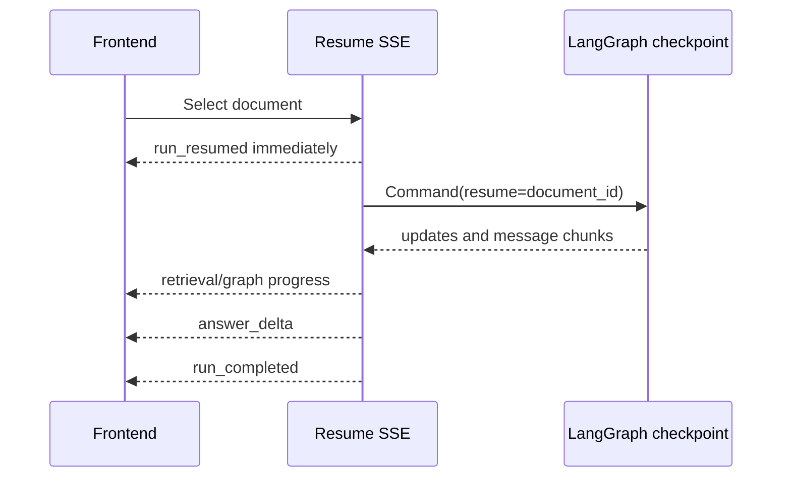

# HITL resume must stream the resumed run, not replay it

## Symptom

After an ambiguous document request interrupted for source selection, choosing a document left
the frontend frozen behind the choice card until the full answer completed. Only then did answer
text appear in several quick chunks.

## Root cause

The `/resume/stream` adapter called the synchronous resume endpoint inside its SSE generator.
That call executed the checkpoint to completion before the generator's first `yield`. The adapter
then split the already-complete reply into artificial `answer_delta` chunks. It emitted no
`run_resumed`, retrieval progress, or graph progress while the resumed graph was actually running.

## Rejected fixes

- Hiding the card only on the frontend would improve appearance but leave the backend buffered,
  with no real progress, answer growth, or cooperative cancellation.
- Polling the runs endpoint would eventually observe `running`, but would duplicate an SSE state
  transition and still provide no graph/message stream.
- Emitting only an early `run_resumed` before a blocking sync call would clear the card but still
  leave a silent, non-cancellable gap until completion.

## Fix

- Sync and streaming resume now share one authorization and atomic-claim helper.
- Streaming resume emits `run_resumed` first.
- The checkpoint is driven with LangGraph `stream_mode=["messages", "updates"]`.
- Retrieval and graph events are persisted and forwarded as their state becomes available.
- Provider message chunks become real `answer_delta` events; deterministic fallback chunking is
  used only when the graph emits no message chunks.
- Cancellation is checked between graph updates and deltas.

The frontend companion clears the answered interaction immediately, ignores stale waiting-run
cache recovery while resume is in flight, and restores the card only if server truth remains
waiting after failure.

## Verification

- The backend regression requires `run_resumed` to be the first resume SSE event and requires
  `retrieval_completed` and `graph_invoked` before `answer_delta`.
- The frontend regression deliberately withholds the first resume response event and verifies the
  pre-event interval at 390px and 1280px: no card, no waiting terminal, active progress, steering
  control, and a queueable follow-up.

## Follow-up risks

- Cancellation remains cooperative; a provider call that emits no graph/message step cannot be
  hard-aborted until control returns.
- Full-document response nodes intentionally buffer provider text so partial-coverage disclosure
  can precede visible answer text.
- A repeated graph interrupt must replace the cleared card with the new interaction.

## Revision history

- 2026-08-26: Created after replacing buffered resume replay with true checkpoint streaming.
