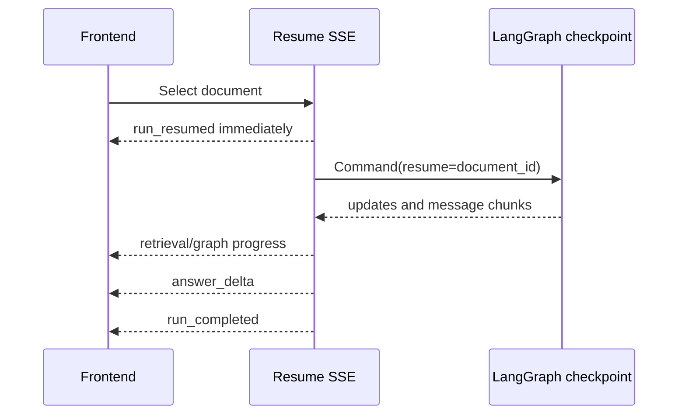

# HITL resume must stream the resumed run, not replay it

## Symptom

After an ambiguous document request interrupted for source selection, choosing a document left
the frontend frozen behind the choice card until the full answer completed. Only then did answer
text appear in several quick chunks.

## Root cause

The `/resume/stream` adapter called the synchronous resume endpoint inside its SSE generator.
That call executed the checkpoint to completion before the generator's first `yield`. The adapter
then split the already-complete reply into artificial `answer_delta` chunks. It emitted no
`run_resumed`, retrieval progress, or graph progress while the resumed graph was actually running.

## Rejected fixes

- Hiding the card only on the frontend would improve appearance but leave the backend buffered,
  with no real progress, answer growth, or cooperative cancellation.
- Polling the runs endpoint would eventually observe `running`, but would duplicate an SSE state
  transition and still provide no graph/message stream.
- Emitting only an early `run_resumed` before a blocking sync call would clear the card but still
  leave a silent, non-cancellable gap until completion.

## Fix

- Sync and streaming resume now share one authorization and atomic-claim helper.
- Streaming resume emits `run_resumed` first.
- The checkpoint is driven with LangGraph `stream_mode=["messages", "updates"]`.
- Retrieval and graph events are persisted and forwarded as their state becomes available.
- Provider message chunks become real `answer_delta` events; deterministic fallback chunking is
  used only when the graph emits no message chunks.
- Cancellation is checked between graph updates and deltas.

### Terminal finalization must share the failure boundary

Resume preparation atomically claims the waiting Product DB run by changing it to `running`
before the SSE generator executes. The first streaming implementation guarded graph iteration,
but terminal retrieval reconciliation, coverage validation, answer persistence, and event
serialization ran after that `try` block. An unexpected exception there could close the stream
without changing the claimed run from `running` or deleting its checkpoint.

The resume stream now keeps graph-iteration handling and terminal-finalization handling separate,
so an already-handled graph failure is not processed twice. Both phases reuse one safe failure
helper: persist `run_failed`, emit `run_failed` then `run_error`, redact the exception to its class,
and best-effort delete the run-scoped checkpoint.

The frontend companion clears the answered interaction immediately, ignores stale waiting-run
cache recovery while resume is in flight, and restores the card only if server truth remains
waiting after failure.

### Repeated interrupts must survive state reconstruction

Human refinement adds a valid third terminal shape: a resumed graph may interrupt again instead
of completing or failing. LangGraph's checkpoint snapshot contains graph values but not the
stream-only `__interrupt__` update. The resume collector formerly returned the snapshot alone,
silently discarded that second interrupt, and finalized the run as insufficient evidence.

The collector now overlays streamed node updates, including `__interrupt__`, onto the complete
checkpoint values. Product DB can therefore persist a fresh V2 attempt UUID while keeping the
same run, KB scope, transcript, and original deadline. Regression coverage drives two unresolved
refinements, verifies broad browsing is unlocked only after the second, and confirms that raw
human clues appear in neither messages nor activity events.

### The final model boundary must stream too

The transport and graph adapters can be correct while answers still appear in one jump. The
ordinary OpenAI responder called `ChatOpenAI.invoke()`, which returned one completed `AIMessage`.
LangGraph `stream_mode="messages"` therefore had only one message chunk to forward, and the SSE
endpoint emitted one `answer_delta` containing the entire reply. Retrieval-planning summaries still
appeared early because they came from graph updates, creating a misleading asymmetry.

Rejected fixes:

- Splitting the completed reply into artificial word chunks changes presentation but does not
  expose provider progress, improve time-to-first-token, or permit cancellation between real tokens.
- Changing the frontend or BFF cannot create chunk boundaries that the backend never emits.
- Calling `stream()` only for SSE endpoints would create two response-composition paths and risk
  parity drift in persisted replies and reasoning summaries.

The responder now calls `ChatOpenAI.stream()` for ordinary answers. Each `AIMessageChunk` flows
through LangGraph callbacks and is added into the same final message used by
`_extract_message_content` and `provider_reasoning_summary`. This preserves one provider call and
one source of truth: summary blocks remain outside reply text, while the aggregated answer is
byte-equivalent to the concatenated visible deltas. The deterministic and comprehensive-document
paths retain their intentional fallback or buffering behavior.

## Verification

- The backend regression requires `run_resumed` to be the first resume SSE event and requires
  `retrieval_completed` and `graph_invoked` before `answer_delta`.
- A finalization-failure regression raises after graph streaming has completed and verifies the
  Product DB run is `failed`, exactly one persisted `run_failed` event exists, the SSE terminates
  with `run_failed` / `run_error`, and the checkpoint thread is empty.
- The frontend regression deliberately withholds the first resume response event and verifies the
  pre-event interval at 390px and 1280px: no card, no waiting terminal, active progress, steering
  control, and a queueable follow-up.

## Follow-up risks

- Cancellation remains cooperative; a provider call that emits no graph/message step cannot be
  hard-aborted until control returns.
- Full-document response nodes intentionally buffer provider text so partial-coverage disclosure
  can precede visible answer text.
- A repeated graph interrupt must replace the cleared card with the new interaction.
- Chunk aggregation depends on LangChain preserving structured Responses API blocks when
  `AIMessageChunk` values are added; compatibility tests must move with adapter upgrades.
- A provider may still emit a large first chunk or delay its first token, so streaming improves the
  transport boundary but does not guarantee a specific cadence.

## Revision history

- 2026-09-02: Replaced the final responder's blocking model invocation with real provider chunk streaming and documented aggregation/reasoning-summary parity.
- 2026-08-31: Preserved repeated LangGraph interrupts during resume state reconstruction and documented the bounded V2 refinement loop.
- 2026-08-31: Added the post-loop terminal-finalization failure boundary so a claimed resume cannot remain stranded in `running` after reconciliation or persistence errors.
- 2026-08-26: Created after replacing buffered resume replay with true checkpoint streaming.
