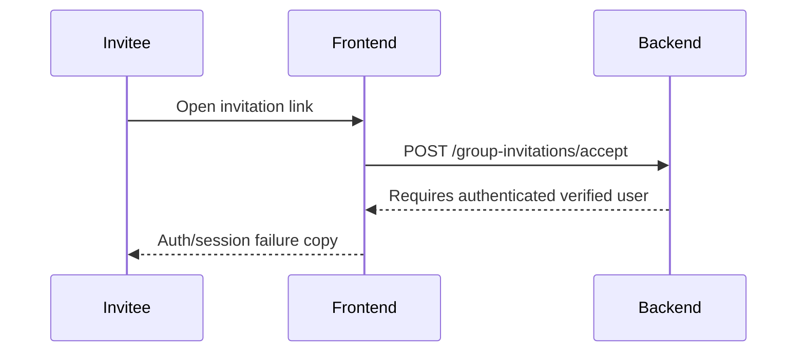
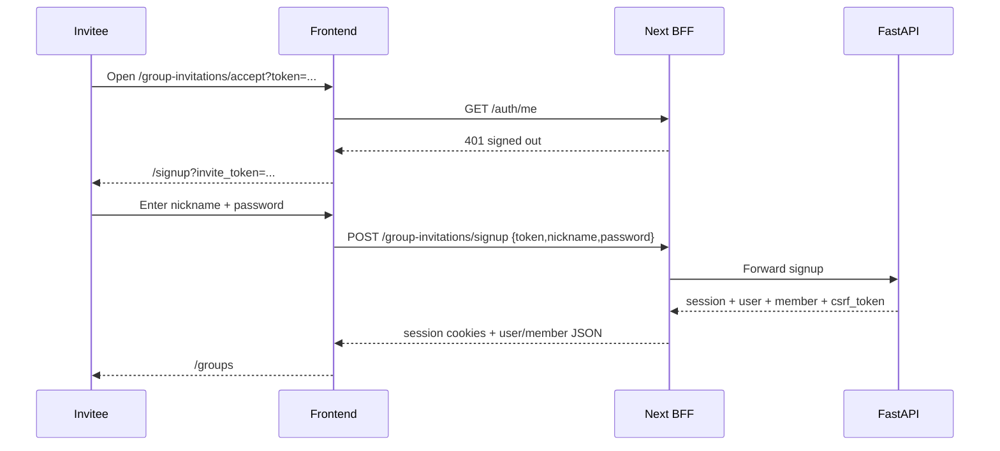

# Invitation-token signup and display-name boundary

## Symptom

A real production invitee opened a group invitation link before having a `my-agents` account and saw the authenticated-accept failure copy (`세션 증명이 만료되었습니다`). That was wrong for the intended product flow: a valid invitation email identity should let a no-account recipient create the account and join the group.

## Root cause

The invitation accept page and backend only modeled the **existing-account** path:

That flow protected against account enumeration, but it missed the no-account branch. It also risked confusing `nickname` with account identity if the signup page simply reused normal signup without explaining that the invited email remains the login identifier.

## Fix

The repaired flow keeps email identity token-proved and display names display-only:

Backend behavior:

- `POST /group-invitations/signup` accepts `token`, `nickname`, and `password` only.
- The new account email comes from the pending invitation, not browser input.
- The account is email-verified because the token was delivered to that address.
- The invitee's password is hashed normally.
- The membership is accepted in the same transaction.
- Existing accounts are rejected and must use login + `/group-invitations/accept`.

Frontend behavior:

- Signed-out invitation accept redirects to `/signup?invite_token=...`.
- Invite signup hides the email field and guest access panel.
- Invite signup submits token + trimmed nickname + password.
- The BFF treats invitation signup as a session-creating route and redacts `csrf_token` from browser JSON.

## Rejected fixes

- **Let nickname be used for login**: rejected because nickname is duplicate-allowed display metadata and would create account-discovery/identity ambiguity.
- **Ask the invitee to type email again**: rejected because the token already proves the invited email and manual email entry can introduce mismatches.
- **Auto-generate a password**: rejected because the invitee needs to own future login credentials.
- **Accept the invite before account creation**: rejected because pending invitations must not become active membership until there is an authenticated account identity.

## Tests and checks

- Backend API test covers no-account invitation signup, membership creation, email login success, and nickname login rejection.
- Backend API test covers existing-account rejection so signup cannot replace an existing account.
- Email-template tests now explain display-name/password signup and email-based future sign-in.
- Frontend Playwright coverage verifies signed-out redirect, hidden email field, and token/nickname/password POST body.

## Follow-up risks

- Hosted production still needs redeploy and smoke evidence through a real invitation email.
- If the backend OpenAPI served to the frontend lags this contract, the frontend must treat it as drift rather than adding user search or email-entry fallbacks.
- The route creates accounts outside normal public signup; that is intentional for token-proved invitations, but release notes should distinguish invite-only onboarding from open public signup.

## Revision history

- 2026-06-14: Created after fixing the no-account group invitation signup flow.
