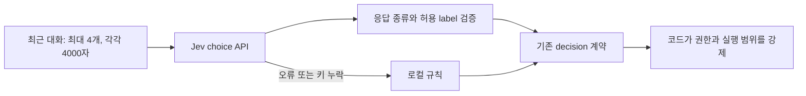

# Jev로 제한된 선택을 분리하기

기존 source gate는 답변용 모델을 호출해 두 label 중 하나를 골랐고, RAG selector는 Luna tool call을 사용했다.
이제 Jev는 미리 정한 choice를 선택하고, 기존 서비스가 권한 확인과 실행을 담당한다. 답변과 metadata 생성은 OpenAI에 남는다.
기존 choice 경로에서 ContextForge는 intent를 Jev로 분류하며 structured entity 추출과 scope 결정은 기존 규칙을 유지한다.

`ChatOpenAI` model 이름만 바꾸면 안 된다. Jev는 `/api/alpha/decisions`에 state와 questions를 보낸다.
`desk-lab`의 Choice 패턴을 참고하되 기존 httpx로 좁은 adapter를 구현해 dependency를 늘리지 않았다.
API 응답은 허용 label로 검증하며, 10초 timeout과 재시도 없는 호출 뒤 오류 시 로컬 규칙을 사용한다.
Confidence는 정답이나 권한의 증거가 아니므로 실제 데이터로 평가하기 전 임의 threshold는 두지 않는다.
Jev는 prose를 생성하지 않으므로 optional approach summary는 비워 둔다. 템플릿을 model-generated로 표시하면 기존 API 의미를 어기기 때문이다.

설정: `OPENROUTER_API_KEY`, `MY_AGENTS_DECISION_PROVIDER=jev`, `MY_AGENTS_JEV_TIMEOUT_SECONDS=10`.
`deterministic` response mode는 항상 외부 결정을 끈다. Decision provider를 `openai`로 바꾸면 이전 gate/selector와 로컬 intent로 되돌린다.
실제 한국어/영어 분류 정확도와 latency/cost는 아직 live 측정하지 않았다. Mock 테스트는 wire contract와 fallback을 검증할 뿐 정확도를 증명하지 않는다.

## Choice와 score의 다른 역할

2026-10-02 구현에서는 같은 adapter 경계에 score question을 추가했습니다. Choice는 실행할
operation 하나를 고르지만 score는 기존 권한 있는 후보의 순서만 바꿉니다. Jev가 후보를
만들거나 권한을 판단하지 않습니다. Rubric은 `0..4`의 의미를 고정하며 소수점 점수도 허용합니다.
이를 retrieval similarity나 확률로 해석해 기존 answer-mode threshold를 바꾸면 안 됩니다.

`MY_AGENTS_RERANKER_MODE=jev`가 기본값입니다. Routing provider와 독립적으로 설정하며
`deterministic`, `cross_encoder`도 유지합니다. 모든 batch가 성공해야 새 순서를 채택합니다.
한 batch만 실패해도 전체 원래 순서로 돌아가므로 일부 Jev 점수와 retrieval score를 섞지 않습니다.
질문과 권한 있는 발췌만 보내고 summary/file note/memory는 넣지 않습니다. UTF-8 byte 예산은
보수적인 요청 제한이며 tokenizer 기반 window는 아닙니다. 잘린 뒤쪽 근거의 손실과 batch 간
점수 일관성은 실제 한국어/영어/code 평가에서 확인해야 합니다.

[현재 계약](../../product-chat-service/37-jev-evidence-reranking.ko.md)과 mocked HTTP 테스트는
실패 시 동작을 보여줍니다. 실제 reranker 품질의 우월성을 증명하지는 않습니다.

## Revision history

- 2026-09-23: 세 결정 지점의 Jev 경계, fallback, 검증 한계 정리.
- 2026-10-02: 기본 Jev score 재순위, 전체 fallback과 원래 similarity 보존, 발췌 전송 범위와 검증 한계 추가.
