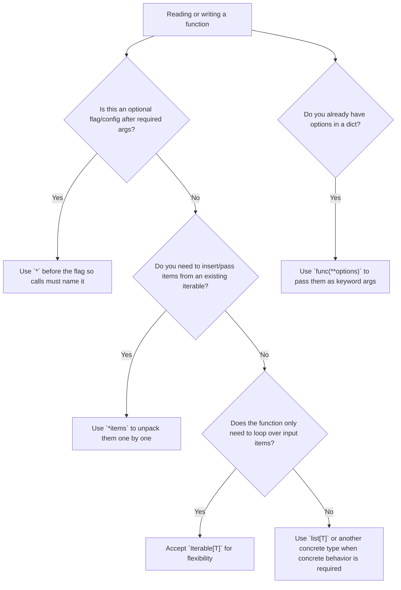

# Python syntax catch-up: `*`, `Iterable`, and `**`

This note captures Python syntax patterns that appear in the current assistant backend and are easy to miss when reading production-shaped code.

## Where these examples appear

| Syntax | Current code example | Main idea |
| --- | --- | --- |
| Standalone `*` in parameters | `_extract_message_content(response, *, debug_empty_response=False)` | Forces later arguments to be keyword-only. |
| `*` in a list/call expression | `[SystemMessage(...), *state["messages"]]` | Unpacks an iterable into individual items. |
| `**` in a call | `ChatOpenAI(**_build_chat_model_args(settings))` | Expands a dictionary into keyword arguments. |

## 1. Standalone `*` means keyword-only after this point

```python
def _extract_message_content(
    response: Any,
    *,
    debug_empty_response: bool = False,
) -> str:
    ...
```

The `*` by itself is not a parameter. It is a boundary marker.

Everything after it must be passed by name:

```python
_extract_message_content(response, debug_empty_response=True)
```

This is intentionally invalid:

```python
_extract_message_content(response, True)
```

Why this is useful:

- `True` by itself is hard to read at a call site.
- `debug_empty_response=True` explains the reason for the flag.
- It protects future readers from mixing up optional boolean/configuration arguments.

A simple mental model:

```python
def send_email(to: str, *, urgent: bool = False) -> None:
    ...

send_email("me@example.com", urgent=True)  # clear
send_email("me@example.com", True)         # rejected by Python
```

## 2. `*` can also unpack an iterable into individual items

Section 1 showed `*` inside a **function definition**:

```python
def send_email(to: str, *, urgent: bool = False) -> None:
    ...
```

That standalone `*` is a boundary marker for keyword-only parameters.

But `*` has another common meaning when it appears inside a **list, tuple, or function call expression**: it unpacks an iterable.

Current code example:

```python
response = tagent_with_tools.invoke(
    [SystemMessage(content=system_prompt), *state["messages"]]
)
```

If `state["messages"]` contains two messages:

```python
state["messages"] = [msg1, msg2]
```

then this list:

```python
[SystemMessage(content=system_prompt), *state["messages"]]
```

behaves like this:

```python
[SystemMessage(content=system_prompt), msg1, msg2]
```

The `*` does **not** add the list as one nested item. It opens the list and places each item into the surrounding list.

Compare:

```python
["system", messages]   # nested list: ["system", [msg1, msg2]]
["system", *messages]  # flat list:   ["system", msg1, msg2]
```

The same idea works in function calls:

```python
def add(a: int, b: int) -> int:
    return a + b

numbers = [2, 3]

add(*numbers)  # same as add(2, 3)
```

So the mental model is:

| Place where `*` appears | Meaning |
| --- | --- |
| In a function definition by itself | “Arguments after this must be named.” |
| In a list/tuple/call expression before a value | “Open this iterable and insert/pass its items one by one.” |

### Side note: what does `Iterable` mean here?

Unpacking works on iterable values. `Iterable[BaseMessage]` means “anything that can produce `BaseMessage` items,” such as a list, tuple, or generator.

```python
def classify_messages(messages: Iterable[BaseMessage]) -> RouteDecision:
    message_list = list(messages)
    latest_user_message = _latest_human_text(message_list)
    return classify_message(latest_user_message, message_list[:-1])
```

Use `Iterable[...]` when the function only needs to consume items. Use `list[...]` when it needs list-specific behavior such as indexing, mutation, or repeated access.

Important detail in the current code: `classify_messages` immediately converts the iterable to a list because it needs to search and slice the messages afterward. The public input type stays flexible, while the inside of the function gets the list behavior it needs.

## 3. `**` expands a dictionary into keyword arguments

```python
self._chat_model = chat_model or ChatOpenAI(**_build_chat_model_args(settings))
```

If `_build_chat_model_args(settings)` returns this dictionary:

```python
{
    "model": "gpt-5.5",
    "timeout": 30,
    "max_completion_tokens": 1200,
}
```

then this call:

```python
ChatOpenAI(**_build_chat_model_args(settings))
```

behaves like this:

```python
ChatOpenAI(
    model="gpt-5.5",
    timeout=30,
    max_completion_tokens=1200,
)
```

This is useful when configuration is assembled in one function but passed into another class or function as named options.

The full line also uses `or` as a fallback:

```python
self._chat_model = chat_model or ChatOpenAI(**_build_chat_model_args(settings))
```

Meaning:

```python
if chat_model:
    self._chat_model = chat_model
else:
    self._chat_model = ChatOpenAI(**_build_chat_model_args(settings))
```

In this project, that lets tests inject a fake chat model without requiring a real OpenAI call.

## Quick decision guide



## Practice exercises

1. Find another optional boolean argument in the codebase. Would keyword-only syntax make the call site clearer?
2. Find a list expression that combines one fixed item with many existing items. Would `*items` keep the result flat?
3. Look for a function that accepts a list. Does it mutate/index the list, or could it accept an `Iterable`?
4. Print `_build_chat_model_args(settings)` in a safe test context and compare the dictionary keys with the `ChatOpenAI(...)` options.

## Revision history

- 2026-05-18: Revised section 2 to explain `*iterable` unpacking separately from keyword-only `*`.
- 2026-05-15: Created learning log for `Python syntax catch-up: *, Iterable, and **`.
- 2026-06-08: Removed stale simulated-agent related-code path after moving runnable practice code to `langgraph-playground`.
