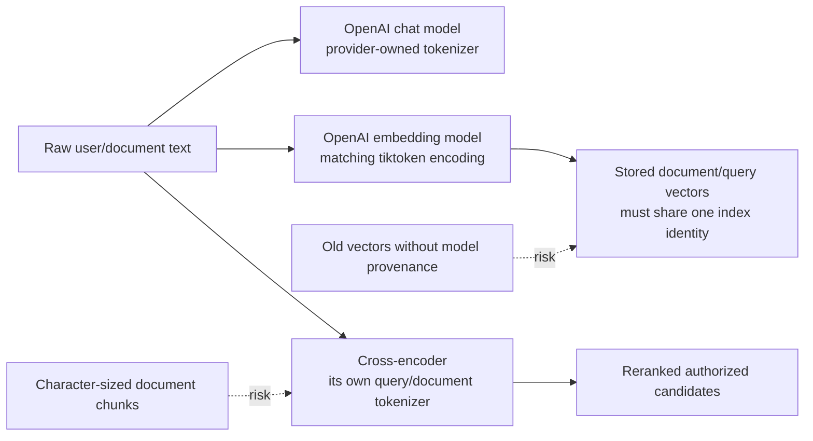

# Tokenizer consistency audit and RAG index safety

## Why this review exists

`my-agents` started before the owner had a clear mental model for LLM tokenization. A later
code-backed review asked the right follow-up question: does the backend need one tokenizer
everywhere, and could the existing retrieval pipeline already be mixing incompatible token or
embedding representations?

The most important correction is:

> A multi-model system should not force one shared tokenizer across chat generation, embeddings,
> and reranking. Each pretrained model must use the tokenizer it was trained with. Consistency is
> required inside each model boundary and across artifacts that are compared directly.

For this project, raw text crosses the chat/reranker boundaries and numeric vectors cross the
embedding/retrieval boundary. Token IDs from one model are not passed into another model.



## Verified implementation snapshot

This snapshot was taken on 2026-07-14 from the repository and safe effective settings without
reading or printing secrets.

| Boundary | Current behavior | Consistency assessment |
| --- | --- | --- |
| Chat generation | `ChatOpenAI` sends text to the configured GPT model (`gpt-5.6-sol` by default) through the Responses API. OpenAI applies the hosted model tokenizer. | Correct boundary; the app should not substitute an unrelated local tokenizer. |
| Embeddings | `OpenAIEmbeddings` uses `text-embedding-3-small`; installed `tiktoken` maps it to `cl100k_base` for length-safe embedding input handling. | Correct for new document/query calls using the same configuration. |
| Reranking | `sentence-transformers.CrossEncoder` tokenizes `(query, chunk)` pairs with the selected cross-encoder tokenizer. | Correct model boundary, but model choice and truncation policy need work. |
| Document chunking | Extraction targets 1,500 characters with 200-character overlap. | Language-dependent proxy, not a reliable downstream token budget. |
| Context packing | ContextForge caps 12 injected chunks and 24,000 characters. | Useful hard bound, but not a model-token guarantee. |

The committed reranker default is already `BAAI/bge-reranker-v2-m3` in `settings.py`,
`.env.example`, tests, and the ContextForge README pair. The effective local settings during this
review instead selected `cross-encoder/ms-marco-MiniLM-L-6-v2`. That is an environment/runtime
override, not the repository default.

## Risk 1: the active MS MARCO reranker silently truncates Korean chunks

The active MiniLM reranker uses an English-oriented BERT WordPiece tokenizer with a 512-token
maximum sequence. The extraction pipeline supplies chunks sized by characters, and the reranker
passes each full `(rewritten query, chunk text)` pair to `CrossEncoder.predict(...)` without an
app-owned token windowing or truncation audit.

A representative local probe over synthetic 1,500-character samples produced:

| Sample | Embedding tokens | Full reranker pair | Pair retained by reranker | Outcome |
| --- | ---: | ---: | ---: | --- |
| English prose | 251 | 337 | 337 | Fits |
| Korean prose | 1,054 | 2,388 | 512 | Heavily truncated |
| Python-like code | 316 | 513 | 512 | Slightly truncated |

These numbers are diagnostic examples, not a production-corpus benchmark. They nevertheless prove
that equal character budgets do not produce equal reranker budgets. For Korean, relevant evidence
near the end of a chunk can become invisible to the second-stage relevance judge.

### Decision

- Use the committed `BAAI/bge-reranker-v2-m3` direction instead of the MS MARCO MiniLM override for
  Korean/multilingual retrieval.
- Do not treat the model-name change alone as completion. Run Korean, English, and code retrieval
  eval fixtures and record latency/memory behavior on the intended runtime.
- Add query-aware token windowing before reranking. Reserve tokens for the query and special tokens,
  split an over-limit document chunk into overlapping reranker-token windows, score each window, and
  aggregate deterministically, initially with the maximum window score.
- Record whether any candidate was windowed or truncated in redacted retrieval evidence.

## Risk 2: stored embeddings do not carry a comparable index identity

Ingestion embeds document chunks with the provider configured at ingestion time. Retrieval embeds
the new query with the provider configured at query time. This is correct only when the stored
vectors and query vector belong to the same embedding space.

The current persistence model stores vector values but does not attach a complete embedding index
identity to each extraction run/chunk. The fallback compatibility check only proves that two vectors
have the same length:

```python
def _compatible_embeddings(left: list[float], right: list[float]) -> bool:
    return bool(left) and bool(right) and len(left) == len(right)
```

Equal dimensions do not prove equal meaning. Two different embedding models can return vectors of
the same length while placing text in unrelated vector spaces. Their cosine similarity is
computable but invalid as a relevance score.

### Recommendation

Introduce an explicit embedding index identity, for example:

```text
provider = openai
model = text-embedding-3-small
dimensions = 1536
encoding = cl100k_base
index_version = v1
```

Persist the identity on an embedding/index generation record and associate chunks and metadata
profiles with it. Retrieval should query only the active compatible index identity. Changing the
model, dimensions, or meaningfully relevant preprocessing should require a new index version and an
explicit re-embedding/backfill path rather than silently reusing old vectors.

## Risk 3: prompt and context limits are character-based

ContextForge's 24,000-character budget is a useful deterministic safety bound, but it does not prove
that the final provider prompt fits a desired token or cost budget. Conversation history, memory,
document JSON formatting, system instructions, and tool definitions are added after retrieval
packing.

This is less urgent than reranker truncation and embedding-space identity, but the next observability
pass should distinguish:

- retrieval characters packed;
- estimated or provider-reported input tokens;
- output and reasoning token usage when available;
- per-language/context-type expansion;
- whether the prompt was reduced because of an input budget.

Use the selected provider model's supported token-counting surface when available. If the hosted chat
model cannot be mapped reliably to a local tokenizer, prefer provider-reported usage plus a
conservative fallback estimate instead of pretending that an unrelated encoding is exact.

## Critical next move

Treat tokenizer-aware retrieval/index safety as the next RAG correctness milestone before adding
query expansion, HyDE, or more retrieval complexity.

1. **Lock the reranker decision and baseline**
   - Remove the MS MARCO runtime override from the intended Korean/multilingual environment.
   - Use `BAAI/bge-reranker-v2-m3` as the selected evaluation candidate.
   - Add Korean, English, and code query/chunk fixtures with relevance and latency baselines.
2. **Prevent silent reranker evidence loss**
   - Add model-tokenizer-aware query/document windowing.
   - Preserve authorization before windowing and reranking.
   - Expose redacted window/truncation counts and tests.
3. **Version the embedding space**
   - Persist provider, model, dimensions, encoding/preprocessing identity, and index version.
   - Reject or exclude incompatible stored vectors even when dimensions match.
   - Provide a re-embed/re-ingest path for existing documents.
4. **Make answer-context budgeting observable**
   - Keep the existing deterministic character cap as a fallback.
   - Add token/usage evidence and a model-aware input-budget policy.

### Stop condition

This milestone is complete when:

- Korean, English, and code reranker fixtures do not silently lose relevant tail evidence;
- the selected BAAI reranker has recorded quality, latency, and memory evidence;
- retrieval cannot compare vectors from different embedding index identities;
- existing data has an explicit migration/re-embedding decision;
- prompt/context usage is observable without logging private text;
- permission-first retrieval and offline deterministic tests remain intact.

## Rejected shortcuts

- **Use one tokenizer everywhere:** rejected because each pretrained model owns its tokenizer and the
  pipeline does not exchange token IDs across these model boundaries.
- **Only shrink chunks globally:** rejected because a fixed character limit still behaves differently
  across Korean, English, code, and different reranker tokenizers.
- **Assume equal vector dimensions mean compatibility:** rejected because dimensions describe shape,
  not the learned embedding space.
- **Change to BAAI and stop:** rejected because multilingual model selection does not by itself prevent
  over-limit pairs, stale embeddings, or unmeasured prompt budgets.

## Related roadmap

The execution order and completion checklist are tracked as a critical next move in
[`ROADMAP.md`](../../../ROADMAP.md) and the portable handoff summary in
[`docs/implementation-tracking.md`](../../implementation-tracking.md).

## Revision history

- 2026-07-14: Created from the tokenizer consistency audit and promoted the remaining RAG safety work
  to the critical next-move roadmap.
- 2026-08-09: Refreshed the chat-generation row for the GPT-5.6 Sol default.
