# RAG retrieval performance log

[한국어 요약](../ko/rag-retrieval-performance-log.md) | English

This is the living ledger for local RAG retrieval performance work. Keep it updated when a
slow run is measured, when an optimization is applied, and when the same scenario is rerun.
Use the repo-local `$rag-performance-optimizer` Codex skill for the guided multi-turn workflow.

The goal is not just to make one run faster. The goal is to preserve a maintainable trail of:

1. which phases were measured;
2. the exact redacted measurement output;
3. which optimization was applied;
4. how much that optimization improved latency and call counts;
5. what remains slow after the change.

Do not paste raw prompts, document text, document IDs, chunk IDs, emails, tokens, or secrets in
this log. Use route, intent, counts, phase names, and millisecond values.

## Measurement workflow

```mermaid
flowchart LR
    Enable[Enable local timing flag] --> Run[Run one representative Ask/RAG turn]
    Run --> Copy[Copy redacted ContextForge timing panel]
    Copy --> Diagnose[Identify dominant phase and call count]
    Diagnose --> Patch[Apply one scoped optimization]
    Patch --> Verify[Run regression tests and lint]
    Verify --> Rerun[Rerun same scenario]
    Rerun --> Ledger[Update improvement ledger]
```



Use this local flag for a single-run breakdown:

```bash
MY_AGENTS_DEBUG_RETRIEVAL_TIMING_LOGGING=true uv run fastapi dev main.py
```

When comparing before and after, keep the scenario stable:

- same local database snapshot or note what changed;
- same user/source selection scope;
- same query intent class;
- same reranker mode;
- same embedding mode/provider;
- same server warm/cold-start condition when possible.

## Phase taxonomy

### Top-level ContextForge phases

| Phase | Meaning | Typical action if slow |
| --- | --- | --- |
| `authorized_document_count` | Count distinct readable documents before planning. | Check auth/count SQL and indexes. |
| `query_planning` | Deterministic query planning and route/intent selection. | Should stay near zero; investigate only if it grows. |
| `candidate_gather` | First-stage retrieval: metadata, embeddings, vector/keyword search, expansion, overview supplement, structured facts. | Primary target when raw candidates are few but gathering is slow. |
| `candidate_fusion` | Dedupe and source fusion before reranking. | Should stay near zero. |
| `reranking` | Optional deterministic or cross-encoder reranking over bounded candidates. | Tune `MY_AGENTS_RERANKER_MODE` / `MY_AGENTS_RERANKER_TOP_K` if gather is already fast. |
| `context_pack` | Build answer-ready context under injected-count and character budgets. | Check budget and packing only if this grows. |

### Nested `candidate_gather.*` phases

| Phase | Meaning | Why it matters |
| --- | --- | --- |
| `candidate_gather.authorized_document_rows_sql` | Document-only authorization rows used for metadata matching. | Avoids scanning every chunk just to score document title/filename metadata. |
| `candidate_gather.authorized_chunk_rows_sql` | Full authorized chunk scan. | Expensive on local Postgres when repeated. Should be minimized. |
| `candidate_gather.authorized_matched_chunk_rows_sql` | Chunk fetch for already matched document IDs. | Preferred over full scans for metadata/profile/overview lanes; repeated calls for the same documents should be avoided with request-local reuse. |
| `candidate_gather.document_metadata_match` | Filename/title/document metadata lane. | Can become slow if implemented through full chunk scans. |
| `candidate_gather.embedding.query.openai` | OpenAI query embedding call. | Network-bound; duplicate query embeddings should be reused. |
| `candidate_gather.metadata_profile_rows_sql` | Generated document profile rows. | Usually small SQL cost; high downstream time often means chunk fetch/scoring cost. |
| `candidate_gather.document_metadata_profile_match` | Search generated metadata profiles and map matches to body chunks. | Should load chunks only for matched documents. |
| `candidate_gather.postgres_vector_sql` | pgvector candidate search. | If this is small, vector search is not the bottleneck. |
| `candidate_gather.direct_authorized_match` | Main semantic/keyword retrieval lane. | Includes query embedding, vector SQL, and fallback matching. |
| `candidate_gather.entity_mentions_sql` | Entity mention lookup for graph expansion seeds. | Must stay batched; high call count means N+1 regression. |
| `candidate_gather.related_entity_chunks_sql` | Batch fetch chunks related by matched entity IDs. | Replaces per-chunk entity mention loops. |
| `candidate_gather.authorized_related_expansion` | Graph expansion lane. | Slow if it repeatedly scans chunks or entity mentions. |
| `candidate_gather.document_overview_supplement` | Adds broader coverage for summary/overview questions. | Should fetch chunks only for matched documents, not every authorized chunk. |
| `candidate_gather.structured_entity_sql` | Structured fact retrieval for entity-aware plans. | Track separately for enumeration/config/API-style queries. |

## Measurement log

Entries are ordered newest-to-oldest so the latest measured state is visible first.

### RAG-PERF-2026-06-22-D: post matched-row reuse timing

This same-scenario rerun happened after request-local matched-document chunk row reuse. The run
kept the retrieval shape stable: 20 raw/fused/reranked candidates, 12 injected chunks, 8 rejected
chunks, `document_grounded` answer mode, and cross-encoder reranking enabled.

| Field | Value |
| --- | ---: |
| total_ms | 22442.777 |
| retrieval_latency_ms | 22398.436 |
| route | retrieval_required |
| answer_mode | document_grounded |
| intent | overview |
| reranker | cross_encoder |
| authorized_document_count | 18 |
| raw_candidate_count | 20 |
| fused_candidate_count | 20 |
| reranked_candidate_count | 20 |
| injected_count | 12 |
| rejected_count | 8 |
| budget_truncated | true |

| Phase | Calls | Elapsed ms | Interpretation |
| --- | ---: | ---: | --- |
| authorized_document_count | 1 | 33.957 | Healthy. |
| query_planning | 1 | 0.302 | Healthy. |
| candidate_gather.authorized_document_rows_sql | 1 | 10.035 | Healthy document-only auth rows. |
| candidate_gather.authorized_matched_chunk_rows_sql | 2 | 9275.471 | Improved from 3 calls, but still the largest gather SQL cost. |
| candidate_gather.document_metadata_match | 1 | 583.695 | Slightly improved. |
| candidate_gather.embedding.query.openai | 1 | 1904.795 | Slower than run C, likely provider/network variance. |
| candidate_gather.metadata_profile_rows_sql | 1 | 14.293 | Healthy. |
| candidate_gather.document_metadata_profile_match | 1 | 8933.371 | Still the main gather sub-phase after overview reuse. |
| candidate_gather.postgres_vector_sql | 1 | 61.025 | Healthy; vector SQL is still not the bottleneck. |
| candidate_gather.direct_authorized_match | 1 | 61.152 | Healthy. |
| candidate_gather.entity_mentions_sql | 1 | 2.364 | Batched. |
| candidate_gather.related_entity_chunks_sql | 1 | 145.531 | Batched graph expansion fetch. |
| candidate_gather.authorized_related_expansion | 1 | 156.855 | Healthy. |
| candidate_gather.document_overview_supplement | 1 | 5.021 | Main cache win: overview now reuses matched rows. |
| candidate_gather | 1 | 11672.401 | Improved another 20.1% from run C. |
| candidate_fusion | 1 | 0.062 | Healthy. |
| reranking | 1 | 10719.124 | Essentially unchanged; now the largest single phase. |
| context_pack | 1 | 0.058 | Healthy. |

Measured deltas against RAG-PERF-2026-06-22-C:

| Phase | Before calls | Before ms | After calls | After ms | Delta ms | Delta % |
| --- | ---: | ---: | ---: | ---: | ---: | ---: |
| total_ms | 1 | 25369.799 | 1 | 22442.777 | 2927.022 | 11.5% |
| retrieval_latency_ms | 1 | 25323.592 | 1 | 22398.436 | 2925.156 | 11.6% |
| candidate_gather | 1 | 14601.382 | 1 | 11672.401 | 2928.981 | 20.1% |
| candidate_gather.authorized_matched_chunk_rows_sql | 3 | 13220.396 | 2 | 9275.471 | 3944.925 | 29.8% |
| candidate_gather.document_metadata_match | 1 | 620.095 | 1 | 583.695 | 36.400 | 5.9% |
| candidate_gather.embedding.query.openai | 1 | 993.725 | 1 | 1904.795 | -911.070 | -91.7% |
| candidate_gather.document_metadata_profile_match | 1 | 9453.883 | 1 | 8933.371 | 520.512 | 5.5% |
| candidate_gather.document_overview_supplement | 1 | 3303.452 | 1 | 5.021 | 3298.431 | 99.8% |
| reranking | 1 | 10713.234 | 1 | 10719.124 | -5.890 | -0.1% |

The cache did what it was designed to do: it removed one repeated matched-document chunk SQL call
and made the overview supplement almost free. The remaining matched-row cost appears to come
mostly from metadata-profile matching, where the profile lane still fetches/scans source chunks for
matched documents.

### RAG-PERF-2026-06-22-C: post fan-out optimization timing

This same-scenario rerun happened after `6f23b89` (`Cut redundant candidate-gather scans after timing proof`). It confirms the optimization removed the worst fan-out without changing the retrieval shape: the run still returned 20 raw/fused/reranked candidates, injected 12 chunks, rejected 8, and remained `document_grounded`.

| Field | Value |
| --- | ---: |
| total_ms | 25369.799 |
| retrieval_latency_ms | 25323.592 |
| route | retrieval_required |
| answer_mode | document_grounded |
| intent | overview |
| reranker | cross_encoder |
| authorized_document_count | 18 |
| raw_candidate_count | 20 |
| fused_candidate_count | 20 |
| reranked_candidate_count | 20 |
| injected_count | 12 |
| rejected_count | 8 |
| budget_truncated | true |

| Phase | Calls | Elapsed ms | Interpretation |
| --- | ---: | ---: | --- |
| authorized_document_count | 1 | 34.674 | Healthy. |
| query_planning | 1 | 0.210 | Healthy. |
| candidate_gather.authorized_document_rows_sql | 1 | 15.100 | New targeted document-only metadata lane. |
| candidate_gather.authorized_matched_chunk_rows_sql | 3 | 13220.396 | New largest gather cost; targeted, but still expensive. |
| candidate_gather.document_metadata_match | 1 | 620.095 | Fixed the previous 19.5s metadata lane. |
| candidate_gather.embedding.query.openai | 1 | 993.725 | Duplicate OpenAI embedding call removed. |
| candidate_gather.metadata_profile_rows_sql | 1 | 11.505 | Healthy. |
| candidate_gather.document_metadata_profile_match | 1 | 9453.883 | Still expensive, likely due matched-document chunk loading/scoring. |
| candidate_gather.postgres_vector_sql | 1 | 61.686 | Healthy; vector SQL still not the bottleneck. |
| candidate_gather.direct_authorized_match | 1 | 61.812 | Healthy after embedding reuse. |
| candidate_gather.entity_mentions_sql | 1 | 2.127 | N+1 query pattern removed. |
| candidate_gather.related_entity_chunks_sql | 1 | 157.361 | Batch graph expansion fetch. |
| candidate_gather.authorized_related_expansion | 1 | 167.141 | Fixed the previous 12.4s expansion lane. |
| candidate_gather.document_overview_supplement | 1 | 3303.452 | Improved but still non-trivial. |
| candidate_gather | 1 | 14601.382 | Main improvement: down 72.1%. |
| candidate_fusion | 1 | 0.055 | Healthy. |
| reranking | 1 | 10713.234 | Now a co-bottleneck with targeted chunk loading. |
| context_pack | 1 | 0.072 | Healthy. |

Measured deltas against RAG-PERF-2026-06-22-B:

| Phase | Before calls | Before ms | After calls | After ms | Delta ms | Delta % |
| --- | ---: | ---: | ---: | ---: | ---: | ---: |
| total_ms | 1 | 63754.876 | 1 | 25369.799 | 38385.077 | 60.2% |
| retrieval_latency_ms | 1 | 63709.865 | 1 | 25323.592 | 38386.273 | 60.3% |
| candidate_gather | 1 | 52353.431 | 1 | 14601.382 | 37752.049 | 72.1% |
| candidate_gather.embedding.query.openai | 2 | 2433.501 | 1 | 993.725 | 1439.776 | 59.2% |
| candidate_gather.document_metadata_match | 1 | 19541.002 | 1 | 620.095 | 18920.907 | 96.8% |
| candidate_gather.document_metadata_profile_match | 1 | 10832.637 | 1 | 9453.883 | 1378.754 | 12.7% |
| candidate_gather.direct_authorized_match | 1 | 648.147 | 1 | 61.812 | 586.335 | 90.5% |
| candidate_gather.entity_mentions_sql | 9646 | 3356.052 | 1 | 2.127 | 3353.925 | 99.9% |
| candidate_gather.authorized_related_expansion | 1 | 12449.364 | 1 | 167.141 | 12282.223 | 98.7% |
| candidate_gather.document_overview_supplement | 1 | 8777.651 | 1 | 3303.452 | 5474.199 | 62.4% |
| reranking | 1 | 11348.078 | 1 | 10713.234 | 634.844 | 5.6% |

The comparable SQL-family change is also important: the old repeated full chunk-scan row (`authorized_chunk_rows_sql`, 5 calls, 45461.412 ms) disappeared. It was replaced by one `authorized_document_rows_sql` call and three `authorized_matched_chunk_rows_sql` calls totaling 13235.496 ms, a 32225.916 ms / 70.9% reduction for that data-access family.

### RAG-PERF-2026-06-22-B: nested candidate-gather timing

This run used the nested `candidate_gather.*` timing panel. It showed that the bottleneck was
not pgvector search. The dominant costs were repeated full authorized chunk scans and an N+1
entity mention pattern.

| Field | Value |
| --- | ---: |
| total_ms | 63754.876 |
| retrieval_latency_ms | 63709.865 |
| route | retrieval_required |
| answer_mode | document_grounded |
| intent | overview |
| reranker | cross_encoder |
| authorized_document_count | 18 |
| raw_candidate_count | 20 |
| fused_candidate_count | 20 |
| reranked_candidate_count | 20 |
| injected_count | 12 |
| rejected_count | 8 |
| budget_truncated | true |

| Phase | Calls | Elapsed ms | Diagnosis |
| --- | ---: | ---: | --- |
| authorized_document_count | 1 | 33.240 | Healthy. |
| query_planning | 1 | 0.189 | Healthy. |
| candidate_gather.authorized_chunk_rows_sql | 5 | 45461.412 | Main waste: repeated full authorized chunk scans. |
| candidate_gather.document_metadata_match | 1 | 19541.002 | Slow because metadata lane depended on authorized chunk scans. |
| candidate_gather.embedding.query.openai | 2 | 2433.501 | Duplicate query embedding call. |
| candidate_gather.metadata_profile_rows_sql | 1 | 11.572 | Healthy SQL cost. |
| candidate_gather.document_metadata_profile_match | 1 | 10832.637 | Slow because profile matches loaded/scanned chunks broadly. |
| candidate_gather.postgres_vector_sql | 1 | 78.245 | Healthy; vector SQL was not the bottleneck. |
| candidate_gather.direct_authorized_match | 1 | 648.147 | Acceptable relative to total. |
| candidate_gather.entity_mentions_sql | 9646 | 3356.052 | N+1 query pattern. |
| candidate_gather.authorized_related_expansion | 1 | 12449.364 | Slow due to entity mention fan-out and another chunk scan. |
| candidate_gather.document_overview_supplement | 1 | 8777.651 | Slow because overview lane scanned authorized chunks broadly. |
| candidate_gather | 1 | 52353.431 | Primary bottleneck. |
| candidate_fusion | 1 | 0.058 | Healthy. |
| reranking | 1 | 11348.078 | Secondary bottleneck. |
| context_pack | 1 | 0.062 | Healthy. |

Diagnosis:

- `authorized_chunk_rows_sql` ran 5 times and consumed about 45.5 seconds cumulatively.
- `entity_mentions_sql` ran 9,646 times, which is a clear N+1 regression shape.
- `postgres_vector_sql` took only 78 ms, so vector search was not the problem in this run.
- `reranking` remained expensive at 11.3 seconds, but still smaller than candidate gathering.

### RAG-PERF-2026-06-22-A: initial top-level timing

This run proved that retrieval dominated the conversation turn, but the first timing panel did
not yet show which part of candidate gathering was slow.

| Field | Value |
| --- | ---: |
| total_ms | 61558.682 |
| retrieval_latency_ms | 61513.008 |
| route | retrieval_required |
| answer_mode | document_grounded |
| intent | overview |
| reranker | cross_encoder |
| authorized_document_count | 18 |
| raw_candidate_count | 20 |
| fused_candidate_count | 20 |
| reranked_candidate_count | 20 |
| injected_count | 12 |
| rejected_count | 8 |
| budget_truncated | true |

| Phase | Elapsed ms | Share of total |
| --- | ---: | ---: |
| authorized_document_count | 32.677 | 0.1% |
| query_planning | 0.224 | 0.0% |
| candidate_gather | 51134.382 | 83.1% |
| candidate_fusion | 0.071 | 0.0% |
| reranking | 10371.547 | 16.8% |
| context_pack | 0.047 | 0.0% |

Diagnosis: `candidate_gather` was the primary bottleneck. Cross-encoder reranking was also
expensive, but optimizing it alone would still leave roughly 51 seconds of retrieval latency.

## Optimization ledger

Use this table as reverse-chronological history: insert new work at the top of the table. Fill
`After measurement` and `Measured improvement` only after a same-scenario rerun. If the scenario
changes, add a new measurement ID instead of pretending the numbers are comparable.

| ID | Date | Change | Before measurement | After measurement | Measured improvement | Commit/status |
| --- | --- | --- | --- | --- | --- | --- |
| OPT-4 | 2026-06-22 | Reuse authorized matched-document chunk rows inside one retrieval attempt. | RAG-PERF-2026-06-22-C: `authorized_matched_chunk_rows_sql` 3 calls / 13220.396 ms; overview supplement 3303.452 ms. | RAG-PERF-2026-06-22-D: `authorized_matched_chunk_rows_sql` 2 calls / 9275.471 ms; overview supplement 5.021 ms. | Matched-row SQL down 1 call and 3944.925 ms / 29.8%; overview supplement down 3298.431 ms / 99.8%; `candidate_gather` down 2928.981 ms / 20.1%; total down 2927.022 ms / 11.5%. | Implemented locally; measured in D. |
| TODO-1 | 2026-06-22 | Evaluate only low-risk cross-encoder optimizations while keeping reranking enabled for document retrieval quality. | `reranking`: 11348.078 ms with 20 candidates. | RAG-PERF-2026-06-22-C: `reranking` 10713.234 ms with 20 candidates. | Reranking changed only 634.844 ms / 5.6%; now a co-bottleneck after gather fixes, but it remains quality-critical. | Future work; do not disable reranking as a default optimization. |
| OPT-3 | 2026-06-22 | Batch graph expansion entity lookup and fetch related chunks in one SQL query. | `candidate_gather.entity_mentions_sql`: 9646 calls, 3356.052 ms; `authorized_related_expansion`: 12449.364 ms. | RAG-PERF-2026-06-22-C: `entity_mentions_sql` 1 call / 2.127 ms; `related_entity_chunks_sql` 1 call / 157.361 ms; expansion 167.141 ms. | Entity mentions down 9645 calls and 3353.925 ms / 99.9%; expansion down 12282.223 ms / 98.7%. | `6f23b89` pushed; measured in C. |
| OPT-2 | 2026-06-22 | Use document-only auth rows for metadata matching and matched-document chunk fetches for metadata/profile/overview lanes. | `candidate_gather.authorized_chunk_rows_sql`: 5 calls, 45461.412 ms; metadata/profile/overview lanes were slow. | RAG-PERF-2026-06-22-C: full scan row gone; document/matched chunk rows total 13235.496 ms. | Data-access family down 32225.916 ms / 70.9%; `candidate_gather` down 37752.049 ms / 72.1%. | `6f23b89` pushed; measured in C. |
| OPT-1 | 2026-06-22 | Reuse one query embedding across metadata-profile and direct retrieval lanes. | `candidate_gather.embedding.query.openai`: 2 calls, 2433.501 ms. | RAG-PERF-2026-06-22-C: 1 call, 993.725 ms. | 1 fewer OpenAI call; 1439.776 ms / 59.2% lower embedding span. | `6f23b89` pushed; measured in C. |
| OBS-2 | 2026-06-22 | Added nested `candidate_gather.*` rows and call counts. | `candidate_gather` was a 51.1s black box. | RAG-PERF-2026-06-22-B identified repeated chunk scans and N+1 entity mentions. | Observability improvement only; enabled targeted optimization. | `6f23b89` pushed. |
| OBS-1 | 2026-06-22 | Added redacted top-level Rich timing panel. | No per-run phase table. | RAG-PERF-2026-06-22-A produced top-level phase timings. | Observability improvement only; not a latency optimization. | `ab84dc8` pushed. |

## Improvement calculation template

For each same-scenario rerun, calculate:

```text
absolute_delta_ms = before_ms - after_ms
percent_delta = absolute_delta_ms / before_ms * 100
call_delta = before_calls - after_calls
```

Example row format:

| Phase | Before calls | Before ms | After calls | After ms | Delta ms | Delta % |
| --- | ---: | ---: | ---: | ---: | ---: | ---: |
| candidate_gather.authorized_chunk_rows_sql | 5 | 45461.412 | TBD | TBD | TBD | TBD |
| candidate_gather.entity_mentions_sql | 9646 | 3356.052 | TBD | TBD | TBD | TBD |
| candidate_gather.embedding.query.openai | 2 | 2433.501 | TBD | TBD | TBD | TBD |
| candidate_gather | 1 | 52353.431 | TBD | TBD | TBD | TBD |
| reranking | 1 | 11348.078 | TBD | TBD | TBD | TBD |
| total_ms | 1 | 63754.876 | TBD | TBD | TBD | TBD |

## Current interpretation and next step

As of RAG-PERF-2026-06-22-D, request-local matched-document row reuse produced another
same-scenario latency improvement:

- total runtime dropped from 25369.799 ms to 22442.777 ms: 2927.022 ms / 11.5% faster;
- retrieval latency dropped from 25323.592 ms to 22398.436 ms: 2925.156 ms / 11.6% faster;
- `candidate_gather` dropped from 14601.382 ms to 11672.401 ms: 2928.981 ms / 20.1% faster;
- `authorized_matched_chunk_rows_sql` dropped from 3 calls / 13220.396 ms to 2 calls /
  9275.471 ms: 3944.925 ms / 29.8% lower;
- `document_overview_supplement` dropped from 3303.452 ms to 5.021 ms: 3298.431 ms /
  99.8% lower;
- `embedding.query.openai` was slower in run D by 911.070 ms, so the net total improvement is
  smaller than the matched-row/overview gains.

The remaining bottleneck watchlist is:

1. `reranking`: 1 call, 10719.124 ms over 20 candidates in run D. Reranking is quality-critical for document retrieval, so do not disable it as a default latency fix.
2. `candidate_gather.authorized_matched_chunk_rows_sql`: 2 calls, 9275.471 ms. The likely next quality-safe target is metadata-profile chunk loading: fetch/reuse fewer source chunks for top matched profile documents without changing authorization or document-grounding behavior.
3. `candidate_gather.document_metadata_profile_match`: 8933.371 ms. This now accounts for most remaining gather cost and likely overlaps with the matched-row fetch.

Next recommended option before touching cross-encoder behavior: make metadata-profile matching
fetch source chunks only for the top matched documents needed to satisfy the retrieval limit, with
a small safety buffer, rather than loading chunks for every profile-scored document.

Do not reduce candidate limits, injected context, or reranking quality globally unless the user
explicitly accepts a quality tradeoff.

## Regression guardrails

Keep these behavior constraints intact while optimizing latency:

- authorization must happen before ranking and packing;
- retrieval must not fetch global chunks and filter after ranking;
- citations must still point to authorized source chunks;
- overview queries should still receive enough source coverage for useful summaries;
- metadata/profile matches should inject body/source chunks, not only generated profile text;
- timing output must stay redacted and opt-in.

Relevant regression tests:

```bash
uv run pytest -q \
  tests/test_context_forge_reranking.py \
  tests/test_metrics.py \
  tests/test_context_forge_contracts.py \
  tests/test_permission_aware_rag.py \
  tests/test_publish_requests.py \
  tests/test_conversations_api.py::test_filename_reference_retrieves_matching_document_metadata \
  tests/test_conversations_api.py::test_streaming_conversation_run_emits_answer_deltas_before_completion
uv run ruff check . --no-cache
uv run ruff format --check .
git diff --check
```

## Revision history

- 2026-06-22: Added RAG-PERF-2026-06-22-D and measured the request-local matched-document chunk row reuse optimization.
- 2026-06-22: Reordered this ledger newest-to-oldest and recorded request-local matched-document chunk row reuse as pending same-scenario measurement.
- 2026-06-22: Added post-optimization RAG-PERF-2026-06-22-C measurement and before/after deltas for `6f23b89`.
- 2026-06-22: Created the performance ledger from the initial top-level timing run, nested candidate-gather timing run, and the first candidate-gather fan-out optimization commit.
