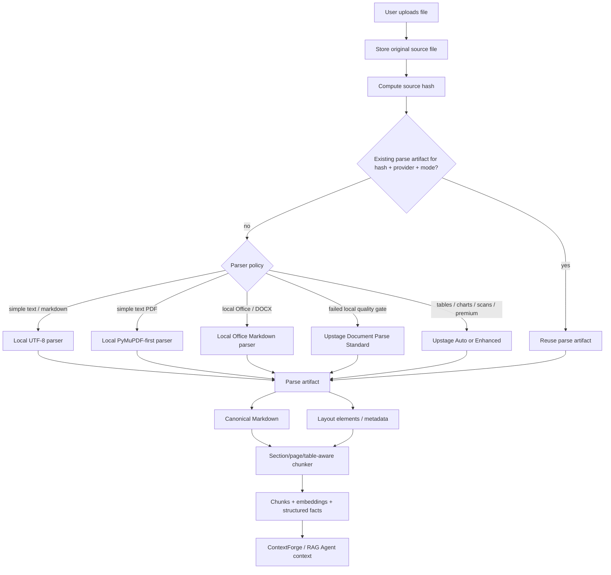

# Proposed ingestion extension: Upstage-backed layout-aware parsing

Status: proposed ingestion extension; not the immediate implementation task

Created: 2026-06-07  
Owner intent: make document ingestion production-realistic without losing offline/local fallbacks

Reviewed 2026-09-05: local Office/PDF parsers and some parse artifacts exist, but the provider
integration and original-file retention described here are not complete. This remains a plan,
not a completion record. Sequence follows [implementation tracking](../implementation-tracking.md#recommended-next-workflow).

## Goal

Upgrade document ingestion from **plain extracted text** to a provider-backed, layout-aware parse pipeline that can preserve the original upload, produce LLM-friendly Markdown, cache parse artifacts, and re-ingest documents when parser/chunker/embedding quality improves.

This is the near-term execution plan for the broader architecture idea in [`docs/idea/layout-aware-ingestion-rag-agent.md`](../idea/layout-aware-ingestion-rag-agent.md).

## Why this matters

Current ingestion works for V1 RAG, but it still stores the current compatibility text in `documents.content` and does not retain the original uploaded file. Some Office uploads, including DOCX, now also persist Markdown-plus-elements parse artifacts, but old uploads still cannot be re-run through a better future parser unless the user uploads the source file again.

A production ingestion path should treat parsing as **document-to-semantic-artifact compilation**, not just text extraction:

```text
original file
  -> parser provider
  -> Markdown / HTML / layout element artifact
  -> section/table/page-aware chunks
  -> embeddings + structured facts + metadata profile
  -> RAG context with citations
```

The key product improvement is that relevant context sent to the LLM can preserve headings, sections, table structure, captions, page references, and layout relationships. This reduces semantic loss compared with flattened text.

## Current implementation baseline

Evidence from current code:

- Upload dispatch supports `.pdf`, `.md`, `.markdown`, `.txt`, `.xlsx`, `.pptx`, and `.docx` in `my_agents/knowledge/uploads.py`; legacy binary `.doc` remains unsupported.
- Current PDF parser order in `my_agents/knowledge/pdf_uploads.py` is:
  1. `pymupdf_text_v1`
  2. `pypdf_text_v2`
  3. `docling_markdown_v1`
  4. constrained `tesseract_ocr_v1`
  5. `deterministic_stream_fallback_v1`
- `my_agents/api/documents.py` reads upload bytes, parses immediately, then persists `DocumentModel(content=parsed.content, ...)`.
- `my_agents/knowledge/office_uploads.py` writes local Markdown parser artifacts for supported Office files; DOCX uses `docling_docx_markdown_v1` and emits provider-neutral `word_*` block elements with Markdown offsets.
- `my_agents/knowledge/models.py` stores source metadata such as filename, content type, byte size, SHA-256, page count, parser name, and parse artifacts where available, but no original blob/object key.
- `my_agents/knowledge/extraction.py` ingests from `document.content`, producing chunks, embeddings, pgvector values, entities, relationships, and metadata profiles.

## Upstage role

Use Upstage Document Parse as an optional cloud parser provider for cases where local parsing loses too much structure or where users choose high-quality parsing.

Expected value:

- layout-aware Markdown/HTML;
- table preservation;
- chart/figure/caption support;
- scanned/image-heavy document handling;
- Korean/English mixed document quality;
- coordinates or element metadata for better citations and previews.

Cost principle: **do not call Upstage for every ingestion by default.** Use provider routing and parse caching so cheap local parsing remains the default for simple files, while Upstage is available for high-value cases.

## Target flow



## Implementation slices

### Slice 1 — Original file retention

Add durable source-file storage before adding Upstage.

Minimum behavior:

- store original upload bytes outside `documents.content`;
- persist storage metadata and original hash;
- keep current parser behavior unchanged;
- keep offline tests using a local/dev storage provider.

Candidate metadata:

```text
source_storage_provider
source_object_key
source_original_sha256
source_original_byte_size
source_retention_status
```

Why first: without this, improved parsing cannot be applied to old uploads.

### Slice 2 — Parse artifact model

Generalize the generic artifact layer independent of Upstage. DOCX/Office uploads already prove this direction for local Markdown-plus-elements output; the remaining work is to make the contract provider-routed, cached, and applied consistently to PDFs and future parsers.

Candidate table:

```text
document_parse_artifacts
- id
- document_id
- source_file_hash
- parser_provider
- parser_model
- parser_version
- parser_mode
- parser_config_json
- markdown_content
- html_content nullable
- elements_json nullable
- warnings_json nullable
- created_at
```

Keep `documents.content` temporarily as the compatibility text surface while writing Markdown artifacts in parallel.

### Slice 3 — Parser provider interface

Introduce a provider boundary so `documents.py` does not hard-code vendor behavior.

Candidate providers:

```text
local_text_v1
local_pdf_v1
upstage_document_parse_standard_v1
upstage_document_parse_auto_v1
upstage_document_parse_enhanced_v1
```

Policy should be env/config driven, for example:

```text
MY_AGENTS_DOCUMENT_PARSE_POLICY=local_first
MY_AGENTS_UPSTAGE_API_KEY=...
MY_AGENTS_UPSTAGE_PARSE_MODEL=document-parse
```

### Slice 4 — Cost-aware routing and cache

Cache parse results by:

```text
source_sha256 + parser_provider + parser_version + parser_mode + output_format
```

Suggested default policy:

| Input / condition | Parser policy |
| --- | --- |
| Markdown/plain text | Local parser |
| Simple text PDF | Local PyMuPDF-first parser |
| `.xlsx`, `.pptx`, `.docx` | Local Office Markdown parser |
| Local parser quality failure | Upstage Standard fallback |
| Tables/charts/scanned/image-heavy docs | Upstage Auto or Standard |
| User-selected high-quality parse | Upstage Auto or Enhanced |
| Re-index only | No parse call; reuse active artifact/text |

### Slice 5 — Re-extract and re-ingest

Add a distinction between:

```text
Re-index only:
  active parse artifact / documents.content -> chunks + embeddings + metadata

Re-extract + re-index:
  original source file -> selected parser -> new artifact -> chunks + embeddings + metadata
```

This allows future parser upgrades without requiring users to upload old documents again.

## Why Markdown as canonical context

Markdown should become the main text artifact because it preserves semantic hints that plain text loses:

- headings and section hierarchy;
- bullet/list nesting;
- table rows and columns;
- quote/caption-like context;
- code/API/config blocks;
- page and section labels.

The LLM should not necessarily receive the whole Markdown file. Retrieval should select relevant Markdown chunks and send those chunks with source metadata.

Example target context:

```markdown
Source: employment-contract.pdf, page 4
Section: Renewal > Notice

The agreement renews automatically unless either party gives 30 days notice.

| Field | Value |
| --- | --- |
| Notice period | 30 days |
| Renewal term | 1 year |
```

## Why keep local parsing

Upstage should be a quality upgrade path, not the only path.

Reasons:

- local PyMuPDF parsing is fast and free for simple text PDFs;
- local Office parsing already handles `.xlsx`, `.pptx`, and `.docx` without provider credentials;
- offline tests and deterministic mode must keep working without provider credentials;
- repeated local/dev uploads should not consume cloud parse budget;
- provider routing lets simple documents stay cheap while complex documents get better treatment;
- original-file retention plus artifact caching prevents repeated paid parsing of the same file.

## Acceptance criteria for the near-term milestone

A first useful implementation is complete when:

- original uploaded files are retained through a local/dev storage provider and a production-ready storage abstraction;
- document records can reference retained source files without exposing storage internals to users;
- parse artifacts can be persisted and linked to documents/extraction runs;
- ingestion can continue to use current local parsing as default;
- an Upstage provider can be enabled by config without breaking offline tests;
- parse artifacts are cached by source hash + parser provider/version/mode;
- a re-extract + re-ingest path can regenerate document text, chunks, embeddings, and metadata from the retained original;
- docs and tests prove old re-index behavior and new re-extract behavior are distinct.

## Non-goals for the first implementation

- Do not replace ContextForge or the RAG Agent contract graph.
- Do not make Upstage mandatory for all users or tests.
- Do not implement a generic document-management product beyond source retention and reparse.
- Do not normalize every layout element into SQL until retrieval/tool needs prove it; `elements_json` is enough for the first artifact layer.
- Do not claim production OCR/layout quality until evaluated with realistic fixtures.

## Open decisions

1. Production source-file storage provider: S3, Cloudflare R2, Neon object storage alternative, or Render-compatible disk plus later migration?
2. Whether users can download originals or retention is only for reparse/audit.
3. Whether Upstage fallback should trigger automatically on local quality failure or require explicit high-quality mode.
4. How to expose parse/reparse status in frontend without confusing it with ingestion status.
5. Whether to store Upstage raw response, normalized artifact only, or both with a retention policy.
