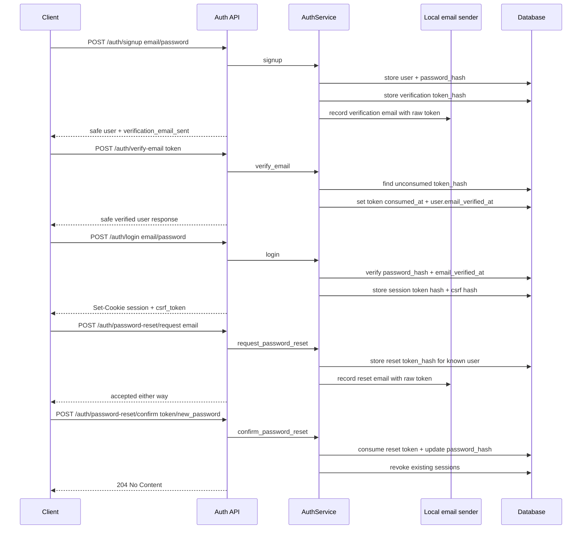

# First-party auth and owned sessions

This note explains the first auth/account-lifecycle milestone for the portfolio chat service.

## What is implemented now

The backend owns a first-party auth/session path:

1. `POST /auth/signup` creates a user with an Argon2 password hash.
2. Signup creates a one-time email verification token and sends it through the local auth email boundary.
3. `POST /auth/verify-email` consumes the verification token and sets `email_verified_at`.
4. `POST /auth/login` verifies the password, requires a verified email, and creates a server-side opaque session.
5. The raw session token is sent only as an HttpOnly cookie.
6. The database stores only SHA-256 digests of session tokens, CSRF tokens, verification tokens, and reset tokens.
7. Login returns a CSRF token for mutating cookie-auth requests.
8. `POST /auth/logout` requires the current session cookie plus the CSRF header and revokes the session.
9. `GET /auth/me` resolves the current `Principal` from the session cookie.
10. `POST /auth/password-reset/request` sends a reset token without revealing whether the account exists.
11. `POST /auth/password-reset/confirm` consumes the reset token, changes the password, and revokes existing sessions.

The current email sender is intentionally local/offline. It records verification and reset emails in process memory for tests and local development, without requiring Resend, AWS SES, SendGrid, Firebase, or another paid/live provider.

## Flow

## Why store token hashes

Session, email-verification, and password-reset tokens are bearer credential material. If the database stored raw token values, a database leak could immediately expose active auth flows. Storing a digest lets the server compare presented tokens without keeping raw token material at rest.

The local development email sender still sees the raw token because an email must contain either the token or a link containing the token. That boundary is intentionally isolated so a real provider can be added later without rewriting auth lifecycle logic.

## What is intentionally not implemented yet

- real outbound email provider integration;
- MFA/passkeys;
- OAuth account linking;
- account lockout/rate limiting;
- account deletion/profile management;
- guest mode / anonymous quotas.

Those are later milestones or explicit non-goals for v0.

## Testing evidence

`tests/test_auth_api.py` covers:

- signup does not return password material;
- signup records a local email verification message;
- unverified login is blocked;
- email verification consumes one-time tokens;
- login returns a CSRF token and creates an owned session;
- `/auth/me` requires a valid session;
- logout without CSRF fails;
- logout with CSRF revokes the session;
- duplicate signup fails safely;
- invalid login does not create an authenticated session;
- password reset requests do not enumerate unknown accounts;
- password reset changes the password and revokes old sessions;
- expired auth lifecycle tokens are rejected.

## Small exercise

Explain this in an interview:

> I used first-party email/password auth to demonstrate backend ownership, but kept provider integration intentionally narrow. The app stores Argon2 password hashes, stores only token digests, requires email verification before login, supports one-time password reset tokens, revokes sessions after password reset, and uses a local email boundary so tests stay offline. I would add rate limiting, MFA/passkeys, OAuth, and a real email provider as separate hardening milestones.

## Revision history

- 2026-05-18: Added email verification, local auth email boundary, password reset tokens, and session revocation after reset.
- 2026-05-17: Created after implementing minimal first-party auth and owned sessions.
