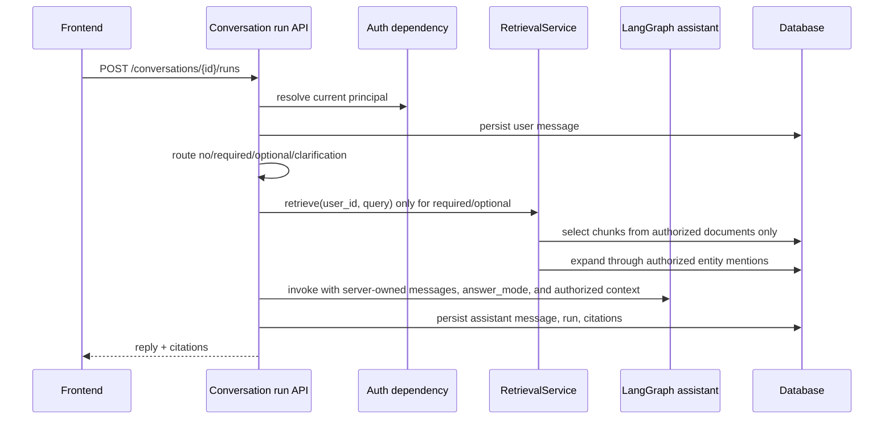
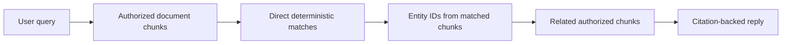
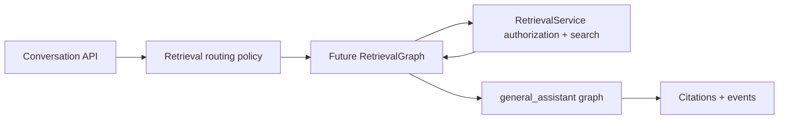

# Permission-aware RAG and citation-backed answers

This note explains the first thin RAG slice for the portfolio chat service.

## What is implemented now

A product chat run can now answer with context from ingested personal or group documents.
The important rule is simple: retrieval starts from the user's authorized documents, not
from the entire knowledge corpus.

The current implementation is intentionally deterministic so tests stay offline:

- retrieval routing classifies each prompt as `no_retrieval`, `retrieval_required`, `retrieval_optional`, or `clarification_required`;
- direct retrieval uses term matching over authorized chunks only when routing calls for retrieval;
- graph expansion uses extracted entity mentions to add related authorized chunks;
- answer mode is explicit: `general_knowledge`, `document_grounded`, or `mixed`;
- citations are stored against the `AgentRunModel` only when retrieved chunks are actually used;
- the response payload returns routing metadata plus citation IDs, document IDs, chunk IDs, and snippets.

## Request flow

## Why permission filtering happens first

RAG systems can leak data if they retrieve globally and filter later. Even if the final
answer hides unauthorized text, intermediate rankings, graph edges, tool traces, or model
context can expose private information.

This project uses a safer order:

The graph expansion step also stays inside the authorized row set. This means a private
chunk can never become a citation or model context for an outsider just because it shares
an entity with an authorized chunk.

## Current limitations

- Retrieval routing and scoring are deterministic fixtures, not LLM query planning or pgvector ranking.
- The reply composition is a thin service-layer scaffold, not a polished answer synthesis prompt.
- Citations include snippets but not character offsets in the API response yet.
- Streaming exists, but frontend display of retrieval route/answer mode still belongs to the separate frontend repository.
- The legacy `/assistant/chat` endpoint still exists for smoke checks and does not own product KB access.

These constraints are acceptable for this portfolio stage because they make the security
boundary testable before adding more impressive retrieval infrastructure.

## Future RetrievalGraph milestone

A separate retrieval LangGraph is intentionally deferred. The current production-shaped
boundary is: Conversation API decides retrieval route, `RetrievalService` enforces
permissions and returns packaged context, and `general_assistant` only receives authorized
compact context plus `answer_mode` metadata.

Promote retrieval to its own graph only when retrieval has enough internal workflow to
justify graph orchestration, for example:

- query rewrite;
- metadata/scope planning;
- hybrid or vector search behind the same permission boundary;
- reranking;
- context compression/packaging;
- clarification/fallback branches that need their own observability.

Even then, hard authorization should remain in `RetrievalService`, not in graph prompts or
agent reasoning. A future shape can be:

## Testing evidence

`tests/test_permission_aware_rag.py` verifies:

- an owner receives citations and authorized context from an ingested private document;
- an outsider asking the same question receives no private citations or private reply text;
- graph expansion adds a related authorized chunk that shares an extracted entity with the direct match;
- no-retrieval prompts skip `RetrievalService.retrieve`;
- optional retrieval can fall back to `general_knowledge` when no relevant authorized chunks exist;
- the graph receives only retrieved chunk IDs/context that passed service-layer authorization, not raw unauthorized document text.

## Revision history

- 2026-05-21: Added deterministic retrieval routing, answer modes, clarification route, and response/event metadata.
- 2026-05-17: Updated limitations after adding structured run events in the next slice.
- 2026-05-17: Created after adding thin permission-aware retrieval, graph expansion, and citations.
