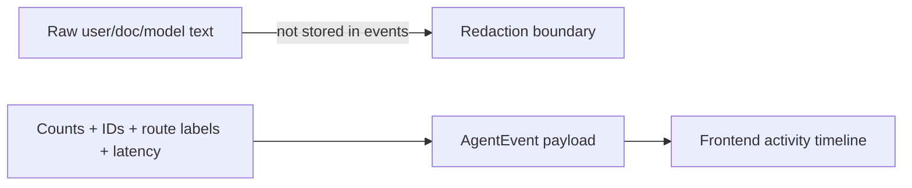

# Agent observability events and eval fixtures

This note explains how the portfolio chat service shows agent activity without exposing
hidden chain-of-thought or private document text.

## What is implemented now

Each product chat run stores structured `AgentEventModel` rows. The frontend can fetch
those rows from:

```text
GET /conversations/{conversation_id}/runs/{run_id}/events
```

The current events are intentionally high-level:

1. `user_message_stored`
2. `retrieval_completed`
3. `graph_invoked`
4. `answer_composed`

They are enough to show a visible service surface: the UI can say that the backend stored
the message, made a retrieval-routing decision, retrieved authorized context when needed,
invoked the graph when appropriate, and composed a cited or general answer.
If graph invocation fails, the service stores a failed run and emits `run_failed` with only
safe error metadata before returning a client-safe error response.

## Redaction boundary

Agent transparency should not mean leaking chain-of-thought, raw prompts, document text,
or secrets. Event payloads therefore contain metadata such as counts, route labels, and
latency values, retrieval route, answer mode, and document scope rather than raw message or chunk content.



Citations remain the explicit provenance channel for document snippets. Events explain
what happened; citations explain which authorized knowledge supported the answer.

## Deterministic eval fixtures

`my_agents/agent_runtime/evals.py` provides small deterministic helpers:

- `evaluate_grounded_citations` checks that a cited reply visibly uses citation text;
- `evaluate_permission_leakage` checks forbidden terms are absent from reply/citations;
- `evaluate_event_redaction` checks forbidden terms are absent from event payloads;
- `evaluate_event_latency_budget` checks emitted latency metrics fit a fixture budget.

These helpers are not a complete LLM evaluation platform. Their role is to make portfolio
claims testable: grounding, permission safety, redaction, and basic performance awareness.

## Testing evidence

`tests/test_agent_observability_evals.py` verifies:

- event sequences are ordered and typed;
- event payloads include retrieval route, answer mode, document scope, retrieval counts, route label, citation count, and latency;
- raw private phrases and raw user questions do not appear in event payloads;
- deterministic eval helpers pass for grounded authorized answers;
- the permission leakage eval passes when an outsider receives no private context.

`tests/test_conversations_api.py` also verifies that failed graph invocation stores
`status=failed` plus a redacted `run_failed` event.

## Revision history

- 2026-05-21: Updated after adding retrieval-route and answer-mode event metadata.
- 2026-05-17: Updated after adding failed-run event persistence.
- 2026-05-17: Created after adding structured agent run events and deterministic eval fixtures.
