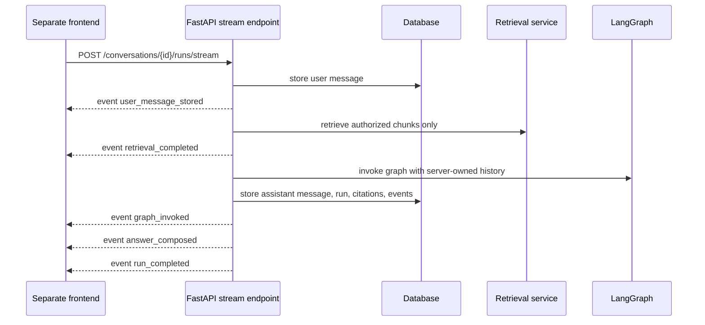

# HTTP streaming and frontend contract

This note documents the backend-only streaming contract for the portfolio chat service.
The frontend still belongs in a separate repository; this backend exposes the API shape a
frontend can consume.

## Implemented endpoint

```text
POST /conversations/{conversation_id}/runs/stream
Content-Type: application/json
Accept: text/event-stream
```

Request body is the same as the non-streaming run endpoint:

```json
{
  "message": "Ask a question about authorized knowledge"
}
```

The response is `text/event-stream` using Server-Sent Events.



## Event order

Successful streams emit:

1. `user_message_stored`
2. `retrieval_completed`
3. `graph_invoked`
4. `answer_composed`
5. `run_completed`

The final `run_completed` event contains the same response shape as
`POST /conversations/{conversation_id}/runs`:

```json
{
  "run_id": "...",
  "conversation_id": "...",
  "reply": "...",
  "route": {"label": "general_assistant", "explanation": "..."},
  "handled_by": "personal_assistant_graph",
  "citations": []
}
```

Failed graph execution after the stream starts emits:

1. `user_message_stored`
2. `retrieval_completed`
3. `run_failed`
4. `run_error`

The persisted run status is still `failed`, and `GET /conversations/{conversation_id}/runs/{run_id}/events`
returns the redacted persisted event sequence. The stream intentionally does not expose raw user prompts,
private provider exceptions, chain-of-thought, or document content.

## Frontend contract guidance

- Use `/conversations/{conversation_id}/runs/stream` for chat UX that wants live progress.
- Use `/conversations/{conversation_id}/runs` when a full-response request is sufficient.
- Do not use legacy `/assistant/chat` for product personal/group knowledge-base chat.
- After `run_completed`, the frontend can refresh messages from
  `GET /conversations/{conversation_id}/messages` and inspect persisted activity through
  `GET /conversations/{conversation_id}/runs/{run_id}/events`.
- If the stream emits `run_error`, show a generic failure state and use run/event endpoints for
  redacted diagnostics rather than displaying provider exception text.

## Current limitations

- This is progress-event streaming, not token-by-token assistant text streaming.
- Run cancellation and retry endpoints are not implemented yet.
- Long-running jobs still execute inside the request; background queues remain a later milestone.
- CORS must be configured when a real frontend origin is chosen.

## Revision history

- 2026-05-19: Created after adding the SSE conversation-run stream endpoint.
