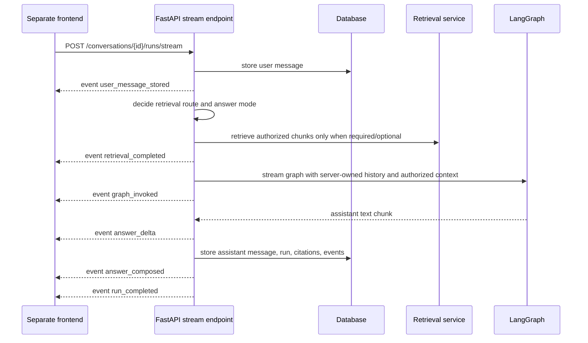

# HTTP streaming and frontend contract

This note documents the backend-only streaming contract for the portfolio chat service.
The frontend still belongs in a separate repository; this backend exposes the API shape a
frontend can consume.

## Implemented endpoint

```text
POST /conversations/{conversation_id}/runs/stream
Content-Type: application/json
Accept: text/event-stream
```

Request body is the same as the non-streaming run endpoint:

```json
{
  "message": "Ask a question about authorized knowledge"
}
```

The response is `text/event-stream` using Server-Sent Events.



## Event order

Successful streams emit:

1. `user_message_stored`
2. `retrieval_completed`
3. `graph_invoked`
4. zero or more `answer_delta`
5. `answer_composed`
6. `run_completed`

`answer_delta` events carry incremental assistant text:

```json
{
  "delta": "partial assistant text",
  "sequence": 1
}
```

When the OpenAI-backed graph/provider yields token chunks, these deltas are emitted while
the graph is still running. Deterministic/local graph spies can also emit multiple deltas
so frontend tests can verify incremental rendering without real credentials.


`retrieval_completed`, `graph_invoked`, and `answer_composed` payloads include redacted routing metadata: `retrieval_route`, `answer_mode`, and `document_scope`. A `clarification_required` route can complete without `graph_invoked` because the backend asks the user which document to use instead of broadly searching all accessible documents.

The final `run_completed` event contains the same response shape as
`POST /conversations/{conversation_id}/runs`:

```json
{
  "run_id": "...",
  "conversation_id": "...",
  "reply": "...",
  "route": {"label": "general_assistant", "explanation": "..."},
  "handled_by": "personal_assistant_graph",
  "retrieval_route": "no_retrieval",
  "answer_mode": "general_knowledge",
  "document_scope": "unknown",
  "citations": []
}
```

Failed graph execution after the stream starts emits a redacted failure path:

1. `user_message_stored`
2. `retrieval_completed`
3. `run_failed`
4. `run_error`

If the graph had already begun streaming, the client may have seen `graph_invoked` or
partial `answer_delta` events before the failure event. The persisted run status is still
`failed`, and `GET /conversations/{conversation_id}/runs/{run_id}/events` returns the
redacted persisted event sequence. The stream intentionally does not expose raw user
prompts, private provider exceptions, chain-of-thought, or document content.

## Frontend contract guidance

- Use `/conversations/{conversation_id}/runs/stream` for chat UX that wants live progress
  and incremental assistant text.
- Use `/conversations/{conversation_id}/runs` when a full-response request is sufficient.
- Do not use legacy `/assistant/chat` for product personal/group knowledge-base chat.
- After `run_completed`, the frontend can refresh messages from
  `GET /conversations/{conversation_id}/messages` and inspect persisted activity through
  `GET /conversations/{conversation_id}/runs/{run_id}/events`.
- If the stream emits `run_error`, show a generic failure state and use run/event endpoints for
  redacted diagnostics rather than displaying provider exception text.

## Current limitations

- `answer_delta` streams assistant text, but the final `run_completed.reply` remains the
  compatibility source of truth for the persisted answer.
- Deterministic fallback may chunk the final local reply immediately before completion when
  the graph provider does not emit token chunks.
- Run cancellation and retry endpoints are not implemented yet.
- Long-running jobs still execute inside the request; background queues remain a later milestone.
- CORS must be configured when a real frontend origin is chosen.

## Revision history

- 2026-05-19: Created after adding the SSE conversation-run stream endpoint.
- 2026-05-19: Added `answer_delta` events for incremental assistant text streaming.
