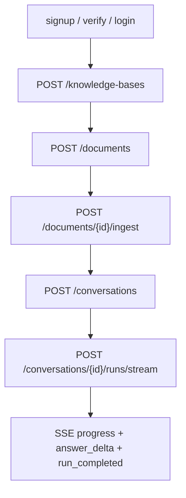

# Frontend demo and local runbook

This note is the backend-owned contract for connecting a separate frontend to the
portfolio chat-service API. The frontend remains outside this repository.

## Local backend configuration

Use deterministic mode when the goal is a credential-free portfolio demo or frontend
integration smoke test.

```bash
MY_AGENTS_RESPONSE_MODE=deterministic \
MY_AGENTS_DATABASE_URL=sqlite+pysqlite:///./local-demo.db \
MY_AGENTS_AUTO_CREATE_TABLES=true \
MY_AGENTS_SESSION_COOKIE_SECURE=false \
MY_AGENTS_AUTH_DEV_OUTBOX_ENABLED=true \
MY_AGENTS_CORS_ALLOWED_ORIGINS=http://localhost:3000 \
uv run uvicorn main:app --host 127.0.0.1 --port 8000
```

Notes:

- `MY_AGENTS_DATABASE_URL=sqlite+pysqlite:///./local-demo.db` keeps local demo state on disk.
- `MY_AGENTS_AUTO_CREATE_TABLES=true` is acceptable for a local SQLite demo; use Alembic migrations for Postgres/Neon.
- `MY_AGENTS_SESSION_COOKIE_SECURE=false` is for local HTTP only. Keep secure cookies enabled behind HTTPS.
- `MY_AGENTS_AUTH_DEV_OUTBOX_ENABLED=true` exposes local verification/reset tokens through `/auth/dev/outbox` for deterministic demos only.
- `MY_AGENTS_CORS_ALLOWED_ORIGINS` must list explicit origins because browser-cookie requests use credentials.
- FastAPI exposes the current OpenAPI contract at `http://127.0.0.1:8000/openapi.json`.
- If the frontend origin is `http://localhost:3000`, set the frontend API base URL to
  `http://localhost:8000`. Browser cookies are host-scoped, so mixing `localhost` and
  `127.0.0.1` can make login succeed but `/auth/me` look unauthenticated.

## Local demo seed helper

For the fastest V1 walkthrough, seed a verified local account plus one personal knowledge
base, text document, and extraction run before starting the frontend demo. The helper
refuses in-memory and non-SQLite databases so it does not target production data.

```bash
MY_AGENTS_RESPONSE_MODE=deterministic \
MY_AGENTS_DATABASE_URL=sqlite+pysqlite:///./local-demo.db \
MY_AGENTS_AUTO_CREATE_TABLES=true \
uv run python -m scripts.local_demo_seed
```

Seeded login:

- email: `test@test.com`
- password: `correct horse battery staple`

Seeded content:

- knowledge base: `V1 Demo Knowledge Base`
- document: `V1 Portfolio Chat Service Demo`
- sample prompt: `How does the portfolio chat service stream answers and persist app state?`

The helper is idempotent for the seeded extraction run. It verifies the demo user and
resets that local user's password to the demo password. If you need a fresh SQLite file,
stop the dev server first and add `--reset-database`; do not use reset while Uvicorn is
holding an open connection to the same SQLite file.

## Backend-only V1 API smoke helper

After the backend is running and the SQLite DB is seeded, verify the production-shaped
API path without the frontend:

```bash
uv run python -m scripts.local_demo_smoke --base-url http://localhost:8000
```

The smoke logs in with the seeded credentials, checks `/auth/me`, finds the seeded
document, verifies existing extraction runs, calls the bodyless ingest endpoint, creates
a conversation, consumes SSE `answer_delta` + `run_completed`, refetches run detail
citations, and checks redacted run events. It intentionally uses only public HTTP API
contracts. Because it verifies bodyless ingest, each run creates one additional local
extraction run for the seeded document.

## Browser request requirements

The frontend should call the API with cookies enabled:

```ts
fetch("http://localhost:8000/auth/me", {
  credentials: "include",
});
```

CORS is disabled by default. When configured, the backend adds credentialed CORS for the
listed origins only.

```bash
MY_AGENTS_CORS_ALLOWED_ORIGINS=http://localhost:3000,http://127.0.0.1:3000
```

Wildcard origins are rejected because `Access-Control-Allow-Credentials: true` must not be
paired with an unrestricted browser origin.

## Auth/session flow

```mermaid
sequenceDiagram
    participant UI as Separate frontend
    participant API as Backend API
    participant Cookie as Browser cookie jar

    UI->>API: POST /auth/signup {email,password}
    API-->>UI: 201 {user, verification_email_sent}
    alt local deterministic demo
        Note over API: Local/dev email sender stores token in process memory
        UI->>API: GET /auth/dev/outbox (local demo only)
        API-->>UI: 200 [{purpose, token}]
    else preview/public SMTP mode
        API-->>Visitor: SMTP verification link
        Visitor-->>UI: Open /verify-email?token=...
    end
    UI->>API: POST /auth/verify-email {token}
    API-->>UI: 200 user
    UI->>API: POST /auth/login {email,password}
    API-->>Cookie: Set-Cookie my_agents_session=...; HttpOnly
    API-->>UI: 200 {user, csrf_token}
    UI->>API: GET /auth/me credentials=include
    API-->>UI: 200 user
    UI->>API: POST /auth/logout X-CSRF-Token: csrf_token
    API-->>Cookie: Clear session cookie
    API-->>UI: 204
```

Important auth details:

- Login returns `csrf_token`; the frontend should keep it in memory for logout and any future CSRF-protected mutating routes.
- The session cookie is `HttpOnly`; frontend code should not try to read it.
- The session cookie defaults to `Secure; SameSite=Lax`. For local development over `http://`, set `MY_AGENTS_SESSION_COOKIE_SECURE=false`.
- If a deployed frontend/backend split requires `SameSite=None`, keep `MY_AGENTS_SESSION_COOKIE_SECURE=true`; settings validation rejects `SameSite=None` with insecure cookies.
- Keep the frontend hostname aligned with the backend hostname in local direct-browser CORS (`localhost` with `localhost`, or `127.0.0.1` with `127.0.0.1`) so browser cookie rules stay predictable.
- Password reset request intentionally returns the same accepted response for known and unknown emails.
- For preview/public visitor accounts, use `MY_AGENTS_AUTH_EMAIL_MODE=smtp`,
  `MY_AGENTS_AUTH_PUBLIC_APP_BASE_URL`, and SMTP provider settings. Production settings
  validation rejects local email delivery and rejects `MY_AGENTS_AUTH_DEV_OUTBOX_ENABLED=true`.

## Product conversation demo flow

The portfolio frontend should use product endpoints, not the legacy `/assistant/chat` endpoint.



Minimal sequence without the seed helper:

1. `POST /auth/signup`
2. `GET /auth/dev/outbox` and read the latest `email_verification` token for that email
3. `POST /auth/verify-email` with the local dev token
4. `POST /auth/login`; store `csrf_token` in frontend state and keep cookies included
5. `POST /knowledge-bases`
6. `POST /documents` with `knowledge_base_id` and text `content`
7. `POST /documents/{document_id}/ingest`
8. `POST /conversations`
9. `POST /conversations/{conversation_id}/runs/stream`

With the seed helper, skip signup/dev-outbox/verify and log in directly with `test@test.com` plus the seeded password.

`GET /auth/dev/outbox` returns `404` unless `MY_AGENTS_AUTH_DEV_OUTBOX_ENABLED=true`.
Do not enable that endpoint outside local deterministic demo runs.

Suggested deterministic demo document:

```text
The portfolio chat service uses LangGraph for assistant routing, FastAPI for the
backend API, SQLite or Postgres for app-owned state, and Server-Sent Events for
incremental answer streaming.
```

Suggested prompt after ingest:

```text
How does the portfolio chat service stream answers and persist app state?
```

## SSE stream contract

`POST /conversations/{conversation_id}/runs/stream` uses `text/event-stream` and the same request body as the non-streaming run endpoint:

```json
{
  "message": "What does this document say about the deployment plan?"
}
```

Expected event names:

- `user_message_stored`
- `retrieval_completed`
- `graph_invoked`
- `answer_delta`
- `answer_composed`
- `run_completed`
- failure path: `run_failed` and `run_error`

`answer_delta` payloads are incremental text chunks:

```json
{"delta":"Hello ","sequence":1}
```

`run_completed` payload has the same shape as `POST /conversations/{id}/runs`:

```json
{
  "run_id": "...",
  "conversation_id": "...",
  "reply": "...",
  "route": {"label": "general_assistant", "explanation": "..."},
  "handled_by": "personal_assistant_graph",
  "citations": []
}
```

Refresh contract:

- `GET /conversations/{conversation_id}/runs` returns summaries ordered newest-first.
- `GET /conversations/{conversation_id}/runs/{run_id}` returns the persisted completed run with `reply`, `route`, and `citations`.
- `GET /conversations/{conversation_id}/runs/{run_id}/events` returns redacted run activity events.
- Failed run detail returns `409` because failed runs do not have a completed reply/citation payload.

## Smoke checks

Health:

```bash
curl http://localhost:8000/health
```

CORS preflight from a frontend origin:

```bash
curl -i -X OPTIONS http://localhost:8000/auth/login \
  -H 'Origin: http://localhost:3000' \
  -H 'Access-Control-Request-Method: POST' \
  -H 'Access-Control-Request-Headers: Content-Type,X-CSRF-Token'
```

Expected headers include:

```text
access-control-allow-origin: http://localhost:3000
access-control-allow-credentials: true
```

## Production/deployment reminders

- Use HTTPS and keep `MY_AGENTS_SESSION_COOKIE_SECURE=true`.
- Set `MY_AGENTS_CORS_ALLOWED_ORIGINS` to the exact deployed frontend origin.
- Keep `MY_AGENTS_SESSION_COOKIE_SAMESITE=lax` for same-site deployed demos, or use `none` only when the frontend/backend are truly cross-site and HTTPS/Secure cookies are active.
- Keep `MY_AGENTS_AUTH_DEV_OUTBOX_ENABLED=false`.
- Set `MY_AGENTS_DEPLOYMENT_ENVIRONMENT=production` for public production runtime so
  startup fails if the dev outbox or local email mode is accidentally enabled.
- Set `MY_AGENTS_AUTH_EMAIL_MODE=smtp`, `MY_AGENTS_AUTH_PUBLIC_APP_BASE_URL`, and the
  `MY_AGENTS_AUTH_SMTP_*` settings for real visitor verification/reset email. Keep SMTP
  secrets only in the host secret manager or local `.env`, never in git.
- Run Alembic migrations for Postgres/Neon rather than relying on auto-create.
- The current auth abuse limiter is single-process/in-memory. Replace it with a shared limiter before multi-worker deployment; until then, frontend gate evidence should describe the demo as single-process bounded.

### Preview/public readiness matrix

| Environment | Frontend origin | Backend origin | Cookie settings | Email mode | CORS/session proof |
| --- | --- | --- | --- | --- | --- |
| Local | `http://localhost:3000` or `http://127.0.0.1:3000` | matching localhost backend | `Secure=false`, `SameSite=Lax` | `local` with dev outbox enabled only for deterministic demos | signup -> dev outbox -> verify -> login -> `/auth/me` |
| Preview | preview HTTPS URL | preview HTTPS API URL | `Secure=true`, `SameSite=Lax` unless cross-site requires `none` | `smtp` with provider sandbox/free tier if available | real email link -> login -> refresh `/auth/me` |
| Production | user-confirmed public URL | user-confirmed public API URL | `Secure=true`, exact SameSite choice recorded | `smtp`; no dev outbox | run only after user confirms secrets/spend/final deploy |

### Provider decision record — auth email

Provider/dependency: generic SMTP relay through Python standard library `smtplib`.

Purpose / UX benefit: real visitor signup, verification, and password reset without
exposing local dev outbox tokens.

Integration surface: `MY_AGENTS_AUTH_EMAIL_MODE=smtp`,
`MY_AGENTS_AUTH_PUBLIC_APP_BASE_URL`, and `MY_AGENTS_AUTH_SMTP_*` settings used by
`my_agents.auth.email.SmtpAuthEmailSender`.

Package/API choice: no new dependency; any provider with SMTP support can be used.

Env vars / secrets needed: SMTP host, port, optional username/password, from-address,
and public frontend base URL. Store values in the deployment provider secret manager.

Free tier or cost ceiling: do not enable a paid provider or production sender until the
user confirms spend/secrets. Prefer a free/sandbox SMTP mode for preview smoke.

Failure modes: SMTP auth failure, blocked sender identity, spam filtering, incorrect
public frontend URL, or expired/consumed token link.

Fallback / rollback: set `MY_AGENTS_AUTH_EMAIL_MODE=local` only for local demos; for
public runtime, disable signup or pause deployment rather than exposing `/auth/dev/outbox`.

Offline test strategy: settings validation tests plus SMTP sender tests with a fake SMTP
client; API signup test verifies SMTP mode does not populate the local outbox.

Preview smoke evidence: record redacted SMTP provider, preview URL, test account alias,
login/session restore result, and a redacted email/link screenshot or provider log snippet.

Production activation confirmation required: yes.

### Public-demo guardrails and privacy copy

- The demo stores visitor email, uploaded document text/metadata, conversations,
  citations, and activity events until an operator manually cleans the database.
- Do not upload secrets, credentials, private personal records, medical/legal/financial
  records, or confidential documents.
- Account deletion/export is not implemented yet; operator cleanup is the current
  rollback/removal path for demo data.
- The text/PDF parser is portfolio-demo quality. Scanned, encrypted, image-only,
  scanned, encrypted, unsupported encoded, very large, or malformed PDFs may fail instead of storing corrupted text.
- Keep OpenAI model, timeout, and max-output settings conservative; record host/provider
  budget controls before public traffic.
- Smoke evidence must redact emails, tokens, cookies, API keys, document contents beyond
  safe snippets, provider logs, and host secrets.
