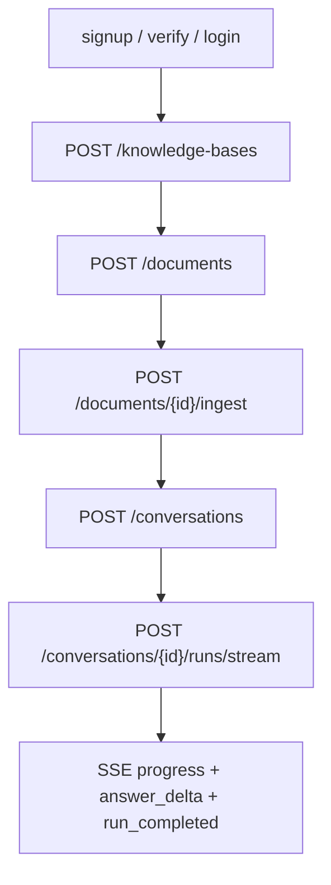

# Frontend demo and local runbook

This note is the backend-owned contract for connecting a separate frontend to the
portfolio chat-service API. The frontend remains outside this repository.

## Local backend configuration

Use deterministic mode when the goal is a credential-free portfolio demo or frontend
integration smoke test.

```bash
MY_AGENTS_RESPONSE_MODE=deterministic \
MY_AGENTS_DATABASE_URL=sqlite+pysqlite:///./local-demo.db \
MY_AGENTS_AUTO_CREATE_TABLES=true \
MY_AGENTS_SESSION_COOKIE_SECURE=false \
MY_AGENTS_AUTH_DEV_OUTBOX_ENABLED=true \
MY_AGENTS_CORS_ALLOWED_ORIGINS=http://localhost:3000 \
uv run uvicorn main:app --host 127.0.0.1 --port 8000
```

Notes:

- `MY_AGENTS_DATABASE_URL=sqlite+pysqlite:///./local-demo.db` keeps local demo state on disk.
- `MY_AGENTS_AUTO_CREATE_TABLES=true` is acceptable for a local SQLite demo; use Alembic migrations for Postgres/Neon.
- `MY_AGENTS_SESSION_COOKIE_SECURE=false` is for local HTTP only. Keep secure cookies enabled behind HTTPS.
- `MY_AGENTS_AUTH_DEV_OUTBOX_ENABLED=true` exposes local verification/reset tokens through `/auth/dev/outbox` for deterministic demos only.
- `MY_AGENTS_CORS_ALLOWED_ORIGINS` must list explicit origins because browser-cookie requests use credentials.
- FastAPI exposes the current OpenAPI contract at `http://127.0.0.1:8000/openapi.json`.
- If the frontend origin is `http://localhost:3000`, set the frontend API base URL to
  `http://localhost:8000`. Browser cookies are host-scoped, so mixing `localhost` and
  `127.0.0.1` can make login succeed but `/auth/me` look unauthenticated.

## Browser request requirements

The frontend should call the API with cookies enabled:

```ts
fetch("http://localhost:8000/auth/me", {
  credentials: "include",
});
```

CORS is disabled by default. When configured, the backend adds credentialed CORS for the
listed origins only.

```bash
MY_AGENTS_CORS_ALLOWED_ORIGINS=http://localhost:3000,http://127.0.0.1:3000
```

Wildcard origins are rejected because `Access-Control-Allow-Credentials: true` must not be
paired with an unrestricted browser origin.

## Auth/session flow

```mermaid
sequenceDiagram
    participant UI as Separate frontend
    participant API as Backend API
    participant Cookie as Browser cookie jar

    UI->>API: POST /auth/signup {email,password}
    API-->>UI: 201 {user, verification_email_sent}
    Note over API: Local/dev email sender stores token in process memory
    UI->>API: GET /auth/dev/outbox (local demo only)
    API-->>UI: 200 [{purpose, token}]
    UI->>API: POST /auth/verify-email {token}
    API-->>UI: 200 user
    UI->>API: POST /auth/login {email,password}
    API-->>Cookie: Set-Cookie my_agents_session=...; HttpOnly
    API-->>UI: 200 {user, csrf_token}
    UI->>API: GET /auth/me credentials=include
    API-->>UI: 200 user
    UI->>API: POST /auth/logout X-CSRF-Token: csrf_token
    API-->>Cookie: Clear session cookie
    API-->>UI: 204
```

Important auth details:

- Login returns `csrf_token`; the frontend should keep it in memory for logout and any future CSRF-protected mutating routes.
- The session cookie is `HttpOnly`; frontend code should not try to read it.
- For local development over `http://`, set `MY_AGENTS_SESSION_COOKIE_SECURE=false`.
- Password reset request intentionally returns the same accepted response for known and unknown emails.

## Product conversation demo flow

The portfolio frontend should use product endpoints, not the legacy `/assistant/chat` endpoint.



Minimal sequence:

1. `POST /auth/signup`
2. `GET /auth/dev/outbox` and read the latest `email_verification` token for that email
3. `POST /auth/verify-email` with the local dev token
4. `POST /auth/login`; store `csrf_token` in frontend state and keep cookies included
5. `POST /knowledge-bases`
6. `POST /documents` with `knowledge_base_id` and text `content`
7. `POST /documents/{document_id}/ingest`
8. `POST /conversations`
9. `POST /conversations/{conversation_id}/runs/stream`

`GET /auth/dev/outbox` returns `404` unless `MY_AGENTS_AUTH_DEV_OUTBOX_ENABLED=true`.
Do not enable that endpoint outside local deterministic demo runs.

Suggested deterministic demo document:

```text
The portfolio chat service uses LangGraph for assistant routing, FastAPI for the
backend API, SQLite or Postgres for app-owned state, and Server-Sent Events for
incremental answer streaming.
```

Suggested prompt after ingest:

```text
How does the portfolio chat service stream answers and persist app state?
```

## SSE stream contract

`POST /conversations/{conversation_id}/runs/stream` uses `text/event-stream` and the same request body as the non-streaming run endpoint:

```json
{
  "message": "What does this document say about the deployment plan?"
}
```

Expected event names:

- `user_message_stored`
- `retrieval_completed`
- `graph_invoked`
- `answer_delta`
- `answer_composed`
- `run_completed`
- failure path: `run_failed` and `run_error`

`answer_delta` payloads are incremental text chunks:

```json
{"delta":"Hello ","sequence":1}
```

`run_completed` payload has the same shape as `POST /conversations/{id}/runs`:

```json
{
  "run_id": "...",
  "conversation_id": "...",
  "reply": "...",
  "route": {"label": "general_assistant", "explanation": "..."},
  "handled_by": "personal_assistant_graph",
  "citations": []
}
```

Refresh contract:

- `GET /conversations/{conversation_id}/runs` returns summaries ordered newest-first.
- `GET /conversations/{conversation_id}/runs/{run_id}` returns the persisted completed run with `reply`, `route`, and `citations`.
- `GET /conversations/{conversation_id}/runs/{run_id}/events` returns redacted run activity events.
- Failed run detail returns `409` because failed runs do not have a completed reply/citation payload.

## Smoke checks

Health:

```bash
curl http://localhost:8000/health
```

CORS preflight from a frontend origin:

```bash
curl -i -X OPTIONS http://localhost:8000/auth/login \
  -H 'Origin: http://localhost:3000' \
  -H 'Access-Control-Request-Method: POST' \
  -H 'Access-Control-Request-Headers: Content-Type,X-CSRF-Token'
```

Expected headers include:

```text
access-control-allow-origin: http://localhost:3000
access-control-allow-credentials: true
```

## Production/deployment reminders

- Use HTTPS and keep `MY_AGENTS_SESSION_COOKIE_SECURE=true`.
- Set `MY_AGENTS_CORS_ALLOWED_ORIGINS` to the exact deployed frontend origin.
- Keep `MY_AGENTS_AUTH_DEV_OUTBOX_ENABLED=false`.
- Run Alembic migrations for Postgres/Neon rather than relying on auto-create.
- Replace the local email sender before public account lifecycle exposure.
- Replace local in-process auth abuse protection with a shared limiter before multi-worker deployment.
