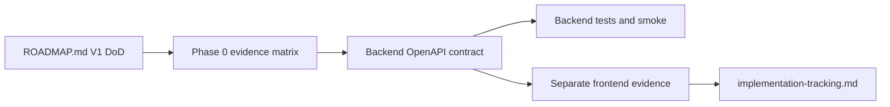

# V1 contract freeze and evidence map

This Phase 0 map freezes the backend-owned V1 contract surface before the next strict V1
implementation phases. The separate frontend repository may verify against this contract,
but frontend code remains outside this backend repo.

## Contract source of truth

- Backend source of truth: the FastAPI OpenAPI document generated by `my_agents.api.create_app()`.
- Local contract URL while the backend is running: `http://127.0.0.1:8000/openapi.json`.
- Frontend coordination notes live in `/Users/heecheonpark/Git/my-agents-frontend/docs/backend-requests.md`.
- Product frontend code must use the product endpoint families below, not legacy `POST /assistant/chat`.
- Frontend should not synthesize missing citation, event, auth, or ingestion fields. Missing fields are backend contract gaps for a later backend phase.

## V1 DoD evidence matrix

| Roadmap V1 DoD item | Phase | Backend evidence target | Frontend evidence target | Docs evidence | Owner repo | Status |
| --- | --- | --- | --- | --- | --- | --- |
| Separate frontend completes signup/login and product conversation flows without legacy `/assistant/chat` | 0, 1, 6 | Auth/session OpenAPI, CORS tests, run endpoints, demo seed/smoke | Browser smoke proves product endpoint use and BFF allowlist blocks `/assistant/*` | `10-frontend-demo-runbook.md`, frontend `docs/implementation-log.md` | both; frontend primary for browser proof | open; local demo slice exists |
| Product chat supports streaming or intentional polling UX with run status | 0, 3, 6 | `POST /conversations/{conversation_id}/runs/stream`, run detail, events tests | Chat UI shows streaming/polling, completion, refresh-safe state | `09-http-streaming-frontend-contract.md` | both | partially implemented; strict V1 proof pending |
| Fresh Postgres/Neon database setup is migration-driven and documented end to end | 0, 2, 4, 6 | Alembic upgrade and `tests/test_migrations.py`; gated external DB smoke | Frontend waits for backend readiness; no direct DB assumptions | `08-postgres-alembic-neon.md`, README pair | backend | partially implemented; repeat smoke pending for future migrations |
| Auth/session behavior is safe enough for public portfolio demo, including rate limiting and cookie/CSRF clarity | 1, 6 | Auth abuse tests, cookie/CSRF/CORS tests, production-origin settings docs | Browser login/me/logout and CSRF mutation smoke | `02-first-party-auth-sessions.md`, `10-frontend-demo-runbook.md` | backend primary; frontend verifies | open; local limiter exists, shared limiter deferred |
| Permission-aware retrieval uses a real retrieval path, not only deterministic fixtures | 4, 6 | Embedding provider boundary, pgvector migration/search, permission-first retrieval tests | Cited answer flow with unauthorized-doc negative proof | `06-permission-aware-rag.md` plus future retrieval doc update | backend | open; deterministic retrieval exists |
| Document ingestion supports at least one realistic uploaded file type | 2, 6 | Upload API, parser boundary, storage metadata, parser failure tests | Upload/ingestion UI smoke or documented gap | `05-knowledge-ingestion-extraction.md` plus future upload runbook | backend primary; frontend verifies | open; text/body ingestion exists only |
| Citations include enough provenance for users to trust the answer | 3, 4, 6 | Run response/detail citation schema, document/chunk/source metadata tests | UI renders backend fields and persists after reload | `06-permission-aware-rag.md`, future citation contract update | backend primary; frontend verifies | partially implemented; richer provenance pending |
| Agent events are useful to the UI without exposing chain-of-thought or unauthorized data | 3, 6 | Event schemas, redaction tests, SSE/fetch event ordering | UI event trail with safe payloads | `07-agent-observability-evals.md`, `09-http-streaming-frontend-contract.md` | backend primary; frontend verifies | partially implemented; schema hardening pending |
| Tests pass offline by default | every phase | `env -u MY_AGENTS_OPENAI_MODEL uv run pytest -q`, Ruff check, Ruff format check | `pnpm lint`, `pnpm exec tsc --noEmit`, `pnpm exec vitest run`, `pnpm build`, Playwright | `docs/implementation-tracking.md` | both | required at every phase boundary |
| Optional Postgres/Neon smoke tests pass against a dedicated test database | 2, 4, 6 | `MY_AGENTS_TEST_DATABASE_URL=... uv run pytest tests/test_migrations.py -q` and later schema-phase smokes | N/A except waiting for backend readiness | `08-postgres-alembic-neon.md` | backend | gated; skipped when env absent |
| Korean and English READMEs remain accurate | 6 and setup changes | README pair review after setup/API/runbook changes | Frontend docs link backend evidence where needed | `README.md`, `README.en.md`, frontend docs | both | required for final closure |
| No real secrets are committed or printed | every phase | `.env.example` only, status/diff review, no real env output | frontend env review | README/env docs and handoff notes | both | required at every phase |

## Frozen product endpoint inventory

Generated from `my_agents.api.create_app().openapi()` on 2026-05-20.

| Method | Path | Request schema | Success response schema | V1 use |
| --- | --- | --- | --- | --- |
| `POST` | `/auth/signup` | `SignupRequest` | `201 SignupResponse` | account creation and verification email handoff |
| `POST` | `/auth/verify-email` | `VerifyEmailRequest` | `200 UserResponse` | local/dev and real email verification flow |
| `POST` | `/auth/login` | `LoginRequest` | `200 LoginResponse` plus session cookie | verified-user login and CSRF token issue |
| `GET` | `/auth/me` | none | `200 UserResponse` | browser session refresh/current-user lookup |
| `POST` | `/auth/logout` | none; CSRF header required | `204` | session revocation |
| `POST` | `/auth/password-reset/request` | `PasswordResetRequest` | `202 AcceptedResponse` | non-enumerating reset request |
| `POST` | `/auth/password-reset/confirm` | `PasswordResetConfirmRequest` | `204` | password reset and session revocation |
| `GET` | `/auth/dev/outbox` | none | `200 array` | local deterministic smoke only; not product BFF allowlist |
| `POST` | `/groups` | `GroupCreateRequest` | `201 GroupResponse` | group scope creation |
| `GET` | `/groups` | none | `200 array` | group list for current user |
| `GET` | `/groups/{group_id}` | none | `200 GroupResponse` | group detail |
| `POST` | `/groups/{group_id}/members` | `MemberUpsertRequest` | `204` | member add/upsert |
| `PATCH` | `/groups/{group_id}/members/{user_id}` | `MemberPatchRequest` | `204` | member role update |
| `POST` | `/knowledge-bases` | `KnowledgeBaseCreateRequest` | `201 KnowledgeBaseResponse` | personal/group KB creation |
| `GET` | `/knowledge-bases` | none | `200 array` | KB list |
| `POST` | `/documents` | `DocumentCreateRequest` | `201 DocumentResponse` | current text-document creation |
| `GET` | `/documents` | none | `200 array` | document list |
| `GET` | `/documents/{document_id}` | none | `200 DocumentResponse` | document detail |
| `PATCH` | `/documents/{document_id}/permissions` | `DocumentPermissionPatchRequest` | `200 DocumentPermissionResponse` | permission management |
| `POST` | `/documents/{document_id}/ingest` | none | `200 ExtractionRunResponse` | current bodyless deterministic ingestion |
| `GET` | `/documents/{document_id}/extraction-runs` | none | `200 array` | ingestion history/status summary |
| `POST` | `/conversations` | `ConversationCreateRequest` | `201 ConversationResponse` | conversation creation |
| `GET` | `/conversations` | none | `200 array` | conversation list |
| `GET` | `/conversations/{conversation_id}` | none | `200 ConversationResponse` | conversation detail |
| `POST` | `/conversations/{conversation_id}/messages` | `MessageCreateRequest` | `201 MessageResponse` | explicit message add path |
| `GET` | `/conversations/{conversation_id}/messages` | none | `200 array` | server-owned transcript |
| `POST` | `/conversations/{conversation_id}/runs` | `ConversationRunRequest` | `200 ConversationRunResponse` | non-streaming product chat run |
| `GET` | `/conversations/{conversation_id}/runs` | none | `200 array` | run summaries |
| `POST` | `/conversations/{conversation_id}/runs/stream` | `ConversationRunRequest` | `200 text/event-stream` | streaming product chat run |
| `GET` | `/conversations/{conversation_id}/runs/{run_id}` | none | `200 ConversationRunResponse` | refresh-safe completed run detail and citations |
| `GET` | `/conversations/{conversation_id}/runs/{run_id}/events` | none | `200 array` | persisted event trail |

## Current backend contract gaps by future phase

| Gap | Why it is not frozen as complete in Phase 0 | Next owning phase |
| --- | --- | --- |
| Shared/distributed rate limiting | Local in-process auth abuse protection exists, but multi-worker public demo needs a shared limiter or explicit deployment boundary. | Phase 1 |
| Realistic uploaded file type | Current `POST /documents` stores text and `POST /documents/{id}/ingest` is bodyless; no PDF upload/parser/storage contract yet. | Phase 2 |
| Ingestion lifecycle for longer parser work | Current extraction run summary exists, but no `pending/running/completed/failed` upload job lifecycle is frozen for realistic files. | Phase 2 or 5 |
| Rich citation provenance | Current citations include document/chunk/snippet identity, but page/file/source-offset provenance is not complete. | Phase 3 |
| Stable event vocabulary for upload/retrieval/failure states | Current run events are useful and redacted, but upload/parser/retrieval lifecycle events are not fully frozen. | Phase 3 |
| Real embedding/vector retrieval | Current permission-aware retrieval is deterministic and permission-first, not pgvector/OpenAI embedding backed. | Phase 4 |
| Repeated Postgres smoke after new migrations | Existing migration smoke is gated; future schema phases must re-run it when `MY_AGENTS_TEST_DATABASE_URL` is configured. | Phase 2, 4, 6 |

## Phase 0 completion gate

Phase 0 is complete when:

1. This backend map exists and is linked from project docs.
2. `docs/implementation-tracking.md` names Phase 0 as the current strict V1 handoff baseline.
3. The frontend lane records its own evidence/gap map in the frontend repo without editing backend files.
4. Backend verification passes: syntax/type-equivalent check if configured, pytest, Ruff check, Ruff format check, and no unintended frontend edits.
5. The next phase starts only after the leader accepts both backend and frontend evidence maps.

## Revision history

- 2026-05-20: Created Phase 0 contract freeze and V1 evidence map.
