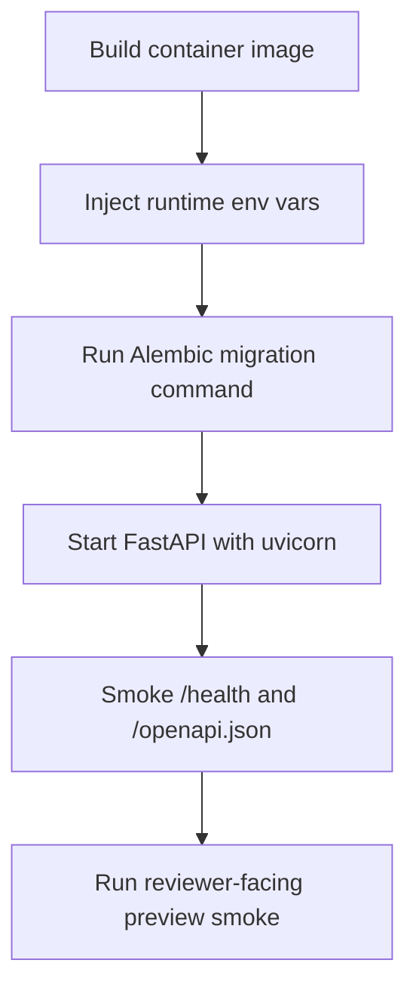

# Generic container deployment path

This is the provider-neutral backend path for a public portfolio demo. It defines
how to build and run the FastAPI service in a container without choosing a host,
activating providers, entering secrets, running live deployments, or spending
money. Use it together with the [public demo deployment readiness runbook](./12-public-demo-deployment-readiness.md).

## Scope



In scope:

- A generic `Dockerfile` and `.dockerignore`.
- A documented start command for FastAPI through `uvicorn`.
- Environment variable names and guardrails.
- Migration and smoke commands that an owner can run against a chosen preview
  environment.

Out of scope:

- CI/CD pipeline setup.
- Live hosting, provider activation, secret entry, hosted database migrations, or
  paid/spend-incurring actions.
- Frontend repository changes.

## Container build and start commands

Build the image locally:

```bash
docker build -t my-agents-backend .
```

Run a local container with a local-only `.env` file:

```bash
docker run --rm \
  --env-file .env \
  -p 8000:8000 \
  my-agents-backend
```

The container command is:

```bash
uv run --no-sync uvicorn main:app --host 0.0.0.0 --port ${PORT:-8000}
```

For non-container hosts, the equivalent command is:

```bash
uv sync --frozen --no-dev
uv run uvicorn main:app --host 0.0.0.0 --port "${PORT:-8000}"
```

## Runtime environment variables by name

Keep real values in the chosen host secret manager or local `.env` only. Do not
commit or paste real secrets into docs, logs, or evidence bundles.

Required for a reviewer-facing preview/public demo:

- `MY_AGENTS_DEPLOYMENT_ENVIRONMENT`
- `MY_AGENTS_DATABASE_URL`
- `MY_AGENTS_AUTO_CREATE_TABLES`
- `MY_AGENTS_RESPONSE_MODE`
- `OPENAI_API_KEY` or `MY_AGENTS_OPENAI_API_KEY`
- `MY_AGENTS_OPENAI_MODEL`
- `MY_AGENTS_OPENAI_TIMEOUT_SECONDS`
- `MY_AGENTS_OPENAI_MAX_OUTPUT_TOKENS`
- `MY_AGENTS_SESSION_COOKIE_NAME`
- `MY_AGENTS_SESSION_COOKIE_SECURE`
- `MY_AGENTS_SESSION_COOKIE_SAMESITE`
- `MY_AGENTS_CSRF_HEADER_NAME`
- `MY_AGENTS_CORS_ALLOWED_ORIGINS`
- `MY_AGENTS_AUTH_DEV_OUTBOX_ENABLED`
- `MY_AGENTS_AUTH_SIGNUP_ENABLED`
- `MY_AGENTS_AUTH_EMAIL_MODE`
- `MY_AGENTS_AUTH_PUBLIC_APP_BASE_URL`
- `MY_AGENTS_AUTH_SMTP_HOST`
- `MY_AGENTS_AUTH_SMTP_PORT`
- `MY_AGENTS_AUTH_SMTP_USERNAME`
- `MY_AGENTS_AUTH_SMTP_PASSWORD`
- `MY_AGENTS_AUTH_SMTP_FROM_EMAIL`
- `MY_AGENTS_AUTH_SMTP_USE_STARTTLS`
- `MY_AGENTS_AUTH_SMTP_TIMEOUT_SECONDS`
- `MY_AGENTS_AUTH_ABUSE_PROTECTION_ENABLED`
- `MY_AGENTS_AUTH_ABUSE_MAX_ATTEMPTS`
- `MY_AGENTS_AUTH_ABUSE_WINDOW_SECONDS`

Preview/public guardrail expectations:

- `MY_AGENTS_DEPLOYMENT_ENVIRONMENT=preview` for hosted preview, then
  `production` only after owner approval.
- `MY_AGENTS_AUTH_DEV_OUTBOX_ENABLED=false`.
- `MY_AGENTS_AUTH_SIGNUP_ENABLED=true` only while public reviewer signup is
  intentionally open; set it to `false` to stop new backend signups while
  preserving existing verified-user login/session behavior.
- `MY_AGENTS_AUTH_EMAIL_MODE=smtp`.
- `MY_AGENTS_SESSION_COOKIE_SECURE=true` for HTTPS.
- `MY_AGENTS_CORS_ALLOWED_ORIGINS` must be exact HTTPS frontend origins; wildcard
  origins are rejected by settings validation.
- `MY_AGENTS_AUTO_CREATE_TABLES` should stay blank/false for hosted Postgres; use
  Alembic migrations instead.

## Migration command

Run migrations only against the owner-approved preview/production database.

Local/non-container form:

```bash
uv run alembic upgrade head
```

Container form:

```bash
docker run --rm \
  --env-file .env \
  my-agents-backend \
  uv run --no-sync alembic upgrade head
```

Do not run hosted DB migrations from an agent session unless the owner has
explicitly provided the target, credentials, and approval for that environment.

## Health and OpenAPI smoke

After the service starts, verify the public metadata endpoints:

```bash
curl -fsS "$BACKEND_ORIGIN/health"
curl -fsS "$BACKEND_ORIGIN/openapi.json" >/tmp/my-agents-openapi.json
```

For a fuller backend API smoke after preview exists:

```bash
uv run python -m scripts.local_demo_smoke --base-url "$BACKEND_ORIGIN" --timeout 120
```

Only use the fuller smoke when the target environment and test account path are
approved. Do not use `/auth/dev/outbox` for preview or production.

## Rollback and disable path

Minimum public-demo rollback path:

1. Stop or roll back the backend deployment to the last known-good image.
2. Remove traffic from the public backend URL or point the frontend away from it.
3. Revoke or rotate compromised SMTP/OpenAI/database credentials if needed.
4. Set `MY_AGENTS_AUTH_SIGNUP_ENABLED=false` and redeploy/restart the backend to
   block new signups, then also disable signup at the frontend or infrastructure
   layer if available.
5. Record the incident, rollback time, deployed commit/image, and remaining risk
   in the evidence bundle.

The backend signup switch only blocks new account creation. It intentionally does
not revoke existing sessions or prevent existing verified users from logging in.

## Owner-gated boundaries

Stop and ask the owner/orchestrator before any of the following:

- Entering real provider secrets.
- Activating SMTP, OpenAI, database, hosting, or paid services.
- Running migrations against a hosted database.
- Publishing a public URL or running production smoke.
- Changing spend limits, quotas, or public signup policy.
