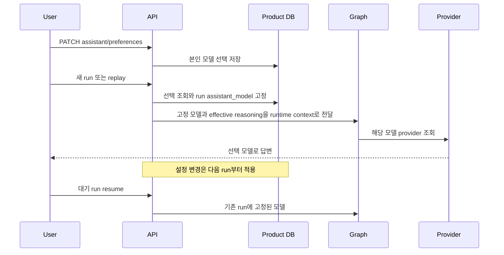

# Assistant 모델 선택

[English](./35-assistant-model-preferences.md)

## 소유권과 적용 범위

일반 계정은 채팅 입력 영역이나 설정에서 assistant 모델을 선택합니다. Product DB가 이 설정을
소유하므로 두 화면과 이후 로그인 세션에서 같은 값을 사용합니다. `MY_AGENTS_OPENAI_MODEL`은
배포 기본값이며 `null`을 저장하면 해당 기본값으로 되돌립니다. Guest는 설정을 바꿀 수 없고
`MY_AGENTS_GUEST_ASSISTANT_MODEL` (기본값 `gpt-6-luna`), standard mode, 해당 모델의 application 기본 effort
(현재 `medium`)로 고정합니다. 새 guest run과 replay는 `MY_AGENTS_OPENAI_MODEL`과 독립적으로 선택합니다. Guest row에 선택값이
있더라도 backend가 무시합니다.

모델 선택은 RAG와 문서 전체 읽기를 포함한 일반 assistant 답변에 적용합니다. 임시 document
workspace attachment turn은 `MY_AGENTS_DOCUMENT_WORKSPACE_MODEL`을 유지합니다.
Source-selection decision, 내부 RAG selector, metadata enrichment와 embedding은 서버가 관리하는
별도 설정을 유지합니다.

## API 계약

모든 endpoint는 인증과 기존 account/session 활성 상태 검증을 요구합니다.

- `GET /capabilities/assistant-models`: `customizable`, `default_model`, `models`를 반환합니다.
  각 모델에는 `id`, `name`, `default_reasoning_effort`, `pro_supported`가 있습니다.
- `GET /assistant/preferences`: `customizable`, `default_model`, nullable `selected_model`,
  `effective_model`을 반환합니다. Guest는 `customizable=false`, `selected_model=null`이며
  `default_model`과 `effective_model`은 모두 운영자가 설정한 guest 모델(기본값 `gpt-6-luna`)입니다.
- `PATCH /assistant/preferences`: `{"assistant_model": "gpt-6.1-sol"}` 또는
  `{"assistant_model": null}`을 받습니다. 필드는 필수이며 알 수 없는 필드/모델은 422입니다.
  Guest는 403 `permission_denied`입니다. 인증한 본인 row만 변경합니다.
- `GET /capabilities/reasoning`: 일반 계정이 선택한 실제 채팅 모델을 반영합니다.
  기존 schema와 일곱 effort 선택지는 유지합니다. 모델 변경 후 다시 조회하세요.

API가 지원하고 저장할 수 있는 목록은 기존의 다음 여섯 개입니다.

`gpt-5.6-luna`, `gpt-6-luna`, `gpt-5.6-sol`, `gpt-6-sol`, `gpt-6.1-sol`, `gpt-6-astra`.

`EXPOSED_ASSISTANT_MODELS`는 `SUPPORTED_ASSISTANT_MODELS`의 subset이어야 합니다.
지원하지 않는 ID를 노출하도록 설정하면 module load에서 바로 실패합니다. Frontend에 제공하는 `models` 배열을 별도로 관리합니다.
노출 순서는 `gpt-6.1-sol`, `gpt-6-luna`, `gpt-6-astra`입니다. UI는 이 세 모델만 명시적인
선택지로 제공하지만 API는 여섯 모델 모두 받습니다. 노출 정책은 권한 제한이 아닙니다.
기존의 지원 모델 선택이나 배포 기본값이 노출 목록 밖이어도 그대로 적용하며 reset/거부하지 않습니다.
Picker는 현재 모델이나 기본값이 노출 목록 밖이어도 사용할 수 있어야 합니다. 해당 모델을 새 radio
선택지로 추가하거나 저장된 선택을 reset 상태로 오인하지 않습니다. Preference metadata의 실제
모델 ID는 유지하며 `null` reset은 노출 여부와 관계없이 실제 배포 기본값으로 돌아갑니다.

이는 application 목록이며 provider 계정의 실제 접근 권한 조회가 아닙니다. 배포 계정의 API key와
모델 접근 권한이 필요합니다. 운영자가 설정한 다른 모델 ID는 배포 fallback으로 사용할 수 있지만
사용자는 임의의 provider 문자열을 저장하지 못합니다. 목록에서 빠진 저장값은 row를 수정하지 않고
배포 기본 모델로 fallback합니다. 공개 모델 선택지가 credential, 다른 사용자 설정, provider trace나
내부 모델 목록을 공개하는 것은 아닙니다.

## 기본 effort와 실행 lifecycle

`my_agents/model_defaults.py`는 수정 가능한 application 기본 effort를 관리합니다.
Luna/Sol은 공식 모델 문서의 `medium`으로 시작했고 Astra는 application의 `medium` seed입니다.
권장값은 정책을 강제하지 않습니다. 일반 계정의 명시적인 reasoning 선택과 replay 상속은 유지합니다.
GPT-6.1 Sol과 Astra는 `none`/`minimal`을 `low`로 변환하며 나머지 네 모델은 `minimal`만 `low`로
바꾸고 `none`은 유지합니다.

Sync/stream/replay는 admission 전에 현재 선택을 조회합니다. 모델 변경은 transcript나 진행 중인
run을 바꾸지 않습니다. Replay는 기존 transcript 교체 동작을 유지하며 현재 선택으로 replacement
run을 만듭니다. HITL resume는 사용자 선택이나 배포 기본값이 바뀌어도 시작된 run 모델을 사용합니다.

Run result, 대기/detail 응답, summary와 `run_started`의 nullable `assistant_model`은 실제 답변
surface에 사용한 configured ID입니다. 과거 row/event는 `null`이며 추측한 모델로 채우지 않습니다.
모델이 없는 과거 resume는 배포 fallback을 사용합니다. 모델 ID는 runtime context이며 ORM 객체를
checkpoint에 넣지 않습니다. Provider cache는 모델별로 분리하고 global Settings를 수정하지 않습니다.
System prompt의 모델 정체성과 request model은 같은 선택 설정에서 가져옵니다.

## Migration과 검증

Migration `20260930_0035`는 nullable `users.assistant_model_preference`와
`agent_runs.assistant_model`을 추가합니다. 기존 DB에서 새 application을 실행하기 전에
[migration runbook](./14-render-migration-and-rollback-notes.md)으로 적용하세요.
Rollback은 새 column과 저장된 선택/모델 기록을 삭제합니다.

Offline 검증은 인증, guest 차단, 목록 검증, 사용자 격리, reset, 모델 기본값, 여섯 모델의 run/event,
replay, stream, resume 고정, provider cache/정체성 격리, SQLite upgrade/downgrade와 PostgreSQL
offline SQL을 다룹니다. 실제 provider 접근 권한, 답변 품질과 배포 검증은 별도로 필요합니다.

2026-09-30 검증: backend 745 passed / 13 skipped, Ruff lint/format 통과. Claude가 격리된
deterministic backend의 OpenAPI/Zod 계약과 실제 BFF 인증 flow를 검증했습니다. Frontend
lint/typecheck/build와 unit 388개, 관련 browser test 17개 통과. 전체 browser suite는
202 passed / 2 skipped이며 workspace file drop과 transcript autoscroll 실패 2개는 clean develop에서도
재현했습니다. 임시 서버는 종료했고 구현은 develop에서 추적합니다. 실제 OpenAI 접근 권한이나 모델 품질의
검증을 의미하지 않습니다.

노출 목록 분리 검증: backend 747 passed / 13 skipped, lint/format 통과. Claude가 frontend unit
390개와 관련 browser test 21개, typecheck/build 통과를 보고했습니다. 노출하지 않는 기존 설정과
기본값 reset을 검증했으며 새 migration이나 강제 모델 변경은 없습니다.

## 자동 파일 재참조와 접수

대화 맥락 유지는 접수 시 일반 모델과 workspace 모델 선택을 고정합니다. 파일 접근을 결정할 때까지 실제 `assistant_model`은 미확인 상태일 수 있으며 `run_model_resolved`가 실행 모델을 알립니다. 원본을 다시 읽으면 별도 고정한 workspace 모델을, 메모로 논의를 이어가면 일반 모델을 사용합니다. [맥락 유지](./36-conversation-continuity.ko.md)를 참고하세요.

게스트 모델 정책 (2026-10-03): `MY_AGENTS_GUEST_ASSISTANT_MODEL` 기본값은 `gpt-6-luna`입니다.
`SUPPORTED_ASSISTANT_MODELS`의 여섯 ID를 지원하며 picker에서 숨긴 모델도 설정할 수 있습니다.
빈 값이나 지원하지 않는 ID는 설정 검증에서 거부합니다. 생략하면 `DEFAULT_GUEST_ASSISTANT_MODEL`을
사용합니다. 환경 변수 변경 후 backend를 재시작하세요. 일반 계정의 fallback이나 guest row의 모델 선택은
guest 모델을 바꾸지 않습니다. 이미 시작한 run은 resume 시 저장된 모델을 유지하며 과거 기록을 수정하지
않습니다. Migration은 필요하지 않습니다. 일반 계정, workspace, 요약, routing, metadata, embedding의
기존 모델 선택 규칙은 유지합니다. GPT-6 Luna는 기존 Responses API와 medium effort를 지원합니다
([공식 모델 문서](https://developers.openai.com/api/docs/models/gpt-6-luna)).
