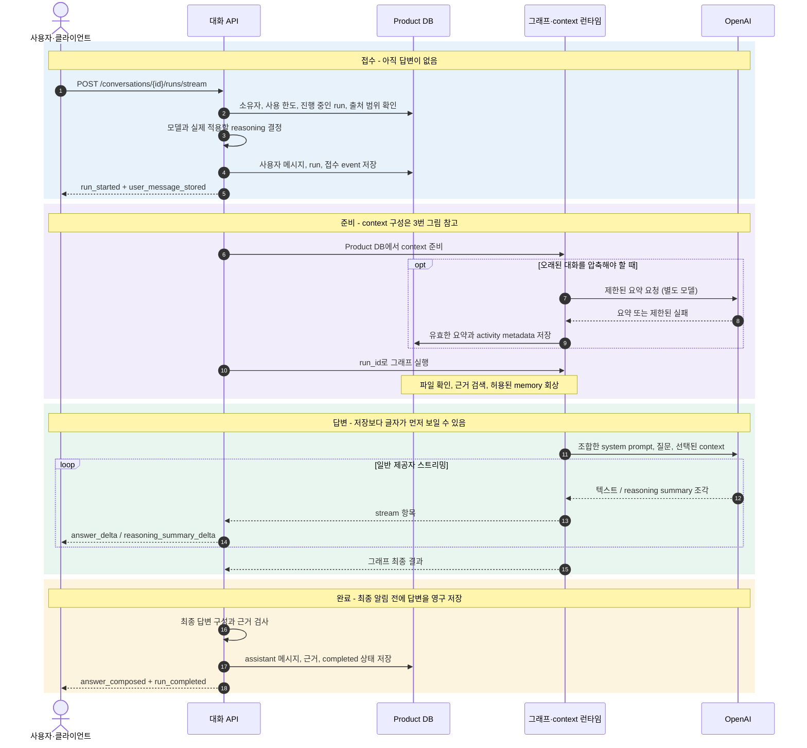
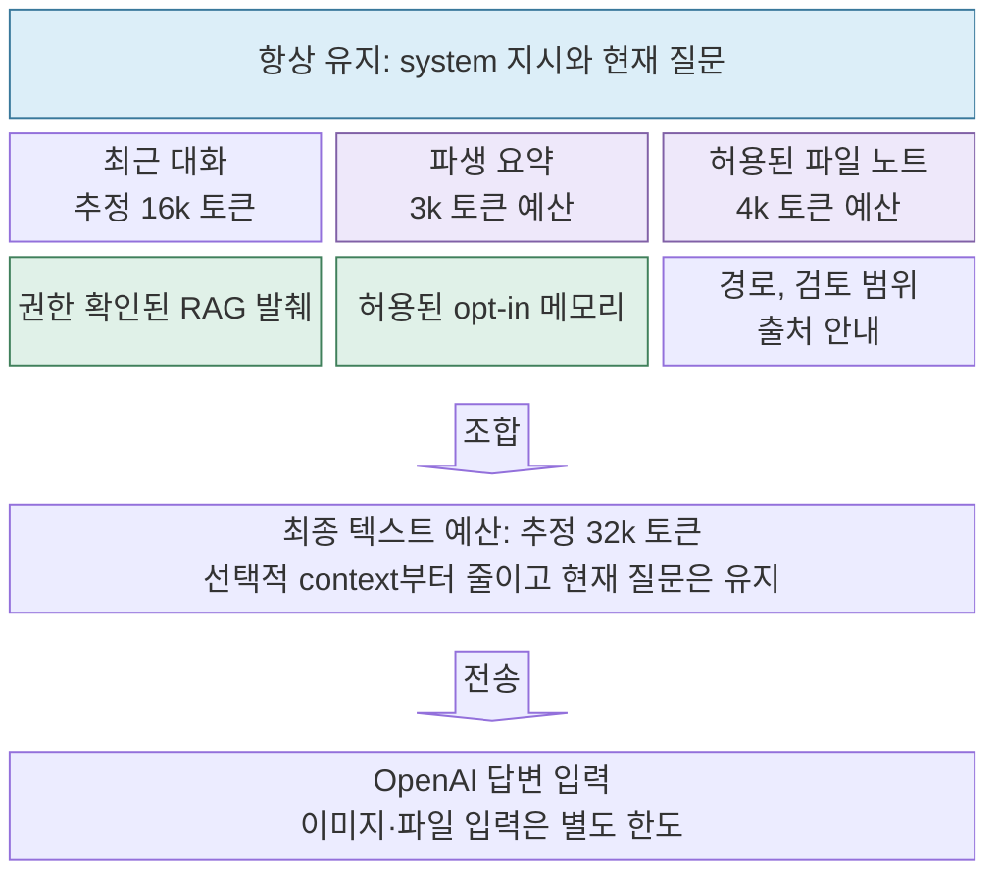
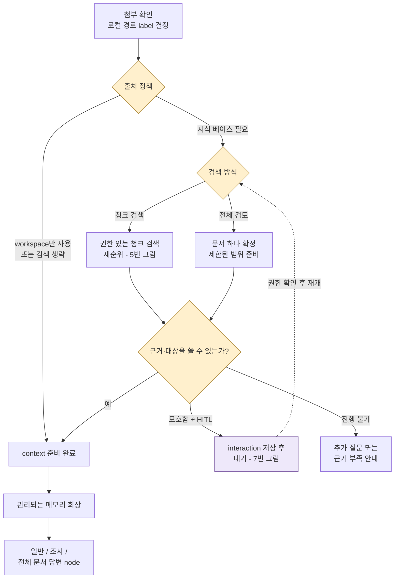
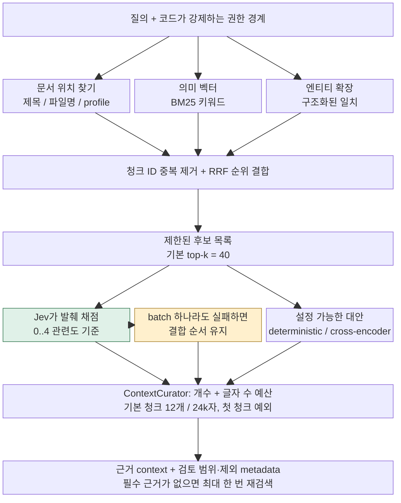
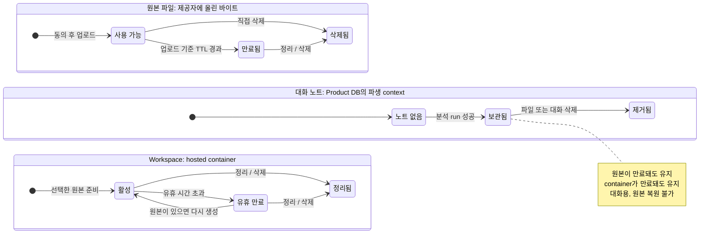
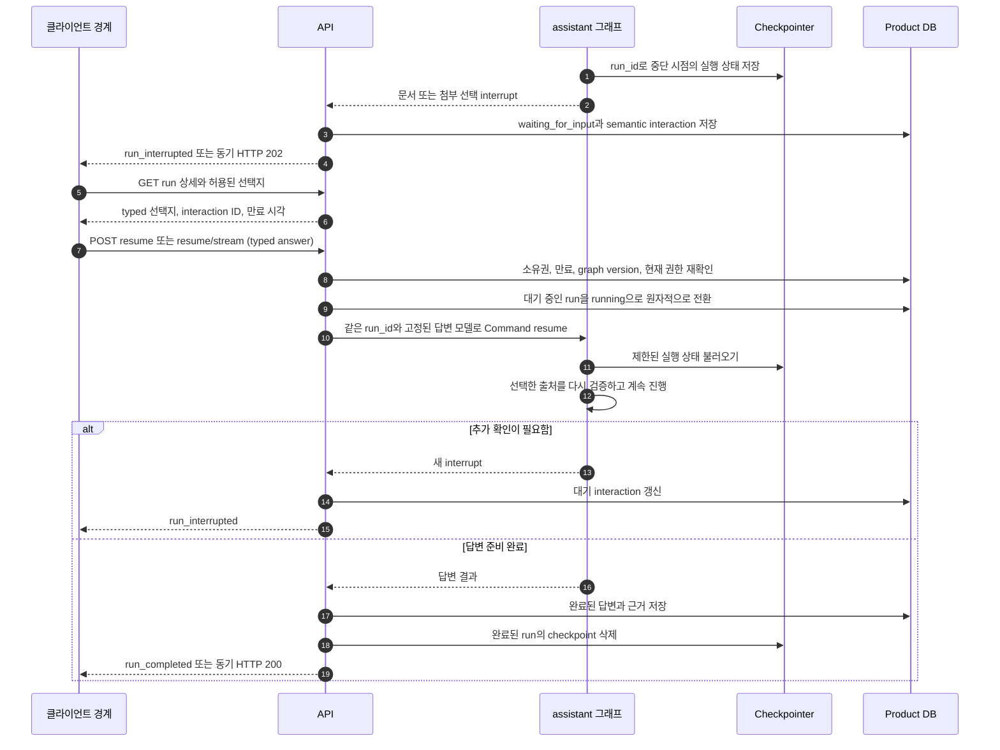
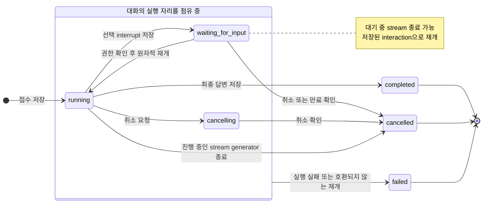
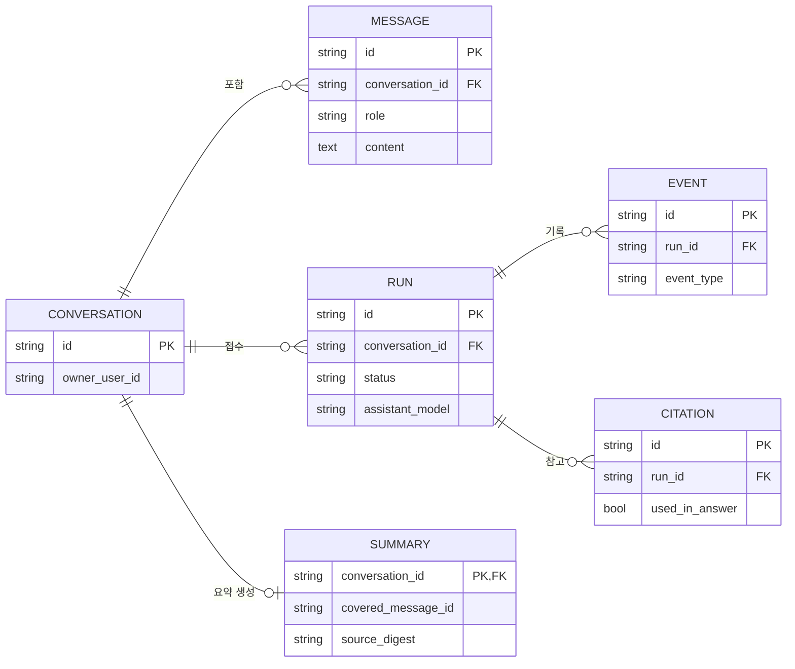

# 메시지 전송부터 답변 수신까지의 서비스 흐름

[English](./38-message-to-answer-service-flow.md) | 한국어

인증된 제품 conversation API에서 사용자 메시지 하나가 전송되어 답변으로 저장되기까지의 과정을 따라갑니다.
2026-10-02 시점의 코드를 기준으로 확인했습니다. 지금 코드가 어떻게 실행되고 각 데이터를 누가 소유하는지를
설명하는 문서이며, 새 설계를 제안하거나 실제 운영 설정을 단정하지 않습니다.

그림의 label은 한국어로 옮겼지만 endpoint, event 이름, `run_id`, 저장되는 상태 값처럼 코드에서 검색해야 하는
식별자는 영어 그대로 두었습니다. Client는 논리적인 경계로만 표시했습니다. 이 문서를 쓰면서 프론트엔드 컴포넌트,
proxy 코드, 실제 화면은 확인하지 않았습니다.

아홉 개의 그림은 서로 다른 서비스가 아니라, 하나의 요청을 여러 관점에서 나누어 본 것입니다.

- 1–2번: 단계별 담당과 시간 순서
- 3–6번: context 구성, 검색, 파일의 수명
- 7–8번: 사용자에게 묻고 재개하는 과정, run의 상태 변화
- 9번: 영구적으로 저장되는 데이터

진입점은 SSE로 응답하는 `POST /conversations/{conversation_id}/runs/stream`이고, 동기 응답이 필요하면
`/runs`를 씁니다. 대화는 이미 만들어져 있고, 임시 파일은 메시지를 보내기 전에 업로드했다고 가정합니다.
인증이 없는 예전 개발용 `/assistant/chat`은 이 흐름에 속하지 않으며, 같은 DB·소유권·HITL(사용자 확인) 계약을
따르지 않습니다.


## 1. 누가 무엇을 담당하는가 — Swimlane

Swimlane은 일반 스트리밍 답변이 정상적으로 완료될 때 책임이 어느 구성 요소로 넘어가는지 보여 줍니다.
한 번에 반환되는 workspace 답변, 사용자 선택 대기, 실패는 뒤의 그림에서 다룹니다.

대화 기록과 실행 상태는 서버가 소유합니다. 요청이 접수되면 답변이 생기기 전에 사용자 메시지부터 저장합니다.
그다음 검색은 생략되거나, 사용자가 출처를 고를 때까지 멈추거나, 답변의 근거를 공급합니다.
완료는 화면에 글자가 보이기 시작한 시점이 아니라, assistant 메시지와 근거가 DB에 commit된 시점입니다.

```mermaid
swimlane-beta TB
    accTitle: 메시지 소유권과 전달 경계
    accDescr: 클라이언트가 보내고, API가 접수하고, 그래프가 답변을 준비하고, API가 저장한 뒤에 완료됩니다.
    subgraph client["사용자와 클라이언트"]
        Send["메시지 전송"]
        Partial["임시 답변 표시"]
        Final["최종 답변 표시"]
    end
    subgraph api["대화 API"]
        Admit["검증 후 원자적으로 접수"]
        Emit["답변 조각 전달"]
        Commit["답변 확정과 저장"]
    end
    subgraph runtime["그래프와 모델 제공자"]
        Context["context와 출처 준비"]
        Generate["답변 작성"]
    end
    Send --> Admit
    Admit --> Context
    Context --> Generate
    Generate -->|"일반 텍스트 스트리밍"| Emit
    Emit -.-> Partial
    Emit -->|"제공자의 최종 결과 도착"| Commit
    Commit -->|"run_completed"| Final
```

[렌더링된 SVG 보기](./assets/message-flow/ko/diagram-1.svg)

사용자는 run이 완료되기 전에도 답변이 조금씩 도착하는 것을 볼 수 있습니다. 새로고침한 뒤에는 저장된 대화와
run 상태가 기준입니다. 사용자 입력을 기다리는 상태는 별도의 상태이며, 그동안 보이지 않는 곳에서 답변 생성이
계속되지 않습니다.

근거: [run endpoint](../../my_agents/api/conversations/endpoints/runs.py),
[stream lifecycle](../../my_agents/api/conversations/endpoints/stream.py).

## 2. 일반 스트리밍 요청의 시간 순서

일반 답변이 정상적으로 완료되는 경우의 순서입니다. 그래프 안의 검색과 파일 처리는 뒤에서 자세히 다룹니다.
그림에서는 요약 요청과 답변 요청을 같은 OpenAI 칸에 그렸지만, 사용하는 모델은 각각 따로 설정합니다.
선택적인 event가 모든 요청에서 나타나지는 않습니다.



[렌더링된 SVG 보기](./assets/message-flow/ko/diagram-2.svg)

`run_started`와 `user_message_stored`는 접수 직후에 전달됩니다. 오래된 대화를 압축해야 하면 그래프가 답변을
시작하기 전에 압축합니다. `retrieval_completed`와 `graph_invoked`는 그래프 update로 필요한 정보가 생기는 즉시
전달됩니다. `graph_invoked`는 관측용 event이므로 그래프가 실제로 실행을 시작한 시각과 같다고 보면 안 됩니다.
파일 회상 과정에서 모델이 정해지면 선택적인 `run_model_resolved` event로 그 결과를 알립니다.

일반 responder는 `ChatOpenAI.stream()`을 호출합니다. Backend는 텍스트 조각을 받는 대로 클라이언트에 전달하고,
같은 출력을 모아 최종 저장에 씁니다. 동기 `/runs`도 같은 일을 하지만 마지막에 JSON 응답 하나만 돌려줍니다.
완료되면 HTTP 200, 사용자 선택을 기다리면 HTTP 202입니다.

최종 답변 입력은 검색이 끝난 뒤 responder에서 한 번 더 조합합니다. 설정된 모델 이름이 들어간 system prompt,
최근 대화, 현재 질문, summary와 file note channel, 검색 근거, 허용된 memory를 합칩니다. 텍스트 예산을 넘으면
오래된 일반 대화, memory, 검색 context, 남은 파생 대화 순으로 줄이고, 현재 질문은 항상 그대로 둡니다.
그래서 검색 단계에서 주입한 근거 수와 실제로 제공자에게 전달된 수가 다를 수 있습니다. 실제 전달 시점의 개수와
참조는 `context_delivery` manifest에 기록됩니다.

근거: [stream endpoint와 event iterator](../../my_agents/api/conversations/endpoints/stream.py),
[graph stream adapter](../../my_agents/api/conversations/graph_streaming.py),
[response provider](../../my_agents/agents/general_assistant/responders.py).

## 3. 요청 접수와 최종 답변 context 구성 — Block

Run endpoint에서 확인한 접수 조건은 session 인증, 대화 소유권, guest 사용 한도, 지식 베이스 선택, 첨부 사용
자격입니다. 클라이언트나 proxy의 보안 동작은 이 문서에서 확인하지 않았습니다. 진행 중인 run을 먼저 검사하는
단계 뒤에는 DB unique constraint가 있어서, 동시에 들어온 요청 두 개가 함께 실행 자리를 차지할 수 없습니다.
현재 메시지가 너무 길면 접수 전에 거부합니다. 접수 중 충돌이 나면 사용자 메시지와 run 생성을 함께 되돌립니다.



[렌더링된 SVG 보기](./assets/message-flow/ko/diagram-3.svg)

- `conversation_id`는 사용자가 보는 대화를, `run_id`는 실행 한 번과 그 checkpoint를 가리킵니다.
- 선택 항목인 `client_request_id`는 사용자별로 고유해야 합니다. 중복되면 409를 반환하며, 두 번째 run을 만들거나 첫 번째 요청을 다시 실행하지 않습니다.
- 일반 계정의 답변은 사용자가 고른 모델(지원되는 경우)이나 배포 기본 모델을 씁니다. Guest는 항상 배포 기본 모델을 씁니다. Workspace 모델과 요약 모델은 따로 설정합니다.
- 모델별 reasoning 정규화는 실제 적용값을 기록하기 전에 한 번, 제공자 호출 직전에 한 번 더 적용합니다. 사용자에게 보이는 effort 선택지는 고정되어 있습니다.
- 접수 단계에서 모델 선택을 기록합니다. 원본 파일을 자동으로 회상하는 경우 최종 답변 모델은 `run_model_resolved` 시점까지 미뤄질 수 있습니다. 재개된 run은 이미 정해 둔 모델을 그대로 씁니다.
- 최근 대화, 대화 요약, 파일 노트, opt-in 장기 메모리는 서로 다른 channel입니다. 요약이 있다고 해서 장기 메모리에 동의한 것으로 보지 않습니다.

현재 텍스트 예산 기본값은 다음과 같습니다.

| 예산 | 기본값 |
| --- | --- |
| 최근 대화 | 추정 16,000 토큰 또는 메시지 64개 |
| 압축 후 최근 대화 목표 | 약 8,000 토큰 |
| 대화 요약 | 3,000 토큰 |
| 파일 노트 | 4,000 토큰 |
| 조합된 전체 텍스트 | 32,000 토큰 |

모두 설정으로 바꿀 수 있는 추정치이며, 제공자가 이미지나 파일에 대해 세는 실제 토큰 수가 아닙니다.
요약 모델은 최대 두 번까지 제한된 호출을 합니다. 압축에 실패하면 남아 있는 유효한 context로 계속 진행하고,
무엇을 생략했는지 metadata로 남깁니다.

근거: [admit_run](../../my_agents/api/conversations/run_lifecycle.py),
[continuity 구현](../../my_agents/conversations/continuity.py),
[모델 선택](../../my_agents/api/reasoning.py), [연속성 계약](./36-conversation-continuity.ko.md).

## 4. 출처 선택의 핵심 분기 — Flowchart

답변이 만들어지는 경로를 실제로 바꾸는 결정만 남겼습니다. 모든 `add_edge`를 옮기지 않고 관련 graph node를
묶어서 그렸습니다. 실선은 정상 진행입니다. 점선으로 그린 재개 화살표는 앞서 고른 검색 방식으로 돌아간다는 뜻이며,
Jev가 검색 방식을 다시 고르지는 않습니다. 모호한 첨부는 출처 판단보다 먼저 처리하고, 같은 interaction 방식으로
사용자에게 물어볼 수 있습니다. `general_assistant`와 `research_helper` label은 같은 답변 구조를 공유합니다.



[렌더링된 SVG 보기](./assets/message-flow/ko/diagram-4.svg)

출처를 쓸지에 대한 큰 판단과, 청크 검색과 전체 검토 중 무엇을 쓸지에 대한 선택은 기본적으로 Jev가 맡고
로컬 규칙이 fallback입니다. `MY_AGENTS_DECISION_PROVIDER`로 지원되는 다른 정책을 고를 수 있습니다.
Jev는 길이를 제한한 최근 human/assistant 메시지만 받고, summary·file note·memory channel은 받지 않습니다.

Workspace가 활성화되어 있으면, 사용자가 지식 베이스 범위를 직접 고르지 않은 한 지식 베이스 검색을 생략합니다.
따라서 지식 베이스를 직접 골랐다면 첨부와 지식 베이스 근거를 함께 쓸 수 있습니다. 첨부가 있다는 이유만으로
검색이 막히지는 않습니다. 원본을 쓸 수 없거나 어떤 파일인지 모호한데 사용자에게 물어볼 방법도 없다면,
파일을 읽은 척하지 않고 그 한계를 답변에 밝힙니다.

전체 검토 경로는 사용자가 읽을 권한이 있고 직접 고를 수 있는 문서 하나를 확정합니다. 제한된 검토 범위와 인용
근거를 준비한 뒤, 답변 node 안에서 권한을 다시 확인하고 해당 범위의 원문을 읽습니다. 원문 전체는 checkpoint에
저장하지 않습니다. 기본값으로 24,000자 이하 문서는 끝까지 읽고, 그보다 길면 앞 12,000자만 읽은 뒤 부분 검토라는
안내를 반드시 붙입니다. 나머지 부분을 자동으로 이어 읽지는 않습니다.

필요한 근거가 없거나 추가 질문이 해결되지 않으면, 답변을 생성하기 전에 그래프 실행이 끝날 수 있습니다.
이때는 API가 안전한 응답을 준비합니다. HITL node는 그래프가 선택 대기를 하도록 설정된 경우에만 존재합니다.
HITL이 없으면 전체 검토 대상이 모호해도 멈추지 않고 `retrieve_memory`로 바로 넘어가는 보조 경로가 있는데,
그림에서는 생략했습니다.

근거: [graph 구성과 답변 dispatch](../../my_agents/agents/general_assistant/graph.py),
[RAG node](../../my_agents/agents/general_assistant/rag_retrieval.py),
[attachment node](../../my_agents/conversations/attachment_graph.py).

## 5. 검색 근거가 변환되는 과정 — Block pipeline

문서 parsing과 indexing은 이 요청보다 훨씬 전에, 지식 수집 단계에서 끝났습니다. 답변 시점의 검색은 사용자의
권한 범위 안에서 시작합니다. 아래 그림은 특정 문서 하나로 고정하지 않은 일반 검색 경로를 보여 주며, 순위
계산과 그 fallback을 분명히 구분합니다. Block의 크기나 화살표의 굵기는 후보 수와 관계가 없고, 숫자는 측정값이
아니라 설정된 상한입니다. 사용자가 문서 하나를 직접 고른 경우에는 별도의 범위 지정 검색 경로를 씁니다.



[렌더링된 SVG 보기](./assets/message-flow/ko/diagram-5.svg)

후보는 파일명·제목 일치, 생성된 metadata profile, 의미 벡터, BM25 키워드 일치, 엔티티 기반 확장에서 모입니다.
구조화된 엔티티 추출은 코드가 담당하므로, `enumeration` intent label만으로 agent 이름 추출 도구가 생기지는
않습니다. RRF는 검색 경로별 순위를 합치고 중복된 청크 ID를 정리합니다. 기본적으로 상위 40개 후보가 재순위로
넘어가고, context 구성 단계에서 최대 12개 청크를 24,000자 예산 안에 담습니다. 현재 packer는 첫 청크가 예산보다
커도 받아들이므로, 글자 수 예산을 절대적인 상한으로 보면 안 됩니다.

Jev는 출처 판단에 어떤 제공자를 설정했든 상관없이 기본 재순위 모델입니다. 질의, 임시 ID, 잘라 낸
**권한 확인된 발췌**를 받아 0–4의 다섯 단계 관련도 기준으로 점수를 매깁니다. 지식 베이스 ID, 파일명, 요약,
파일 노트, 메모리는 일부러 넣지 않지만, 발췌 자체에 민감한 원문이 들어 있을 수는 있습니다. Batch가 하나라도
실패하면 그 회차의 점수를 모두 버리고 결합된 순서를 그대로 씁니다. Cross-encoder와 deterministic 방식은 설정으로
고르는 대안이며, 실패했을 때 자동으로 넘어가는 fallback이 아닙니다.

ContextForge 그래프는 필수 근거가 없을 때 제한된 재검색을 한 번만 허용합니다. 끝없이 반복하는 검색이 아닙니다.
재순위는 순서를 개선할 뿐, 접근 권한을 주거나 내용이 사실임을 보증하지 않습니다. RAG Agent의 deterministic
verifier도 근거와 경로가 서로 맞는지를 검사할 뿐, 모든 문장의 사실 여부를 검증하지는 않습니다.

근거: [후보 수집](../../my_agents/agents/context_forge/candidates.py),
[결합](../../my_agents/agents/context_forge/fusion.py),
[재순위](../../my_agents/agents/context_forge/reranking.py),
[context 구성](../../my_agents/agents/context_forge/packing.py),
[재검색](../../my_agents/agents/context_forge/graph.py), [Jev 계약](./37-jev-evidence-reranking.ko.md).

## 6. 원본·노트·container의 서로 다른 수명 — State

이 경로는 영구적인 지식 베이스 수집과 다릅니다. 승인된 일반 계정은 지원되는 파일과 이미지를 직접 첨부할 수
있고, guest는 workspace 원본이나 파일 노트를 쓸 수 없습니다. 파일을 제공자에게 보내거나 실행하기 전에
업로드 동의와 소유권부터 확인합니다.



[렌더링된 SVG 보기](./assets/message-flow/ko/diagram-6.svg)

세 묶음은 동시에 존재하지만 각자 수명이 다른 자원입니다. 하나의 순차 pipeline도 아니고, 동시에 실행되는 작업을
뜻하지도 않습니다. Label은 각 자원을 쓸 수 있는지를 요약한 것입니다. ‘노트 없음’, ‘보관됨’ 같은 노트 상태는
설명을 위한 이름일 뿐 저장되는 `RunStatus` 값이 아닙니다. 원본이 만료되면 대화 노트도 지워지는 것처럼 보이지
않도록 일부러 그렇게 그렸습니다.

Workspace 실행은 격리된 OpenAI SDK adapter와 별도로 설정한 workspace 모델을 씁니다. Hosted container는 네트워크가
차단되어 있지만, 이 제한은 container에만 해당하며 일반 assistant의 hosted web search와는 관계가 없습니다.
이미지와 파일은 각각 그에 맞는 typed input으로 전달됩니다. 분석에 성공했다고 해서 결과 파일이 꼭 생기지는
않습니다. 인식된 형식과 경로의 결과물만 인증된 다운로드가 가능한 artifact로 등록하며, assistant가 다운로드
링크를 지어내서는 안 됩니다.

Workspace 제공자는 결과를 실시간 stream이 아니라 한 번에 돌려줍니다. 이후에 보이는 `answer_delta`는 이미 만들어진
답변을 나눠 보낸 fallback 조각일 수 있으며, workspace 모델이 실시간으로 생성한 토큰이 아닙니다. 새 원본은
업로드한 지 7일 뒤에 만료되고, container의 유휴 수명은 그와 별개로 제한됩니다.

노트는 해당 대화에만 속하고, 성공한 run 뒤에 저장됩니다. 노트가 있다고 해서 파일을 정확히, 빠짐없이 읽었다는
증거가 되지는 않습니다. 이후 대화에서는 노트를 바탕으로 답할 수 있지만, 정확한 내용 확인이나 수정에는 아직
유효하고 권한이 있는 원본이 필요합니다. 어떤 파일을 가리키는지 모호하면 `attachment_selection`으로 사용자에게
물을 수 있습니다. 만료된 원본은 노트로 되살릴 수 없습니다. 제공자 쪽의 실제 파일 삭제는 답변 흐름과 별개로
durable cleanup outbox가 처리합니다.

근거: [workspace service](../../my_agents/document_workspace/service.py),
[typed provider 실행](../../my_agents/document_workspace/provider.py),
[파일 회상](../../my_agents/conversations/file_context.py), [연속성 계약](./36-conversation-continuity.ko.md).

## 7. 사용자에게 묻고 같은 run에서 재개하기

사용자가 어떤 문서나 첨부를 말하는지 알 수 없으면, run은 버전이 붙은 semantic interaction을 만듭니다.
Interaction은 어떤 입력이 필요한지만 설명하고, 프론트엔드 컴포넌트를 어떻게 그릴지는 정하지 않습니다.
Product DB는 새로고침 뒤에도 복구할 수 있도록 대기 중인 interaction을 저장하고, checkpointer는 그래프를 재개하는
데 필요한 제한된 실행 상태를 저장합니다.



[렌더링된 SVG 보기](./assets/message-flow/ko/diagram-7.svg)

재개하려면 클라이언트가 현재 interaction ID와 typed answer를 보내야 합니다. 서버는 소유권, 만료, graph version,
제시했던 선택지, 사용자 권한을 다시 확인하고, 오래되었거나 위조된 선택은 거부합니다. 대기에서 실행으로 바뀌는
전환은 원자적으로 처리하므로 같은 run이 두 번 재개되지 않습니다. 재개할 때 guest 질문 횟수를 다시 쓰거나 사용자
메시지와 run을 새로 만들지 않습니다. 기다리는 동안 권한이 바뀔 수 있으므로, 앞선 검색 때 확인한 권한만으로는
충분하지 않습니다.

System knowledge는 자동으로 붙는 내부 context이며 사용자 선택지에 나타나지 않습니다. 지속되는 checkpointer는
기본적으로 PostgreSQL이 제공하고, SQLite나 offline 경로는 재시작 뒤 재개를 보장하지 않습니다. 끝난 run의
checkpoint는 정리합니다. 만료된 interaction이나 호환되지 않는 graph version은 예전 상태를 그대로 실행하지 않고,
정책에 따라 취소나 실패로 처리합니다.

근거: [prepare_conversation_run_resume](../../my_agents/api/conversations/endpoints/runs.py),
[interaction 저장](../../my_agents/api/conversations/interactions.py),
[resume 호출](../../my_agents/api/conversations/graph_invocation.py),
[interaction 계약](./27-agent-frontend-interaction-contract.ko.md).

## 8. 완료·취소·실패는 서로 다른 결과

그림에 나온 상태가 저장되는 run 상태의 전부입니다. ‘접수 거부’와 ‘만료’는 `RunStatus` 값이 아니며, 접수 전에
거부된 요청에는 run 자체가 생기지 않습니다. 전송 오류와 제공자 오류는 그림에서 하나로 묶었습니다. 오류별
정확한 처리는 endpoint 코드를 기준으로 합니다.



[렌더링된 SVG 보기](./assets/message-flow/ko/diagram-8.svg)

일반 스트리밍 run이 끝나면 finalization 단계에서 답변, 참고한 출처, 검토 범위, memory snapshot, 선택적인
reasoning summary를 정리합니다. 그다음 assistant 메시지, 인용 기록, 출처와 event 근거, completed 상태를
저장합니다. 공개 trace는 확인된 실행 데이터로만 구성합니다. `answer_composed`와 최종 `run_completed`는 완료
저장이 성공한 뒤에만 전달합니다. 인용 판정은 보수적이고 결정론적입니다. 참고한 출처라고 해서 모두 답변을
뒷받침하는 인용인 것은 아닙니다. 자동으로 붙는 system 출처의 정보는 공개 응답과 event에서 제거합니다. 부분
검토 안내는 finalization 뒤에도 그대로 남습니다.

스트리밍된 조각은 임시 표시일 뿐입니다. 최종 `run_completed`에는 원래 조각에 없던 안내나 서식이 더해질 수
있습니다. 클라이언트는 HTTP 200, `graph_invoked`, 첫 토큰만 보고 완료되었다고 판단하면 안 됩니다. SSE가
시작된 뒤에 실패하면 HTTP 상태는 이미 보낸 뒤이므로, 상태를 바꾸거나 제공자 오류를 노출하는 대신 안전한
`run_failed`와 `run_error` event로 알립니다.

취소는 실행 경계에서 협력적으로 처리됩니다. 클라이언트 연결이 끊기면 stream의 `GeneratorExit` 경로가 대기 중이
아닌 진행 중 run을 취소하고 checkpoint를 정리합니다. 프로세스가 비정상 종료된 경우에는 별도의 stale-run 정리가
필요할 수 있습니다. 연결이 끊긴 뒤에도 답변을 끝까지 만들어 주는 별도 실행기는 없습니다. 이미 저장된 대기
interaction은 stream이 닫혀도 유지됩니다. 새로고침하면 클라이언트는 저장된 메시지, run 상세, 대기 중인
interaction을 읽어야 하며, 끊긴 stream을 특정 토큰 위치부터 이어 받을 수는 없습니다.

Replay는 재개와 다릅니다. Replay는 이전 turn을 다시 생성하고, replay 계약에 따라 그 뒤의 대화와 상태를 정리하며,
영향을 받은 요약의 출처 정보를 무효화합니다.

근거: [완료·취소 저장](../../my_agents/api/conversations/run_lifecycle.py),
[답변 준비](../../my_agents/api/conversations/answer_finalization.py),
[SSE 종료 처리](../../my_agents/api/conversations/endpoints/stream.py),
[취소 endpoint](../../my_agents/api/conversations/endpoints/events.py),
[replay](../../my_agents/api/conversations/endpoints/replay.py).

## 9. 무엇이 저장되는가 — 핵심 Entity Relationship

실제 **Product DB의 물리적 관계** 가운데 일부를 골라 보여 줍니다. 까마귀 발 모양은 0개 이상, `o|`는 0개 또는
1개를 뜻합니다. 필드는 일부만 적었습니다. 대화 하나에는 메시지와 run이 여러 개 있을 수 있지만 현재 요약은
최대 하나입니다. Event와 인용 기록은 run에 속합니다. 참고한 출처로 기록된 인용이라고 해서 반드시
`used_in_answer`인 것은 아닙니다.

Table과 column 이름은 실제 스키마와 맞추기 위해 영어로 두고, 관계 label만 한국어로 옮겼습니다.



[렌더링된 SVG 보기](./assets/message-flow/ko/diagram-9.svg)

확인한 모델에서 run의 `user_message_id`와 `assistant_message_id`는 DB foreign key가 아니라 애플리케이션이
관리하는 참조입니다. 그래서 강제되는 관계처럼 그리지 않았습니다. 첨부 연결, 파일 노트, artifact, cleanup outbox,
LangGraph가 관리하는 table은 이 그림에서 뺐습니다. 이 그림은 foreign key 구조만 보여 주므로, 자원별 수명은
6번 그림을 참고하세요.

근거: [대화 기록](../../my_agents/conversations/models.py),
[요약·파일 노트 기록](../../my_agents/conversations/continuity_models.py),
[인용 기록](../../my_agents/knowledge/models.py).

### 데이터와 event 경계 한눈에 보기

| Channel | 들어가는 내용 | 혼동하면 안 되는 것 |
| --- | --- | --- |
| Product DB 대화·run 기록 | 사용자 메시지, 최종 assistant 메시지, 상태, 출처 연결 | 제공자 쪽의 원본 대화 상태 |
| Run checkpoint | `run_id` 하나에 속한, 재개용 제한된 실행 상태 | 영구 대화 기록이나 장기 메모리 |
| 대화 요약 / 파일 노트 | 출처 정보가 붙은, 해당 대화 범위의 파생 context | 새 메모리 동의, 또는 만료된 원본의 정확한 사본 |
| Opt-in 메모리 | Product DB가 관리하는 허용된 회상 | 모든 대화에서 자동으로 학습한 내용 |
| Jev 경로 판단 입력 | 길이를 제한한 최근 human/assistant 텍스트와 허용된 선택 metadata | 요약·파일 노트·메모리 channel |
| Jev 재순위 입력 | 질의, 임시 ID가 붙은 권한 확인된 발췌 | 전체 문서 모음, 또는 권한 판단 |
| OpenAI 답변 입력 | System 지시, 현재 질문, 선택된 context. Workspace에서는 typed file | 저장된 모든 문서, 또는 기본으로 전체 대화 |
| 저장된 activity / `agent_trace` | 민감 정보를 가린 event, 확인된 단계와 개수 | 원본 prompt, 숨겨진 추론 내용, 모든 주장의 사실 보증 |
| SSE 전용 `answer_delta` / `reasoning_summary_delta` | 화면에 차례로 표시할 조각 | 저장 완료된 최종 메시지, 이어 받을 수 있는 토큰 기록 |
| SSE 전용 `run_completed` / `run_error` | 전송 계층의 최종 알림 | 따로 저장되는 `AgentEventType` 값 |

저장되는 reasoning summary event는 스트리밍 조각과 별개입니다. Jev의 선택에는 모델이 작성한 계획 설명이 붙지
않습니다. 선택적인 OpenAI selector와 답변 제공자는 그런 설명을 만들 수 있습니다. 일반 responder는 출처 정책에
따라 hosted web search를 쓸 수 있으며, 이는 비공개 지식 베이스 검색과 별개입니다. 임베딩, 요약, 답변, workspace,
Jev 모델은 각각 맡은 역할이 다릅니다.

## 실제 run 하나를 확인하는 순서

1. `client_request_id`, `conversation_id`, `run_id`를 서로 연결합니다. 클라이언트의 재시도와 접수 단계의 재실행을 혼동하지 마세요.
2. Run 상태와 실제 적용된 모델·reasoning 설정을 확인합니다. `run_model_resolved`가 있으면 함께 확인합니다.
3. 검색 경로, intent, 실제 사용된 재순위 방식, 후보·주입 개수, 검토 범위, fallback metadata를 확인합니다.
4. 실제 입력 근거와 짧게 잘린 debug snippet을 구분합니다. 답이 맞았다고 해서 문서 전체를 읽었다는 뜻은 아닙니다.
5. 최종 응답을 저장된 메시지, 참고한 출처, 인용, artifact, 대기 중인 interaction과 비교합니다.
6. HTTP 200이나 스트리밍 조각만 있다면 완료되었다고 보고하지 마세요. failed, cancelled, waiting 상태와 안전한 event를 확인합니다.

관련 계약은 `tests/test_conversations_api.py`, `tests/test_run_admission.py`,
`tests/test_full_document_retrieval.py`, `tests/test_document_workspace.py`, `tests/test_jev_reranking.py`에서
검증합니다. 이 테스트는 정해진 동작을 확인할 뿐, 실제 모델의 품질을 측정하지 않습니다. 필드별 상세는
[streaming 계약](./09-http-streaming-frontend-contract.ko.md),
[모델 선택 설정](./35-assistant-model-preferences.ko.md), [reasoning 정책](./26-run-reasoning-preferences.ko.md)을
참고하세요.

## 다이어그램 선정과 렌더러 호환성

[Mermaid 공식 syntax 목록](https://mermaid.js.org/intro/)의 **31개 유형을 하나씩 검토**했습니다.
(“Other Examples”는 예시 모음이지 32번째 유형이 아닙니다.) 이 문서의 아홉 개 그림은 서로 보완하는 여섯 가지
유형을 씁니다. 보기 좋게 다양화하려는 것이 아니라, 각 절이 답하려는 질문에 맞는 유형을 골랐습니다.

Mermaid 공식 사이트는 현재 12.1.0을 안내합니다. 이 문서의 그림은 로컬의 Mermaid와 Mermaid CLI 11.16.0으로
렌더링해 확인했으며, `swimlane-beta`는 11.16.0 이상이 필요합니다. GitHub나 편집기가 쓰는 Mermaid 버전은
확인하지 않았기 때문에, 그림마다 저장소에 넣어 둔 SVG 링크를 대안으로 붙였습니다. 편집의 기준은 Markdown의
Mermaid block이며, 그림을 고치면 SVG도 다시 만들어야 합니다.

<details>
<summary>공식 다이어그램 유형 전체 검토 내역</summary>

| 유형 | 선택 | 이 문서에 맞는지 판단한 이유 |
| --- | --- | --- |
| [Flowchart](https://mermaid.js.org/syntax/flowchart.html) | 사용 · §4 | 출처와 검색의 조건 분기만 남기고, 전체 graph를 그대로 옮기지 않음. |
| [Swimlanes Diagram](https://mermaid.js.org/syntax/swimlanes.html) | 사용 · §1 | 클라이언트, API, 런타임 사이의 책임과 전달 경계를 보여 줌. |
| [Sequence Diagram](https://mermaid.js.org/syntax/sequenceDiagram.html) | 사용 · §2, §7 | 호출 순서, 스트리밍, checkpoint 재개를 보여 줌. |
| [Class Diagram](https://mermaid.js.org/syntax/classDiagram.html) | 미사용 | Python 타입과 메서드 구조는 요청 흐름 설명에서 주의를 흩뜨림. |
| [State Diagram](https://mermaid.js.org/syntax/stateDiagram.html) | 사용 · §6, §8 | 파일 자원별 수명과 저장되는 run 상태의 전이를 보여 줌. |
| [Entity Relationship Diagram](https://mermaid.js.org/syntax/entityRelationshipDiagram.html) | 사용 · §9 | Product DB에서 강제되는 소유 관계와 개수 제약을 보여 줌. |
| [User Journey](https://mermaid.js.org/syntax/userJourney.html) | 미사용 | 작업별 점수가 필요한데 사용자 만족도 관측이 없음. 책임은 Swimlane으로 점수 없이 표현함. |
| [Gantt](https://mermaid.js.org/syntax/gantt.html) | 미사용 | 측정한 단계별 소요 시간이나 일정이 없어, 근거 없는 시간을 암시하게 됨. |
| [Pie Chart](https://mermaid.js.org/syntax/pie.html) | 미사용 | 지연이나 트래픽 같은 측정된 비율이 없음. |
| [Quadrant Chart](https://mermaid.js.org/syntax/quadrantChart.html) | 미사용 | 두 축으로 점수를 비교하거나 우선순위를 정하는 문서가 아님. |
| [Requirement Diagram](https://mermaid.js.org/syntax/requirementDiagram.html) | 미사용 | 요구사항과 테스트의 추적에는 좋지만 실행 흐름을 그리지 못함. 근거는 코드·테스트 링크로 충분함. |
| [Use Case Diagram](https://mermaid.js.org/syntax/usecase.html) | 미사용 | Actor의 목표만으로는 순서와 상태가 드러나지 않아 Swimlane이 더 적합함. Mermaid 12 이상도 필요함. |
| [GitGraph (Git) Diagram](https://mermaid.js.org/syntax/gitgraph.html) | 미사용 | Git 이력을 그리는 유형이며, 대화 실행이나 replay를 설명하지 못함. |
| [C4 Diagram](https://mermaid.js.org/syntax/c4.html) | 미사용 | 배포·컴포넌트 지도에 적합하지만, 이 문서는 서비스 경계가 아니라 요청 하나의 실행을 다룸. |
| [Mindmaps](https://mermaid.js.org/syntax/mindmap.html) | 미사용 | 분류는 잘 보여 주지만, Block·ER 그림이 담는 방향·예산·소유 제약이 사라짐. |
| [Timeline](https://mermaid.js.org/syntax/timeline.html) | 미사용 | Sequence 그림과 겹치면서 담당자와 분기는 드러나지 않음. |
| [ZenUML](https://mermaid.js.org/syntax/zenuml.html) | 미사용 | Sequence를 쓰는 다른 문법일 뿐, 기본 sequence diagram에 없는 표현력을 더하지 않음. |
| [Sankey](https://mermaid.js.org/syntax/sankey.html) | 미사용 | 흐름 전체에서 보존되는 양이 필요한데, 검색 경로가 겹쳐 후보 수가 보존되지 않음. |
| [XY Chart](https://mermaid.js.org/syntax/xyChart.html) | 미사용 | 벤치마크 결과에는 맞지만, 측정값이 없는 제어 흐름에는 맞지 않음. |
| [Block Diagram](https://mermaid.js.org/syntax/block.html) | 사용 · §3, §5 | Context 조합과 근거 변환은 묶음과 고정된 단계 배치를 분명히 보여 줘야 함. |
| [Packet](https://mermaid.js.org/syntax/packet.html) | 미사용 | SSE·JSON 기록은 고정 길이 bit 구조가 아님. |
| [Kanban](https://mermaid.js.org/syntax/kanban.html) | 미사용 | 작업 보드의 한 장면으로는 허용되는 상태 전이를 표현하지 못함. |
| [Architecture](https://mermaid.js.org/syntax/architecture.html) | 미사용 | 서비스·인프라 자원 중심이며, 배포 인벤토리는 이번 확인 범위 밖임. |
| [Radar](https://mermaid.js.org/syntax/radar.html) | 미사용 | 여러 품질 지표를 측정한 문서가 아님. |
| [Event Modeling](https://mermaid.js.org/syntax/eventmodeling.html) | 미사용 | Command·event·read model 설계에는 좋지만, 구현되지 않은 event sourcing이나 의존 관계를 암시할 수 있음. Sequence와 ER 그림으로 저장 시점을 분명히 함. |
| [Treemap](https://mermaid.js.org/syntax/treemap.html) | 미사용 | 계층별 크기가 필요한데, 기록 크기나 저장 비율은 측정하지 않음. |
| [Venn](https://mermaid.js.org/syntax/venn.html) | 미사용 | 참고한 출처와 인용의 관계는 보여 줄 수 있지만, 출처 정보의 방향과 사용 자격이 사라짐. Channel 표가 더 명확함. |
| [Ishikawa](https://mermaid.js.org/syntax/ishikawa.html) | 미사용 | 원인 분석은 장애 문서의 몫이며, 정상 흐름 설명과 목적이 다름. |
| [Wardley](https://mermaid.js.org/syntax/wardley.html) | 미사용 | 사업 가치와 성숙도를 그리는 지도이며, 실행 순서를 설명하지 않음. |
| [Cynefin](https://mermaid.js.org/syntax/cynefin.html) | 미사용 | 의사 결정 프레임워크일 뿐, 실제 모델 router나 상태 기계가 아님. |
| [TreeView](https://mermaid.js.org/syntax/treeView.html) | 미사용 | 디렉터리·계층 구조만으로는 모듈 사이의 실행 관계를 설명하지 못함. |

</details>

## 유지보수

SVG는 저장소 root에서 Mermaid CLI 11.16.0 이상으로 다시 만듭니다. 두 문서는 같은 그림을 다루지만 한국어 문서는
label을 한국어로 옮겼으므로 SVG를 따로 둡니다. 코드 식별자, endpoint, event 이름, 저장되는 상태 값은 두 문서
모두 영어로 유지합니다.

```bash
# 영어
mmdc -i docs/product-chat-service/38-message-to-answer-service-flow.md \
  -o docs/product-chat-service/assets/message-flow/diagram.svg \
  -e svg -b white -w 1600

# 한국어
mmdc -i docs/product-chat-service/38-message-to-answer-service-flow.ko.md \
  -o docs/product-chat-service/assets/message-flow/ko/diagram.svg \
  -e svg -b white -w 1600
```

접수 순서, 그래프 분기, context channel, 모델의 역할, 스트리밍 보장, 재개 동작, 완료 저장 방식이 바뀌면 이 문서와
영어 문서를 함께 고칩니다. 그림을 고칠 때는 두 언어의 그림을 같이 고치세요. 이 문서는 여러 구성 요소가 함께
동작하는 방식을 설명하며, 정확한 필드와 동작은 주제별 계약 문서와 코드가 기준입니다. 이 문서는 런타임 동작이나
배포 설정을 바꾸지 않습니다.
