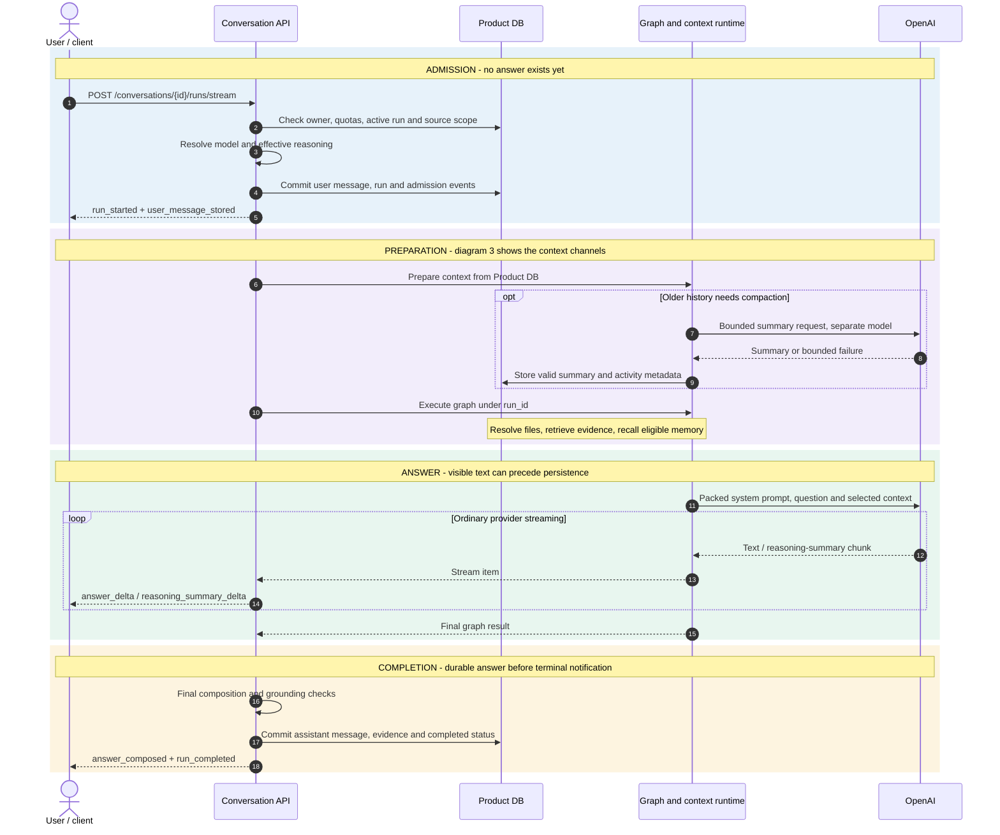
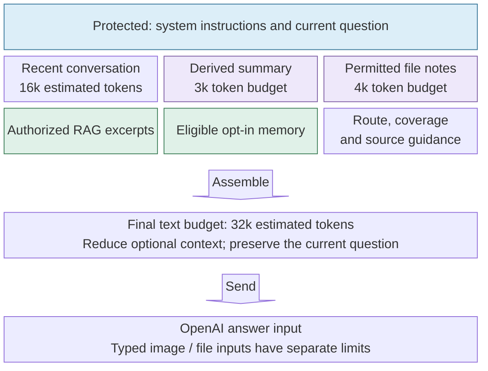
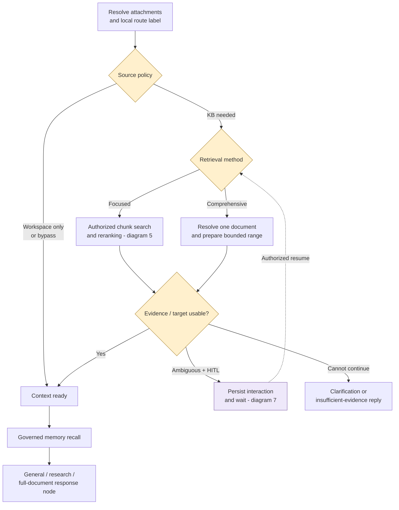
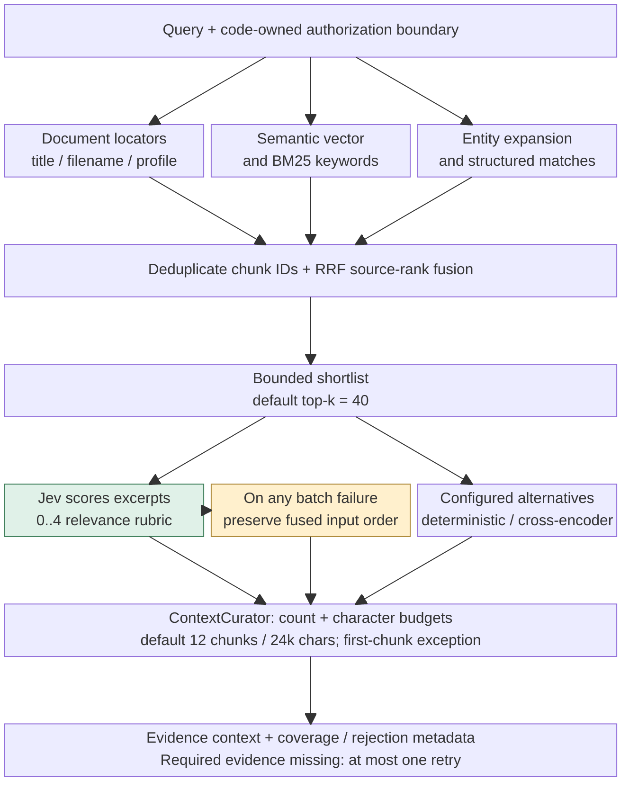
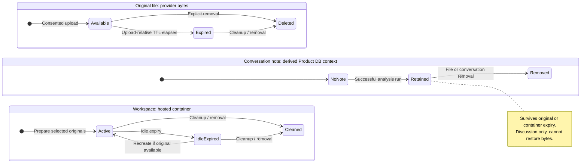
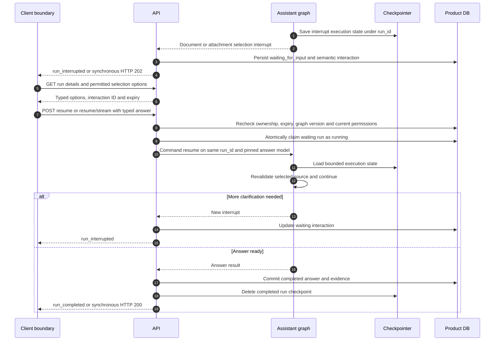
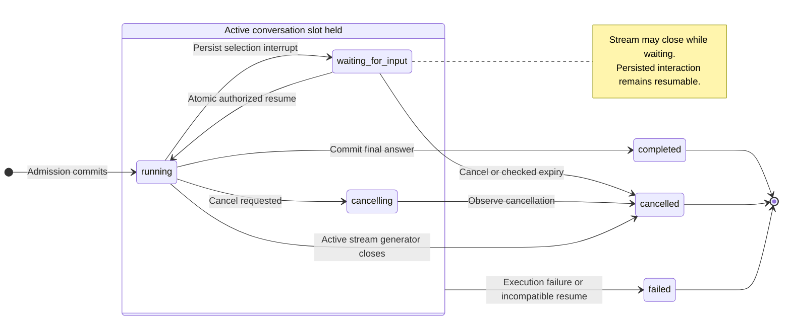
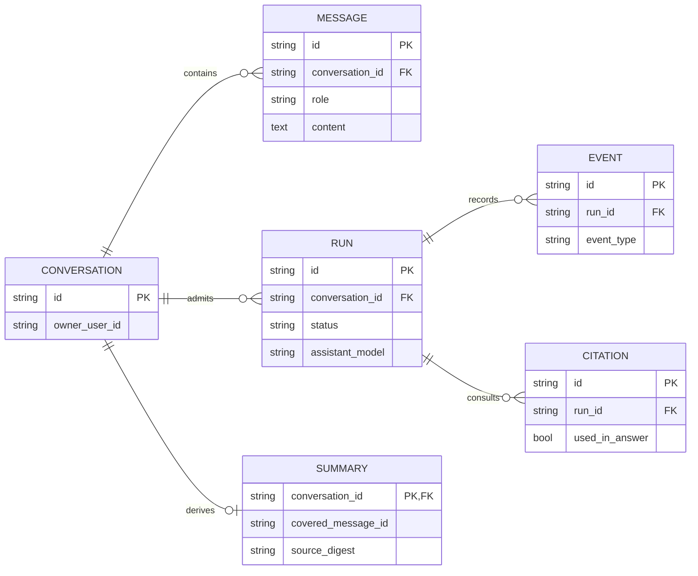

# Message-to-answer service flow

English | [한국어](./38-message-to-answer-service-flow.ko.md)

This walkthrough follows one message through the authenticated product conversation API, from
submission to a stored answer. It was checked against the source code on 2026-10-02. It describes how
the current code executes and who owns each piece of data; it is not a design proposal, and it makes
no claim about deployed runtime settings. Diagram labels use the same terms as the code, so you can
search for them directly. The client appears only as a logical boundary: this walkthrough did not
inspect frontend components, proxy code, or what the UI actually renders.

The nine diagrams are separate views of the same request, not separate agent services:

- Diagrams 1–2: who is responsible for each step, and in what order.
- Diagrams 3–6: how context is assembled, how retrieval works, and how long files live.
- Diagrams 7–8: pausing to ask the user, resuming, and the run lifecycle.
- Diagram 9: what is stored durably.

The entry point is `POST /conversations/{conversation_id}/runs/stream` for an SSE response, or
`/runs` for a synchronous one. The walkthrough assumes the conversation already exists and that any
temporary file uploads happened before the message was sent. The legacy, unauthenticated
`/assistant/chat` endpoint is a development surface. It is not part of this flow, and it does not
follow the same database, ownership, or human-in-the-loop (HITL) contracts.


## 1. Who owns each step — swimlanes

The swimlanes show how ownership passes between components during a successful, ordinary
streaming answer. Buffered workspace answers, waiting for the user, and failures are covered in
later diagrams.

The server owns both the transcript and the execution state. Once a request is admitted, the
user's message is stored before any answer exists. Retrieval can then be skipped, paused while the
user picks a source, or used to supply evidence. A run is complete only when the assistant message
and its evidence are committed to the database, not when text first appears in the stream.

```mermaid
swimlane-beta TB
    accTitle: Message ownership and handoffs
    accDescr: Client submits, API admits, graph prepares an answer, and API commits before completion.
    subgraph client["User and client"]
        Send["Submit message"]
        Partial["Display provisional text"]
        Final["Display canonical answer"]
    end
    subgraph api["Conversation API"]
        Admit["Validate and atomically admit"]
        Emit["Forward answer deltas"]
        Commit["Finalize and commit answer"]
    end
    subgraph runtime["Graph and providers"]
        Context["Prepare context and sources"]
        Generate["Compose answer"]
    end
    Send --> Admit
    Admit --> Context
    Context --> Generate
    Generate -->|"Ordinary text streaming"| Emit
    Emit -.-> Partial
    Emit -->|"Final provider result ready"| Commit
    Commit -->|"run_completed"| Final
```

[Rendered SVG](./assets/message-flow/diagram-1.svg)

The user may see the answer arrive piece by piece before the run completes. After a refresh, the
stored transcript and run status are what count. Waiting for the user's input is a separate state;
no answer keeps running quietly in the background while the run waits.

Source: [run endpoints](../../my_agents/api/conversations/endpoints/runs.py),
[stream lifecycle](../../my_agents/api/conversations/endpoints/stream.py).

## 2. Ordinary streaming request, end to end

This sequence shows an ordinary answer that completes successfully. Retrieval and file handling
inside the graph are expanded in later sections. The summary request and the answer request share
one OpenAI lane in the diagram, but each uses its own model setting. Optional events do not appear
on every request.



[Rendered SVG](./assets/message-flow/diagram-2.svg)

`run_started` and `user_message_stored` are sent after admission. If older history needs
compaction, that happens before the graph starts answering. `retrieval_completed` and
`graph_invoked` are sent as soon as graph updates provide their data. `graph_invoked` is an
observability event, so it does not necessarily mark the moment the graph started running. When
file recall selects the model, an optional `run_model_resolved` event reports that choice.

The ordinary responder calls `ChatOpenAI.stream()`. The backend forwards each text delta to the
client and also collects the same output for finalization. The synchronous `/runs` endpoint does
the same work but returns one final JSON response: HTTP 200 when the run completes, or HTTP 202
when it is waiting for the user.

The responder packs the final answer input once more, after retrieval. It combines the system
prompt (which names the configured model), the recent conversation, the current question, the
summary and file-note channels, the retrieved evidence, and any eligible memory. If the result
exceeds the text budget, it trims in this order — older ordinary history, memory, retrieved
context, then any remaining derived history — and always keeps the current question. As a result,
the number of excerpts injected at the retrieval stage can differ from what actually reaches the
provider. The `context_delivery` manifest records the counts and references at this final text
boundary.

Source: [stream endpoint and event iterator](../../my_agents/api/conversations/endpoints/stream.py),
[graph stream adapter](../../my_agents/api/conversations/graph_streaming.py),
[response provider](../../my_agents/agents/general_assistant/responders.py).

## 3. Admission and the assembled answer context — blocks

Admission is gated by session authentication, conversation ownership, the guest quota, the
knowledge-base selection, and attachment eligibility. These are the checks traced in the run
endpoint; how the client or proxy enforces security is outside this walkthrough. The early
active-run check is backed by a database uniqueness constraint, so two concurrent submissions can
never both hold the active slot. A current message that is too long is rejected before admission.
If admission hits a conflict, the user message and the run are rolled back together.



[Rendered SVG](./assets/message-flow/diagram-3.svg)

- `conversation_id` identifies the transcript the user sees. `run_id` identifies one execution and its checkpoint.
- The optional `client_request_id` must be unique per user. A duplicate returns 409. It neither starts a second run nor replays the first one.
- Registered users' ordinary answers use their supported model preference, or the deployment default if they have none. Guests always use the deployment default. The workspace and summarization models are configured separately.
- Model-specific reasoning normalization runs before the effective values are recorded, and again at the provider boundary. The public effort choices stay frozen.
- Admission records the model choices. Automatic recall of an original file can postpone the final answer-model decision until `run_model_resolved`. A resumed run uses the model that was resolved and pinned for it.
- Recent history, conversation summaries, file notes, and opt-in long-term memory are separate channels. A summary does not count as consent to long-term memory.

The current default text budgets are:

| Budget | Default |
| --- | --- |
| Recent history | 16,000 estimated tokens or 64 messages |
| Recent history after compaction (target) | about 8,000 tokens |
| Conversation summary | 3,000 tokens |
| File notes | 4,000 tokens |
| Assembled text | 32,000 tokens |

These are configurable estimates, not the provider's own token counts for images or files. The
summary model gets at most two bounded calls. If compaction fails, the run continues with the
valid context it has, plus metadata noting what was left out.

Source: [admit_run](../../my_agents/api/conversations/run_lifecycle.py),
[continuity implementation](../../my_agents/conversations/continuity.py),
[model selection](../../my_agents/api/reasoning.py), [continuity contract](./36-conversation-continuity.md).

## 4. Source decisions — a focused flowchart

This view keeps only the decisions that change how the answer is produced. Instead of copying
every `add_edge`, it groups related graph nodes. Solid arrows show normal control flow. The dashed
resume arrow returns to the retrieval method chosen earlier; Jev does not choose the method again.
Ambiguous attachments are resolved before the source gate and can pause for the user through the
same interaction mechanism. The `general_assistant` and `research_helper` labels share the same
answer infrastructure.



[Rendered SVG](./assets/message-flow/diagram-4.svg)

By default, Jev makes both the broad source decision and the focused-versus-comprehensive choice,
with local rules as a fallback. `MY_AGENTS_DECISION_PROVIDER` can select another supported policy.
Jev sees only a bounded slice of recent human and assistant messages. It never receives the
summary, file-note, or memory channels.

When a workspace is active, KB retrieval is skipped unless the user explicitly selected a KB
scope. Attachments and explicitly selected KB evidence can therefore be used together; having an
attachment does not by itself rule out retrieval. If an original file is unavailable or ambiguous
and there is no way to pause and ask, the answer states that limitation instead of pretending to
have read the file.

The comprehensive branch resolves one document that the user is authorized to read and can
control. It prepares bounded coverage and citation evidence, then re-checks permissions and reads
the raw text range inside the response node. The full raw document is never written to the
checkpoint. By default, a document of up to 24,000 characters is read completely. A longer
document is read only for its first 12,000 characters, and the answer must say it is a partial
review. The rest of the document is not read automatically.

If required evidence is missing or a clarification is still unresolved, graph execution can end
before any answer is generated; the API then prepares a safe response. HITL nodes exist only when
the graph is configured to pause for selections. Without HITL, an ambiguous full-document target
can also continue straight to `retrieve_memory`; the diagram leaves out that non-pausing side path.

Source: [graph construction and response dispatch](../../my_agents/agents/general_assistant/graph.py),
[RAG nodes](../../my_agents/agents/general_assistant/rag_retrieval.py),
[attachment nodes](../../my_agents/conversations/attachment_graph.py).

## 5. Evidence transformation — a block pipeline

Documents were parsed and indexed during knowledge ingestion, long before this request. Retrieval
at answer time starts inside the user's authorized boundary. The block diagram shows the normal
search path when no single document is pinned, and keeps ranking and its fallback visibly separate.
Block size and arrow width do not represent candidate counts, and the numbers are configured
limits, not measurements. When the user explicitly selects one document, a separate scoped
retrieval path is used instead.



[Rendered SVG](./assets/message-flow/diagram-5.svg)

Candidates can come from filename and title matches, generated metadata profiles, semantic
vectors, BM25 keyword matches, and entity-based expansion. Structured entity extraction is done in
code; an `enumeration` intent label on its own does not create a tool for extracting agent names.
RRF merges the rankings from each source and removes duplicate chunk IDs. By default, the top 40
candidates go to reranking, and context packing then keeps at most 12 chunks within a
24,000-character budget. The packer currently lets an oversized first chunk through, so the
character budget is not a strict hard limit.

Jev is the default reranker, regardless of which source-decision provider is configured. It
receives the query, synthetic IDs, and clipped **authorized excerpts**, and scores each excerpt on
a five-level relevance rubric (0–4). Nothing else is deliberately added — no KB IDs, filenames,
summaries, file notes, or memory — but the excerpts themselves can still contain sensitive source
text. If any batch fails, the whole scoring pass is discarded and the fused order is kept. The
cross-encoder and deterministic modes are alternatives you configure; they are not automatic
fallbacks.

When required evidence is missing, the ContextForge graph allows one bounded retry, not an
open-ended search loop. Reranking improves ordering; it does not grant access or certify that
anything is true. Likewise, the RAG Agent's deterministic verifier checks that the evidence and
the route are consistent, not that every factual claim is correct.

Source: [candidate gathering](../../my_agents/agents/context_forge/candidates.py),
[fusion](../../my_agents/agents/context_forge/fusion.py),
[reranking](../../my_agents/agents/context_forge/reranking.py),
[packing](../../my_agents/agents/context_forge/packing.py),
[bounded retry](../../my_agents/agents/context_forge/graph.py), [Jev contract](./37-jev-evidence-reranking.md).

## 6. Original, notes, and container — three independent lifecycles

This path is separate from permanent KB ingestion. Approved registered users can explicitly
attach supported files and images. Guests cannot use workspace originals or file notes. Upload
consent and ownership are checked before any file is sent to the provider or executed.



[Rendered SVG](./assets/message-flow/diagram-6.svg)

The three groups exist side by side, and each has its own lifetime. They do not form a single
pipeline, and they do not imply tasks running at the same time. The labels summarize whether each
resource is available. Note states such as `NoNote` and `Retained` are explanatory only; they are
not stored `RunStatus` values. The diagram deliberately does not suggest that an expired original
deletes the conversation note.

Workspace runs use an isolated OpenAI SDK adapter and their own configured workspace model. The
hosted container has networking disabled; that restriction applies to the container only and says
nothing about the ordinary assistant's hosted web search. Images and files are sent as their
matching typed provider inputs. A successful analysis does not have to produce an output file.
Only outputs in recognized formats and paths become artifacts with authenticated downloads, and
the assistant must never invent a download link.

The workspace provider returns its result all at once, not as a live stream. Any `answer_delta`
events that follow can be fallback chunks of text that was already computed, not live tokens from
the workspace model. New originals expire seven days after upload; the container's idle lifetime
has its own, separate limit.

Notes belong to this conversation only and are saved after successful runs. A note is not proof
that the file was read exactly or completely. Later discussion can rely on notes, but checking
exact content or editing the file requires an authorized original that is still available.
Ambiguous references can pause the run with `attachment_selection`. An expired original cannot be
rebuilt from its notes. Deleting files at the provider is handled by a durable cleanup outbox,
outside this answer timeline.

Source: [workspace service](../../my_agents/document_workspace/service.py),
[typed provider execution](../../my_agents/document_workspace/provider.py),
[file recall](../../my_agents/conversations/file_context.py), [continuity contract](./36-conversation-continuity.md).

## 7. Ask the user, wait, and resume the same run

When the run cannot tell which document or attachment the user means, it raises a versioned,
semantic interaction. The interaction describes what input is needed, not how a frontend component
should look. The Product DB stores the pending interaction so a refresh can recover it, and the
checkpointer stores the bounded execution state needed to resume the graph.



[Rendered SVG](./assets/message-flow/diagram-7.svg)

To resume, the client sends the current interaction ID and a typed answer. The server re-checks
ownership, expiry, the graph version, the choices it offered, and the user's permissions, and it
rejects a stale or forged selection. The waiting-to-running transition is claimed atomically, so
the same run cannot be resumed twice. Resuming does not use up another guest prompt or create a new
user message and run. Because access can change while a run is waiting, the permission check made
during the earlier retrieval is not enough on its own.

System knowledge is ambient internal context and never appears among the options the user can
choose. PostgreSQL provides the persistent checkpointer by default; the SQLite and offline paths do
not guarantee that a run can resume after a restart. Finished runs have their checkpoints cleared.
Expired interactions and incompatible graph versions are cancelled or failed according to policy,
rather than resuming old state blindly.

Source: [prepare_conversation_run_resume](../../my_agents/api/conversations/endpoints/runs.py),
[interaction persistence](../../my_agents/api/conversations/interactions.py),
[resume invocation](../../my_agents/api/conversations/graph_invocation.py),
[interaction contract](./27-agent-frontend-interaction-contract.md).

## 8. Completion, cancellation, and failure are different outcomes

The diagram shows every persisted run state, and only those. “Admission rejected” and “expired”
are not `RunStatus` values; a request rejected before admission never gets a run at all.
Transport and provider errors are grouped together here; the endpoint code defines exactly how
each error is handled.



[Rendered SVG](./assets/message-flow/diagram-8.svg)

When a normal streaming run finishes, finalization prepares the reply, the consulted sources,
coverage, a memory snapshot, and any reasoning summaries. It then stores the assistant message,
citation records, source and event evidence, and the completed status. The public trace is built
from verified execution data. `answer_composed` and the terminal `run_completed` are sent only after
the completion has been saved. Citation attribution is conservative and deterministic: a source
the run consulted is not automatically a citation that supports a claim. Provenance for ambient
system sources is removed from public response and event fields. Partial-coverage disclosures are
kept through finalization.

Streamed deltas are provisional. The final `run_completed` content can include disclosures or
formatting that never appeared in the raw provider deltas. A client must not treat HTTP 200,
`graph_invoked`, or the first token as a sign that the run completed. If a run fails after the SSE
stream has started, the HTTP status has already been sent, so the stream reports the failure
through safe `run_failed` and `run_error` events instead of exposing provider errors.

Cancellation is cooperative: it takes effect at execution boundaries. When the client disconnects,
the stream's `GeneratorExit` path cancels an active run that is not waiting and cleans up its
checkpoint. After a process crash, a stale-run cleanup may be needed instead. Nothing keeps
generating an answer in the background after a disconnect. A waiting interaction that was already
saved is kept when the stream closes. After a refresh, the client should read the stored messages,
run details, and any pending interaction; a live stream cannot be resumed from a token offset.

Replay is not the same as resume. Replay regenerates an earlier turn, removes later transcript
entries and state as the replay contract specifies, and invalidates the provenance of any affected
summary.

Source: [completion and cancellation persistence](../../my_agents/api/conversations/run_lifecycle.py),
[pure answer preparation](../../my_agents/api/conversations/answer_finalization.py),
[SSE terminal handling](../../my_agents/api/conversations/endpoints/stream.py),
[cancellation endpoint](../../my_agents/api/conversations/endpoints/events.py),
[replay](../../my_agents/api/conversations/endpoints/replay.py).

## 9. What is stored — a scoped entity-relationship view

This is a selected view of the **physical Product DB relationships**. A crow's foot means zero or
more, and `o|` means zero or one. Only some attributes are listed. A conversation has many messages
and runs but at most one current summary. Events and citation records belong to runs. A consulted
citation record is not necessarily `used_in_answer`.



[Rendered SVG](./assets/message-flow/diagram-9.svg)

In the inspected model, a run's `user_message_id` and `assistant_message_id` are references
managed by the application, not database foreign keys, so the diagram does not draw them as
enforced relationships. Attachment links, file notes, artifacts, the cleanup outbox, and
LangGraph's own tables are left out of this focused view. For how long each resource lives, see
diagram 6; this view shows foreign-key structure only.

Source: [conversation records](../../my_agents/conversations/models.py),
[summary and file-note records](../../my_agents/conversations/continuity_models.py),
[citation records](../../my_agents/knowledge/models.py).

### Data and event boundaries at a glance

| Channel | Contents | Must not be mistaken for |
| --- | --- | --- |
| Product DB transcript/run | User messages, final assistant messages, statuses, source links | Raw provider conversation state |
| Run checkpoint | Bounded execution state for resuming, scoped to one `run_id` | Permanent conversation history or long-term memory |
| Conversation summary / file notes | Derived context scoped to the conversation, with provenance | Consent to new memory, or an exact copy of an expired original |
| Opt-in memory | Eligible recall governed by the Product DB | Automatic learning from every chat |
| Jev routing input | Bounded recent human/assistant text and permitted selection metadata | The summary, file-note, or memory channels |
| Jev reranking input | The query and clipped authorized excerpts with synthetic IDs | The whole document corpus, or a permission decision |
| OpenAI answer input | System instructions, the current question, and selected context; typed files in the workspace | Every stored document, or the entire history by default |
| Persisted activity / `agent_trace` | Redacted events, verified stages, and counts | Raw prompts, hidden chain-of-thought, or proof that every claim is true |
| SSE-only `answer_delta` / `reasoning_summary_delta` | Fragments for incremental display | Durable final messages, or a token log you can resume from |
| SSE-only `run_completed` / `run_error` | Terminal transport notifications | Separately persisted `AgentEventType` values |

Persisted reasoning-summary events are separate from their streaming deltas. Jev's choices come
without any model-written planning text; the optional OpenAI selector and the answer provider can
produce such text. Depending on its source policy, the ordinary responder may use hosted web
search, which is separate from private KB retrieval. The embedding, summary, answer, workspace, and
Jev models each play a different role.

## How to inspect one real run

1. Match up `client_request_id`, `conversation_id`, and `run_id`. A client retry is not an admission replay.
2. Read the run's status and its effective model and reasoning settings, including `run_model_resolved` if present.
3. Check the retrieval route, intent, effective reranker, candidate and injected counts, coverage, and fallback metadata.
4. Tell full input evidence apart from shortened debug snippets. A correct answer does not prove the whole document was read.
5. Compare the final response with the stored messages, consulted sources, citations, artifacts, and any pending interaction.
6. If all you have is HTTP 200 or streamed deltas, do not report the run as completed. Check for a failed, cancelled, or waiting status and the safe events.

The relevant contracts are covered by `tests/test_conversations_api.py`,
`tests/test_run_admission.py`, `tests/test_full_document_retrieval.py`,
`tests/test_document_workspace.py`, and `tests/test_jev_reranking.py`. These tests verify specified
behavior; they do not measure live model quality. For field-level details, see the
[streaming contract](./09-http-streaming-frontend-contract.md),
[model preferences](./35-assistant-model-preferences.md), and
[reasoning policy](./26-run-reasoning-preferences.md).

## Diagram selection and renderer compatibility

Each of the **31 diagram types** in the [official Mermaid syntax index](https://mermaid.js.org/intro/)
was reviewed. (“Other Examples” is a gallery, not a 32nd type.) The nine diagrams here use six
complementary types. Each type was chosen for the question its section answers, not for visual
variety.

The official site currently documents Mermaid 12.1.0. These diagrams were rendered and checked
locally with Mermaid and Mermaid CLI 11.16.0; `swimlane-beta` needs 11.16.0 or newer. The Mermaid
versions used by GitHub and editors were not checked, so every diagram links to a checked-in SVG
as a fallback. The Mermaid blocks in the Markdown are the source of truth; re-export the SVGs
whenever a diagram changes.

<details>
<summary>Review of every official diagram type</summary>

| Type | Decision | Why it fits or does not fit this document |
| --- | --- | --- |
| [Flowchart](https://mermaid.js.org/syntax/flowchart.html) | Use · §4 | Shows the conditional source and retrieval branches, trimmed down from a full graph dump. |
| [Swimlanes Diagram](https://mermaid.js.org/syntax/swimlanes.html) | Use · §1 | Shows ownership and handoffs between the client, API, and runtime. |
| [Sequence Diagram](https://mermaid.js.org/syntax/sequenceDiagram.html) | Use · §2, §7 | Shows request/response order, streaming, and checkpoint resume. |
| [Class Diagram](https://mermaid.js.org/syntax/classDiagram.html) | Not selected | Python types and methods would distract from the request lifecycle. |
| [State Diagram](https://mermaid.js.org/syntax/stateDiagram.html) | Use · §6, §8 | Shows independent file-resource lifetimes and persisted run transitions. |
| [Entity Relationship Diagram](https://mermaid.js.org/syntax/entityRelationshipDiagram.html) | Use · §9 | Shows enforced Product DB ownership and record cardinalities. |
| [User Journey](https://mermaid.js.org/syntax/userJourney.html) | Not selected | Needs task scores, and no user-satisfaction data exists. Swimlanes show responsibility without invented scores. |
| [Gantt](https://mermaid.js.org/syntax/gantt.html) | Not selected | No measured stage durations or schedule exist; a chart would imply timings we cannot support. |
| [Pie Chart](https://mermaid.js.org/syntax/pie.html) | Not selected | No measured proportions; latency and traffic shares are unknown. |
| [Quadrant Chart](https://mermaid.js.org/syntax/quadrantChart.html) | Not selected | There is no two-axis scoring or prioritization question here. |
| [Requirement Diagram](https://mermaid.js.org/syntax/requirementDiagram.html) | Not selected | Good for tracing requirements to tests, but it does not picture runtime execution. Source and test links already provide the evidence. |
| [Use Case Diagram](https://mermaid.js.org/syntax/usecase.html) | Not selected | Actor goals leave out ordering and state, so swimlanes say more. It also needs Mermaid 12+. |
| [GitGraph (Git) Diagram](https://mermaid.js.org/syntax/gitgraph.html) | Not selected | Models version-control history, not conversation execution or replay. |
| [C4 Diagram](https://mermaid.js.org/syntax/c4.html) | Not selected | Suits a separate deployment or component map; this document follows one request rather than service boundaries. |
| [Mindmaps](https://mermaid.js.org/syntax/mindmap.html) | Not selected | Shows a taxonomy but loses the direction, budget, and ownership constraints that the block and ER views keep. |
| [Timeline](https://mermaid.js.org/syntax/timeline.html) | Not selected | Would repeat the sequence view while hiding ownership and alternate paths. |
| [ZenUML](https://mermaid.js.org/syntax/zenuml.html) | Not selected | An alternative sequence syntax that adds nothing the native sequence diagram lacks. |
| [Sankey](https://mermaid.js.org/syntax/sankey.html) | Not selected | Needs quantities that are conserved across the flow; candidate counts are not, because retrieval channels overlap. |
| [XY Chart](https://mermaid.js.org/syntax/xyChart.html) | Not selected | Suits benchmark results, not unmeasured control flow. |
| [Block Diagram](https://mermaid.js.org/syntax/block.html) | Use · §3, §5 | Context assembly and evidence transformation need explicit grouping and a fixed stage layout. |
| [Packet](https://mermaid.js.org/syntax/packet.html) | Not selected | SSE and JSON records are not fixed-width bit layouts. |
| [Kanban](https://mermaid.js.org/syntax/kanban.html) | Not selected | A task-board snapshot cannot express which runtime state transitions are allowed. |
| [Architecture](https://mermaid.js.org/syntax/architecture.html) | Not selected | Centers on services and resources; a deployment inventory is outside the inspected scope. |
| [Radar](https://mermaid.js.org/syntax/radar.html) | Not selected | No multi-metric quality scores were measured for this walkthrough. |
| [Event Modeling](https://mermaid.js.org/syntax/eventmodeling.html) | Not selected | Good for designing commands, events, and read models, but could suggest event sourcing or dependencies that are not implemented. The sequence and ER views keep commits explicit. |
| [Treemap](https://mermaid.js.org/syntax/treemap.html) | Not selected | Needs hierarchical magnitudes; record sizes and storage shares were not measured. |
| [Venn](https://mermaid.js.org/syntax/venn.html) | Not selected | Could show consulted versus cited sources, but would lose provenance direction and eligibility. The channel table is clearer. |
| [Ishikawa](https://mermaid.js.org/syntax/ishikawa.html) | Not selected | Root-cause diagnosis belongs in an incident analysis, not a description of the normal flow. |
| [Wardley](https://mermaid.js.org/syntax/wardley.html) | Not selected | Maps business evolution and visibility, which does not explain execution. |
| [Cynefin](https://mermaid.js.org/syntax/cynefin.html) | Not selected | A decision-making framework, not the actual model router or state machine. |
| [TreeView](https://mermaid.js.org/syntax/treeView.html) | Not selected | A directory or hierarchy view leaves out how modules interact at runtime. |

</details>

## Maintenance

Regenerate the SVG exports from the repository root with Mermaid CLI 11.16.0 or newer. The two
documents describe the same diagrams, but the Korean document uses Korean labels, so each one has
its own SVG set. Code identifiers, endpoints, event names, and stored states stay in English in
both versions.

```bash
# English
mmdc -i docs/product-chat-service/38-message-to-answer-service-flow.md \
  -o docs/product-chat-service/assets/message-flow/diagram.svg \
  -e svg -b white -w 1600

# Korean
mmdc -i docs/product-chat-service/38-message-to-answer-service-flow.ko.md \
  -o docs/product-chat-service/assets/message-flow/ko/diagram.svg \
  -e svg -b white -w 1600
```

Update this walkthrough whenever admission order, graph branches, context channels, model roles,
streaming guarantees, resume behavior, or completion persistence changes. When you change a
diagram, make the same change to the Korean version. This document explains how the components
work together; the topic contracts and the code remain authoritative for exact fields and
behavior. It does not introduce any runtime or deployment changes.
