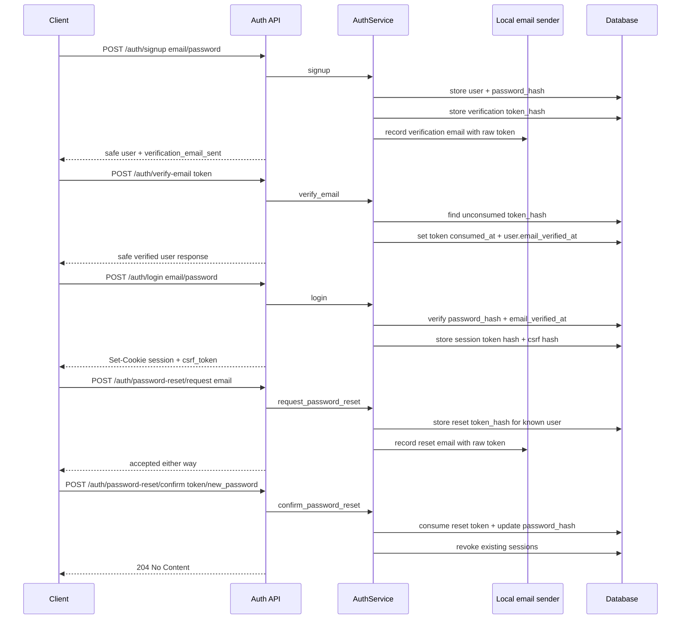

# First-party auth and owned sessions

This note explains the first auth/account-lifecycle milestone for the product chat service.

## What is implemented now

The backend owns a first-party auth/session path:

1. `POST /auth/signup` creates a user with an Argon2 password hash.
2. Signup creates a one-time email verification token and sends it through the local auth email boundary.
3. `POST /auth/verify-email` consumes the verification token and sets `email_verified_at`.
4. `POST /auth/login` verifies the password, requires a verified email, and creates a server-side opaque session.
5. The raw session token is sent only as an HttpOnly cookie.
6. The database stores only SHA-256 digests of session tokens, CSRF tokens, verification tokens, and reset tokens.
7. Login returns a CSRF token for mutating cookie-auth requests.
8. `POST /auth/logout` requires the current session cookie plus the CSRF header and revokes the session.
9. `GET /auth/me` resolves the current `Principal` from the session cookie.
10. `POST /auth/password-reset/request` sends a reset token without revealing whether the account exists.
11. `POST /auth/password-reset/confirm` consumes the reset token, changes the password, and revokes existing sessions.
12. `POST /auth/guest/request` creates a short-lived one-time provider-free guest code when guest access is enabled.
13. `POST /auth/guest/login` redeems that code once and issues the normal app session cookie plus CSRF token for an explicit guest identity.

The default email sender is intentionally local/offline. It records verification and
reset emails in process memory for tests and local development. Preview/public demos
can switch to the generic SMTP boundary without adding a provider-specific SDK.

## Flow

## Why store token hashes

Session, email-verification, and password-reset tokens are bearer credential material. If the database stored raw token values, a database leak could immediately expose active auth flows. Storing a digest lets the server compare presented tokens without keeping raw token material at rest.

The local development email sender still sees the raw token because an email must contain either the token or a link containing the token. That boundary is intentionally isolated so a real provider can be added later without rewriting auth lifecycle logic.

## Public-demo auth/session boundary

The Phase 1 public-demo boundary is intentionally explicit:

- Session cookies are `HttpOnly`, default to `Secure`, and use `SameSite=Lax` by default.
- Local HTTP demos may set `MY_AGENTS_SESSION_COOKIE_SECURE=false`; deployed demos should keep `Secure=true`.
- Cross-site browser deployments that require `MY_AGENTS_SESSION_COOKIE_SAMESITE=none` must also keep `MY_AGENTS_SESSION_COOKIE_SECURE=true`; settings validation rejects the unsafe combination.
- `POST /auth/logout` is the current cookie-authenticated mutating auth endpoint and requires the configured CSRF header.
- `MY_AGENTS_CORS_ALLOWED_ORIGINS` must list exact frontend origins for credentialed browser requests; wildcard origins are rejected.
- `MY_AGENTS_AUTH_SIGNUP_ENABLED=false` blocks new backend signups as a public-demo
  kill switch while preserving existing verified-user login/session behavior.
- `MY_AGENTS_GUEST_ACCESS_ENABLED=true` opens provider-free guest access for the
  public demo. Guest codes are one-time, guest sessions expire after
  `MY_AGENTS_GUEST_ACCESS_TTL_SECONDS` (default 24 hours), and guest responses use
  `email: null`, `is_guest: true`, and `guest_expires_at` instead of presenting a
  fake visitor email as a real account.
- Guest public-demo limits are server-owned: `MY_AGENTS_GUEST_MAX_CONVERSATIONS=1`,
  `MY_AGENTS_GUEST_MAX_PROMPTS=5`, and `MY_AGENTS_GUEST_MAX_DOCUMENT_UPLOADS=3`.
  Limit failures return safe `429` details; expired guest access returns a safe
  auth failure. Guests cannot create password-reset/email-verification tokens and
  are blocked from the dev auth outbox even if that local-only endpoint is enabled.
- Auth abuse protection is implemented as an in-process, digest-keyed attempt limiter for signup, login, verification-token, and password-reset flows. This is acceptable only for local/single-process public-demo topology. Do not claim multi-worker or distributed rate-limit protection until this boundary is moved to a shared store or gateway.

## What is intentionally not implemented yet

- provider-specific email SDK integration;
- MFA/passkeys;
- OAuth account linking;
- shared/distributed auth rate limiting for multi-worker deployments;
- account deletion/profile management;
- durable anonymous quota storage beyond the single-session public-demo guest limits.

Those are later milestones or explicit non-goals for v0.

## Testing evidence

`tests/test_auth_api.py` covers:

- signup does not return password material;
- signup records a local email verification message;
- unverified login is blocked;
- email verification consumes one-time tokens;
- login returns a CSRF token and creates an owned session;
- default login cookies are `Secure`, `HttpOnly`, and `SameSite=Lax`;
- `/auth/me` requires a valid session;
- logout without CSRF fails;
- logout honors a configured CSRF header name and leaves the session active after a wrong header;
- logout with CSRF revokes the session;
- duplicate signup fails safely;
- disabled signup fails safely without creating users, tokens, emails, or sessions;
- disabling signup does not block existing verified-user login;
- guest access is disabled by default;
- guest codes redeem once, create a guest session, and make `/auth/me` return an
  explicit guest shape;
- expired guest codes/sessions are rejected;
- guests are capped at one conversation, five prompts, and three documents/uploads;
- guests do not create password-reset/email-verification tokens and cannot use the
  local dev auth outbox;
- invalid login does not create an authenticated session;
- password reset requests do not enumerate unknown accounts;
- password reset changes the password and revokes old sessions;
- expired auth lifecycle tokens are rejected.
- auth abuse protection rate-limits repeated signup, bad login, invalid lifecycle-token, and reset-request attempts.
- settings reject `SameSite=None` without `Secure=true`, and CORS tests prove exact-origin credentialed browser assumptions.

## Small exercise

Explain this in an interview:

> I used first-party email/password auth to demonstrate backend ownership, but kept provider integration intentionally narrow. The app stores Argon2 password hashes, stores only token digests, requires email verification before login, supports one-time password reset tokens, revokes sessions after password reset, and uses a local email boundary so tests stay offline. For a public demo, cookie/CSRF/CORS behavior is configured explicitly and auth abuse protection is bounded to a single-process limiter; I would add shared rate limiting, MFA/passkeys, OAuth, and a real email provider as separate hardening milestones.

## Revision history

- 2026-05-21: Added provider-free public-demo guest access contract and limits.
- 2026-05-21: Documented the backend-owned signup disable switch for public-demo rollback.
- 2026-05-20: Documented Phase 1 public-demo auth/session boundary, CSRF/CORS/cookie tests, and single-process rate-limit limitation.
- 2026-05-18: Added email verification, local auth email boundary, password reset tokens, and session revocation after reset.
- 2026-05-17: Created after implementing minimal first-party auth and owned sessions.
