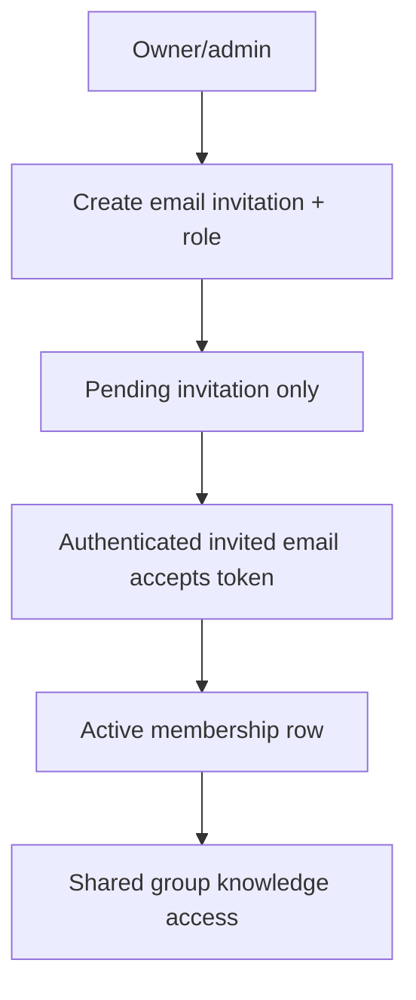
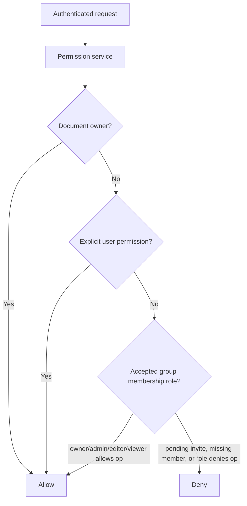

# Group and document permissions

## What is implemented now

The backend product boundary is a shared-knowledge group/team model:

- groups;
- email invitation lifecycle for membership activation;
- accepted memberships only in the membership table;
- membership roles;
- documents;
- explicit user document permissions;
- deny-by-default document authorization checks;
- publish requests for moving personal sources into approved group KB retrieval.

A pending invitation is not an active membership and does not grant group KB access. Product clients must not directly activate membership by known `user_id`, reveal whether an invited email has an account, or imply a public user directory. The code term remains `group`; user-facing copy may say “team”.

## Membership activation flow

Active member role updates can remain owner/admin-only, but they must operate on already accepted members only. Setup fixtures and backfills may use non-product helpers; public product routes must not recreate direct add-by-`user_id` activation.

## Permission flow

| Relationship | Read | Write | Admin | Publish group knowledge | Share conversations/memory |
| --- | --- | --- | --- | --- | --- |
| Document owner | Yes | Yes | Yes | Can request/approve depending on group role | No |
| Explicit user permission | Yes if granted | No unless granted later | No | No | No |
| Accepted group owner/admin | Yes for group docs | Yes where role allows | Yes | Approve/reject | No |
| Accepted group editor/viewer | Yes where role allows | Role-limited | No | Request where allowed | No |
| Pending invite | No | No | No | No | No |
| Unauthorized user | No | No | No | No | No |

## Why this matters for RAG

The retrieval service must never retrieve global top-k chunks and filter later. It
builds authorization into the candidate set before deterministic ranking or graph
expansion results enter application memory.

Group/team membership grants access to accepted shared knowledge and publish workflows only. Conversation transcripts, run history, and opt-in memory remain scoped to the authenticated user and are not shared with the group.

## Current limitations / non-goals

- no public user search or opt-in profile discovery yet;
- no organization/workspace identity management beyond groups;
- no full audit log yet;
- no document-level deny overrides yet;
- frontend code lives in the separate `my-agents-frontend` repository.

## Testing evidence

Invitation and permission tests should cover:

- group owners/admins can create, list, update, resend, and cancel invitations;
- duplicate pending invitations are rejected without account-existence fields;
- pending invitations do not create active memberships or grant group KB access;
- authenticated recipients can accept with the invited email and receive the intended role;
- wrong-user, cancelled, expired, and already-consumed acceptance fail safely;
- direct product membership activation by `user_id` is absent from public API/OpenAPI;
- group viewers can read group documents;
- group viewers cannot write group documents;
- outsiders cannot read group documents;
- document owners can grant explicit read access;
- non-managers cannot invite members or change active member roles.

## Revision history

- 2026-06-10: Updated the product boundary to invite-accepted group/team membership with privacy-preserving invitation semantics and private conversations/memory.
- 2026-05-17: Updated after retrieval/citation slices started using this permission boundary.
- 2026-05-17: Created after implementing groups, memberships, document permissions, and authorization tests.
