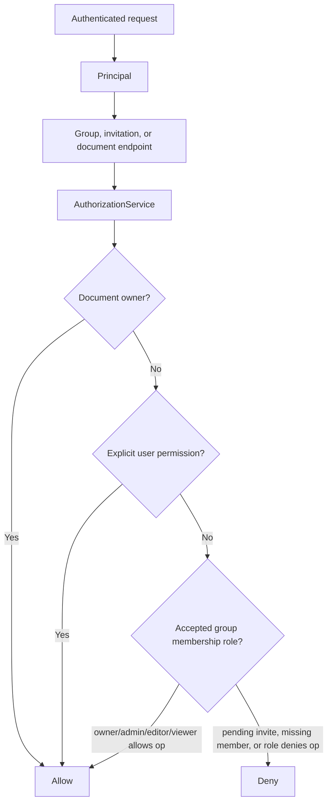

# Groups, invitations, and document permissions

This note explains the group/team authorization slice for the product chat service.
A group is a shared-knowledge boundary only after membership is accepted through an
email invitation. The product API must not expose direct active-membership creation
by known `user_id`.

## Product boundary

- **Invite acceptance is the membership boundary.** Owners/admins invite an email
  address and choose a role; the recipient becomes an active member only after
  accepting the invitation while authenticated as the invited email.
- **No user discovery.** Create/resend/accept responses must not reveal whether an
  invited email already has an account. There is no public user directory or
  account-existence field.
- **Pending invitations are not memberships.** Pending/cancelled/expired invites
  stay in invitation state and do not grant document or retrieval access.
- **Group knowledge is shared; conversations and memory are private.** Accepted
  membership grants access to approved group KBs and publish workflows. It does
  not share conversation transcripts, chat runs, or opt-in long-term memory.
- **`group` remains the backend term.** Product copy may call the surface “team,”
  but v1 does not promise organization/workspace identity management.

## Implemented / target API surface

The group surface includes:

- groups;
- accepted memberships and membership roles;
- privacy-preserving group invitations;
- documents and knowledge bases;
- explicit user document permissions;
- deny-by-default document authorization checks;
- publish requests for moving personal sources into approved group KB retrieval.

Recommended invitation routes:

| Method | Path | Actor | Purpose | Privacy rule |
| --- | --- | --- | --- | --- |
| `POST` | `/groups/{group_id}/invitations` | owner/admin | create a pending invitation by email and role | response shape does not reveal account existence |
| `GET` | `/groups/{group_id}/invitations` | owner/admin | list pending/recent invitations for a managed group | may show the invited email entered by the manager, never matched account metadata |
| `PATCH` | `/groups/{group_id}/invitations/{invitation_id}` | owner/admin | change role on a pending invitation | reject non-pending invites |
| `POST` | `/groups/{group_id}/invitations/{invitation_id}/resend` | owner/admin | rotate/reissue the invite token | do not expose raw tokens or account state |
| `DELETE` | `/groups/{group_id}/invitations/{invitation_id}` | owner/admin | cancel a pending invite | cancelled token cannot be accepted |
| `GET` | `/groups/{group_id}/members` | accepted member | list accepted member basics | no pending invite/account-discovery fields |
| `POST` | `/group-invitations/accept` | authenticated recipient | accept an opaque token | bind token to the authenticated verified email |

Direct `POST /groups/{group_id}/members` activation by `user_id` is not a
product-facing route. Tests and seed helpers that need direct setup must use
non-HTTP fixtures or service helpers.

## Permission flow

## Role behavior

| Actor / scope | Read | Write | Manage permissions | Manage invitations | Ingest | Retrieve/cite |
| --- | --- | --- | --- | --- | --- | --- |
| Personal owner | Yes | Yes | Yes | N/A | Yes | Yes |
| Explicit viewer | Yes | No | No | No | No | Yes |
| Explicit editor | Yes | Yes | Optional grant | No | Optional grant | Yes |
| Group owner/admin | Yes | Yes | Yes | Yes | Yes | Yes |
| Group editor | Yes | Yes | No | No | Yes | Yes |
| Group viewer | Yes | No | No | No | No | Yes |
| Pending invitee | No | No | No | No | No | No |
| Unauthorized user | No | No | No | No | No | No |

## Why this matters for RAG

The retrieval service must never retrieve global top-k chunks and filter later. It
builds authorization into the candidate set before deterministic ranking or graph
expansion results enter application memory.

Invitation state protects the same boundary: pending invites cannot contribute to
retrieval authorization, and accepted group roles authorize only group/document KB
access. Private conversations and user memory remain outside group sharing.

## Current limitations / non-goals

- no public user search or discoverable profile directory;
- no organization/workspace identity management;
- no shared conversation transcript or shared memory feature;
- no document-level deny overrides yet;
- no full audit log yet;
- frontend invitation UI depends on the hosted OpenAPI contract for the final route
  and response shapes.

## Testing evidence

Coverage should prove both positive behavior and absence of bypasses/leaks:

- owners/admins can create, list, resend, cancel, and role-update pending invitations;
- editors/viewers cannot manage invitations;
- registered and unregistered email invitations return the same public-safe shape;
- pending invitations do not create active membership rows;
- acceptance requires the authenticated invited email and creates at most one membership;
- wrong-user, cancelled, expired, consumed, and duplicate acceptance fail safely;
- accepted members can list basic member/role information without email/profile fields;
- public OpenAPI does not expose direct create-member-by-`user_id`;
- accepted group viewers can read approved group documents and outsiders cannot;
- publish request create/list/approve/reject behavior is preserved;
- conversation transcripts and opt-in memory remain owner-private.

## Revision history

- 2026-06-10: Updated for the invite-only group/team membership boundary and frontend sync.
- 2026-05-17: Updated after retrieval/citation slices started using this permission boundary.
- 2026-05-17: Created after implementing groups, memberships, document permissions, and authorization tests.
