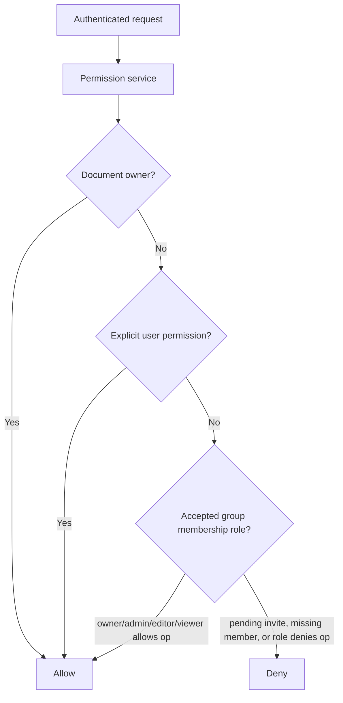

# Group and document permissions

## What is implemented now

The backend product boundary is a shared-knowledge group/team model:

- groups;
- email invitation lifecycle for membership activation;
- accepted memberships only in the membership table;
- membership roles;
- documents;
- explicit user document permissions;
- deny-by-default document authorization checks;
- publish requests for moving personal sources into approved group KB retrieval.

A pending invitation is not an active membership and does not grant group KB access. Product clients must not directly activate membership by known `user_id`, reveal whether an invited email has an account, or imply a public user directory. The code term remains `group`; user-facing copy may say “team”.

| Method | Path | Actor | Purpose | Privacy rule |
| --- | --- | --- | --- | --- |
| `POST` | `/groups/{group_id}/invitations` | owner/admin | create a pending invitation by email and role | response shape does not reveal account existence |
| `GET` | `/groups/{group_id}/invitations` | owner/admin | list pending/recent invitations for a managed group | may show the invited email entered by the manager, never matched account metadata |
| `PATCH` | `/groups/{group_id}/invitations/{invitation_id}` | owner/admin | change role on a pending invitation | reject non-pending invites |
| `POST` | `/groups/{group_id}/invitations/{invitation_id}/resend` | owner/admin | rotate/reissue the invite token | do not expose raw tokens or account state |
| `DELETE` | `/groups/{group_id}/invitations/{invitation_id}` | owner/admin | cancel a pending invite | cancelled token cannot be accepted |
| `GET` | `/groups/{group_id}/members` | owner/admin | list accepted member basics for role maintenance | no pending invite/account-discovery fields; not a general member directory |
| `PATCH` | `/groups/{group_id}/members/{user_id}` | owner/admin | update an already-active member role | non-creating; reject unknown or non-member users |
| `POST` | `/group-invitations/accept` | authenticated recipient | accept an opaque token | bind token to the authenticated verified email |

Direct `POST /groups/{group_id}/members` activation by `user_id` is not a
product-facing route. `PATCH /groups/{group_id}/members/{user_id}` may update roles for
already-active members only and must not create membership. Tests and seed helpers
that need direct setup must use non-HTTP fixtures or service helpers.

## Permission flow

| Relationship | Read | Write | Admin | Publish group knowledge | Share conversations/memory |
| --- | --- | --- | --- | --- | --- |
| Document owner | Yes | Yes | Yes | Can request/approve depending on group role | No |
| Explicit user permission | Yes if granted | No unless granted later | No | No | No |
| Accepted group owner/admin | Yes for group docs | Yes where role allows | Yes | Approve/reject | No |
| Accepted group editor/viewer | Yes where role allows | Role-limited | No | Request where allowed | No |
| Pending invite | No | No | No | No | No |
| Unauthorized user | No | No | No | No | No |

## Why this matters for RAG

The retrieval service must never retrieve global top-k chunks and filter later. It
builds authorization into the candidate set before deterministic ranking or graph
expansion results enter application memory.

Group/team membership grants access to accepted shared knowledge and publish workflows only. Conversation transcripts, run history, and opt-in memory remain scoped to the authenticated user and are not shared with the group.

## Current limitations / non-goals

- no public user search or opt-in profile discovery yet;
- no organization/workspace identity management beyond groups;
- no full audit log yet;
- no document-level deny overrides yet;
- frontend code lives in the separate `my-agents-frontend` repository.

## Testing evidence

Invitation and permission tests should cover:

- owners/admins can create, list, resend, cancel, and role-update pending invitations;
- editors/viewers cannot manage invitations;
- registered and unregistered email invitations return the same public-safe shape;
- pending invitations do not create active membership rows;
- acceptance requires the authenticated invited email and creates at most one membership;
- wrong-user, cancelled, expired, consumed, and duplicate acceptance fail safely;
- owners/admins can list basic member/role information for role maintenance without email/profile fields;
- owner/admin active-member role patch is non-creating and rejects missing/non-member users;
- public OpenAPI does not expose direct create-member-by-`user_id`;
- accepted group viewers can read approved group documents and outsiders cannot;
- publish request create/list/approve/reject behavior is preserved;
- conversation transcripts and opt-in memory remain owner-private.

## Revision history

- 2026-06-10: Updated the product boundary to invite-accepted group/team membership with privacy-preserving invitation semantics and private conversations/memory.
- 2026-05-17: Updated after retrieval/citation slices started using this permission boundary.
- 2026-05-17: Created after implementing groups, memberships, document permissions, and authorization tests.
