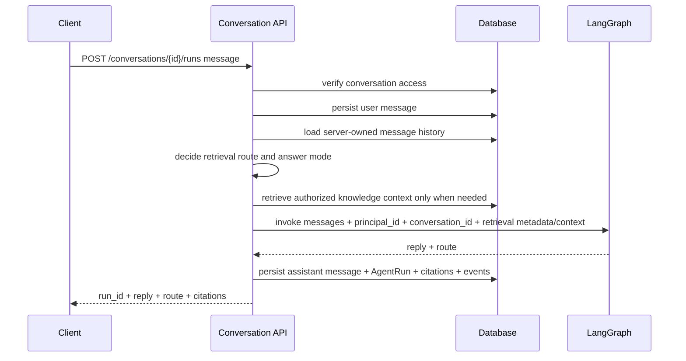

# Server-owned conversations and chat runs

This note explains the move from client-supplied chat history toward server-owned conversation state.

## Why this matters

The legacy `/assistant/chat` endpoint accepts a `history` array from the client. That is useful for v0 smoke tests, but it is not a safe product boundary for a permission-aware knowledge service.

A product chat run should use messages that the backend owns, scopes, and can authorize.

## New run flow

## What is implemented now

- `ConversationModel` stores owner-private conversation scope only.
- `MessageModel` stores user and assistant messages.
- `AgentRunModel` stores the first durable run boundary.
- `/conversations/{id}/messages` returns the authorized server-owned transcript for frontend display.
- `/conversations/{id}/runs` applies retrieval routing, then invokes the existing LangGraph assistant with server-owned history.
- `/conversations/{id}/runs` also supports `GET` so a frontend can list completed and failed runs.
- Runs now include retrieval route, answer mode, permission-aware retrieval context IDs, citations, and redacted events.
- Failed graph invocations persist a failed run and redacted `run_failed` event before returning a client-safe error.
- Group membership does not grant transcript access; group knowledge is selected separately through `knowledge_base_selection`.
- Outsiders receive safe denial.

## Legacy boundary

`/assistant/chat` still exists for v0 compatibility and deterministic smoke tests. It should not become the product endpoint for knowledge-backed chat access.

Frontend work should use conversation/run endpoints for product chat.

## Current limitations

- streaming transport exists for run progress and answer deltas;
- no run failure table details beyond the basic status field;
- no LangGraph checkpointer yet;
- no background job queue for long-running ingestion or agent work yet.

Retrieval routing, citations, streaming, and redacted events now exist as later learning notes.

## Testing evidence

`tests/test_conversations_api.py` verifies:

- run endpoint uses persisted server-owned history;
- message listing returns the stored transcript in server-owned order;
- run listing returns frontend-safe run summaries without reply or event payloads;
- failed graph invocation stores `status=failed` and a redacted `run_failed` event;
- graph invocation receives `principal_id`, `conversation_id`, retrieval route, answer mode, and authorized context;
- group members cannot read another user's owner-private conversation merely through shared group membership;
- outsiders cannot read conversation message transcripts;
- legacy `/assistant/chat` does not return product run fields.

## Revision history

- 2026-06-07: Removed deprecated group-conversation scope; conversations are owner-private and group knowledge is selected through the unified source-selection contract.
- 2026-05-21: Updated run flow for retrieval routing, answer modes, and streaming-era metadata.
- 2026-05-17: Added run history and redacted failed-run persistence.
- 2026-05-17: Added authorized conversation transcript listing for frontend display.
- 2026-05-17: Updated after adding citations and redacted run events.
- 2026-05-17: Created after adding server-owned conversations and product run endpoint.
