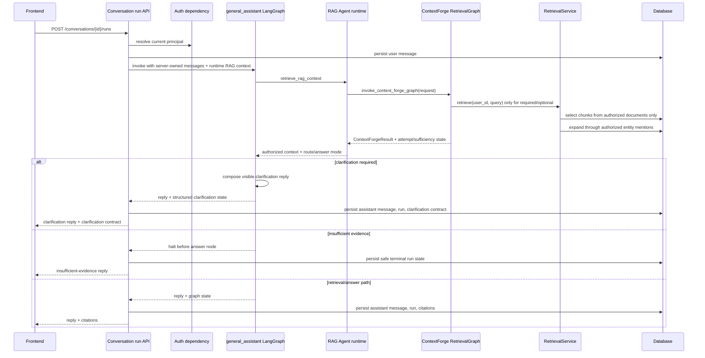
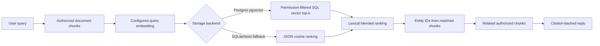
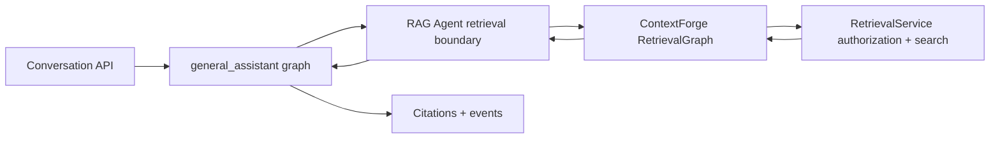

# Permission-aware RAG and citation-backed answers

This note explains the first thin RAG slice for the product chat service.

## What is implemented now

A product chat run can now answer with context from ingested personal or group documents.
The important rule is simple: retrieval starts from the user's authorized documents, not
from the entire knowledge corpus.

The current implementation is intentionally deterministic so tests stay offline:

- retrieval routing classifies each prompt as `no_retrieval`, `retrieval_required`, `retrieval_optional`, or `clarification_required`;
- direct retrieval uses term matching over authorized chunks only when routing calls for retrieval;
- graph expansion uses extracted entity mentions to add related authorized chunks;
- answer mode is explicit: `general_knowledge`, `document_grounded`, or `mixed`;
- ambiguous document references return a language-neutral `clarification` contract for
  human-in-the-loop localization instead of hard-coded English prose;
- filename/title-like document references are matched against authorized document metadata
  before body-only retrieval, so visible upload names can resolve even when absent from text;
- conversation runs enter retrieval through the `general_assistant` graph, which invokes the RAG Agent runtime; the RAG Agent delegates internally to the thin ContextForge LangGraph RetrievalGraph and records bounded retry/sufficiency state;
- citations are stored against the `AgentRunModel` only when retrieved chunks are actually used;
- the response payload returns routing metadata plus citation IDs, document IDs, chunk IDs, and snippets.

## Request flow

## Why permission filtering happens first

RAG systems can leak data if they retrieve globally and filter later. Even if the final
answer hides unauthorized text, intermediate rankings, graph edges, tool traces, or model
context can expose private information.

This project uses a safer order:

The graph expansion step also stays inside the authorized row set. This means a private
chunk can never become a citation or model context for an outsider just because it shares
an entity with an authorized chunk.

## Current limitations

- Retrieval routing is deterministic; Postgres ranking now uses pgvector SQL vector search after permission filtering, with JSON-backed cosine similarity as the SQLite/test fallback.
- LLM query planning, full-text fusion, and ANN/vector index tuning are still future work.
- The reply composition is a thin service-layer scaffold, not a polished answer synthesis prompt.
- Citations include snippets but not character offsets in the API response yet.
- Streaming exists, but frontend display of retrieval route/answer mode still belongs to the separate frontend repository.
- The legacy `/assistant/chat` endpoint still exists for smoke checks and does not own product KB access.

These constraints are acceptable for this demo stage because they make the security
boundary testable before adding more impressive retrieval infrastructure.

## RetrievalGraph augmentation milestone

The current production-shaped boundary is now: the Conversation API prepares the run request and runtime context, `general_assistant` invokes the RAG Agent inside its graph, the RAG Agent delegates to `invoke_context_forge_graph(...)`, ContextForge orchestrates the retrieval attempt and bounded sufficiency retry, and `RetrievalService` enforces permissions before returning packaged context. `general_assistant` receives authorized compact context plus `answer_mode` as graph state produced by the RAG Agent node.

Promote more of retrieval into graph nodes only when retrieval has enough internal
workflow to justify the added orchestration, for example:

- query rewrite;
- metadata/scope planning;
- hybrid full-text/vector search, candidate fusion, or ANN tuning behind the same permission boundary;
- cross-encoder reranking as a second-stage pass over top-k already-authorized candidates;
- reranking;
- context compression/packaging;
- product-facing retrieval quality profiles such as Fast / Balanced / Thorough, where
  candidate/vector limit, structured lookup, reranking, injected chunk count, and context
  char budget are tuned against measured latency and answer quality;
- richer clarification options, such as returning authorized document choices after a
  separate product/privacy review.

Even then, hard authorization should remain in `RetrievalService`, not in graph prompts,
agent reasoning, vector-store configuration, or cross-encoder prompts. The current and
future shape is:

## Testing evidence

`tests/test_permission_aware_rag.py` verifies:

- an owner receives citations and authorized context from an ingested private document;
- an outsider asking the same question receives no private citations or private reply text;
- graph expansion adds a related authorized chunk that shares an extracted entity with the direct match;
- no-retrieval prompts skip `RetrievalService.retrieve`;
- optional retrieval can fall back to `general_knowledge` when no relevant authorized chunks exist;
- the graph receives only retrieved chunk IDs/context that passed service-layer authorization, not raw unauthorized document text.

## Revision history

- 2026-06-17: Added future retrieval quality/speed profile guidance for balancing RAG accuracy with product UX latency.
- 2026-06-16: Promoted `rag_agent` to the assistant-facing retrieval boundary invoked from `general_assistant`, while ContextForge remains the delegated permission-first retrieval graph.
- 2026-06-10: Added the thin ContextForge RetrievalGraph wrapper as the active retrieval implementation seam while keeping deeper tool-using graph orchestration future-gated.
- 2026-05-25: Clarification-required runs now return structured human-in-the-loop state instead of deterministic English text.
- 2026-05-25: Added authorized title/source-filename metadata matching for filename-only document references.
- 2026-05-21: Added deterministic retrieval routing, answer modes, clarification route, and response/event metadata.
- 2026-05-17: Updated limitations after adding structured run events in the next slice.
- 2026-05-17: Created after adding thin permission-aware retrieval, graph expansion, and citations.
