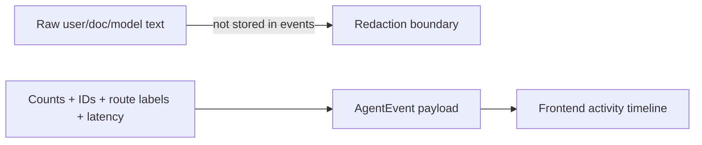

# Agent observability events and eval fixtures

This note explains how the product chat service shows agent activity without exposing
hidden chain-of-thought or private document text.

## What is implemented now

Each product chat run stores structured `AgentEventModel` rows. The frontend can fetch
those rows from:

```text
GET /conversations/{conversation_id}/runs/{run_id}/events
```

The current events are intentionally high-level:

1. `run_started`
2. `user_message_stored`
3. `retrieval_completed`
4. `graph_invoked`
5. `answer_composed`

They are enough to show a visible service surface: the UI can say that the backend opened a run, stored
the message, made a retrieval-routing decision, retrieved authorized context when needed,
invoked the graph when appropriate, and composed a cited or general answer.
If graph invocation fails, the service stores a failed run and emits `run_failed` with only
safe error metadata before returning a client-safe error response. If a streaming run is
cooperatively cancelled, the service emits `run_cancel_requested`/`run_cancelled` without
persisting partial assistant text.

## Redaction boundary

Agent transparency should not mean leaking chain-of-thought, raw prompts, document text,
or secrets. Event payloads therefore contain metadata such as counts, route labels, and
latency values, retrieval route, answer mode, and document scope rather than raw message or chunk content.



Citations remain the explicit provenance channel for document snippets. Events explain
what happened; citations explain which authorized knowledge supported the answer.

## Internal Prometheus timing metrics

The service also has an opt-in Prometheus text endpoint for internal maintenance and
quality analysis:

```text
MY_AGENTS_METRICS_ENABLED=true
GET /metrics
```

This is not a frontend product API and should not be treated as user-facing agent
activity. It exists to answer performance questions such as whether the first chat
turn is slow because of request overhead, conversation-run orchestration, ContextForge
retrieval, embedding calls, reranking, or assistant graph invocation.

Implemented timing histograms:

- `my_agents_http_request_duration_seconds`
- `my_agents_conversation_run_duration_seconds`
- `my_agents_context_forge_duration_seconds`
- `my_agents_retrieval_phase_duration_seconds`
- `my_agents_embedding_duration_seconds`
- `my_agents_reranker_duration_seconds`
- `my_agents_graph_invocation_duration_seconds`

Allowed labels are deliberately low-cardinality operational labels: route templates,
status codes, run outcomes, retrieval route, answer mode, provider/model names, and
fixed internal phase names. Do not add raw prompts, document text, user IDs, document
IDs, chunk IDs, emails, tokens, secrets, or arbitrary URL paths as metric labels.

These metrics complement run events:

- run events are persisted, frontend-safe, per-run timeline facts;
- Prometheus metrics are aggregate p50/p95/p99 timing signals for backend operators.

Future observability work should split into two lanes:

1. Add Prometheus + Grafana for common backend operations metrics such as request
   latency, request volume, error rate, ingestion/worker health, queue or stale-run
   signals, and resource saturation.
2. Evaluate Langfuse vs LangSmith for LLM-specific observability: provider latency,
   token/cost metrics, prompt/version tracking, traces, eval datasets, and
   retrieval/answer-quality review.

## Deterministic eval fixtures

`my_agents/agent_runtime/evals.py` provides small deterministic helpers:

- `evaluate_grounded_citations` checks that a cited reply visibly uses citation text;
- `evaluate_permission_leakage` checks forbidden terms are absent from reply/citations;
- `evaluate_event_redaction` checks forbidden terms are absent from event payloads;
- `evaluate_event_latency_budget` checks emitted latency metrics fit a fixture budget.

These helpers are not a complete LLM evaluation platform. Their role is to make product
claims testable: grounding, permission safety, redaction, and basic performance awareness.

## Testing evidence

`tests/test_agent_observability_evals.py` verifies:

- event sequences are ordered and typed;
- event payloads include retrieval route, answer mode, document scope, retrieval counts, route label, citation count, and latency;
- raw private phrases and raw user questions do not appear in event payloads;
- deterministic eval helpers pass for grounded authorized answers;
- the permission leakage eval passes when an outsider receives no private context.
- opt-in `/metrics` exposure records request and embedding timing histograms without exposing raw product data in labels.

`tests/test_conversations_api.py` also verifies that failed graph invocation stores
`status=failed` plus a redacted `run_failed` event.

## Revision history

- 2026-06-16: Recorded future Prometheus/Grafana operations metrics and Langfuse/LangSmith LLM observability goals.
- 2026-06-16: Added opt-in internal Prometheus timing metrics for maintenance and performance-quality analysis.
- 2026-05-21: Updated after adding retrieval-route and answer-mode event metadata.
- 2026-05-17: Updated after adding failed-run event persistence.
- 2026-05-17: Created after adding structured agent run events and deterministic eval fixtures.
