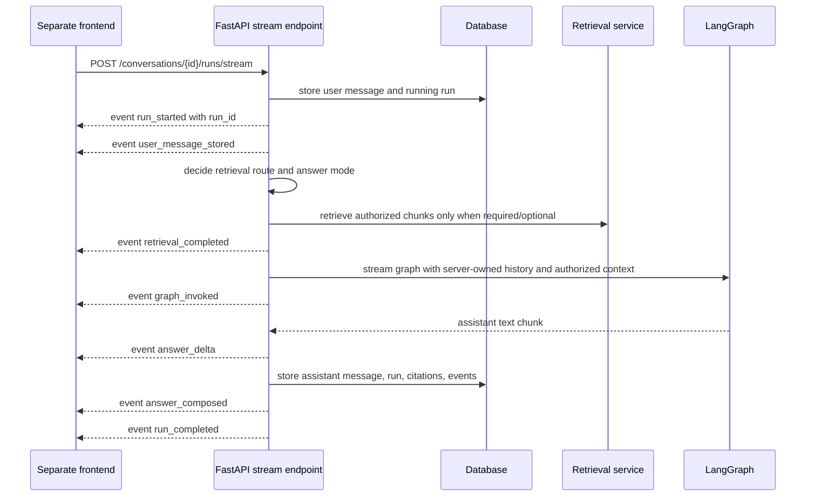

# HTTP streaming and frontend contract

This note documents the backend-only streaming contract for the product chat service.
The frontend still belongs in a separate repository; this backend exposes the API shape a
frontend can consume.

## Implemented endpoints

```text
POST /conversations/{conversation_id}/runs/stream
Content-Type: application/json
Accept: text/event-stream
```

Request body is the same as the non-streaming run endpoint:

```json
{
  "message": "Ask a question about authorized knowledge"
}
```

The response is `text/event-stream` using Server-Sent Events.



## Event order

Successful streams emit:

1. `run_started`
2. `user_message_stored`
3. `retrieval_completed`
4. `graph_invoked`
5. zero or more `answer_delta`
6. optional `full_document_read`
7. `answer_composed`
8. `run_completed`

`full_document_read` appears only for the explicit comprehensive-document path. It is
persisted and streamed after the final answer deltas but before `answer_composed`; ordinary
runs keep their existing sequence without that event.

`run_started` carries the server run id early enough for explicit cancellation:

```json
{
  "run_id": "...",
  "conversation_id": "...",
  "status": "running"
}
```

`answer_delta` events carry incremental assistant text:

```json
{
  "delta": "partial assistant text",
  "sequence": 1
}
```

## Dynamic reasoning summary stream

`reasoning_summary_delta` is a separate SSE-only event and `reasoning_summary_generated` is a
bounded persisted event. They carry a closed `stage`, text delta/final text, and per-stage sequence;
`answer_delta` remains final-answer text only. Completed `run_completed` and run detail return the
refresh-safe `reasoning_summaries` list.

The frontend must present these as model-generated approach summaries and keep them separate from
the verified `agent_trace`. See the [dynamic reasoning summary contract](./28-dynamic-reasoning-summary-contract.md).

The normal run, resume, and replay OpenAPI operations publish the exact delta payload under the
`text/event-stream` media object's `x-sse-events.reasoning_summary_delta` extension. The payload
requires `stage`, nonblank `delta`, and a positive per-stage `sequence`. Individual deltas have no
500-character maximum; the completed persisted item owns that final bound. Optional summary-event
parse failures must not fail answer streaming.

Ordinary OpenAI-backed answer composition calls `ChatOpenAI.stream()`. Each provider
`AIMessageChunk` is emitted while the graph is still running and is also aggregated into the final
message used for persistence and reasoning-summary extraction. Deterministic/local graph spies can
emit multiple deltas so frontend tests verify incremental rendering without real credentials.


`retrieval_completed`, `graph_invoked`, and `answer_composed` payloads include redacted routing metadata: `retrieval_route`, `answer_mode`, and `document_scope`. Retrieval counts use source names such as `semantic_vector_count`, `keyword_match_count`, `document_metadata_count`, `graph_expansion_count`, and `fallback_count`. A `clarification_required` route carries both visible assistant text and a language-neutral `clarification` object. Depending on whether the graph/provider streams response chunks, clients may see `graph_invoked`/`answer_delta` before completion or may only receive the final `answer_composed` and `run_completed` payloads. In all cases, `run_completed.reply` is non-empty and the structured clarification object keeps the HITL contract stable:

```json
{
  "required": true,
  "kind": "document_scope",
  "reason_code": "ambiguous_document_reference",
  "message_key": "clarification.document_scope.select_source",
  "input_slot": "document_reference",
  "retrieval_route": "clarification_required",
  "document_scope": "unknown",
  "rewritten_query": "..."
}
```

Frontend clients should render the assistant `reply`, localize `message_key` where they need form/input affordances, and collect the missing document/file reference from the human user.

The final `run_completed` event contains the same response shape as
`POST /conversations/{conversation_id}/runs`:

```json
{
  "run_id": "...",
  "conversation_id": "...",
  "reply": "...",
  "route": {"label": "general_assistant", "explanation": "..."},
  "handled_by": "personal_assistant_graph",
  "retrieval_route": "no_retrieval",
  "answer_mode": "general_knowledge",
  "document_scope": "unknown",
  "citations": [],
  "consulted_sources": [],
  "document_coverage": null
}
```

For attributed runs, `consulted_sources` is the complete user-visible consulted superset and
`citations` is its conservative answer-supported subset. A source in both arrays has the same
persisted `id` and `chunk_id`. `consulted_sources: []` means attribution ran and found no
consulted source; `consulted_sources: null` means the run predates attribution, in which case
the legacy flat `citations` list is preserved without reclassifying it as answer-supported.

This response field is present consistently in synchronous run completion, normal SSE
`run_completed`, resumed-run SSE `run_completed`, non-streaming and streaming replay completion,
and `GET /conversations/{conversation_id}/runs/{run_id}`. A refresh must therefore not collapse
the two evidence sets back into one.

Evidence arrays remain chunk-granular for backend attribution and audit, but frontend citation
presentation is document-granular. Group by `document_id`; display `source_filename` when present,
otherwise `document_title`, plus `knowledge_base_name` and optional deduplicated `source_page`
values. Do not show snippets or document, knowledge-base, or chunk IDs in the ordinary citation
detail UI.

## Full-document buffering and coverage disclosure

The full-document response node is intentionally excluded from direct provider-token
streaming. Its provider output is buffered until the backend can prepend the deterministic
Korean/English partial-review notice when `document_coverage.mode` is `partial`. Only then
does the SSE adapter emit fallback `answer_delta` chunks. Therefore clients never see an
apparently comprehensive answer first and a limitation notice later.

For a partial read, `run_completed.reply` and the concatenated `answer_delta` values are
identical and begin with a notice like:

```text
Partial-review notice: I reviewed characters 0-12000 of 48000.
This is not yet a complete-document review.
```

`run_completed.document_coverage` and the preceding `full_document_read` event contain the
same public range metadata: mode, document ID/title/source filename, start/end offsets, and
total characters. The event adds `latency_ms`. Neither surface includes the raw normalized
document text or the internal next cursor.

Failed graph execution after the stream starts emits a redacted failure path:

1. `run_started`
2. `user_message_stored`
3. `retrieval_completed`
4. `run_failed`
5. `run_error`

If the graph had already begun streaming, the client may have seen `graph_invoked` or
partial `answer_delta` events before the failure event. The persisted run status is still
`failed`, and `GET /conversations/{conversation_id}/runs/{run_id}/events` returns the
redacted persisted event sequence. The stream intentionally does not expose raw user
prompts, private provider exceptions, chain-of-thought, or document content.

## Durable-interaction resume streaming

```text
POST /conversations/{conversation_id}/runs/{run_id}/resume/stream
Content-Type: application/json
Accept: text/event-stream
```

The endpoint validates and atomically claims the waiting run before opening the stream. Its first
event is `run_resumed`, followed by real `retrieval_completed` and `graph_invoked` progress as
LangGraph continues the checkpoint. Provider message chunks are emitted as `answer_delta`; a
buffered fallback is used only when the graph produces no live message chunks. Cancellation is
checked between graph updates and deltas. A repeated interrupt emits `run_interrupted`; normal
completion persists the same response returned by sync resume and emits `run_completed`.

This ordering is a product contract: once the user answers the interaction, the frontend must
leave its suspended presentation immediately and behave like an ordinary streaming answer. The
previous adapter called sync resume to completion before its first yield and then replayed the
finished text as fake deltas, which kept the choice UI frozen for the entire run.

## Assistant-message replay streaming

```text
POST /conversations/{conversation_id}/messages/{message_id}/replay/stream
Content-Type: application/json
Accept: text/event-stream
```

Request body is the same optional `ConversationReplayRequest` accepted by the
non-streaming replay endpoint. When the original assistant run exists, replay uses that
run's unified knowledge-base selection so regeneration matches the original
source boundary without reviving the deprecated group/private source split.

If the original run used `full_document_read`, replay also preselects that exact document.
It revalidates current authorization and never substitutes a newly available document. If
the original target was deleted or access was revoked, replay completes with an
unavailable-source warning, no full-document coverage/citations, and no replacement target.

The replay stream emits the same frontend-safe event family as a normal streamed run:
`run_started`, `user_message_stored`, `retrieval_completed`, optional `graph_invoked`,
zero or more `answer_delta`, `answer_composed`, and `run_completed`. The
`user_message_stored` event references the existing preceding user message; replay does
not duplicate the user prompt in the transcript.

Replay pruning is success-only. The target assistant message and later transcript rows,
old run data, events, and citations remain visible while the new answer streams. After
`run_completed`, the backend prunes the old suffix and preserves the completed replay
run. If streaming replay fails, the backend persists a redacted failed run and emits
`run_failed` plus `run_error`, but it does **not** prune the old transcript.

## Cancellation / send-immediately steering

The stream supports cooperative cancellation for frontend steering UX. The frontend should
keep queueing as the default behavior, and use cancellation only for an explicit
"send immediately" action.

```text
POST /conversations/{conversation_id}/runs/{run_id}/cancel
```

Response shape:

```json
{
  "run_id": "...",
  "conversation_id": "...",
  "status": "cancelling"
}
```

If the run is already terminal, the endpoint returns the existing terminal status. A
streaming run observes cancellation cooperatively between retrieval/graph stream steps,
emits `run_cancelled`, marks the run `cancelled`, and closes the stream. Partial assistant
text is intentionally **not** persisted as an assistant message, and cancelled runs have no
citations or completed run detail.

The backend rejects new `/runs` and `/runs/stream` requests for the same conversation while
a run is `running` or `cancelling`:

```json
{
  "detail": "conversation run already active"
}
```

Frontend send-immediately flow:

1. Read `run_started.data.run_id` from the active stream.
2. Call `POST /conversations/{conversation_id}/runs/{run_id}/cancel`.
3. Wait for `run_cancelled` or stream close.
4. Send the immediate message as a new run.
5. Treat `409 conversation run already active` as a safe retry/backoff state.

Guest prompt limits count persisted user messages, so an interrupted prompt still counts
against the guest prompt cap; the replacement immediate message counts separately.

Current limitation: this is cooperative cancellation, not provider-level hard abort. If the
underlying graph/provider is blocked and emits no stream step, cancellation may not be
observed until that call returns or yields.

## Client disconnect durability gap

As of 2026-06-09, streamed chat generation is still coupled to the client-held HTTP/SSE
request. `answer_delta` chunks are transient transport events; the backend persists the
assistant message only after the graph returns a final result and `persist_completed_run`
commits the `run_completed` response. If the browser tab is closed, the user navigates
away, or an intermediary drops the stream before completion, the server can observe the
stream generator closing and terminalize the run without saving any partial assistant
message. A user who later revisits the conversation may therefore see their user message
and a cancelled/failed run, but not the answer that was in progress.

This must be handled in the near future for production UX. The preferred direction is to
make generation server-owned and durable: create the run, execute it in a background job or
worker independent of the listening client, persist the final assistant message/citations
when generation completes, and treat SSE as a resumable listener/progress channel rather
than the owner of execution. Until that architecture exists, frontend code should not assume
that leaving a streaming conversation will finish and persist the assistant response.

## Frontend contract guidance

- Use `/conversations/{conversation_id}/runs/stream` for chat UX that wants live progress
  and incremental assistant text.
- Use `/conversations/{conversation_id}/messages/{message_id}/replay/stream` for
  regeneration UI that should look like a fresh answer generation while preserving the old
  transcript on failure.
- Use `/conversations/{conversation_id}/runs` or non-streaming `/messages/{message_id}/replay`
  when a full-response request is sufficient.
- Do not use legacy `/assistant/chat` for product personal/group knowledge-base chat.
- After `run_completed`, the frontend can refresh messages from
  `GET /conversations/{conversation_id}/messages` and inspect persisted activity through
  `GET /conversations/{conversation_id}/runs/{run_id}/events`.
- If the stream emits `run_error`, show a generic failure state and use run/event endpoints for
  redacted diagnostics rather than displaying provider exception text.

## Current limitations

- `answer_delta` streams assistant text, but the final `run_completed.reply` remains the
  compatibility source of truth for the persisted answer.
- The concatenated ordinary provider `answer_delta` values and the base reply reconstructed from
  those same chunks are identical; reasoning-summary blocks never enter either string.
- Full-document answers are buffered rather than provider-token-streamed so partial coverage
  can be disclosed before the first visible delta.
- Large documents expose only the first configured character range; streaming does not imply
  background multi-range traversal.
- Deterministic fallback may chunk the final local reply immediately before completion when
  the graph provider does not emit token chunks.
- Cancellation is cooperative and does not hard-abort a blocked provider call yet.
- Long-running jobs still execute inside the request; background queues remain a later milestone.
- Client disconnects can currently cancel/terminalize an in-progress streamed run before the
  assistant response is persisted. Durable server-owned run execution is a near-future requirement.
- CORS must be configured when a real frontend origin is chosen.

## Revision history

- 2026-08-26: Replaced buffered checkpoint-resume replay with immediate `run_resumed`, live LangGraph progress, real answer deltas, and cooperative cancellation checks.
- 2026-08-25: Defined document-level citation presentation using human-readable document/knowledge-base metadata over chunk-level wire provenance.
- 2026-08-25: Added refresh-safe `consulted_sources` alongside answer-supported `citations`, including resume/replay parity and legacy `null` semantics.
- 2026-08-24: Documented full-document buffering, typed coverage events, and replay target fidelity.
- 2026-05-19: Created after adding the SSE conversation-run stream endpoint.
- 2026-05-19: Added `answer_delta` events for incremental assistant text streaming.
- 2026-05-21: Added early `run_started`, cooperative run cancellation, and active-run rejection for send-immediately steering.
- 2026-06-07: Added assistant-message replay streaming with success-only transcript pruning and failure-safe old-answer preservation.
- 2026-06-09: Documented the client-disconnect durability gap and near-future need for server-owned background run execution.
