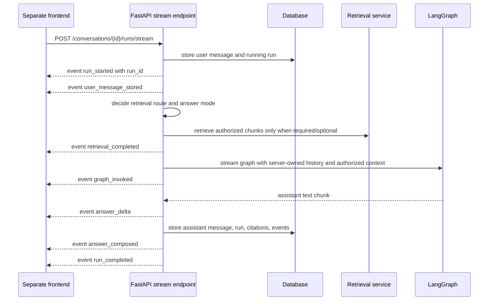

# HTTP streaming and frontend contract

This note documents the backend-only streaming contract for the product chat service.
The frontend still belongs in a separate repository; this backend exposes the API shape a
frontend can consume.

## Implemented endpoints

```text
POST /conversations/{conversation_id}/runs/stream
Content-Type: application/json
Accept: text/event-stream
```

Request body is the same as the non-streaming run endpoint:

```json
{
  "message": "Ask a question about authorized knowledge"
}
```

The response is `text/event-stream` using Server-Sent Events.



## Event order

Successful streams emit:

1. `run_started`
2. `user_message_stored`
3. `retrieval_completed`
4. `graph_invoked`
5. zero or more `answer_delta`
6. `answer_composed`
7. `run_completed`

`run_started` carries the server run id early enough for explicit cancellation:

```json
{
  "run_id": "...",
  "conversation_id": "...",
  "status": "running"
}
```

`answer_delta` events carry incremental assistant text:

```json
{
  "delta": "partial assistant text",
  "sequence": 1
}
```

When the OpenAI-backed graph/provider yields token chunks, these deltas are emitted while
the graph is still running. Deterministic/local graph spies can also emit multiple deltas
so frontend tests can verify incremental rendering without real credentials.


`retrieval_completed`, `graph_invoked`, and `answer_composed` payloads include redacted routing metadata: `retrieval_route`, `answer_mode`, and `document_scope`. Retrieval counts use source names such as `semantic_vector_count`, `keyword_match_count`, `document_metadata_count`, `graph_expansion_count`, and `fallback_count`. A `clarification_required` route completes without `graph_invoked` or `answer_delta`; instead, `answer_composed` and `run_completed` carry `reply: ""` plus a language-neutral `clarification` object such as:

```json
{
  "required": true,
  "kind": "document_scope",
  "reason_code": "ambiguous_document_reference",
  "message_key": "clarification.document_scope.select_source",
  "input_slot": "document_reference",
  "retrieval_route": "clarification_required",
  "document_scope": "unknown",
  "rewritten_query": "..."
}
```

Frontend clients should localize `message_key` and collect the missing document/file reference from the human user rather than rendering backend-authored English prose.

The final `run_completed` event contains the same response shape as
`POST /conversations/{conversation_id}/runs`:

```json
{
  "run_id": "...",
  "conversation_id": "...",
  "reply": "...",
  "route": {"label": "general_assistant", "explanation": "..."},
  "handled_by": "personal_assistant_graph",
  "retrieval_route": "no_retrieval",
  "answer_mode": "general_knowledge",
  "document_scope": "unknown",
  "citations": []
}
```

Failed graph execution after the stream starts emits a redacted failure path:

1. `run_started`
2. `user_message_stored`
3. `retrieval_completed`
4. `run_failed`
5. `run_error`

If the graph had already begun streaming, the client may have seen `graph_invoked` or
partial `answer_delta` events before the failure event. The persisted run status is still
`failed`, and `GET /conversations/{conversation_id}/runs/{run_id}/events` returns the
redacted persisted event sequence. The stream intentionally does not expose raw user
prompts, private provider exceptions, chain-of-thought, or document content.

## Assistant-message replay streaming

```text
POST /conversations/{conversation_id}/messages/{message_id}/replay/stream
Content-Type: application/json
Accept: text/event-stream
```

Request body is the same optional `ConversationReplayRequest` accepted by the
non-streaming replay endpoint. When the original assistant run exists, replay uses that
run's unified knowledge-base selection so regeneration matches the original
source boundary without reviving the deprecated group/private source split.

The replay stream emits the same frontend-safe event family as a normal streamed run:
`run_started`, `user_message_stored`, `retrieval_completed`, optional `graph_invoked`,
zero or more `answer_delta`, `answer_composed`, and `run_completed`. The
`user_message_stored` event references the existing preceding user message; replay does
not duplicate the user prompt in the transcript.

Replay pruning is success-only. The target assistant message and later transcript rows,
old run data, events, and citations remain visible while the new answer streams. After
`run_completed`, the backend prunes the old suffix and preserves the completed replay
run. If streaming replay fails, the backend persists a redacted failed run and emits
`run_failed` plus `run_error`, but it does **not** prune the old transcript.

## Cancellation / send-immediately steering

The stream supports cooperative cancellation for frontend steering UX. The frontend should
keep queueing as the default behavior, and use cancellation only for an explicit
"send immediately" action.

```text
POST /conversations/{conversation_id}/runs/{run_id}/cancel
```

Response shape:

```json
{
  "run_id": "...",
  "conversation_id": "...",
  "status": "cancelling"
}
```

If the run is already terminal, the endpoint returns the existing terminal status. A
streaming run observes cancellation cooperatively between retrieval/graph stream steps,
emits `run_cancelled`, marks the run `cancelled`, and closes the stream. Partial assistant
text is intentionally **not** persisted as an assistant message, and cancelled runs have no
citations or completed run detail.

The backend rejects new `/runs` and `/runs/stream` requests for the same conversation while
a run is `running` or `cancelling`:

```json
{
  "detail": "conversation run already active"
}
```

Frontend send-immediately flow:

1. Read `run_started.data.run_id` from the active stream.
2. Call `POST /conversations/{conversation_id}/runs/{run_id}/cancel`.
3. Wait for `run_cancelled` or stream close.
4. Send the immediate message as a new run.
5. Treat `409 conversation run already active` as a safe retry/backoff state.

Guest prompt limits count persisted user messages, so an interrupted prompt still counts
against the guest prompt cap; the replacement immediate message counts separately.

Current limitation: this is cooperative cancellation, not provider-level hard abort. If the
underlying graph/provider is blocked and emits no stream step, cancellation may not be
observed until that call returns or yields.

## Client disconnect durability gap

As of 2026-06-09, streamed chat generation is still coupled to the client-held HTTP/SSE
request. `answer_delta` chunks are transient transport events; the backend persists the
assistant message only after the graph returns a final result and `persist_completed_run`
commits the `run_completed` response. If the browser tab is closed, the user navigates
away, or an intermediary drops the stream before completion, the server can observe the
stream generator closing and terminalize the run without saving any partial assistant
message. A user who later revisits the conversation may therefore see their user message
and a cancelled/failed run, but not the answer that was in progress.

This must be handled in the near future for production UX. The preferred direction is to
make generation server-owned and durable: create the run, execute it in a background job or
worker independent of the listening client, persist the final assistant message/citations
when generation completes, and treat SSE as a resumable listener/progress channel rather
than the owner of execution. Until that architecture exists, frontend code should not assume
that leaving a streaming conversation will finish and persist the assistant response.

## Frontend contract guidance

- Use `/conversations/{conversation_id}/runs/stream` for chat UX that wants live progress
  and incremental assistant text.
- Use `/conversations/{conversation_id}/messages/{message_id}/replay/stream` for
  regeneration UI that should look like a fresh answer generation while preserving the old
  transcript on failure.
- Use `/conversations/{conversation_id}/runs` or non-streaming `/messages/{message_id}/replay`
  when a full-response request is sufficient.
- Do not use legacy `/assistant/chat` for product personal/group knowledge-base chat.
- After `run_completed`, the frontend can refresh messages from
  `GET /conversations/{conversation_id}/messages` and inspect persisted activity through
  `GET /conversations/{conversation_id}/runs/{run_id}/events`.
- If the stream emits `run_error`, show a generic failure state and use run/event endpoints for
  redacted diagnostics rather than displaying provider exception text.

## Current limitations

- `answer_delta` streams assistant text, but the final `run_completed.reply` remains the
  compatibility source of truth for the persisted answer.
- Deterministic fallback may chunk the final local reply immediately before completion when
  the graph provider does not emit token chunks.
- Cancellation is cooperative and does not hard-abort a blocked provider call yet.
- Long-running jobs still execute inside the request; background queues remain a later milestone.
- Client disconnects can currently cancel/terminalize an in-progress streamed run before the
  assistant response is persisted. Durable server-owned run execution is a near-future requirement.
- CORS must be configured when a real frontend origin is chosen.

## Revision history

- 2026-05-19: Created after adding the SSE conversation-run stream endpoint.
- 2026-05-19: Added `answer_delta` events for incremental assistant text streaming.
- 2026-05-21: Added early `run_started`, cooperative run cancellation, and active-run rejection for send-immediately steering.
- 2026-06-07: Added assistant-message replay streaming with success-only transcript pruning and failure-safe old-answer preservation.
- 2026-06-09: Documented the client-disconnect durability gap and near-future need for server-owned background run execution.
