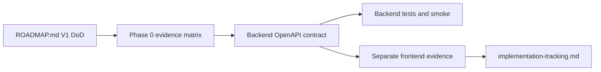

# V1 contract freeze and evidence map

This Phase 0 map freezes the backend-owned V1 contract surface before the next strict V1
implementation phases. The separate frontend repository may verify against this contract,
but frontend code remains outside this backend repo.

## Contract source of truth

- Backend source of truth: the FastAPI OpenAPI document generated by `my_agents.api.create_app()`.
- Local contract URL while the backend is running: `http://127.0.0.1:8000/openapi.json`.
- Frontend coordination notes live in `/Users/heecheonpark/Git/my-agents-frontend/docs/backend-requests.md`.
- Product frontend code must use the product endpoint families below, not legacy `POST /assistant/chat`.
- Frontend should not synthesize missing citation, event, auth, or ingestion fields. Missing fields are backend contract gaps for a later backend phase.

## V1 DoD evidence matrix

| Roadmap V1 DoD item | Phase | Backend evidence target | Frontend evidence target | Docs evidence | Owner repo | Status |
| --- | --- | --- | --- | --- | --- | --- |
| Separate frontend completes signup/login and product conversation flows without legacy `/assistant/chat` | 0, 1, 6 | Auth/session OpenAPI, CORS tests, run endpoints, demo seed/smoke | Browser smoke proves product endpoint use and BFF allowlist blocks `/assistant/*` | `10-frontend-demo-runbook.md`, frontend `docs/implementation-log.md` | both; frontend primary for browser proof | hosted signup/email verification proven; full cited chat smoke still should be recorded after each deployment |
| Product chat supports streaming or intentional polling UX with run status | 0, 3, 6 | `POST /conversations/{conversation_id}/runs/stream`, run detail, cancellation, and events tests | Chat UI shows streaming/polling, completion, refresh-safe state | `09-http-streaming-frontend-contract.md` | both | backend implemented; hosted/browser proof remains part of recurring smoke evidence |
| Fresh Postgres/Neon database setup is migration-driven and documented end to end | 0, 2, 4, 6 | Alembic upgrade and `tests/test_migrations.py`; gated external DB smoke | Frontend waits for backend readiness; no direct DB assumptions | `08-postgres-alembic-neon.md`, README pair, Render/Neon notes | backend | documented and deployed for hosted baseline; repeat smoke remains required for future migrations |
| Auth/session behavior is safe enough for public demo, including rate limiting and cookie/CSRF clarity | 1, 6 | Auth abuse tests, cookie/CSRF/CORS tests, production-origin settings docs, Resend HTTP sender | Browser login/me/logout and CSRF mutation smoke | `02-first-party-auth-sessions.md`, `10-frontend-demo-runbook.md`, `12-public-demo-deployment-readiness.md` | backend primary; frontend verifies | backend hardened for single-process public demo; shared rate limiting and deeper review remain |
| Permission-aware retrieval uses a real retrieval path, not only deterministic fixtures | 4, 6 | Embedding provider boundary, JSON cosine ranking tests, pgvector migration/search tests, permission-first retrieval tests, ContextForge tests | Cited answer flow with unauthorized-doc negative proof | `06-permission-aware-rag.md`, `08-postgres-alembic-neon.md`, `12-retrieval-agent-hybrid-reference.md` | backend | backend implemented with ContextForge and pgvector/JSON paths; retrieval-quality evals remain follow-up |
| Document ingestion supports at least one realistic uploaded file type | 2, 6 | Upload API, parser boundary, storage metadata, parser failure tests, async progress tests, external-worker mode | Upload/ingestion UI smoke or documented gap | `05-knowledge-ingestion-extraction.md` plus frontend runbook | backend primary; frontend verifies | backend implemented for text-based PDF, Markdown, and plain text; scanned/OCR/DOCX/etc. deferred |
| Citations include enough provenance for users to trust the answer | 3, 4, 6 | Run response/detail citation schema, document/chunk/source metadata tests | UI renders backend fields and persists after reload | `06-permission-aware-rag.md`, future citation contract update | backend primary; frontend verifies | partial: persisted document/chunk/snippet provenance exists; richer page/offset/source-preview/confidence pending |
| Agent events are useful to the UI without exposing chain-of-thought or unauthorized data | 3, 6 | Event schemas, redaction tests, SSE/fetch event ordering | UI event trail with safe payloads | `07-agent-observability-evals.md`, `09-http-streaming-frontend-contract.md` | backend primary; frontend verifies | backend implemented for redacted event trail; richer UI/debug taxonomy remains follow-up |
| Tests pass offline by default | every phase | `uv run pytest -q`, Ruff check, Ruff format check | `pnpm lint`, `pnpm exec tsc --noEmit`, `pnpm exec vitest run`, `pnpm build`, Playwright | `docs/implementation-tracking.md` | both | backend green on 2026-05-30: 278 passed, 2 skipped; frontend evidence owned separately |
| Optional Postgres/Neon smoke tests pass against a dedicated test database | 2, 4, 6 | `MY_AGENTS_TEST_DATABASE_URL=... uv run pytest tests/test_migrations.py -q` and later schema-phase smokes | N/A except waiting for backend readiness | `08-postgres-alembic-neon.md` | backend | gated; skipped when env absent; rerun after future schema changes |
| Korean and English READMEs remain accurate | 6 and setup changes | README pair review after setup/API/runbook changes | Frontend docs link backend evidence where needed | `README.md`, `README.en.md`, frontend docs | both | current backend README pair matches the status surface |
| No real secrets are committed or printed | every phase | `.env.example` only, status/diff review, no real env output | frontend env review | README/env docs and handoff notes | both | tracked secret-like scan only found safe placeholders |

## Frozen product endpoint inventory

Generated from `MY_AGENTS_ENV_FILE= MY_AGENTS_RESPONSE_MODE=deterministic my_agents.api.create_app().openapi()` on 2026-05-30. The generated app exposes 54 non-doc routes.

| Method | Path | Request schema | Success response schema | V1 use |
| --- | --- | --- | --- | --- |
| `GET` | `/health` | none | `200` | health/startup smoke |
| `POST` | `/assistant/chat` | `ChatRequest` | `200 ChatResponse` | legacy/dev assistant smoke only; not the product frontend path |
| `POST` | `/auth/signup` | `SignupRequest` | `201 SignupResponse` | account creation and verification email handoff |
| `POST` | `/auth/verify-email` | `VerifyEmailRequest` | `200 UserResponse` | email verification flow |
| `POST` | `/auth/login` | `LoginRequest` | `200 LoginResponse` plus session cookie | verified-user login and CSRF token issue |
| `GET` | `/auth/me` | none | `200 UserResponse` | browser session refresh/current-user lookup |
| `POST` | `/auth/logout` | none; CSRF header required | `204` | session revocation |
| `POST` | `/auth/password-reset/request` | `PasswordResetRequest` | `202 AcceptedResponse` | non-enumerating reset request |
| `POST` | `/auth/password-reset/confirm` | `PasswordResetConfirmRequest` | `204` | password reset and session revocation |
| `POST` | `/auth/guest/request` | `GuestAccessRequest` | `200 AcceptedResponse` | env-gated public-demo guest request acknowledgement |
| `POST` | `/auth/guest/login` | `GuestLoginRequest` | `200 LoginResponse` plus session cookie | operator-issued guest-code redemption |
| `GET` | `/auth/dev/outbox` | none | `200 array[DevAuthEmailMessageResponse]` | local deterministic smoke only; not product BFF allowlist |
| `POST` | `/groups` | `GroupCreateRequest` | `201 GroupResponse` | group scope creation |
| `GET` | `/groups` | none | `200 array[GroupResponse]` | group list for current user |
| `GET` | `/groups/{group_id}` | none | `200 GroupResponse` | group detail |
| `POST` | `/groups/{group_id}/invitations` | `GroupInvitationCreateRequest` | `201 GroupInvitationResponse` | email invitation; does not reveal account existence |
| `GET` | `/groups/{group_id}/invitations` | none | `200 array[GroupInvitationResponse]` | manager-only invitation review |
| `GET` | `/groups/{group_id}/members` | none | `200 array[MemberResponse]` | manager-only accepted-member roster with display-only nickname; no member email |
| `PATCH` | `/groups/{group_id}/members/{user_id}` | `MemberPatchRequest` | `204` | non-creating active-member role update by user ID |
| `POST` | `/group-invitations/accept` | `GroupInvitationAcceptRequest` | `200 MemberResponse` | invited user accepts opaque token |
| `GET` | `/groups/{group_id}/publish-requests` | none | `200 array[KnowledgePublishRequestResponse]` | group knowledge publish request list |
| `POST` | `/groups/{group_id}/publish-requests` | `KnowledgePublishRequestCreateRequest` | `201 KnowledgePublishRequestResponse` | request to publish personal knowledge into group scope |
| `POST` | `/groups/{group_id}/publish-requests/{request_id}/approve` | none | `200 KnowledgePublishRequestResponse` | group admin publish approval |
| `POST` | `/groups/{group_id}/publish-requests/{request_id}/reject` | none | `200 KnowledgePublishRequestResponse` | group admin publish rejection |
| `POST` | `/knowledge-bases` | `KnowledgeBaseCreateRequest` | `201 KnowledgeBaseResponse` | personal/group KB creation |
| `GET` | `/knowledge-bases` | none | `200 array[KnowledgeBaseResponse]` | KB list |
| `GET` | `/knowledge-bases/{knowledge_base_id}` | none | `200 KnowledgeBaseResponse` | KB detail |
| `POST` | `/knowledge-bases/{knowledge_base_id}/documents` | `DocumentCreateRequest` | `201 DocumentResponse` | KB-scoped text-document creation |
| `GET` | `/knowledge-bases/{knowledge_base_id}/documents` | none | `200 array[DocumentResponse]` | KB-scoped document list |
| `POST` | `/knowledge-bases/{knowledge_base_id}/documents/upload` | multipart form: `title`, `file` | `201 DocumentResponse` | KB-scoped file upload for PDF/Markdown/plain text |
| `POST` | `/knowledge-bases/{knowledge_base_id}/documents/{document_id}/ingest` | none | `200 ExtractionRunResponse` | KB-scoped synchronous ingestion compatibility path |
| `POST` | `/knowledge-bases/{knowledge_base_id}/documents/{document_id}/ingest/async` | none | `202 ExtractionRunResponse` | KB-scoped queued ingestion with polling/worker support |
| `GET` | `/knowledge-bases/{knowledge_base_id}/documents/{document_id}/extraction-runs` | none | `200 array[ExtractionRunResponse]` | KB-scoped ingestion history/status summary |
| `GET` | `/knowledge-bases/{knowledge_base_id}/documents/{document_id}/extraction-runs/{run_id}` | none | `200 ExtractionRunResponse` | KB-scoped ingestion run detail/polling |
| `POST` | `/documents` | `DocumentCreateRequest` | `201 DocumentResponse` | legacy/global text-document creation; prefer KB-scoped path |
| `POST` | `/documents/upload` | multipart form: `title`, optional `group_id`/`knowledge_base_id`, `file` | `201 DocumentResponse` | legacy/global uploaded-document creation |
| `GET` | `/documents` | none | `200 array[DocumentResponse]` | authorized document list |
| `GET` | `/documents/{document_id}` | none | `200 DocumentResponse` | document detail |
| `DELETE` | `/documents/{document_id}` | none | `204` | document deletion |
| `PATCH` | `/documents/{document_id}/permissions` | `DocumentPermissionPatchRequest` | `200 DocumentPermissionResponse` | document permission management |
| `POST` | `/documents/{document_id}/ingest` | none | `200 ExtractionRunResponse` | legacy/global synchronous ingestion |
| `POST` | `/documents/{document_id}/ingest/async` | none | `202 ExtractionRunResponse` | legacy/global queued ingestion with polling/worker support |
| `GET` | `/documents/{document_id}/extraction-runs` | none | `200 array[ExtractionRunResponse]` | legacy/global ingestion history/status summary |
| `GET` | `/documents/{document_id}/extraction-runs/{run_id}` | none | `200 ExtractionRunResponse` | legacy/global ingestion run detail/polling |
| `POST` | `/conversations` | `ConversationCreateRequest` | `201 ConversationResponse` | conversation creation |
| `GET` | `/conversations` | none | `200 array[ConversationResponse]` | conversation list |
| `GET` | `/conversations/{conversation_id}` | none | `200 ConversationResponse` | conversation detail |
| `DELETE` | `/conversations/{conversation_id}` | none | `204` | conversation deletion |
| `POST` | `/conversations/{conversation_id}/messages` | `MessageCreateRequest` | `201 MessageResponse` | explicit message add path |
| `GET` | `/conversations/{conversation_id}/messages` | none | `200 array[MessageResponse]` | server-owned transcript |
| `POST` | `/conversations/{conversation_id}/messages/{message_id}/replay` | `ConversationReplayRequest` | `200 ConversationRunResponse` | regenerate from a prior user message while preserving old answer until success |
| `POST` | `/conversations/{conversation_id}/messages/{message_id}/replay/stream` | `ConversationReplayRequest` | `200 text/event-stream` | streamed regeneration with answer deltas and success-only transcript pruning |
| `POST` | `/conversations/{conversation_id}/runs` | `ConversationRunRequest` | `200 ConversationRunResponse` | non-streaming product chat run |
| `GET` | `/conversations/{conversation_id}/runs` | none | `200 array[AgentRunSummaryResponse]` | run summaries; also terminalizes stale active runs |
| `POST` | `/conversations/{conversation_id}/runs/stream` | `ConversationRunRequest` | `200 text/event-stream` | streaming product chat run with progress and `answer_delta` events |
| `GET` | `/conversations/{conversation_id}/runs/{run_id}` | none | `200 ConversationRunResponse` | refresh-safe run detail, citations, and terminal stale-run recovery |
| `POST` | `/conversations/{conversation_id}/runs/{run_id}/cancel` | none | `200 ConversationRunCancelResponse` | cooperative run cancellation request |
| `GET` | `/conversations/{conversation_id}/runs/{run_id}/events` | none | `200 array[AgentEventResponse]` | persisted redacted event trail |

## Current backend contract gaps by future phase

| Gap | Why it is not frozen as complete in Phase 0 | Next owning phase |
| --- | --- | --- |
| Shared/distributed rate limiting | Phase 1 explicitly bounds V1 to the existing local in-process limiter for single-process demos. Multi-worker public deployment still needs Redis/gateway/shared-store replacement before it can claim distributed protection. | Phase 6 or deployment hardening |
| Full hosted product smoke evidence | Hosted signup/email verification is proven, but each deployment still needs recorded smoke through login -> document upload/ingest -> cited chat. | Phase 6 / recurring release evidence |
| Parser/file coverage beyond text-first files | Backend supports text-based PDF, Markdown, and plain-text uploads with metadata and PDF page provenance. Scanned/encrypted/image-only PDFs, OCR, DOCX, HTML, and CSV/JSON structural parsing remain deferred. | Later parser expansion |
| Durable ingestion worker semantics | `pending/running/completed/failed` progress exists and hosted demos can use an external worker, but the worker still uses DB polling rather than a durable queue with production supervision and stale-run recovery. | Phase 5 or deployment hardening |
| Rich citation provenance | Current citations include document/chunk/snippet identity and refresh-safe run detail, but richer page/file/source-offset/source-preview/confidence provenance is not complete. | Phase 3 or citation UX hardening |
| Stable event vocabulary for upload/retrieval/failure states | Current run events are useful and redacted, but richer upload/parser/retrieval lifecycle UI taxonomy and production observability are not fully frozen. | Phase 3 / observability hardening |
| Retrieval quality beyond current ContextForge path | ContextForge now provides hybrid candidate generation, structured retrieval, deterministic fusion, and optional cross-encoder reranking over authorized candidates. Query expansion, HyDE, production reranker packaging, and retrieval-quality eval tuning remain pending. | Phase 4 |
| Repeated Postgres smoke after new migrations | Existing migration smoke is gated; future schema phases must re-run it when `MY_AGENTS_TEST_DATABASE_URL` is configured. | Phase 2, 4, 6 |

## Phase 0 completion gate

Phase 0 is complete when:

1. This backend map exists and is linked from project docs.
2. `docs/implementation-tracking.md` names Phase 0 as the current strict V1 handoff baseline.
3. The frontend lane records its own evidence/gap map in the frontend repo without editing backend files.
4. Backend verification passes: syntax/type-equivalent check if configured, pytest, Ruff check, Ruff format check, and no unintended frontend edits. Latest backend evidence is mirrored in `docs/implementation-tracking.md`.
5. The next phase starts only after the leader accepts both backend and frontend evidence maps.

## Revision history

- 2026-05-30: Regenerated backend endpoint inventory, refreshed V1 DoD status, and replaced stale provider/ingestion/retrieval gaps with current hosted-demo evidence gaps.
- 2026-05-20: Updated after backend Phase 2 PDF upload/ingestion implementation to add the upload endpoint inventory and revised gap status.
- 2026-05-20: Updated after backend Phase 1 auth/session hardening to record the single-process rate-limit boundary and pending frontend gate.
- 2026-05-20: Created Phase 0 contract freeze and V1 evidence map.
