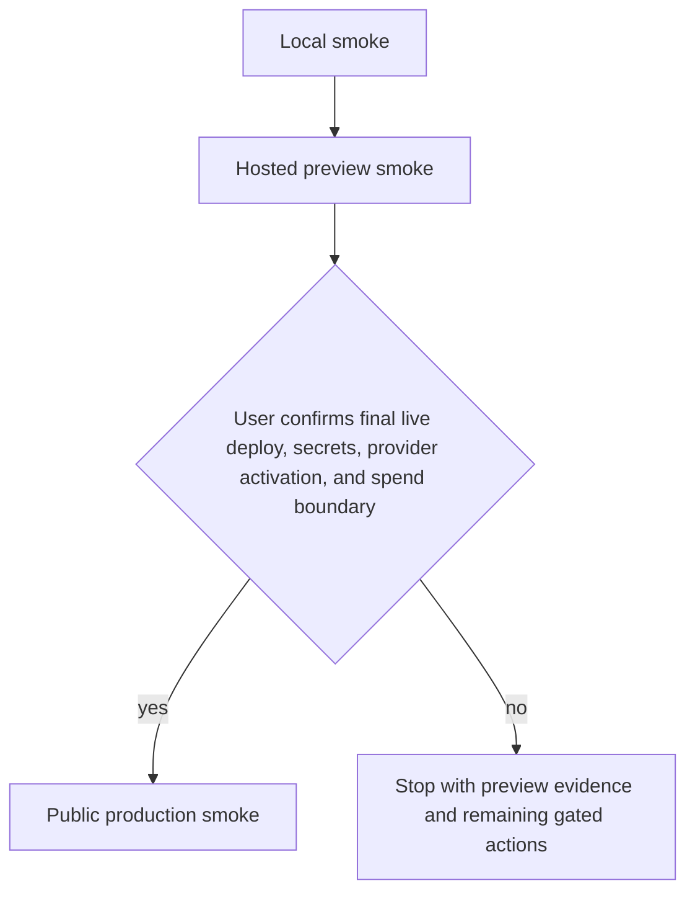

# Public demo deployment readiness runbook

This runbook is the backend-owned checklist for moving the product chat service
from local seeded proof to hosted preview proof and, only after explicit user
confirmation, public production smoke. It does not activate providers, spend
money, reveal secrets, or run a live deployment by itself.

## Release gate order



Rules:

1. Local smoke may use deterministic mode, the local dev outbox, and seeded data.
2. Hosted preview smoke must use HTTPS origins, persistent storage, migrations,
   and a real or preview-safe account verification path that does not expose
   `/auth/dev/outbox`.
3. Public production smoke must not run until the user explicitly confirms final
   live deploy, secret entry, provider activation, and any spend boundary.
4. Evidence must redact emails, cookies, tokens, API keys, document contents
   beyond short safe snippets, and provider dashboard identifiers.

## Provider and dependency decision record

Create one record per provider or dependency before implementation or activation.
Use this for email providers, hosting/database providers, deployment SDKs, UX
libraries, and reliability tooling.

```md
## YYYY-MM-DD - <provider/dependency name>

Status: proposed | approved | implemented | rejected | rollback
Purpose / UX or reliability benefit:
Integration surface:
Package/API choice:
Env vars / secrets needed:
Secret owner and storage location:
Free tier, quota, or cost ceiling:
User confirmation needed before spend or production activation: yes/no
Failure modes:
Fallback / rollback:
Offline or mocked test strategy:
Preview smoke evidence:
Production activation confirmation required: yes/no
Known limitations:
```

Minimum acceptance for an approved record:

- The provider solves a concrete visitor-account, deployment-reliability, or demo
  UX problem.
- Tests stay offline by default; provider calls are mocked or isolated from unit
  tests.
- Secrets are documented by name only and never committed.
- Cost and rollback are explicit enough for a public demo operator to stop the
  public surface safely.

## Deployment topology checklist

Fill this table with real values during preview setup. Keep URLs redacted in
public reports if they identify private previews.

Use the [generic container deployment path](./13-generic-container-deployment-path.md)
for the provider-neutral Docker image, start command, migration command, smoke
commands, and owner-gated boundaries before choosing a specific host or CI/CD
pipeline.

| Item | Local value | Preview value | Production value | Stop condition |
| --- | --- | --- | --- | --- |
| Frontend origin | `http://localhost:3000` | TBD HTTPS URL | user-confirmed public URL | URL recorded; frontend uses BFF or credentialed exact origin only. |
| Backend origin | `http://localhost:8000` or `http://127.0.0.1:8000` | TBD HTTPS URL | user-confirmed public API URL | `/health` and `/openapi.json` reachable. |
| Database | local SQLite | persistent preview DB | production DB | Alembic migration command documented and run. |
| Email/account provider | local outbox only | `MY_AGENTS_AUTH_EMAIL_MODE=smtp` with provider or preview-safe SMTP sandbox | SMTP provider enabled after user confirmation | Visitor account can verify without `/auth/dev/outbox`. |
| OpenAI runtime | deterministic or configured key | model and budget boundary recorded | model and budget boundary confirmed | Timeout, max output tokens, and failure behavior documented. |
| Logs/evidence | local terminal | host logs available | host logs available | Smoke can capture redacted status evidence. |
| Rollback | stop local server | disable signup, revoke preview env, or switch to seeded fallback | disable signup or rollback deployment | Operator has a documented stop path. |

## Auth/session matrix

| Environment | Frontend origin | Backend origin | Cookie Secure | SameSite | CORS | CSRF/session proof |
| --- | --- | --- | --- | --- | --- | --- |
| Local | `http://localhost:3000` | `http://localhost:8000` or `http://127.0.0.1:8000` | `false` for local HTTP only | `lax` | exact origin only | Login sets HttpOnly session; `/auth/me` restores; logout uses CSRF. |
| Preview | TBD HTTPS frontend | TBD HTTPS backend | `true` | `lax` unless topology requires `none` | exact preview origin only | Browser smoke with visitor account; no dev outbox. |
| Production | user-confirmed public frontend | user-confirmed public backend | `true` | `lax` unless topology requires `none` | exact production origin only | Full public smoke after final confirmation only. |

Do not use `SameSite=None` without `Secure=true`. Do not pair credentialed CORS
with wildcard origins.

## Public demo guardrails

Before preview smoke, document or implement each guardrail:

- Signup/login/reset abuse controls: current in-process limits are acceptable only
  for single-process demos and must be labeled as such.
- Signup-disable or fallback path: set `MY_AGENTS_AUTH_SIGNUP_ENABLED=false` to
  block new backend signups, document how to revoke provider credentials, and
  fall back to a seeded/invite-only demo if abuse or email deliverability fails.
- Provider-free guest access: if enabled, assert `MY_AGENTS_GUEST_ACCESS_ENABLED=true`
  intentionally and keep the backend-owned defaults or stricter values for 24-hour
  access, one conversation, five prompts, and three document creates/uploads.
- Upload limits: record accepted file types, size limits, and unsupported PDFs
  such as scanned, encrypted, unsupported encoded, huge, or non-text PDFs.
- Run and cost limits: record response mode, model, timeout, max output tokens,
  host/provider quotas, and any manual budget controls.
- Dev-only surfaces: assert `MY_AGENTS_AUTH_DEV_OUTBOX_ENABLED=false` for preview
  and production; do not expose `/auth/dev/outbox` through public frontend flows.
- Production startup guard: set `MY_AGENTS_DEPLOYMENT_ENVIRONMENT=production`;
  settings validation rejects `MY_AGENTS_AUTH_DEV_OUTBOX_ENABLED=true` and rejects
  local email delivery in that environment.
- Event and citation safety: public UI may display only redacted operational
  events and display-safe citation snippets.

## Implemented auth email provider boundary

The backend now supports a generic SMTP sender without adding a provider-specific
dependency. Use it for preview/public visitor account verification and password reset:

```bash
MY_AGENTS_DEPLOYMENT_ENVIRONMENT=preview
MY_AGENTS_AUTH_EMAIL_MODE=smtp
MY_AGENTS_AUTH_PUBLIC_APP_BASE_URL=https://<frontend-preview>
MY_AGENTS_AUTH_SMTP_HOST=<smtp-host>
MY_AGENTS_AUTH_SMTP_PORT=587
MY_AGENTS_AUTH_SMTP_USERNAME=<secret-name-only>
MY_AGENTS_AUTH_SMTP_PASSWORD=<secret-manager-value>
MY_AGENTS_AUTH_SMTP_FROM_EMAIL=<verified-sender>
MY_AGENTS_AUTH_SMTP_USE_STARTTLS=true
```

The code path is intentionally provider-neutral (`smtplib`) so the deployment
decision can choose Resend SMTP, SES SMTP, Mailgun SMTP, or another SMTP relay
without changing application code. Unit tests use a fake SMTP client; they do not
make network calls or require real credentials.

## Data and privacy boundary

Public visitor copy and the runbook must state:

- The app is a public demo, not a private document vault.
- Visitors must not upload secrets, credentials, medical/legal/financial records,
  confidential work documents, or sensitive personal documents.
- Emails, uploaded documents, conversations, citations, and events may be retained
  as demo data until manual cleanup.
- If account deletion/export is not implemented, disclose that limitation and
  document an operator cleanup path.
- Smoke screenshots and logs must redact emails, cookies, tokens, API keys,
  provider IDs, and document content except for intentionally safe snippets.

## Evidence bundle schema

Create one evidence bundle per gate: local, preview, and production.

```md
# Evidence bundle - <local|preview|production> - YYYY-MM-DD HH:MM TZ

Backend commit:
Frontend commit:
Backend origin:
Frontend origin:
Database/migration state:
Email/account provider mode:
OpenAI/runtime mode:

## Commands

- Backend tests:
- Backend lint/format:
- Frontend lint/typecheck/tests/build:
- Browser/e2e smoke:

## Smoke account

- Alias or redacted ID:
- Verification path:
- Confirmation that `/auth/dev/outbox` was not used for preview/production:

## Product flow results

- Health:
- Signup/verification/login/session restore:
- Upload or document create:
- Ingest/extraction evidence:
- Streamed run and answer delta/completion:
- Persisted run detail/citations:
- Redacted events:
- Refresh/reopen persistence:
- Browser storage secret check:

## Provider/dependency records

- <link or pasted redacted record>

## Known limitations

- <limitation and owner>

## Remaining gated actions

- <final live deploy, secrets, spend, provider activation, or production smoke confirmation>
```

## Backend verification commands

Run these before claiming backend readiness, unless the current task is docs-only
and code lanes are still in progress:

```bash
uv run pytest -q
uv run ruff check . --no-cache
uv run ruff format --check .
```

Optional preview API smoke, once a preview base URL exists:

```bash
uv run python -m scripts.local_demo_smoke --base-url https://<preview-backend> --timeout 120
```

If a hosted smoke requires provider credentials or production secrets, stop and
record it as user-gated instead of fabricating evidence.
