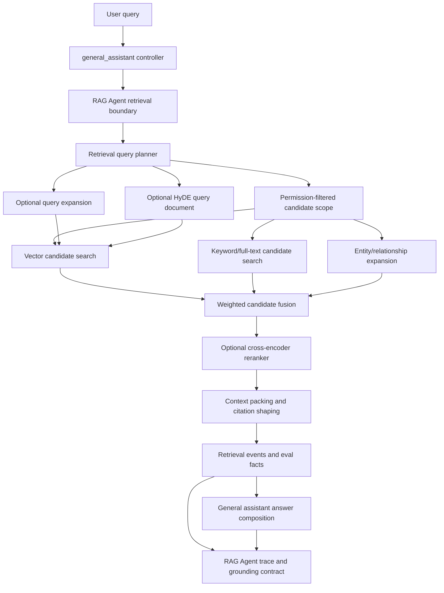

# Retrieval agent hybrid reference

This document is the backend-owned reference for the retrieval-agent track. It intentionally keeps the design local to this repository so roadmap and implementation notes do not depend on files from other workspaces. Current production status: `rag_agent` owns the assistant-facing retrieval boundary and exposes the runtime that `general_assistant` calls from inside its graph. ContextForge remains the delegated permission-first retrieval engine behind that boundary and exposes a thin LangGraph RetrievalGraph wrapper over the service. The deeper tool-using retrieval graph described here remains a future expansion of the RAG Agent/ContextForge seam, not a replacement for the permission-first service boundary.

## Goal

The retrieval agent track should keep document search quality out of answer composition while still letting the general assistant decide when to retrieve. `general_assistant` calls the RAG Agent runtime; ContextForge takes the query plus authorization context behind that boundary, produces trustworthy cited chunks, and exposes retrieval evidence. Future work can promote more retrieval planning into RAG Agent graph/tool nodes when evals justify the added orchestration.

## Target pipeline



## Current graph interface

Current conversation runs pass a runtime RAG dependency into `general_assistant`:

```python
graph_context = graph_context_for_run(
    db=db,
    user_id=user_id,
    selection_context=selection_context,
)
# graph_context contains SqlAlchemyRagAgentRuntime(db)
```

Inside the graph, `retrieve_rag_context` calls `rag_runtime.retrieve_context(...)`, which returns a `RagAgentRetrievalResult`. The default SQLAlchemy runtime delegates to `invoke_context_forge_graph(...)` and carries back the underlying `ContextForgeResult`, bounded `retrieval_attempt_count`, and `insufficient_evidence` flag. The RAG Agent boundary does not own raw SQL, ingestion, final-answer composition, citations, conversation persistence, or provider secrets; hard authorization remains in ContextForge/RetrievalService.

## Future interface sketch

```python
@dataclass(frozen=True)
class RetrievalAgentRequest:
    user_id: str
    conversation_id: str
    query: str
    rewritten_query: str
    limit: int = 5


@dataclass(frozen=True)
class RetrievalCandidate:
    chunk_id: str
    document_id: str
    text: str
    sources: tuple[str, ...]  # vector, fulltext, graph_expansion, hyde
    candidate_score: float
    rerank_score: float | None = None


class RetrievalAgent:
    def retrieve(self, request: RetrievalAgentRequest) -> list[RetrievalCandidate]:
        """Return permission-safe, ranked retrieval candidates for answer context."""
```

The current backend can grow toward this interface incrementally from `rag_agent.retrieval.RagAgentRuntime`, which delegates to `invoke_context_forge_graph(...)` today. The authorization filter remains
non-negotiable: every candidate generation path must start from chunks the
principal is allowed to read.

## Candidate generation stages

### 1. Vector search

- Embed the query or planned query.
- Search only authorized chunks.
- In local/offline mode, JSON-backed cosine ranking is acceptable.
- In production Postgres, pgvector should accelerate first-stage candidate retrieval.
- pgvector is not the final relevance judge; it is a fast candidate generator.

### 2. Keyword/full-text search

- Use lexical search for exact names, acronyms, quoted phrases, and Korean/English terms that embedding search may underweight.
- Combine with vector results through weighted fusion.
- Keep weights configurable later, but start with simple defaults.

### 3. Graph/entity expansion

- Use entity mentions and co-occurrence relationships to add adjacent authorized chunks.
- Treat expansion as recall support, not proof of final relevance.
- Expanded chunks should normally rank below strong vector/full-text matches unless reranking promotes them.

### 4. Cross-encoder reranking

- Rerank only a small top-k candidate set, for example 10-30 chunks.
- Score `(query, chunk_text)` pairs after permission filtering.
- Keep reranking behind a provider/interface flag so tests stay offline and local setup does not require model downloads.
- Persist or emit aggregate reranking metadata, not raw hidden reasoning.

### 5. Query expansion

- Generate synonyms and related concepts while preserving the user's original intent.
- Use expansion to improve candidate recall, not to broaden the task beyond the user's request.
- Track whether expanded terms changed the result set for eval/debugging.

### 6. HyDE

- For broad conceptual questions where direct hybrid search under-recovers, generate a short hypothetical answer/document and embed that for vector candidate search.
- Use HyDE as a fallback or optional branch, not as the default for every query.
- Keep generated hypothetical text out of citations; citations must point to real authorized chunks.

## Candidate fusion sketch

```python
combined_score = (
    vector_weight * normalized_vector_score
    + fulltext_weight * normalized_fulltext_score
    + graph_weight * graph_expansion_bonus
    + hyde_weight * normalized_hyde_score
)
```

Initial recommended defaults:

- vector: `0.55`
- full-text: `0.30`
- graph expansion: `0.10`
- HyDE: `0.05`, only when enabled for the query

These are starting points for evals, not product truths.

## Evaluation target

The retrieval-agent track should add small fixture evals before tuning weights:

- recall: did the expected supporting chunk appear in the candidate set?
- precision: how many returned chunks are actually relevant?
- leakage: did unauthorized documents stay out of candidates, reranker inputs, events, and citations?
- stability: do deterministic fixtures keep the same ranking across test runs?
- latency budget: candidate generation and reranking stay within a documented demo threshold.

## Near-term implementation mapping

Current completed slices should remain a foundation, not the final architecture:

1. Add embedding provider boundary.
2. Add real OpenAI embedding mode while keeping deterministic offline mode.
3. Rank authorized chunks by JSON-backed cosine similarity.
4. Add pgvector storage/search on Postgres while keeping JSON/SQLite fallback.
5. Keep event/source names truthful.
6. Add a RAG Agent runtime boundary over the thin ContextForge RetrievalGraph wrapper so future agents can call the
   same permission-first retrieval path as a typed subgraph/tool.
7. Leave deeper role-node retrieval planning, full-text fusion, ANN/vector index
   tuning, query expansion, HyDE, and broader eval-driven orchestration as
   explicit follow-up seams.
