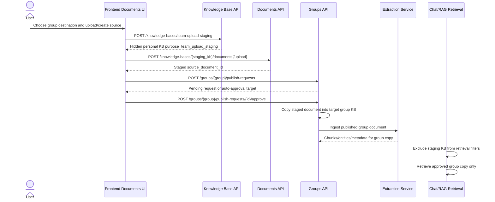
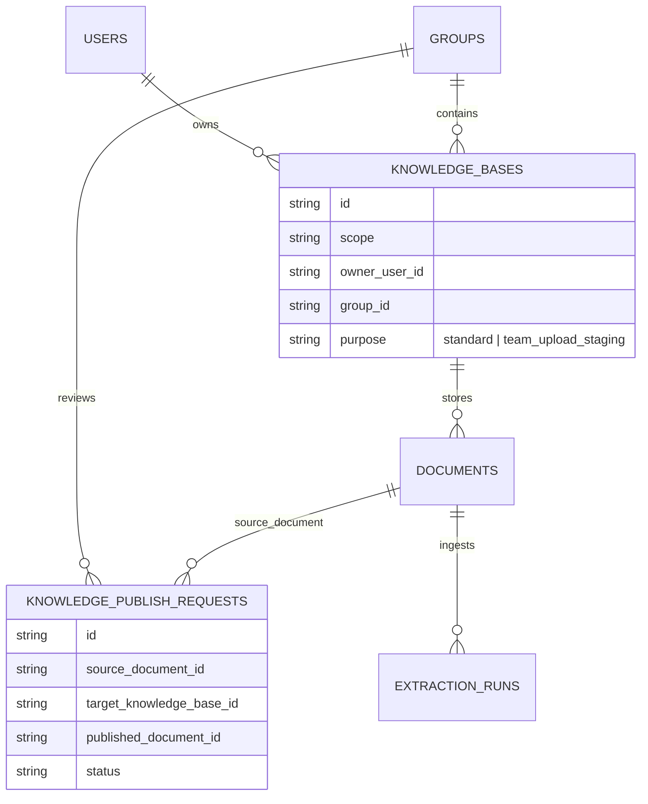

# Group upload staging flow

This note records the architectural decision for group document uploads. It is written for both people and AI agents so future work does not accidentally re-introduce duplicate retrieval sources.

## Decision

Group uploads use a hidden, personal `team_upload_staging` knowledge base as a private source buffer. The staging KB accepts text/file document writes by direct ID, but it is excluded from normal knowledge-base lists, chat source selection, and RAG retrieval. When the publish request is approved, the backend copies the staged document into the target group knowledge base and ingests that group copy. The group copy is the retrievable source of record.

## Why this exists

Uploading directly into a group KB would skip the approval boundary. Uploading into a normal personal KB and then copying to a group KB would let the uploader retrieve both the private source and the group copy, which creates duplicate citations and confusing RAG behavior. Hidden staging preserves the review flow without making the staging source part of Ask retrieval.

## Service flow

## Persistence shape

## Invariants

- `purpose=team_upload_staging` is personal-only, owner-scoped, and hidden from `GET /knowledge-bases`.
- Staging KBs are writable by direct ID through KB-scoped document create/upload paths.
- Chat selected-mode rejects staging KB IDs.
- Chat all-mode and retrieval filters count/select only `purpose=standard` KBs.
- Whole-KB publish requests require a standard personal KB; only document-copy publish requests may use a staged source document.
- Group approval copies the source document to the target group KB and ingests the group copy.
- The staging document may remain as a private audit/source buffer, but it must not be cited by Ask retrieval.
- Requesters may cancel pending publish requests as `cancelled` and submit a new request later.
- Deleting the staged source before approval withdraws the pending publish request while preserving its source snapshot. Deleting it after approval does not remove the group copy. Deleting the approved group copy clears `published_document_id` on the historical request instead of crashing on a foreign key.

## Code map

- `my_agents/knowledge/models.py`: `KnowledgeBasePurpose` and `KnowledgeBaseModel.purpose`.
- `my_agents/api/knowledge_bases.py`: `POST /knowledge-bases/team-upload-staging` and hidden list behavior.
- `my_agents/knowledge/auth.py`: retrieval/selectability filters and chat selection rejection.
- `my_agents/knowledge/retrieval.py`: RAG scope filters require standard KB purpose.
- `my_agents/api/groups.py`: publish approval copies staged documents into group KBs; whole-KB publish is standard-only.
- `alembic/versions/20260607_0017_knowledge_base_purpose.py`: production schema migration.
- `tests/test_kb_nested_document_routes.py`: regression coverage for hidden staging, retrieval exclusion, and publishability.
