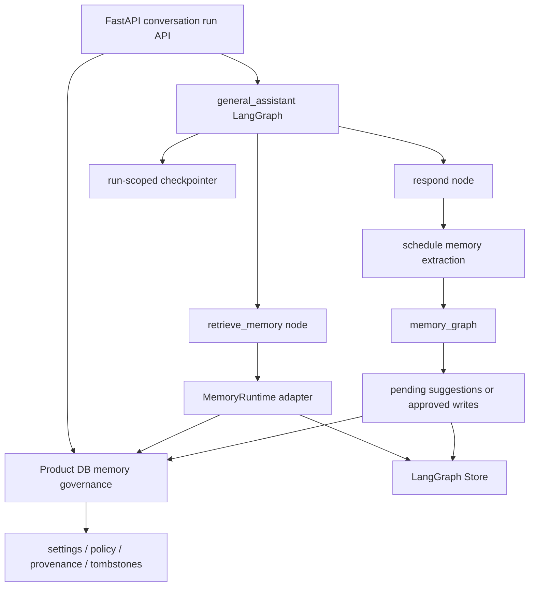

# LangGraph-native memory migration note

Status: Store/checkpointer runtime implemented behind opt-in flags; memory graph remains planned

Created: 2026-06-10

Updated: 2026-08-24

This note documents the memory architecture decision after reviewing the current
`my-agents` implementation against the LangChain `memory-template` pattern.

## Decision summary

The current memory implementation is a safe V1 governance layer, but it should not
remain the final runtime architecture. Because this project is meant to be based on
LangGraph, long-term memory recall and extraction should move closer to LangGraph
native primitives over time.

The target split is:

| Concern | Long-term owner | Rationale |
| --- | --- | --- |
| Visible conversations, final assistant messages, citations, run events | Product DB | These are product/audit records and frontend source of truth. |
| Consent, settings, delete/deactivate, provenance, stale-source policy | Product DB governance layer | These are user-control, compliance, and product-safety rules. |
| Active memory storage/search runtime | LangGraph Store or a compatible adapter | This keeps the memory runtime aligned with LangGraph patterns. |
| Memory extraction/update workflow | Separate LangGraph `memory_graph` | This avoids putting memory formation on the hot answer path. |
| HITL/resume/interruption state | Run-scoped LangGraph checkpointer | Checkpointer is execution state, not conversation transcript or long-term memory. |

In short:

```text
Product DB = product truth + memory governance ledger
LangGraph Store = long-term memory runtime
LangGraph memory_graph = extraction/update workflow
LangGraph checkpointer = run-scoped execution/HITL state
```

Implementation update on 2026-08-17: `general_assistant` has graph-owned memory recall,
a PostgresStore semantic projection that is always revalidated against Product DB
governance, and a run-scoped PostgresSaver for document-selection interrupts. Both
persistence surfaces remain disabled by default until setup/reconciliation succeeds.
The separate extraction/update `memory_graph` remains a future phase.

## Why this migration exists

The merged V1 stored memory records in SQLAlchemy tables, filtered them in the
service layer, and injected `memory_context` into the general assistant graph. That
was intentionally conservative: opt-in is explicit, suggestions are confirm/reject,
content is scrubbed on deletion/decision, and transcript/document source deletion
marks affected memories stale.

The first migration slice has moved recall orchestration into the graph while keeping
that Product DB governance. The graph now calls a runtime adapter instead of receiving
fully preassembled memory context from FastAPI.

However, if left as-is, the project drifts away from a LangGraph-native agent
architecture:

- the FastAPI/service layer becomes the memory runtime;
- memory retrieval happens before graph invocation instead of as a graph node;
- memory extraction is not a separate debounced/background graph;
- recall uses deterministic token relevance rather than Store-backed semantic search;
- memory schemas are fixed product categories rather than configurable memory types.

That is acceptable for the first safe milestone, but not the intended endpoint.

## Reference pattern from `langchain-ai/memory-template`

Reference: [`langchain-ai/memory-template`](https://github.com/langchain-ai/memory-template).

The template separates the chat graph from the memory graph:

1. The chatbot graph answers the user and searches user memory through the LangGraph
   store.
2. A scheduled/debounced memory run is enqueued after the chat turn.
3. The memory graph extracts or updates configured memory types.
4. Memory schemas support patch-style profile documents and insert-style event notes.

`my-agents` should adopt this shape gradually, but not copy it blindly. This product
also needs explicit consent, provenance, source invalidation, and user-facing review
APIs that the template does not fully model.

## Current V1 behavior to preserve

The following V1 behavior is intentional and should survive the migration:

- memory is disabled by default per user;
- user can review, deactivate, delete, confirm, or reject memory records/suggestions;
- public API writes cannot assert arbitrary provenance, value payloads, or TTLs;
- sensitive memory candidates are rejected by deterministic policy gates;
- deleted memory content/value is scrubbed into a minimal tombstone;
- confirmed/rejected/expired suggestions scrub proposed content;
- document-derived memories require `source_document_id` and become stale when the
  source document is deleted;
- conversation replay/delete stales transcript-sourced memories before source rows
  disappear;
- provider prompts treat memory and document snippets as untrusted context, not
  instructions;
- recent conversation wins over conflicting stored memory, and authorized documents
  win for document-grounded claims;
- completed/failed runs can store internal redacted memory-source audit snapshots, while
  frontend-visible run events expose only memory counts/categories/provenance types.

These are governance/product guarantees, not implementation details.

## Target architecture



Key direction changes:

- `general_assistant` should eventually retrieve memory inside the graph, not receive
  a fully preassembled `memory_context` from FastAPI.
- A separate `memory_graph` should extract candidate memories after a turn, preferably
  with debounce/background execution.
- The first memory-graph milestone should create pending suggestions, not silently
  activate memories.
- Approved/explicit memories should be written to LangGraph Store and mirrored into
  the Product DB governance ledger.
- Checkpointer should be introduced only for run-scoped execution state and HITL
  resume, not as a conversation-history or long-term-memory store.

## Migration phases

### Phase 0 — Current V1 governance layer

Already merged:

- SQLAlchemy models for settings, memories, suggestions, lifecycle metadata, source
  IDs, and stale/delete state.
- API routes for settings, memory CRUD, and suggestion confirm/reject.
- Initial service-layer recall and conflict detection, now superseded by the Phase 2
  graph-owned recall node while keeping the same governance filters.
- Redacted run snapshots.
- Source invalidation for document deletion and transcript replay/delete.

Known limitation: this is product-owned runtime memory, not LangGraph-native runtime
memory.

### Phase 1 — Introduce a memory runtime boundary

Started. A small interface now exists around recall operations before changing
persistence:

```python
class MemoryRuntime(Protocol):
    def search(self, *, user_id: str, query: str, limit: int) -> list[MemoryItem]: ...
```

The initial adapter wraps the existing Product DB tables through `UserMemoryService`.
The important part is to stop spreading direct table/service assumptions across graph
and API code. Write/delete runtime methods should be added when `memory_graph` or
Store-backed writes are introduced.

### Phase 2 — Move recall into the graph

Started. The chat graph now has a recall node before response generation:

```text
classify_request -> retrieve_memory -> respond_general/respond_research
```

The node receives `user_id` and a `MemoryRuntime` through LangGraph runtime context,
uses the latest user text from graph state, calls `MemoryRuntime.search`, and outputs
compact `memory_context` plus `source_conflicts`.

This makes memory a graph capability instead of a pre-graph FastAPI preprocessing step.

### Phase 3 — Add `memory_graph` for extraction

Create `my_agents/agents/memory_graph/` as a separate LangGraph workflow inspired by
`memory-template`:

- input: recent conversation/run context and authorized source metadata;
- output: candidate memory suggestions;
- default behavior: suggest-confirm, not auto-activate;
- deterministic policy gates still run before persistence;
- memory candidates keep source conversation/message/run/document provenance.

This can run synchronously in deterministic tests, then move to background/debounced
execution once the worker path exists.

### Phase 4 — Store active memory in LangGraph Store

Move active memory runtime storage/search to LangGraph Store or a compatible adapter.
The Product DB should retain governance metadata and either:

1. mirror store namespace/key plus status/provenance/stale/delete state; or
2. act as an authorization/provenance index that filters Store results before prompt use.

Prefer a namespace shape close to LangGraph examples, such as:

```text
("memories", user_id, memory_type)
```

If we keep the existing SQL namespace shape during transition, document the mapping
explicitly and migrate only when Store-backed search is active.

### Phase 5 — Add run-scoped checkpointer for HITL/resume

Implemented behind `MY_AGENTS_CHECKPOINTER_ENABLED`. The assistant workflow uses
`run_id` as the thread boundary, checkpoints only a bounded six-message window plus
primitive retrieval/interaction snapshots, and deletes terminal-run checkpoints.
Ambiguous document requests can pause as `waiting_for_input`, expose an authorized
document selection, and resume the same run after revalidating current permission.
The public waiting/resume payload follows the versioned semantic contract in
[Agent-to-frontend interaction contract](./27-agent-frontend-interaction-contract.md).

The opt-in comprehensive-document path extends this same run-scoped boundary without
turning checkpoints into a document cache. `general-assistant-checkpoint-v2` checkpoints
the resolved `selected_document_id`, compact `document_coverage`, citation/chunk IDs, and
the private internal next cursor. It never checkpoints the normalized document body. The
response node revalidates authorization and re-reads the bounded range at composition time,
then disables LangSmith tracing around the provider call that receives the body.

If target resolution is ambiguous, this path reuses the existing versioned
`document_selection` interrupt rather than creating a full-document-specific interaction.
Resume returns to target resolution, rechecks current authorization, and continues the
same run. Terminal execution still deletes the run-scoped checkpoint; completed Product DB
events retain only refresh-safe coverage metadata.

## Non-goals

- Do not turn LangGraph checkpointer into the conversation-history store.
- Do not let LangGraph Store bypass user opt-in, delete/deactivate, or source-staleness
  policy.
- Do not silently auto-store memories from chat without user review until a separate
  product decision changes the consent model.
- Do not remove Product DB run/citation/event/source-snapshot records just because
  Store/checkpointer is introduced.
- Do not store full normalized document text in checkpoint state merely to support
  comprehensive answers; re-read authorized bounded content at the response boundary.

## Documentation conflicts resolved by this note

- Older wording that suggested LangGraph checkpointers should be the app-owned source
  of truth for conversation memory is obsolete. Checkpointers are execution-state
  artifacts for run resume/HITL.
- Current Product DB memory tables are V1 governance/runtime scaffolding, not the final
  LangGraph-native memory runtime.
- Future docs should describe Product DB and LangGraph Store as complementary, not
  competing, persistence layers.
