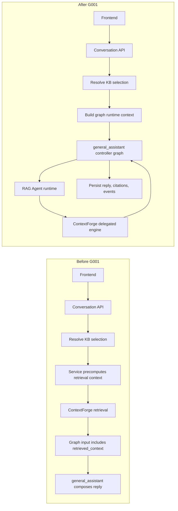
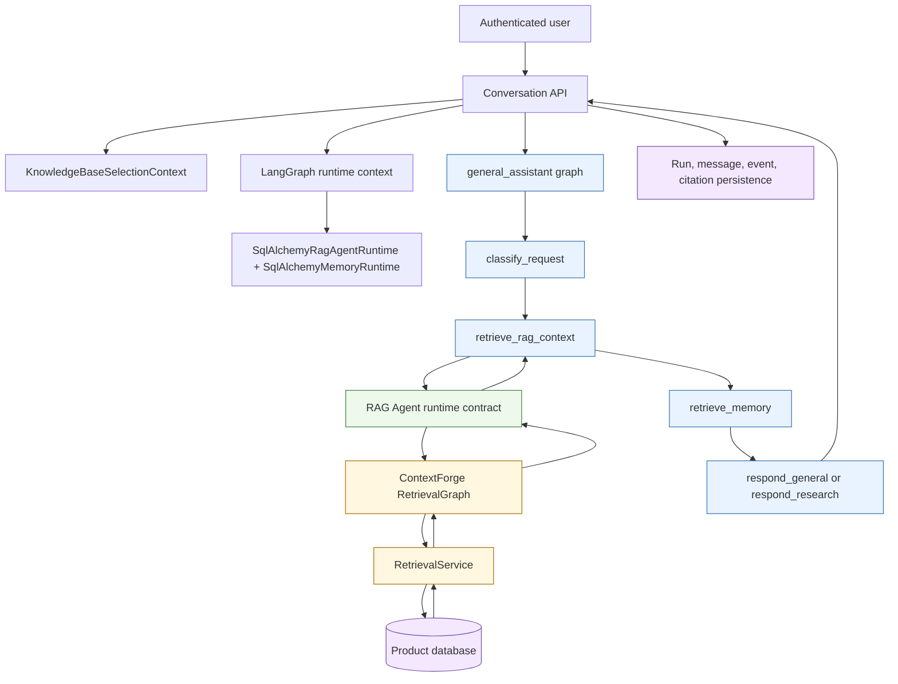
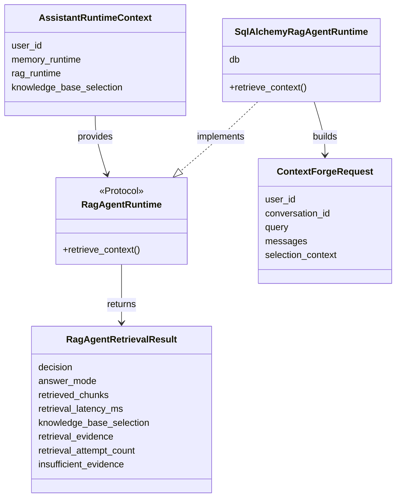
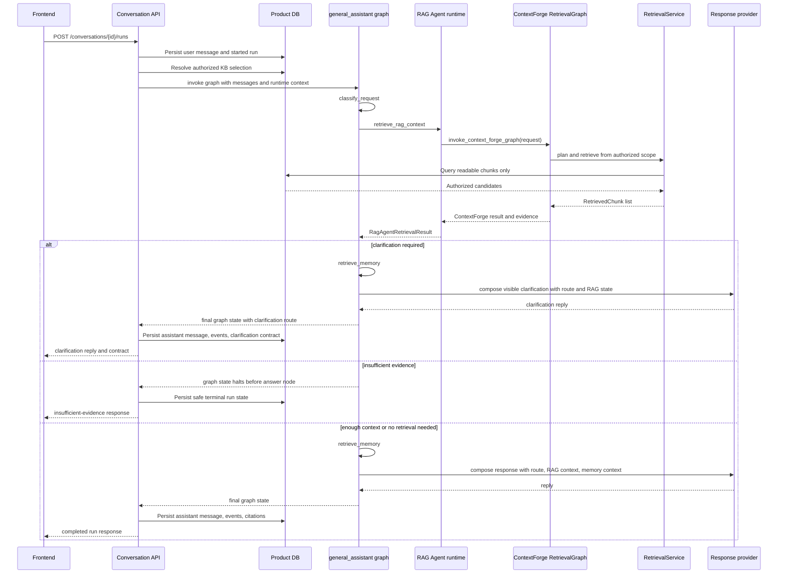
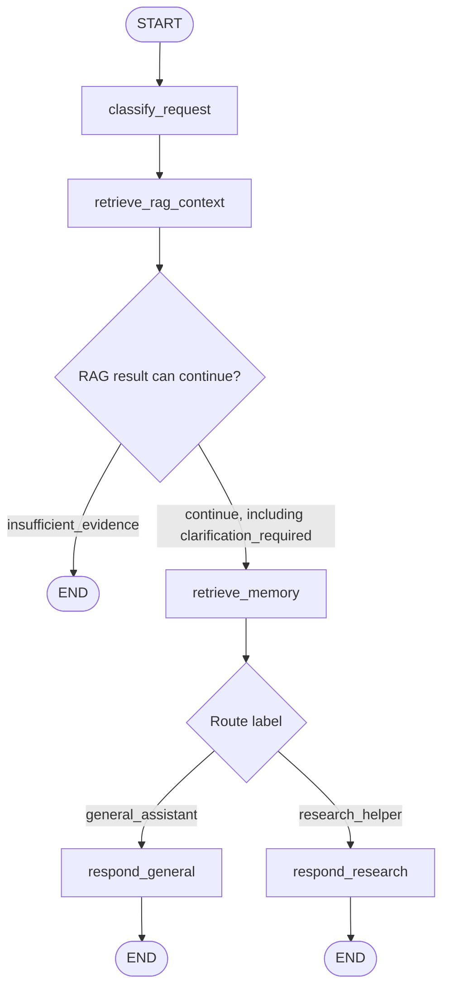
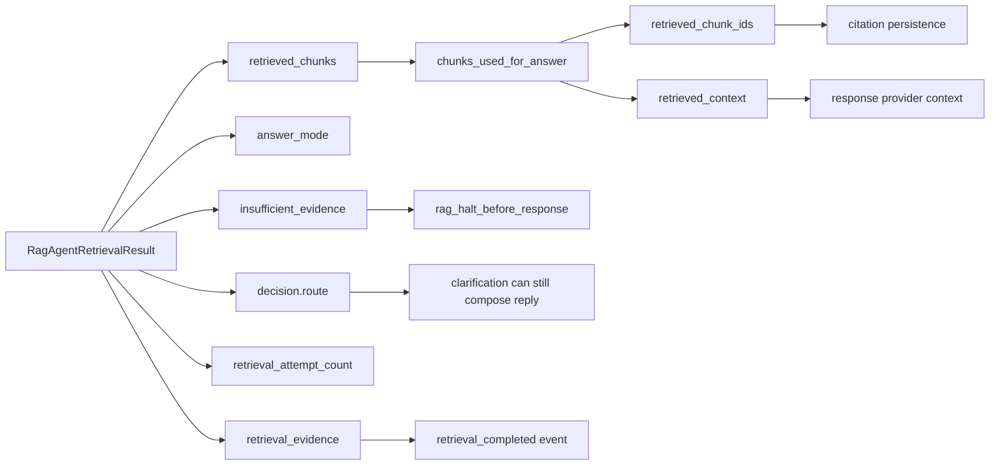
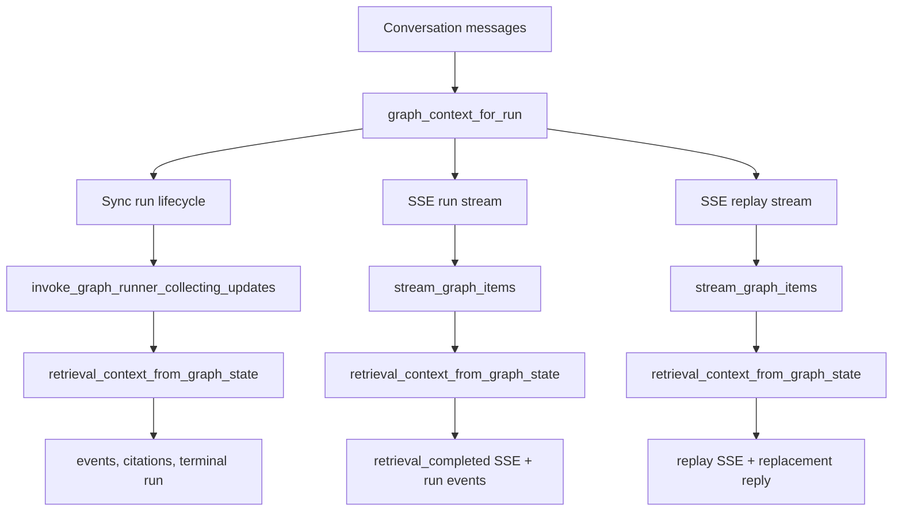
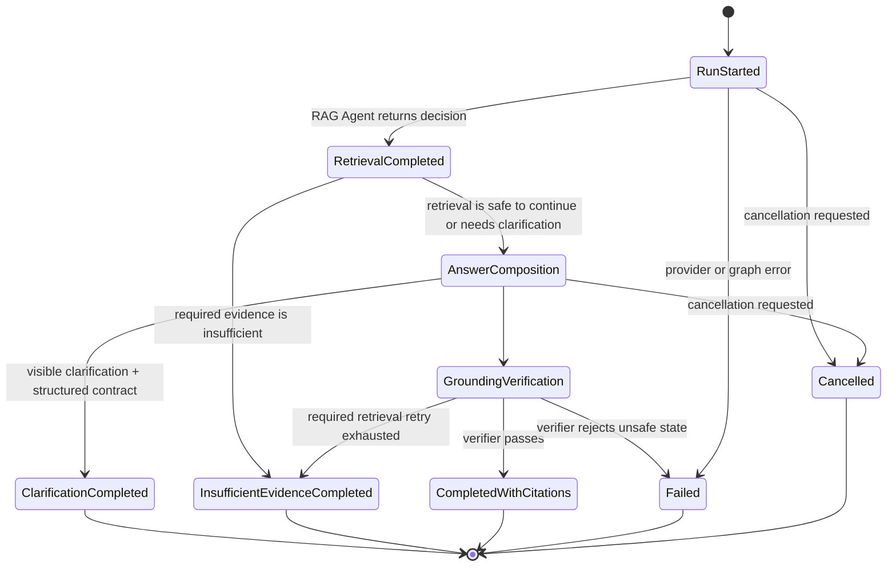
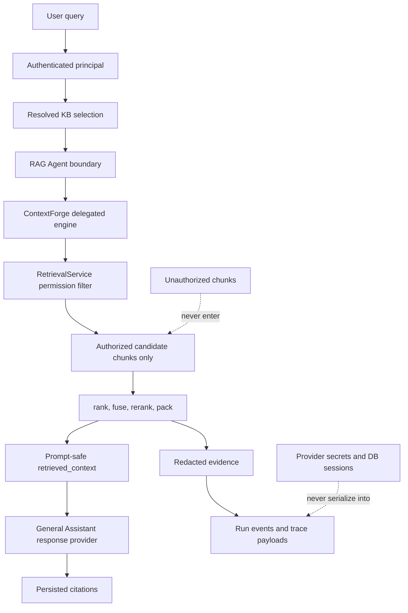
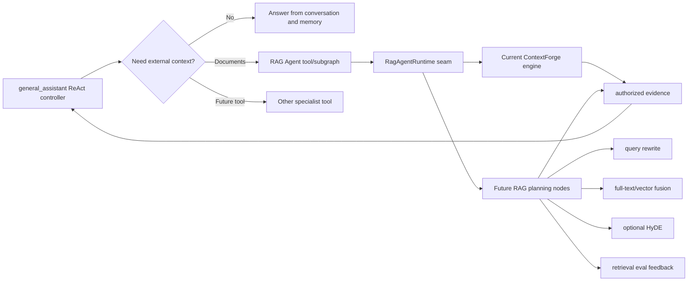

# General Assistant and RAG Agent architecture change report

Date: 2026-06-16

Status: implemented in the `codex/g001-general-assistant-rag-agent` PR branch

Primary implementation commit: `0e11f35` (`Let the assistant own RAG retrieval decisions`)

This report explains the G001 architecture correction: the General Assistant is now the
product conversation controller, and the RAG Agent is the assistant-invoked retrieval
specialist boundary. ContextForge still exists, but it is now deliberately framed as the
internal permission-first retrieval engine behind the public RAG Agent runtime.

The practical result is that product conversation runs no longer precompute document
retrieval in the API service and pass it into the assistant graph. Instead, the API
constructs runtime-only dependencies, invokes the General Assistant graph, and the graph
itself decides the retrieval point by calling the RAG Agent before memory recall and
answer composition.

## 1. Architecture goal

The owner goal was not to delete ContextForge immediately. The goal was to fix the public
agent boundary:

- **General Assistant** should be the top-level ReAct-style controller for the user turn.
- **RAG Agent** should be a callable specialist tool/subgraph boundary for document-grounded
  retrieval.
- **ContextForge** should remain an internal delegated implementation until there is enough
  reason to split or replace it.
- Conversation APIs should stop making retrieval decisions as a pre-graph service-layer
  side effect.
- Existing safety properties must stay intact: authorization-first retrieval, citation
  persistence, insufficient-evidence fallback, clarification contracts, redacted events,
  streaming parity, deterministic tests, and no frontend contract break.

In short: the product should read as `General Assistant -> RAG Agent -> ContextForge`, not
`API -> ContextForge -> General Assistant`.

## 2. Before and after

Before this change, product runs prepared retrieval context before graph invocation. That
made the graph look like a reply writer receiving already-retrieved documents instead of a
controller that can choose whether to call retrieval.



The after shape is intentionally conservative: the RAG Agent boundary is now real and
callable from the graph, while ContextForge continues to do the low-level retrieval work
that was already tested.

## 3. New component responsibilities



| Layer | Owns now | Does not own |
| --- | --- | --- |
| Conversation API | Authentication, conversation/run creation, KB selection resolution, runtime dependency construction, persistence, SSE response framing | Retrieval decision logic, prompt-visible document context construction |
| General Assistant | Top-level graph control flow, route classification, RAG Agent invocation, memory recall ordering, answer node selection | Raw SQL retrieval, authorization rules, citation row creation |
| RAG Agent | Public retrieval specialist runtime seam, `RagAgentRetrievalResult`, answer-ready retrieved context shaping, insufficient-evidence flags | Final answer prose, raw provider secrets, unauthenticated KB access |
| ContextForge | Delegated permission-first retrieval implementation, query planning, candidate search/fusion/reranking, evidence capture | Public assistant identity, final answer composition |
| RetrievalService | Hard authorization and data retrieval over product storage | Agent orchestration or prompt policy |

## 4. Main files changed and why

| File or area | What changed | Why it matters |
| --- | --- | --- |
| `my_agents/agents/general_assistant/graph.py` | Added a retrieval-enabled product graph and a separate no-KB legacy graph. Product graph order is now `classify_request -> retrieve_rag_context -> retrieve_memory -> respond_*`. | Makes General Assistant the graph owner of retrieval timing while preserving legacy smoke paths without KB access. |
| `my_agents/agents/general_assistant/rag_retrieval.py` | Added the graph node that calls the RAG Agent runtime from LangGraph runtime context and maps the result into assistant state. | Keeps retrieval inside the graph without serializing DB sessions or adapter objects into checkpointable state. |
| `my_agents/agents/rag_agent/retrieval.py` | Added `RagAgentRuntime`, `SqlAlchemyRagAgentRuntime`, and `RagAgentRetrievalResult`. | Creates the public specialist seam that future General Assistant tool logic can call. |
| `my_agents/api/conversations/graph_invocation.py` | `graph_context_for_run(...)` now builds both memory and RAG runtime dependencies. | Moves runtime-only DB-backed dependencies out of graph input and into LangGraph context. |
| `my_agents/api/conversations/retrieval_context.py` | Removed pre-graph retrieval preparation helpers and replaced them with graph-state adapters. | Makes graph output, not API prework, the source of retrieval truth. |
| Sync, stream, and replay run paths | Invoke the graph with runtime context and read `rag_retrieval_result` from graph updates/final state. | Preserves behavior across all conversation modes and avoids a sync-only architecture. |
| `my_agents/api/assistant.py` and `my_agents/cli.py` | Use `build_legacy_chat_graph()` for legacy unauthenticated chat. | Prevents `/assistant/chat` and CLI smoke paths from accidentally needing KB runtime context. |
| Agent READMEs and product docs | Updated terminology: RAG Agent is public retrieval boundary; ContextForge is delegated engine. | Aligns implementation, docs, and owner intent. |
| Tests and spies | Added graph/RAG runtime spy helpers and assertions that old precompute helpers are gone. | Locks the architectural boundary, not only happy-path replies. |

## 5. Runtime context instead of graph input precomputation

The implementation deliberately uses LangGraph runtime context for non-checkpointed
services. Graph input remains small and serializable: messages, principal IDs, conversation
IDs, and default state fields. Runtime context carries DB-backed adapters.



This matters because graph state may be streamed, logged, merged, tested, or eventually
checkpointed. A SQLAlchemy session and DB-backed runtime object should not live in that
state. The runtime context approach gives the graph control over when to call retrieval
without making runtime dependencies part of durable state.

## 6. Product conversation sequence



The sequence shows the important inversion: the API does not call ContextForge first. It
only prepares the authorized selection and dependency context. The graph call owns the
RAG Agent invocation.

## 7. Graph control flow



There are two graph variants:

1. `build_graph()` - product conversation graph with RAG Agent retrieval. Conversation
   services must invoke this graph with `graph_context_for_run(...)`.
2. `build_legacy_chat_graph()` - no-KB legacy graph for `/assistant/chat` and CLI smoke
   checks. This protects unauthenticated/dev paths from accidentally gaining document
   retrieval access.

The product graph intentionally runs RAG before memory recall. That ordering keeps
document-grounded evidence and answer mode available before the response provider is
called, while preserving the existing memory recall node as another graph-owned context
source.

## 8. Result and state mapping

The RAG Agent returns one product-facing retrieval result object. The General Assistant
node converts that object into assistant state fields used by downstream nodes and API
persistence.



The adapter layer in `my_agents/api/conversations/retrieval_context.py` now reads this
object from graph state and adapts it to the existing conversation service shape. That
keeps existing persistence code reusable while changing the authority source from
pre-graph service work to graph-owned RAG Agent output.

## 9. Sync, streaming, and replay parity

The change was made across all run paths, not only the normal synchronous endpoint.



Streaming required extra care because graph updates can arrive before final result state.
The stream adapter now forwards update fields such as `rag_retrieval_result`,
`rag_halt_before_response`, `retrieval_route`, `answer_mode`, and `document_scope`. That
lets SSE emit `retrieval_completed` as soon as the retrieval node has produced evidence,
while still waiting for answer deltas only when the graph continues to a response node.

## 10. Halt and completion states



The halt states are part of the safety story:

- `clarification_required` returns visible assistant text plus a structured clarification
  contract, so the product UI is not left with a successful empty reply.
- `insufficient_evidence` persists a safe no-evidence answer and no citations.
- Required retrieval still goes through RAG Agent grounding verification before a cited
  reply is accepted.

## 11. Trust and privacy boundaries



The permission boundary did not move into prompts. It remains in deterministic service
code. The graph calls the RAG Agent, the RAG Agent delegates to ContextForge, and
ContextForge still relies on RetrievalService for hard authorization before ranking,
expansion, reranking, packing, events, or citations can happen.

This is why the change is architectural but not a security relaxation. The public
assistant-facing name changed, and the control point moved into the graph, but the data
access rule stayed the same: never retrieve globally and filter later.

## 12. Frontend and API contract impact

No frontend implementation was needed for this change. The backend still emits the same
product-level concepts the frontend already understands:

- run started;
- user message stored;
- retrieval completed;
- graph invoked;
- answer deltas for streaming runs;
- answer composed;
- run completed or failed;
- citations, snippets, source metadata, route metadata, answer mode, warnings, and
  clarification/insufficient-evidence flags.

The important API-visible behavior is continuity. The internal source of retrieval context
changed from precomputed graph input to graph-produced RAG Agent state, but the persisted
run/event/citation contract remained stable.

## 13. Why ContextForge was kept

The original idea for a RAG Agent was to replace ContextForge. During implementation, the
more manageable path was to keep ContextForge as the delegated engine and move the public
boundary above it.

That choice avoided unnecessary churn because ContextForge already owned tested behavior:

- deterministic route planning;
- authorized source-boundary handoff;
- title/source-filename matching;
- structured entity retrieval;
- candidate fusion and optional reranking;
- context packing;
- bounded insufficient-evidence retry;
- redacted retrieval evidence;
- opt-in debug traces.

Replacing all of that in one step would have mixed two concerns: public architecture
correction and retrieval-engine rewrite. This PR corrects the architecture first. Future
work can gradually move more planning into RAG Agent nodes or replace ContextForge pieces
behind the same `RagAgentRuntime` seam.

## 14. Future extension path



Near-term follow-up should happen behind stable seams:

1. Add explicit tool-selection policy in General Assistant when the product has more than
   one real tool.
2. Grow the RAG Agent runtime into richer retrieval nodes only when evals show the current
   ContextForge engine is the limiting factor.
3. Keep ContextForge internals replaceable by maintaining `RagAgentRuntime` as the public
   interface.
4. Keep authorization in service code, not in agent prompts.
5. Keep frontend/API payloads stable unless a future feature explicitly needs new public
   fields.

## 15. Verification evidence

The implementation PR was validated with the following evidence after the architecture
split was complete:

```text
uv run ruff check . --no-cache
uv run ruff format --check .
git diff --check
uv run python -m compileall -q my_agents tests
uv run pytest -q
# 420 passed, 2 skipped, 9 warnings
```

Additional review evidence recorded before this report:

- independent code review: approved with no findings;
- architecture review: clear;
- current PR branch pushed at `0e11f35`;
- no frontend changes required because the API/SSE product surface remained compatible.

## 16. What to review in the PR

Reviewers should focus on these questions:

1. Does `general_assistant` read as the top-level controller in both code and docs?
2. Is `rag_agent.retrieval.RagAgentRuntime` the right public seam for future tool/subgraph
   growth?
3. Are runtime-only dependencies kept out of graph state and persisted payloads?
4. Do sync, stream, and replay paths all extract retrieval context from graph state?
5. Does the legacy no-KB chat graph keep `/assistant/chat` and CLI behavior safe for
   unauthenticated smoke usage?
6. Are ContextForge docs clear that it is now delegated internals, not the public
   assistant-facing retrieval agent?
7. Are clarification, insufficient-evidence, citation, and redaction paths preserved?

## 17. Summary of this report

This change corrected the agent architecture without rewriting the whole retrieval engine.
The General Assistant is now the product graph controller and invokes the RAG Agent from
inside the graph. The RAG Agent exposes a typed runtime retrieval seam and returns a
single `RagAgentRetrievalResult` that downstream graph and API code can adapt into events,
answer context, citations, and safety states. ContextForge remains valuable, but it is now
framed as the internal permission-first retrieval engine delegated by the RAG Agent.

The API still owns authentication, KB selection resolution, persistence, and SSE framing;
it no longer owns pre-graph retrieval context construction. Runtime-only DB-backed
adapters are supplied through LangGraph context, not serialized graph input. Sync,
streaming, and replay paths all read retrieval results from graph updates/final state, so
behavior stays consistent across conversation modes.

Safety boundaries were preserved: RetrievalService still filters by authorization before
ranking or context packing, insufficient RAG evidence can still halt the graph before
answer composition, clarification results produce visible assistant text plus a structured
contract, grounding verification still protects required retrieval answers, and frontend
payloads remain stable. The architecture is now ready for a more ReAct-like General
Assistant that can choose whether to call the RAG Agent or other future specialist tools,
while the current tested ContextForge retrieval engine continues to operate behind the
new public boundary.
