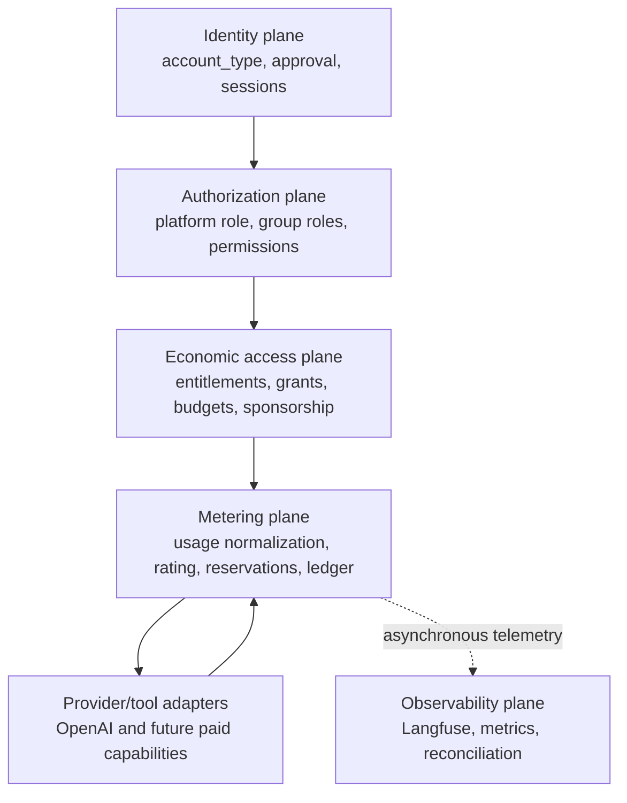
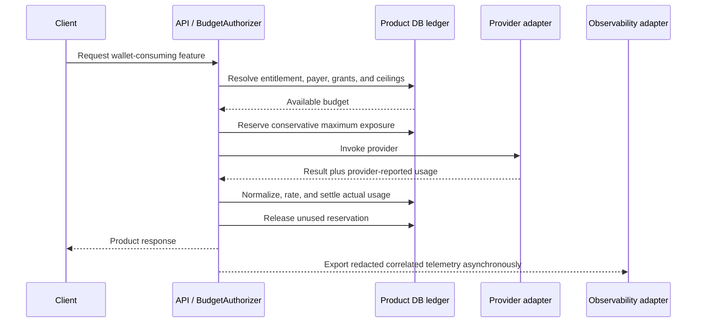

# Economic access, usage metering, and credits architecture

Status: proposed architecture; not implemented
Last reviewed: 2026-08-09

This document turns the account-access, wallet protection, token metering,
credit, sponsorship, payment, and Langfuse discussion into one durable system
architecture proposal.

It does **not** claim that metering, credits, paid plans, family sponsorship, or
Langfuse are implemented. The implemented foundation is described separately
from the proposed architecture throughout this document.

## 1. Problem statement

`my-agents` will gain capabilities that consume owner-funded API resources.
Family members should be able to use the intended product naturally. Public
visitors and job interviewers should be able to evaluate a bounded slice, but
they must not receive an open-ended right to spend the project owner's money.
Future paid users should fund their own allowance.

Authentication alone cannot solve this. A valid account proves identity; it
does not establish who pays, which features are enabled, or how much provider
usage may be consumed.

The system therefore needs a backend-owned economic-access boundary that can
answer, transactionally:

1. Who initiated this operation?
2. May this identity use the requested feature?
3. Which account or grant pays for it?
4. Is sufficient budget available before the provider call starts?
5. What usage did the provider actually report?
6. Which rate card applies to that usage?
7. How much allowance should be settled, released, refunded, or expired?

## 2. Goals and non-goals

### Goals

- Preserve explicit owner approval for ordinary account admission.
- Keep identity lifecycle, platform privilege, resource authorization, economic
  access, and observability as separate concepts.
- Protect the owner's wallet across concurrent requests, retries, streaming,
  cancellation, and partial failure.
- Support owner, sponsored family, invited evaluator, public trial, paid, and
  blocked relationships without adding conditionals to every feature.
- Record provider-reported token usage without binding the core ledger to one
  provider's response schema.
- Rate historical usage reproducibly through immutable, versioned rate cards.
- Allow Langfuse or another observability platform to receive correlated usage
  telemetry without becoming the enforcement or financial source of truth.
- Permit operator-controlled grants before any self-service account or billing
  UI exists.

### Non-goals

- This proposal does not implement schemas, endpoints, payment integration, or
  UI.
- It does not add another LLM provider. OpenAI remains the project provider
  policy; platform neutrality is an architectural boundary for future change.
- It does not use `user_type`, group roles, or document permissions as billing
  tiers.
- It does not treat raw token counts as interchangeable monetary value across
  models.
- It does not make Langfuse a synchronous dependency of product requests.

## 3. Implemented foundation today

The existing backend already owns first-party users, sessions, signup approval,
guest identities, resource permissions, and narrow guest limits.

### 3.1 Signup admission controls

The relevant environment controls are:

```env
MY_AGENTS_AUTH_SIGNUP_ENABLED=true
MY_AGENTS_ACCOUNT_SIGNUP_AUTO_APPROVAL=false
```

With signup enabled and auto-approval disabled:

1. A visitor may submit signup.
2. The backend creates a registered user with `approval_status="pending"`.
3. No verification email is issued yet.
4. Login is rejected while approval remains pending.
5. An operator explicitly approves or rejects the signup.
6. Approval either begins email verification or explicitly marks the email
   verified through the existing operator workflow.

`MY_AGENTS_AUTH_SIGNUP_ENABLED=false` is a kill switch for new signup while
preserving existing-account login.

This is an admission boundary, not a spending policy. An approved registered
account currently has no durable token or cost allowance.

### 3.2 Existing identity and privilege fields

| Existing concept | Current meaning | Current values |
| --- | --- | --- |
| `account_type` | Identity lifecycle kind | `registered`, `guest` |
| `approval_status` | Admission state for registered accounts | `pending`, `approved`, `rejected` |
| `user_type` | Global platform-management privilege | `normal`, `root`, `system` |
| Group role | Authority inside one group | Group-scoped roles |
| Document permission | Authority over one document | Explicit read/write/manage/ingest decisions |

`user_type` is effectively a platform role in the current architecture.
`root` and `system` are system-knowledge managers; the field does not describe
family relationships, plans, sponsorship, payment, or token allowance.

Conceptually clearer names would be `identity_kind` for `account_type` and
`platform_role` for `user_type`. A database rename is not required to adopt
this glossary.

### 3.3 Existing guest boundary

Guest access is a deliberately narrow public-demo path with expiry and fixed
action counts. It currently limits conversations, prompts, and document
creates/uploads. It is useful preview scaffolding, but it is not a durable
anonymous quota system or provider-cost ledger.

Counting five prompts does not establish wallet exposure: five short replies
and five long reasoning/tool runs can have materially different costs.

## 4. Canonical terminology

The project should use the following terms consistently in code, architecture
docs, operator workflows, and future UI.

| Term | Question it answers |
| --- | --- |
| Identity | Who is making the request? |
| Admission | Is this registered identity allowed to enter the product? |
| Authentication | Has the identity proved control of its session or credentials? |
| Authorization | Which data or resource operations may it access? |
| Platform role | Does it hold global administrative capability? |
| Entitlement | May it use this product feature? |
| Quota/allowance | How much of the feature may it consume? |
| Rate limit | How quickly may it consume the feature? |
| Actor | Which user initiated the operation? |
| Payer | Which account, sponsor, or grant absorbs the charge? |
| Sponsorship | Why is one payer funding another actor? |
| Usage | What provider or tool units were actually consumed? |
| Rate card | How are usage units converted into rated cost? |
| Credit | Product-owned spending right after rating policy is applied? |
| Reservation | Budget held before uncertain usage begins? |
| Settlement | Final debit based on actual billable usage? |
| Observability | How are latency, usage, cost, quality, and failures analyzed? |

The central invariant is:

> Authentication proves identity. Approval permits entry. Authorization
> protects data. Entitlements permit features. The usage ledger controls
> spending. None of these concepts implicitly grants another.

## 5. Architectural planes



The Product DB owns identity, authorization state, entitlements, grants,
reservations, settled usage, and balances. External platforms may observe or
fund those records, but must not replace them.

## 6. Economic relationships

The economic policy must be independent of account lifecycle and platform
privilege.

| Relationship | Intended policy | Payer |
| --- | --- | --- |
| Owner | All intended features with emergency ceilings | Owner |
| Sponsored family | Natural access with generous safety ceilings | Owner sponsor |
| Invited evaluator | Selected features and an expiring grant | Owner sponsor |
| Public trial | Small fixed tasting allowance | Promotional grant |
| Paid user | Entitlements and allowance created by purchase | User/billing account |
| Suspended or blocked | No costly operations | None |

Family access should feel unrestricted during normal use, but should not be
mathematically unlimited. A compromised account, runaway retry, or broken worker
must not be able to drain the provider wallet. Family policy should therefore
combine generous sponsored allowance with per-request, daily, and global
emergency ceilings.

An interviewer can use the ordinary public trial or receive an operator-issued,
expiring evaluator grant without becoming a platform administrator.

## 7. Separate actor from payer

The actor and payer are often the same, but must be stored independently.

```text
Family operation:
  actor_user_id  = family member
  payer_account  = owner sponsorship account

Paid operation:
  actor_user_id  = customer
  payer_account  = customer billing account

Evaluator operation:
  actor_user_id  = evaluator
  payer_account  = expiring evaluation grant
```

This separation supports sponsored access, audit, refunds, budget reporting,
and future organizational accounts without conflating data ownership with
financial responsibility.

Groups used for knowledge collaboration should not automatically become billing
accounts. Collaboration membership and sponsorship are separate relationships.

## 8. Metering bounded context

The economic-access system should expose one backend-owned boundary around every
wallet-consuming operation. Conceptual responsibilities are:

### `BudgetAuthorizer`

- Resolve actor, payer, active grants, feature entitlement, and applicable
  ceilings.
- Reject an operation before provider invocation when funding is unavailable.
- Create a transactional reservation for uncertain maximum exposure.

### `UsageMeter`

- Accept provider-native usage reports through adapters.
- Preserve a bounded raw provider record for audit.
- Normalize usage into canonical, non-overlapping units.
- Deduplicate retries and repeated callbacks by operation/idempotency key.

### `RateEngine`

- Select the immutable rate-card version applicable at operation time.
- Convert canonical usage lines into rated monetary cost.
- Convert rated cost into internal credit subunits according to product policy.

### `CreditLedger`

- Record grants, purchases, reservations, releases, settlements, refunds,
  expiration, and manual adjustments as append-only entries.
- Maintain or project available, reserved, and settled balances.
- Preserve actor, payer, operation, reason, and audit provenance.

### Adapters

- Provider adapter: provider response to canonical usage.
- Payment adapter: verified payment event to purchased grant.
- Observability adapter: operation and usage to Langfuse/OpenTelemetry.
- Operator adapter: manual family/evaluator grants and corrections.

The core must not import payment-provider plan concepts or query Langfuse to
authorize a request.

## 9. Provider-neutral usage model

A raw token is not a platform-neutral credit. Tokenizers, model prices, cached
token discounts, reasoning-token behavior, and tool pricing differ.

Each wallet-consuming operation should produce one canonical record:

```text
MeteredOperation
├── operation_id
├── idempotency_key
├── actor_user_id
├── payer_account_id
├── feature
├── provider
├── requested_model
├── actual_model
├── provider_request_id
├── status
├── started_at
├── completed_at
├── usage_lines[]
├── rate_card_version
├── rated_cost_microunits
└── settled_credit_subunits
```

Canonical usage lines should be mutually exclusive:

```text
input_uncached_token
input_cached_read_token
input_cache_write_token
output_visible_token
output_reasoning_token
embedding_input_token
tool_call
image
audio_second
document_page
```

This project can initially implement only the OpenAI units it receives. The
schema remains extensible because future tools may charge by request, image,
page, duration, or storage rather than text tokens.

### 9.1 Inclusive versus exclusive token counts

Providers and telemetry standards may report inclusive totals. For example, an
input-token total may already contain cached-input tokens, and output totals may
contain reasoning tokens.

The canonical rating layer must normalize these into non-overlapping lines:

```text
provider input total = 10,000
provider cached input = 8,000

normalized input_uncached_token    = 2,000
normalized input_cached_read_token = 8,000
```

The raw provider report may be retained in bounded structured form, but the
RateEngine must never rate overlapping totals twice.

OpenTelemetry GenAI semantic conventions are a useful adapter vocabulary for
provider, operation, model, input/output usage, cached input, and reasoning
output. They are an interchange format, not the Product DB domain schema:
[OpenTelemetry GenAI attributes](https://opentelemetry.io/docs/specs/semconv/registry/attributes/gen-ai/).

## 10. Usage, cost, and credits are different facts

```text
Provider usage  -> technical fact
Rated cost      -> usage x pinned rate-card version
Credit debit    -> product policy applied to rated cost
```

### Usage

Records what technically occurred, such as uncached input, cached input,
reasoning output, visible output, embeddings, or tool calls.

### Rated cost

Records wallet impact in a precise integer monetary subunit. Avoid floating
point. Micro-USD or a smaller integer unit may be used if it safely represents
the provider's price precision.

### Credits

Represent application-owned spending rights. Credits should be cost-normalized
rather than equated directly with raw tokens. Otherwise, the same token grant
can have radically different wallet exposure on a cheap model and a premium
reasoning model.

The internal conversion can remain invisible to users:

```text
raw normalized usage
    -> rated monetary microunits
    -> internal credit subunits
    -> optional user-facing credit display
```

User-facing packaging may change without rewriting historical usage.

## 11. Versioned rate cards

The application should own rate-card records conceptually containing:

```text
RateCard
├── version
├── provider
├── model match rule
├── unit type
├── price numerator/denominator
├── currency
├── valid_from
└── valid_until
```

Rules:

- Quantities, monetary subunits, and credit subunits use integers.
- Every settlement pins the selected rate-card version.
- Historical settlements never change when a provider changes price.
- Provider-reported cost can be retained as reconciliation evidence, but the
  application must document whether provider-reported or locally rated cost is
  authoritative for each provider adapter.
- Model aliases must resolve to the actual provider response model when
  available.
- Unknown model/rate combinations fail safely according to policy; they must not
  silently become free.

## 12. Reservation and settlement lifecycle

Output usage is unknown before a request begins. A simple post-call balance
check permits concurrent overspend, so the budget must be reserved first.



Example:

```text
available before request = 1,000 credits
reserved maximum         =   100 credits
available during run     =   900 credits
actual settled debit     =    37 credits
reservation released     =    63 credits
available after run      =   963 credits
```

The reservation estimate may combine known/estimated input tokens with the
configured maximum output tokens and any feature-specific tool ceiling.

Settlement must run even when:

- the client disconnects during streaming;
- the user cancels after provider work began;
- a tool fails after an LLM call;
- the model returns an incomplete response;
- the application retries internally;
- the product response cannot be persisted after provider billing occurred.

Provider-reported usage, not HTTP success alone, determines whether a debit is
required.

## 13. Ledger model and balance semantics

Do not treat a mutable `remaining_credits` field as the financial audit trail.
Use append-only ledger entries, optionally accompanied by a transactionally
maintained balance projection.

Representative ledger reasons:

```text
trial_grant
family_sponsorship_grant
evaluator_grant
purchased_grant
periodic_refresh
reservation
reservation_release
usage_settlement
refund
expiration
manual_adjustment
```

Each entry should preserve:

- entry and idempotency IDs;
- payer account;
- actor when applicable;
- related grant, operation, and provider request;
- signed amount and unit;
- reason and operator/payment provenance;
- created, effective, and expiration timestamps;
- reversal/reference relationship for corrections.

Conceptually:

```text
available balance =
    active grants
  + purchases
  + refunds
  - settled usage
  - active reservations
  - expirations
```

The actual storage design may use a journal plus cached balances, but concurrent
reservation and settlement must remain transactional.

## 14. Entitlements, quotas, budgets, and rate limits

These controls must remain distinct.

| Control | Example |
| --- | --- |
| Entitlement | Evaluator may use chat but not expensive OCR |
| Quota | Trial has 100 product credits total |
| Budget | Family sponsorship may consume up to a high monthly cost ceiling |
| Rate limit | At most five model starts per minute |
| Per-request ceiling | One run may reserve at most a bounded output/tool cost |
| Global kill switch | Stop all new paid-provider operations during an incident |

Rate limits address abuse velocity. Credits address cumulative economic
exposure. Both are required.

The policy evaluation order should be deterministic:

1. Authentication and admission.
2. Resource authorization.
3. Feature entitlement.
4. Account/sponsorship status.
5. Rate limit.
6. Per-request and global safety ceiling.
7. Available grant/credit reservation.

## 15. Langfuse and observability boundary

Langfuse can provide valuable traces, model/feature/user cost aggregation,
latency analysis, quality evaluation, and anomaly investigation. It supports
generation/embedding usage and cost details and can aggregate metrics by opaque
user, session, model, feature, and tags:

- [Langfuse token and cost tracking](https://langfuse.com/docs/observability/features/token-and-cost-tracking)
- [Langfuse user tracking](https://langfuse.com/docs/observability/features/users)
- [Langfuse metrics](https://langfuse.com/docs/metrics/overview)

Langfuse must not be the synchronous budget authority. Its SDKs batch telemetry
in the background, short-lived processes require explicit flushing, and network
or ingestion delay cannot be allowed to make financial decisions stale:
[Langfuse event queuing and batching](https://langfuse.com/docs/observability/features/queuing-batching).

### Recommended correlation

```text
my-agents operation_id   -> trace ID or metadata
conversation_id          -> session ID
actor_user_id            -> opaque Langfuse user ID
feature                  -> trace name/tag
provider and model       -> generation attributes
rate_card_version        -> metadata
normalized usage/cost    -> explicit usage and cost details
environment/release      -> trace attributes
```

### Privacy boundary

- Use opaque user IDs, not email addresses.
- Do not export passwords, tokens, session material, credentials, or sponsorship
  administration details.
- Default to excluding raw prompts, document text, retrieved chunks, and model
  outputs unless a separately reviewed redaction/retention policy permits them.
- Usage and cost telemetry must remain useful even when content capture is off.
- Separate development, test, and production environments so local traffic does
  not contaminate production cost metrics.

### Source-of-truth relationship

```text
Product DB ledger = enforcement, reservations, payer attribution, balances
Langfuse           = traces, analytics, latency, quality, anomaly visibility
Provider records   = external wallet reconciliation evidence
Payment provider   = verified funding events that create product grants
```

Periodic reconciliation should compare Product DB usage and cost with Langfuse
and provider totals. A mismatch produces an operational alert; it must not be
silently repaired by rewriting historical ledger entries.

## 16. Payment-platform neutrality

A future payment provider should not own product balances. Its adapter should:

1. Verify webhook authenticity.
2. Deduplicate the external event ID.
3. Map a completed purchase/subscription event to a product grant.
4. Map refunds, chargebacks, or cancellation to explicit ledger entries and
   entitlement changes.
5. Preserve the external customer/payment reference for audit.

The core product should consume grants and entitlements, not Stripe-specific or
other vendor-specific plan objects. This allows the payment platform to change
without changing provider metering or historical usage.

## 17. Conceptual API/error contract

This is not a frozen API proposal, but future clients will need machine-readable
policy outcomes consistent with the existing error-code direction.

Representative outcomes:

```text
feature_not_entitled
usage_allowance_exhausted
spending_limit_reached
operation_reservation_conflict
metering_unavailable
rate_card_unavailable
payment_required
account_suspended
```

Safe response fields may include:

```json
{
  "code": "usage_allowance_exhausted",
  "detail": "Usage allowance exhausted.",
  "feature": "assistant_chat",
  "remaining_credit_units": 0,
  "reset_at": null,
  "next_action": "purchase_or_request_access"
}
```

Do not expose provider credentials, internal price negotiation, other users'
balances, or sensitive sponsorship information.

## 18. Failure behavior

| Failure | Required behavior |
| --- | --- |
| Insufficient allowance | Reject before provider invocation |
| Concurrent requests | Serialize/atomically reserve against the same payer balance |
| Provider timeout with no usage evidence | Resolve according to adapter policy; do not guess silently |
| Provider reports usage after product error | Settle reported usage and record failed product outcome |
| Duplicate retry/callback | Return/reuse the existing operation settlement by idempotency key |
| Unknown model price | Fail closed or use an explicitly approved fallback rate; never silently free |
| Langfuse unavailable | Continue product enforcement; buffer/drop telemetry according to policy |
| Product DB unavailable | Do not start a new wallet-consuming operation |
| Payment webhook replay | Deduplicate by provider event ID |
| Ledger/provider reconciliation mismatch | Alert and investigate; correct through auditable adjustment/reversal |

## 19. Security and abuse controls

- Enforce economic policy in backend services, never only in frontend UI.
- Pair token/credit budgets with shared rate limiting before broad multi-worker
  public access.
- Keep a global provider-spend kill switch independent of account balances.
- Cap maximum output tokens and tool calls per feature and request.
- Prevent client requests from asserting payer, rate, charge, user type, or grant.
- Require operator-only mutation for family/evaluator sponsorship until a
  reviewed administrative surface exists.
- Audit every manual grant, adjustment, suspension, and reversal.
- Treat guest identity anti-abuse, payment fraud, and account compromise as
  separate threat models.

## 20. Invariants

The future implementation and tests should preserve at least these invariants:

1. A valid session does not imply an entitlement or allowance.
2. `user_type` does not determine billing or sponsorship.
3. Resource authorization is checked before paid retrieval/model work.
4. No wallet-consuming provider call begins without a successful reservation,
   except an explicitly documented zero-cost operation.
5. Available balance cannot be spent twice by concurrent operations.
6. One logical operation settles at most once.
7. Provider usage lines are normalized before rating and never double-count
   overlapping totals.
8. Every settlement pins a rate-card version.
9. Actor and payer remain separately attributable.
10. Historical ledger entries are corrected through reversal/adjustment, not
    silent mutation.
11. Langfuse failure cannot grant access or alter a balance.
12. Payment-provider success alone does not debit usage; it creates a Product DB
    grant that the normal ledger consumes.

## 21. Verification strategy

When implementation is authorized, tests should remain offline by default and
mock provider, observability, and payment boundaries.

### Unit contracts

- Provider usage normalization, including cached/reasoning overlap.
- Versioned rate selection and integer rounding.
- Credit conversion.
- Entitlement and sponsor resolution.
- Reservation, settlement, release, expiry, reversal, and refund behavior.

### Transaction/concurrency contracts

- Two simultaneous reservations cannot overspend one payer balance.
- Duplicate operation or provider IDs do not double-settle.
- Failed settlement remains recoverable without silently releasing spent usage.
- Expiring grants cannot be reserved after expiry.

### API contracts

- Machine-readable exhaustion and entitlement errors.
- Clients cannot assert payer, rate, usage, or privilege.
- Family/evaluator/paid policies remain distinct from `user_type` and resource
  permissions.

### Reconciliation contracts

- Product DB totals can be grouped by provider, model, feature, actor, and payer.
- Redacted Langfuse export uses the same operation correlation ID.
- Telemetry loss does not affect enforcement.

## 22. Recommended evolution

### Phase 0: architecture freeze

- Agree on the glossary and bounded contexts in this document.
- Decide the internal credit unit and monetary precision.
- Define the canonical usage-line vocabulary for current OpenAI calls.
- Define privacy-safe Langfuse content/retention policy.

### Phase 1: metering evidence only

- Capture provider-reported usage at every OpenAI boundary.
- Normalize and persist metered operations without blocking users.
- Compare Product DB aggregates with provider and optional Langfuse metrics.
- Prove idempotency and coverage before charging credits.

### Phase 2: shadow rating

- Introduce versioned rate cards.
- Calculate cost and hypothetical credit debits without enforcing balances.
- Measure rounding, missing-usage, retry, streaming, and reconciliation errors.

### Phase 3: reservations and sponsored grants

- Enforce transactional reservations and settlement.
- Add operator-issued family and evaluator grants.
- Keep public signup approval and guest tasting controls.
- Add global/per-request safety ceilings and shared rate limits.

### Phase 4: paid credits

- Integrate a payment adapter that creates Product DB grants from verified
  payment events.
- Add refund/chargeback/cancellation handling.
- Expose safe balance and exhaustion contracts to the frontend.

### Phase 5: self-service account management

- Add user-visible usage, credit, purchase, sponsorship, and account lifecycle
  surfaces only after the backend source of truth is stable.

## 23. Decisions to make before implementation

1. What monetary subunit and integer precision will rate cards use?
2. What does one internal and one displayed credit represent?
3. Are purchased credits non-expiring while promotional grants expire?
4. How are multiple eligible grants consumed: earliest expiry, sponsor priority,
   or explicit selection?
5. Which OpenAI response boundaries expose provider-reported usage reliably,
   including streaming, reasoning, metadata enrichment, and embeddings?
6. What conservative reservation formula applies to each feature?
7. Which operations are free, sponsored, or disabled when rate information is
   missing?
8. What are the owner, family, evaluator, trial, paid, and global safety
   ceilings?
9. Which trace fields may Langfuse receive, and how long may they be retained?
10. Which Product DB/provider/Langfuse differences trigger alerts?
11. Is the first payment model prepaid credits, recurring allowance, or both?
12. Which operator workflows are required before any administrative UI?

## 24. Summary

The portable architecture is not `credit == token`. It is:

```text
provider-native report
    -> canonical non-overlapping usage
    -> immutable versioned rate
    -> rated wallet cost
    -> product credit debit
    -> append-only ledger settlement
```

Identity identifies the actor. Authorization protects data. Entitlements permit
features. Sponsorship identifies the payer. Reservations protect concurrent
budget. The Product DB ledger is authoritative. Langfuse observes and helps
reconcile the system but never decides whether spending is allowed.
