# RAG retrieval performance log

[한국어 요약](../ko/23-rag-retrieval-performance-log.md) | English

This is the living ledger for local RAG retrieval performance work. Keep it updated when a
slow run is measured, when an optimization is applied, and when the same scenario is rerun.
Use the repo-local `$rag-performance-optimizer` Codex skill for the guided multi-turn workflow.

The goal is not just to make one run faster. The goal is to preserve a maintainable trail of:

1. which phases were measured;
2. the exact redacted measurement output;
3. which optimization was applied;
4. how much that optimization improved latency and call counts;
5. what remains slow after the change.

Do not paste raw prompts, document text, document IDs, chunk IDs, emails, tokens, or secrets in
this log. Use route, intent, counts, phase names, and millisecond values.

## Measurement workflow

```mermaid
flowchart LR
    Enable[Enable local timing flag] --> Run[Run one representative Ask/RAG turn]
    Run --> Copy[Copy redacted ContextForge timing panel]
    Copy --> Diagnose[Identify dominant phase and call count]
    Diagnose --> Patch[Apply one scoped optimization]
    Patch --> Verify[Run regression tests and lint]
    Verify --> Rerun[Rerun same scenario]
    Rerun --> Ledger[Update improvement ledger]
```



Use this local flag for a single-run breakdown:

```bash
MY_AGENTS_DEBUG_RETRIEVAL_TIMING_LOGGING=true uv run fastapi dev main.py
```

When comparing before and after, keep the scenario stable:

- same local database snapshot or note what changed;
- same user/source selection scope;
- same query intent class;
- same reranker mode;
- same embedding mode/provider;
- same server warm/cold-start condition when possible.

## Phase taxonomy

### Top-level ContextForge phases

| Phase | Meaning | Typical action if slow |
| --- | --- | --- |
| `authorized_document_count` | Count distinct readable documents before planning. | Check auth/count SQL and indexes. |
| `query_planning` | Deterministic query planning and route/intent selection. | Should stay near zero; investigate only if it grows. |
| `candidate_gather` | First-stage retrieval: metadata, embeddings, vector/keyword search, expansion, overview supplement, structured facts. | Primary target when raw candidates are few but gathering is slow. |
| `candidate_fusion` | Dedupe and source fusion before reranking. | Should stay near zero. |
| `reranking` | Optional deterministic or cross-encoder reranking over bounded candidates. | Tune `MY_AGENTS_RERANKER_MODE` / `MY_AGENTS_RERANKER_TOP_K` if gather is already fast. |
| `context_pack` | Build answer-ready context under injected-count and character budgets. | Check budget and packing only if this grows. |

### Nested `candidate_gather.*` phases

| Phase | Meaning | Why it matters |
| --- | --- | --- |
| `candidate_gather.authorized_document_rows_sql` | Document-only authorization rows used for metadata matching. | Avoids scanning every chunk just to score document title/filename metadata. |
| `candidate_gather.authorized_chunk_rows_sql` | Full authorized chunk scan. | Expensive on local Postgres when repeated. Should be minimized. |
| `candidate_gather.authorized_matched_chunk_rows_sql` | Chunk fetch for already matched document IDs. | Preferred over full scans for metadata/profile/overview lanes. |
| `candidate_gather.document_metadata_match` | Filename/title/document metadata lane. | Can become slow if implemented through full chunk scans. |
| `candidate_gather.embedding.query.openai` | OpenAI query embedding call. | Network-bound; duplicate query embeddings should be reused. |
| `candidate_gather.metadata_profile_rows_sql` | Generated document profile rows. | Usually small SQL cost; high downstream time often means chunk fetch/scoring cost. |
| `candidate_gather.document_metadata_profile_match` | Search generated metadata profiles and map matches to body chunks. | Should load chunks only for matched documents. |
| `candidate_gather.postgres_vector_sql` | pgvector candidate search. | If this is small, vector search is not the bottleneck. |
| `candidate_gather.direct_authorized_match` | Main semantic/keyword retrieval lane. | Includes query embedding, vector SQL, and fallback matching. |
| `candidate_gather.entity_mentions_sql` | Entity mention lookup for graph expansion seeds. | Must stay batched; high call count means N+1 regression. |
| `candidate_gather.related_entity_chunks_sql` | Batch fetch chunks related by matched entity IDs. | Replaces per-chunk entity mention loops. |
| `candidate_gather.authorized_related_expansion` | Graph expansion lane. | Slow if it repeatedly scans chunks or entity mentions. |
| `candidate_gather.document_overview_supplement` | Adds broader coverage for summary/overview questions. | Should fetch chunks only for matched documents, not every authorized chunk. |
| `candidate_gather.structured_entity_sql` | Structured fact retrieval for entity-aware plans. | Track separately for enumeration/config/API-style queries. |

## Measurement log

### RAG-PERF-2026-06-22-A: initial top-level timing

This run proved that retrieval dominated the conversation turn, but the first timing panel did
not yet show which part of candidate gathering was slow.

| Field | Value |
| --- | ---: |
| total_ms | 61558.682 |
| retrieval_latency_ms | 61513.008 |
| route | retrieval_required |
| answer_mode | document_grounded |
| intent | overview |
| reranker | cross_encoder |
| authorized_document_count | 18 |
| raw_candidate_count | 20 |
| fused_candidate_count | 20 |
| reranked_candidate_count | 20 |
| injected_count | 12 |
| rejected_count | 8 |
| budget_truncated | true |

| Phase | Elapsed ms | Share of total |
| --- | ---: | ---: |
| authorized_document_count | 32.677 | 0.1% |
| query_planning | 0.224 | 0.0% |
| candidate_gather | 51134.382 | 83.1% |
| candidate_fusion | 0.071 | 0.0% |
| reranking | 10371.547 | 16.8% |
| context_pack | 0.047 | 0.0% |

Diagnosis: `candidate_gather` was the primary bottleneck. Cross-encoder reranking was also
expensive, but optimizing it alone would still leave roughly 51 seconds of retrieval latency.

### RAG-PERF-2026-06-22-B: nested candidate-gather timing

This run used the nested `candidate_gather.*` timing panel. It showed that the bottleneck was
not pgvector search. The dominant costs were repeated full authorized chunk scans and an N+1
entity mention pattern.

| Field | Value |
| --- | ---: |
| total_ms | 63754.876 |
| retrieval_latency_ms | 63709.865 |
| route | retrieval_required |
| answer_mode | document_grounded |
| intent | overview |
| reranker | cross_encoder |
| authorized_document_count | 18 |
| raw_candidate_count | 20 |
| fused_candidate_count | 20 |
| reranked_candidate_count | 20 |
| injected_count | 12 |
| rejected_count | 8 |
| budget_truncated | true |

| Phase | Calls | Elapsed ms | Diagnosis |
| --- | ---: | ---: | --- |
| authorized_document_count | 1 | 33.240 | Healthy. |
| query_planning | 1 | 0.189 | Healthy. |
| candidate_gather.authorized_chunk_rows_sql | 5 | 45461.412 | Main waste: repeated full authorized chunk scans. |
| candidate_gather.document_metadata_match | 1 | 19541.002 | Slow because metadata lane depended on authorized chunk scans. |
| candidate_gather.embedding.query.openai | 2 | 2433.501 | Duplicate query embedding call. |
| candidate_gather.metadata_profile_rows_sql | 1 | 11.572 | Healthy SQL cost. |
| candidate_gather.document_metadata_profile_match | 1 | 10832.637 | Slow because profile matches loaded/scanned chunks broadly. |
| candidate_gather.postgres_vector_sql | 1 | 78.245 | Healthy; vector SQL was not the bottleneck. |
| candidate_gather.direct_authorized_match | 1 | 648.147 | Acceptable relative to total. |
| candidate_gather.entity_mentions_sql | 9646 | 3356.052 | N+1 query pattern. |
| candidate_gather.authorized_related_expansion | 1 | 12449.364 | Slow due to entity mention fan-out and another chunk scan. |
| candidate_gather.document_overview_supplement | 1 | 8777.651 | Slow because overview lane scanned authorized chunks broadly. |
| candidate_gather | 1 | 52353.431 | Primary bottleneck. |
| candidate_fusion | 1 | 0.058 | Healthy. |
| reranking | 1 | 11348.078 | Secondary bottleneck. |
| context_pack | 1 | 0.062 | Healthy. |

Diagnosis:

- `authorized_chunk_rows_sql` ran 5 times and consumed about 45.5 seconds cumulatively.
- `entity_mentions_sql` ran 9,646 times, which is a clear N+1 regression shape.
- `postgres_vector_sql` took only 78 ms, so vector search was not the problem in this run.
- `reranking` remained expensive at 11.3 seconds, but still smaller than candidate gathering.

## Optimization ledger

Use this table as append-only history. Fill `After measurement` and `Measured improvement` only
after a same-scenario rerun. If the scenario changes, add a new measurement ID instead of
pretending the numbers are comparable.

| ID | Date | Change | Before measurement | After measurement | Measured improvement | Commit/status |
| --- | --- | --- | --- | --- | --- | --- |
| OBS-1 | 2026-06-22 | Added redacted top-level Rich timing panel. | No per-run phase table. | RAG-PERF-2026-06-22-A produced top-level phase timings. | Observability improvement only; not a latency optimization. | `ab84dc8` pushed. |
| OBS-2 | 2026-06-22 | Added nested `candidate_gather.*` rows and call counts. | `candidate_gather` was a 51.1s black box. | RAG-PERF-2026-06-22-B identified repeated chunk scans and N+1 entity mentions. | Observability improvement only; enabled targeted optimization. | `6f23b89` pushed. |
| OPT-1 | 2026-06-22 | Reuse one query embedding across metadata-profile and direct retrieval lanes. | `candidate_gather.embedding.query.openai`: 2 calls, 2433.501 ms. | Pending rerun. | Pending measured delta; expected call count 2 -> 1 for this path. | `6f23b89` pushed. |
| OPT-2 | 2026-06-22 | Use document-only auth rows for metadata matching and matched-document chunk fetches for metadata/profile/overview lanes. | `candidate_gather.authorized_chunk_rows_sql`: 5 calls, 45461.412 ms; metadata/profile/overview lanes were slow. | Pending rerun. | Pending measured delta; target is fewer full authorized chunk scans. | `6f23b89` pushed. |
| OPT-3 | 2026-06-22 | Batch graph expansion entity lookup and fetch related chunks in one SQL query. | `candidate_gather.entity_mentions_sql`: 9646 calls, 3356.052 ms; `authorized_related_expansion`: 12449.364 ms. | Pending rerun. | Pending measured delta; target is entity mention calls 9646 -> 1 plus `related_entity_chunks_sql`. | `6f23b89` pushed. |
| TODO-1 | 2026-06-22 | Evaluate cross-encoder reranking cost after gather is fixed. | `reranking`: 11348.078 ms with 20 candidates. | Not started. | Not started. | Future work. |

## Improvement calculation template

For each same-scenario rerun, calculate:

```text
absolute_delta_ms = before_ms - after_ms
percent_delta = absolute_delta_ms / before_ms * 100
call_delta = before_calls - after_calls
```

Example row format:

| Phase | Before calls | Before ms | After calls | After ms | Delta ms | Delta % |
| --- | ---: | ---: | ---: | ---: | ---: | ---: |
| candidate_gather.authorized_chunk_rows_sql | 5 | 45461.412 | TBD | TBD | TBD | TBD |
| candidate_gather.entity_mentions_sql | 9646 | 3356.052 | TBD | TBD | TBD | TBD |
| candidate_gather.embedding.query.openai | 2 | 2433.501 | TBD | TBD | TBD | TBD |
| candidate_gather | 1 | 52353.431 | TBD | TBD | TBD | TBD |
| reranking | 1 | 11348.078 | TBD | TBD | TBD | TBD |
| total_ms | 1 | 63754.876 | TBD | TBD | TBD | TBD |

## Current interpretation and next step

As of 2026-06-22, the latest code has removed the obvious candidate-gather fan-out, but the
same local corpus/query has not yet been rerun after `6f23b89` in this log. The next required
measurement is a post-optimization `RAG-PERF-2026-06-22-C` run using the same local scenario.

Expected signs of success:

- `candidate_gather.authorized_chunk_rows_sql` should no longer appear 5 times for metadata,
  profile, expansion, and overview work.
- `candidate_gather.authorized_document_rows_sql` and
  `candidate_gather.authorized_matched_chunk_rows_sql` should appear instead for targeted lanes.
- `candidate_gather.entity_mentions_sql` should have one batched call for expansion seeds, not
  thousands of calls.
- `candidate_gather.related_entity_chunks_sql` should show the batched expansion chunk fetch.
- `candidate_gather.embedding.query.openai` should be one call for this retrieval path.
- If `candidate_gather` drops materially, `reranking` may become the next largest bottleneck.

## Regression guardrails

Keep these behavior constraints intact while optimizing latency:

- authorization must happen before ranking and packing;
- retrieval must not fetch global chunks and filter after ranking;
- citations must still point to authorized source chunks;
- overview queries should still receive enough source coverage for useful summaries;
- metadata/profile matches should inject body/source chunks, not only generated profile text;
- timing output must stay redacted and opt-in.

Relevant regression tests:

```bash
uv run pytest -q \
  tests/test_context_forge_reranking.py \
  tests/test_metrics.py \
  tests/test_context_forge_contracts.py \
  tests/test_permission_aware_rag.py \
  tests/test_publish_requests.py \
  tests/test_conversations_api.py::test_filename_reference_retrieves_matching_document_metadata \
  tests/test_conversations_api.py::test_streaming_conversation_run_emits_answer_deltas_before_completion
uv run ruff check . --no-cache
uv run ruff format --check .
git diff --check
```

## Revision history

- 2026-06-22: Created the performance ledger from the initial top-level timing run, nested candidate-gather timing run, and the first candidate-gather fan-out optimization commit.
