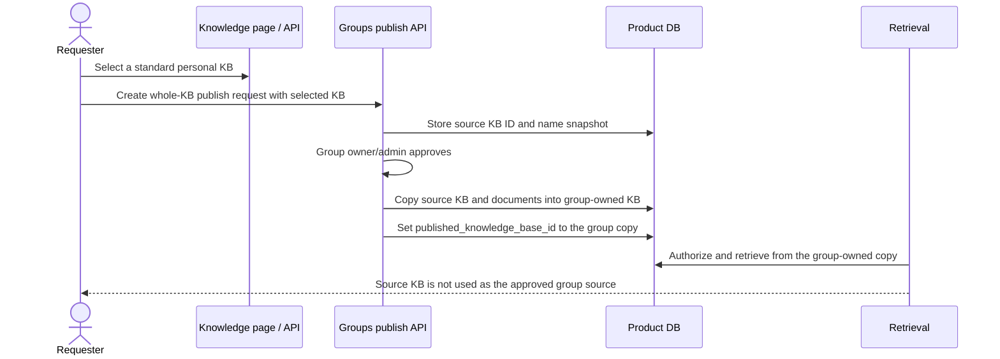

# Knowledge lifecycle and publish-copy contract

[한국어](../ko/24-knowledge-lifecycle-and-publish-copy-contract.md) | English

This note records the product contract for knowledge-space rename/delete, document preview, and publish-request copy semantics after the Knowledge management UX work.

## User-facing contract

- The Knowledge page is the creation and source-management surface. Users rename/delete knowledge spaces, open document details, preview the document's Markdown/internal representation, and create share requests from the selected knowledge space or document.
- The Groups page is review/status oriented. Group owners/admins approve, reject, and inspect publish requests there; users should not have to type document IDs or knowledge-base IDs to create a request.
- Share creation uses selected entities from the UI: group selector, target group knowledge space selector when needed, and the selected source document or source knowledge space.
- Delete is immediate; there is no trash/restore workflow in this contract.

## Backend invariants

- Only lifecycle-manageable standard knowledge bases can be renamed or deleted through the normal API. Hidden `team_upload_staging` KBs remain an internal buffer and are excluded from the management flow.
- Rename input is trimmed and blank names are rejected before persistence.
- Document list responses stay lightweight and do not include full source content. The KB-scoped preview endpoint returns the full display/internal Markdown representation only for an authorized document inside the requested KB:

```text
GET /knowledge-bases/{knowledge_base_id}/documents/{document_id}/preview
```

- Pending publish requests keep enough source snapshots to survive source deletion. Deleting a pending source document or source KB withdraws the request.
- Approved publish requests keep the group-owned published copy as the retrievable source of record. Deleting the original source after approval does not remove the published group copy.
- If a group manager deletes the approved group copy later, the publish-request history remains and the live `published_document_id` or `published_knowledge_base_id` pointer is cleared while the published-name snapshot remains.

## Whole-KB publication flow



Whole-KB approval now creates a group-scoped KB copy instead of treating the requester's personal KB as a group-readable source. This keeps ownership clean: the requester can later edit/delete the personal source, while group owners/admins manage the published group copy.

## Legacy backfill

Older approved whole-KB publication rows may still point at a personal source KB as their published target. Those rows should be migrated to group-owned copies before depending on the new retrieval contract.

Preview the migration summary first:

```bash
uv run python -m scripts.backfill_kb_publication_copies --dry-run
```

Apply only after reviewing the JSON summary and taking any environment-appropriate backup/snapshot:

```bash
uv run python -m scripts.backfill_kb_publication_copies --apply
```

The current retrieval path does not use legacy personal-KB publication rows as authorization. Backfill keeps historical rows useful while preserving the new group-owned-copy boundary.

## Code and test map

- `my_agents/api/knowledge_bases.py` — KB rename/delete, lifecycle guard, publish-request detachment, document preview.
- `my_agents/api/groups.py` — publish-request creation, whole-KB approval copy, response snapshots.
- `my_agents/knowledge/publication_copies.py` — reusable copy/backfill helpers.
- `scripts/backfill_kb_publication_copies.py` — dry-run/apply operator script for legacy rows.
- `tests/test_kb_nested_document_routes.py` — preview scoping, blank-name rejection, KB lifecycle/delete guards.
- `tests/test_publish_requests.py` — source deletion, no manual hidden-source bypass, whole-KB copy semantics.
- `tests/test_kb_publication_backfill.py` — legacy publication backfill behavior.
