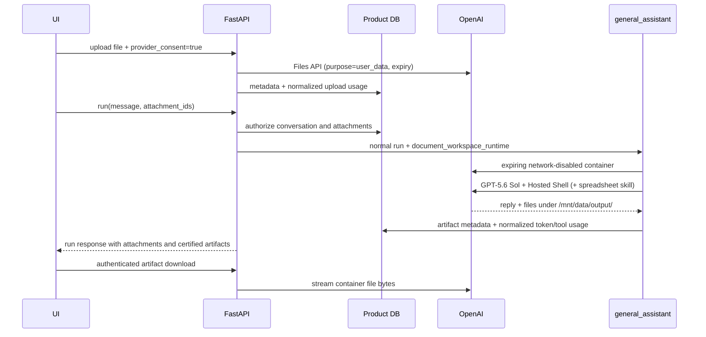

# OpenAI-hosted document workspace

[한국어](../ko/25-openai-document-workspace.md) | English

## Status and scope

This is an opt-in conversation capability for approved registered accounts. It delegates expensive document analysis and spreadsheet generation to OpenAI instead of using Render CPU/RAM for local office-file editing. It does not introduce Deep Agents, a second assistant, durable file storage, or guest access.

Ordinary chat remains on the existing `ChatOpenAI` provider. Only attachment turns use the narrow OpenAI SDK adapter because the required Files, Containers, Hosted Shell, and Skills APIs are not exposed by the current `ChatOpenAI` surface.

## Lifecycle

The Product DB stores file metadata, run associations, workspace metadata, artifact metadata, and immutable normalized usage events. The response usage event separates input, cached-input, output, and reasoning tokens and records whether Hosted Shell ran. It never stores uploaded or generated file bytes. OpenAI files currently expire after one hour by default; the hosted container expires after 20 idle minutes by default. Expired metadata remains useful for honest UI state and usage audit.

## Public API contract

- `GET /capabilities/document-workspace`: effective feature state, account eligibility, format registry, limits, and retention.
- `POST /conversations/{conversation_id}/attachments`: multipart `file` plus required `provider_consent=true`.
- `GET /conversations/{conversation_id}/attachments`: attachment metadata and expiry state.
- `DELETE /conversations/{conversation_id}/attachments/{attachment_id}`: removes the provider file when it still exists and marks metadata deleted.
- `POST /conversations/{conversation_id}/runs`: accepts an additive `attachment_ids` list.
- `GET /conversations/{conversation_id}/artifacts`: generated artifact metadata.
- `GET /conversations/{conversation_id}/artifacts/{artifact_id}/download`: authenticated byte stream proxied from the active provider container.

Run responses add `attachments` and `artifacts`. The display-safe persisted event enum adds `attachments_ready`, `document_workspace_started`, and `artifact_created`; their payloads expose counts, provider-reported byte sizes when available, filenames, content types, IDs, and expiry timestamps only.

## Formats and output certification

The analysis allowlist is versioned in `my_agents/document_workspace/formats.py` and mirrors the OpenAI File Inputs extension families verified on 2026-08-09: PDF, spreadsheet, rich-document, presentation, and text/code files. Video and arbitrary binary uploads are out of scope. The effective registry is served by the capability endpoint so the frontend does not hardcode it.

Analysis support is broader than editing certification. Only `.xlsx`, `.csv`, and `.tsv` outputs under `/mnt/data/output/` become downloadable artifacts in this milestone. Other accepted inputs can be analyzed, but the assistant must not claim a downloadable edited document was produced. This avoids presenting unverified DOCX/PPTX/PDF fidelity as a stable product contract.

## Security and economic boundaries

- The feature is disabled by default and rejects guest principals.
- File transfer requires explicit consent on every upload.
- Conversation ownership and attachment ownership are checked before any provider execution or download.
- Hosted container networking is disabled.
- Uploaded files, retrieved KB snippets, and memory snippets are marked as untrusted data in provider instructions.
- Provider traces, shell commands, stdout, prompts, credentials, and hidden reasoning never enter public events.
- Usage events record provider-neutral units such as input/output/cached tokens, file-input bytes, container starts, and hosted-shell calls. Unique idempotency keys prevent double recording and leave later credit settlement independent of Langfuse or one model vendor.

## Deployment

Apply Alembic revision `20260809_0030` before enabling the flag. Set `OPENAI_API_KEY` and `MY_AGENTS_DOCUMENT_WORKSPACE_ENABLED=true`; tune limits through the documented `MY_AGENTS_DOCUMENT_WORKSPACE_*` variables. No local office suite, code sandbox, or high-memory parser is added to the Render process for this path.

The test suite replaces the provider boundary with an offline fake. A credentialed live smoke remains an operator action because it creates billable OpenAI files, a container, model tokens, and possibly Hosted Shell usage.
