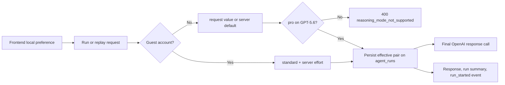

# Run reasoning preferences

[한국어](../ko/26-run-reasoning-preferences.md)

## Purpose

The frontend may keep a registered user's OpenAI reasoning preference in browser local storage and send it with each conversation run. The backend remains the authority: it validates model compatibility, fixes guest cost controls, persists the effective values, and forwards only those effective values to the final OpenAI response call.



## API contract

`POST /conversations/{conversation_id}/runs`, its streaming variant, and both replay endpoints accept two optional top-level fields:

```json
{
  "message": "Review this migration plan",
  "reasoning_mode": "pro",
  "reasoning_effort": "high"
}
```

- `reasoning_mode`: `standard | pro`; omitted means `standard`.
- `reasoning_effort`: `none | minimal | low | medium | high | xhigh | max`; omitted means `MY_AGENTS_OPENAI_REASONING_EFFORT`, whose repository default is `medium`.
- Mode and effort are independent.
- `pro` requires the model selected for that run to belong to the GPT-5.6 family. Otherwise the request fails before a user message or run is stored with HTTP 400 and `code=reasoning_mode_not_supported`.

The completed run response, run-detail response, run summaries, and display-safe `run_started` event return the effective `reasoning_mode` and `reasoning_effort`. Replay uses explicit replay fields when supplied; otherwise it inherits the original run's effective pair. Historical rows and events migrate to `standard` plus `medium`.

## Capability discovery and guest policy

Authenticated clients can call `GET /capabilities/reasoning`. It returns the stable option lists, active default effort, whether the chat and document-workspace surfaces support `pro`, and `customizable` for the current principal. Raw provider model identifiers are intentionally omitted because clients need capability flags, not deployment inventory.

Guests cannot raise or lower either setting. The backend ignores guest-submitted values and enforces `standard` plus `MY_AGENTS_OPENAI_REASONING_EFFORT`; this is an authorization and cost policy, not only a disabled frontend control. The frontend may hide the controls when `customizable=false`.

## Provider boundary

The effective pair applies to the final answer generation call:

- ordinary chat uses `ChatOpenAI` with the Responses API request-level `reasoning` object;
- attachment turns pass the same object to GPT-5.6 Sol through the isolated document-workspace adapter;
- the internal source-selection gate remains fixed to `standard` and the server-default effort so browser preferences do not alter routing behavior or routing cost.

Raw chain-of-thought is never requested, stored, or returned. These settings control provider computation only. OpenAI documents that `pro` performs more model work and can increase latency and token usage; product credit enforcement remains a separate usage-ledger concern.

Reasoning tokens count toward the existing output ceilings (`MY_AGENTS_OPENAI_MAX_OUTPUT_TOKENS` and `MY_AGENTS_DOCUMENT_WORKSPACE_MAX_OUTPUT_TOKENS`). Selecting a high effort does not raise those ceilings automatically, so an operator should tune them from observed latency, incomplete-response, and cost data rather than assuming `max` always produces a longer visible answer.
