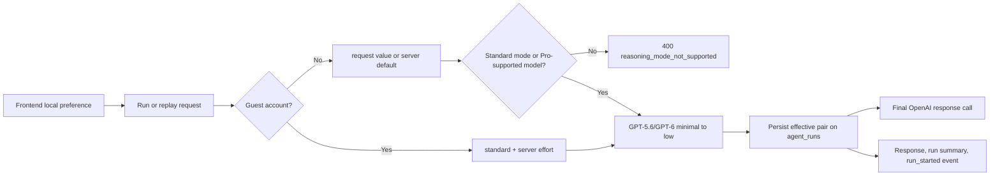

# Run reasoning preferences

[한국어](../ko/26-run-reasoning-preferences.md)

## Purpose

The frontend may keep a registered user's OpenAI reasoning preference in browser local storage and send it with each conversation run. The backend remains the authority: it validates model compatibility, fixes guest cost controls, persists the effective values, and forwards only those effective values to the final OpenAI response call.


```mermaid
flowchart LR
    UI["Frontend local preference"] --> Request["Run or replay request"]
    Request --> Guest{"Guest account?"}
    Guest -->|Yes| Fixed["standard + server effort"]
    Guest -->|No| Resolve["request value or server default"]
    Resolve --> Check{"Standard mode or Pro-supported model?"}
    Check -->|No| Error["400 reasoning_mode_not_supported"]
    Check -->|Yes| Normalize["GPT-5.6/GPT-6 minimal to low"]
    Normalize --> Persist["Persist effective pair on agent_runs"]
    Fixed --> Normalize
    Persist --> Provider["Final OpenAI response call"]
    Persist --> Contract["Response, run summary, run_started event"]
```

## API contract

`POST /conversations/{conversation_id}/runs`, its streaming variant, and both replay endpoints accept two optional top-level fields:

```json
{
  "message": "Review this migration plan",
  "reasoning_mode": "pro",
  "reasoning_effort": "high"
}
```

- `reasoning_mode`: `standard | pro`; omitted means `standard`.
- `reasoning_effort`: `none | minimal | low | medium | high | xhigh | max`; omitted means `MY_AGENTS_OPENAI_REASONING_EFFORT`, whose repository default is `medium`.
- For GPT-5.6 and GPT-6 models, `minimal` is accepted as a compatibility alias and normalized to `low` before run persistence and provider calls. This applies to chat, document workspace, replay inheritance, and server defaults (including guests). Responses and events report the effective `low`; Model defaults are unchanged.
- Mode and effort are independent.
- `pro` requires the model selected for that run to belong to the GPT-5.6 or GPT-6 family. Otherwise the request fails before a user message or run is stored with HTTP 400 and `code=reasoning_mode_not_supported`.

The completed run response, run-detail response, run summaries, and display-safe `run_started` event return the effective `reasoning_mode` and `reasoning_effort`. Replay uses explicit replay fields when supplied; otherwise it inherits the original run's effective pair. Historical rows and events migrate to `standard` plus `medium`.

## Frozen public effort contract

The user-facing effort vocabulary and its order are frozen:

`none → minimal → low → medium → high → xhigh → max`

These are product-level choices, not a claim that every provider model accepts every value.
Future model additions MUST preserve `ReasoningEffort`, `SUPPORTED_REASONING_EFFORTS`, request
schemas, and the capability endpoint's `supported_efforts`. Do not add, remove, rename, reorder,
or filter the user-facing choices to match a model's API enum. Changing this product contract
requires a separate explicit product decision, not a routine model upgrade.

Model compatibility belongs in `normalize_reasoning_effort()` in `my_agents/reasoning.py`.
For each new model, verify provider-supported values, define any necessary mappings there,
and test all seven public choices. Do not assume unsupported values are accepted or that
an unknown future model inherits an existing family's mapping. If no faithful mapping exists,
resolve that model's policy before enabling it; do not silently rewrite the public contract.

| Configured model family | Requested effort | Effective effort |
| --- | --- | --- |
| GPT-5.6 | `minimal` | `low` |
| GPT-6 | `minimal` | `low` |
| GPT-5.6 / GPT-6 | Other values | Unchanged by the current normalizer |
| Other models | Any value | Unchanged; this is not a provider-support guarantee |

GPT-6 Astra's `none` remains an explicit compatibility gap; no none-to-low mapping is introduced
by this change. A future model rollout must check such gaps independently of the frozen enum.

Normalization runs after request/replay/default/guest policy and surface-model selection,
before persisting the effective run values. The provider payload builder applies the same
idempotent function to cover direct calls. Capabilities normalize the chat model's default
while preserving the complete public choice list. Historical runs are not rewritten; replay
normalizes their inherited effort against the currently selected model.

On 2026-09-27, a direct GPT-5.6 Sol Responses API smoke accepted `none` and rejected `minimal`
with HTTP 400 `unsupported_value`. The prior GPT-6-only mapping therefore left a real rollback
compatibility gap. Regression coverage includes both families, selected chat/workspace models,
request/default/guest/replay inputs, persisted run/events, and the frozen choice list.

## Capability discovery and guest policy

Authenticated clients can call `GET /capabilities/reasoning`. It returns the stable option lists, active default effort, whether the chat and document-workspace surfaces support `pro`, and `customizable` for the current principal. Raw provider model identifiers are intentionally omitted because clients need capability flags, not deployment inventory.

Guests cannot raise or lower either setting. The backend ignores guest-submitted values and enforces `standard` plus `MY_AGENTS_OPENAI_REASONING_EFFORT`; this is an authorization and cost policy, not only a disabled frontend control. The frontend may hide the controls when `customizable=false`.

## Provider boundary

The effective pair applies to the final answer generation call:

- ordinary chat uses `ChatOpenAI` with the Responses API request-level `reasoning` object;
- attachment turns pass the same object to GPT-5.6 Sol through the isolated document-workspace adapter;
- the internal source-selection gate uses a server-owned decision provider; Jev ignores browser reasoning preferences. The OpenAI rollback keeps standard/server-default effort.

Raw chain-of-thought is never requested, stored, or returned. These settings control provider computation only. OpenAI documents that `pro` performs more model work and can increase latency and token usage; product credit enforcement remains a separate usage-ledger concern.

## Dynamic reasoning summaries

Answer synthesis can return bounded model-authored summaries from Sol, separate from raw
chain-of-thought and verified `agent_trace`. Jev returns typed choices rather than prose, so
its optional retrieval-planning summary is absent. The OpenAI rollback may still produce a
model-authored planning summary. Templates must not be labeled model-generated.

The rationale, schema/SSE events, safety boundary, implementation sequence, and definition
of done live in the [dynamic reasoning summary contract](./28-dynamic-reasoning-summary-contract.md).

Reasoning tokens count toward the existing output ceilings (`MY_AGENTS_OPENAI_MAX_OUTPUT_TOKENS` and `MY_AGENTS_DOCUMENT_WORKSPACE_MAX_OUTPUT_TOKENS`). Selecting a high effort does not raise those ceilings automatically, so an operator should tune them from observed latency, incomplete-response, and cost data rather than assuming `max` always produces a longer visible answer.
