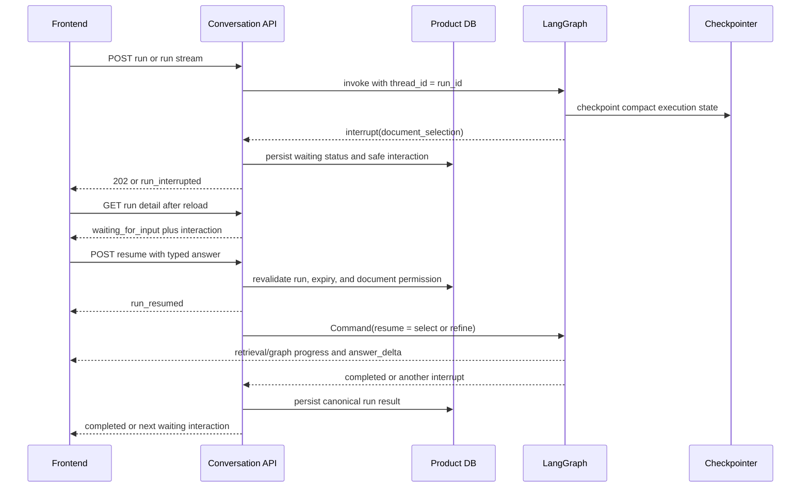
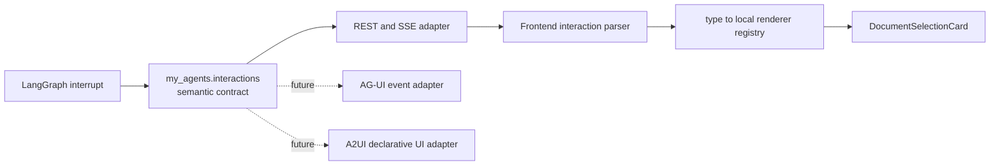

# Agent-to-frontend interaction contract

[한국어](../ko/27-agent-frontend-interaction-contract.md) | English

## Status and purpose

This document is the current architecture contract for user input that an agent run
needs before it can continue. The first implemented interaction is durable document
source selection. Future interactions must extend this contract instead of adding
one-off response fields, SSE event shapes, or frontend run-loop branches.

The same `document_selection` type serves both ordinary ambiguous document questions and
explicit comprehensive-document requests. Whole-document retrieval does not introduce a
new interaction type or expose its internal continuation cursor to the frontend.

The contract is deliberately protocol-neutral. The backend describes **what input is
required** and the frontend decides **how to render and collect it**. It does not add
AG-UI or A2UI as a dependency.

## Non-negotiable boundary

- Backend interactions are semantic, versioned, JSON-serializable, and safe to display.
- Backend payloads never name React components, layouts, colors, controls, or CSS.
- Ambient system knowledge is automatically injected server context, not a
  user-controllable source axis. System KBs and documents must never appear as interaction
  options, and a forged resume answer naming one is rejected.
- Frontend components are selected through a local interaction renderer registry.
- Activity events do not replace pending interaction state.
- Product DB run detail is the refresh-safe public source of truth; LangGraph checkpoints
  remain private run-scoped execution state.
- Raw prompts, provider traces, credentials, chain-of-thought, and unreviewed arbitrary
  dictionaries are forbidden in interaction payloads.

## V2 wire contract and V1 compatibility

All interaction requests and answers carry both a semantic type and a schema version.
New interactions use V2. Each attempt gets a new UUID while the run, selected KB scope,
and original expiry remain unchanged.

```json
{
  "schema_version": 2,
  "interaction_id": "<attempt UUID>",
  "type": "document_selection",
  "reason_code": "ambiguous_document_reference | unresolved_document_reference",
  "message_key": "clarification.document_scope.select_source",
  "expires_at": "2026-08-18T00:00:00Z",
  "option_count": 2,
  "library_count": 4000,
  "options": [
    {
      "document_id": "...",
      "title": "Architecture notes",
      "source_filename": "architecture.pdf",
      "knowledge_base_id": "...",
      "knowledge_base_name": "Personal knowledge",
      "match_confidence": "high | medium | low",
      "match_reason_code": "exact_title | exact_filename | partial_title | partial_filename | metadata_overlap"
    }
  ],
  "next_cursor": null,
  "refinement": {
    "allowed": true,
    "attempts_used": 0,
    "attempts_max": 2,
    "max_length": 120
  },
  "browse": {"allowed": false, "cursor": null}
}
```

Resume requests are a closed type-specific union. Selection and human refinement both
resume the same checkpoint; refinement is never stored as a chat message.

```json
{
  "schema_version": 2,
  "interaction_id": "<attempt UUID>",
  "type": "document_selection",
  "kind": "select",
  "document_id": "..."
}
```

```json
{
  "schema_version": 2,
  "interaction_id": "<attempt UUID>",
  "type": "document_selection",
  "kind": "refine",
  "text": "Pydantic Annotated Literal.md"
}
```

After two unresolved refinements, `browse.allowed=true`; only then may the options endpoint
return the broad authorized library with opaque cursor pagination. V1 remains accepted for
already-waiting checkpoints and keeps its legacy `<run_id>:document_selection` identity and
`{document_id}` resume body. Persisted lifecycle events expose the applicable version.

## Lifecycle and durability

The default chat source mode remains all authorized personal/group KBs plus ambient system
knowledge. The interaction is not a replacement KB picker. Resolution first revalidates the
authorized metadata scope, then applies this ladder: a unique exact filename/title resolves
automatically; otherwise the backend returns at most five stable ranked candidates; the user
may supply up to two 120-character one-line filename clues; only then is broad browsing
available. A client-selected KB subset narrows every stage.

For an explicit comprehensive-document request, “ambiguous” also includes a request that
names no unique title/source filename while several eligible documents exist. After resume,
the graph returns to full-document target resolution, revalidates that the selected
document is still user-controllable and authorized, and only then reads its bounded text.
System KBs/documents are excluded from both automatic target resolution and interaction
options; a forged system-document answer remains invalid.



An unexpired waiting run remains the conversation's active run. A new run request is
rejected with HTTP `409` and `code=conversation_run_already_active`. Frontends must pause
queued messages while waiting instead of treating that response as ordinary retryable
stream backpressure.

Choosing an option ends the suspended presentation immediately. The streamed resume endpoint
atomically claims the run, emits `run_resumed` first, and then exposes real LangGraph progress
and answer deltas while the checkpoint continues. Frontends may restore the interaction only
if resume fails or the run interrupts again; they must not keep a frozen choice card over the
resuming answer. The non-streaming resume endpoint keeps the same authorization and atomic-claim
boundary but returns its completed result normally.

The interaction can be reconstructed after refresh from `GET
/conversations/{conversation_id}/runs/{run_id}`. SSE is a transition signal, not the only
copy of state. Shortlists are authorization-filtered again on refresh, broad options are
filtered when listed, and the selected document is authorized again when resumed. The option boundary is narrower than retrieval: it
contains only user-controllable personal/group documents, while ambient system knowledge
continues to support the answer automatically and without visible provenance.

`document_coverage` and `full_document_read` are result/audit contracts, not pending
interactions. They disclose complete/partial character coverage after a run completes and
must not be rendered as another question for the user. Large-document continuation is an
internal future workflow, not a V2 resume-answer field.

## Cancellation and declining a clarification

The owner confirmed on 2026-09-05 that the existing behavior remains the default: missing human
input leaves execution paused until answered, cancelled or expired. Silence is not approval.
The agent must not bypass a mandatory human decision or substitute an inferred answer for it.

For a run still in `waiting_for_input`, `POST /conversations/{conversation_id}/runs/{run_id}/cancel`
returns HTTP 200 with `status=cancelled`, persists a `run_cancelled` event, clears the interaction,
and deletes its checkpoint. It does not resume the graph or create an assistant message. Thus the
run/event history records what happened even when the visible transcript ends on a user message.
Cancelling a running answer may initially return `status=cancelling`; a successful HTTP response
alone does not mean the run is already terminal.

The frontend can display a notice derived from the cancelled run and the absence of an assistant
answer. This is presentation of persisted state, not a synthetic model answer. Keep that notice for
actual cancellations even if a future continuation feature is added; an actual stored answer should
not receive a duplicate notice.

The proposed “continue without choosing a document” action is separate and currently unimplemented.
If approved, it must use an explicit semantic resume answer and visibly communicate continuation,
not reuse Cancel. It may produce a normal stored assistant reply from general knowledge or explain
which evidence is missing, but must not claim to have reviewed an unselected document or silently
widen the user's source scope. Model cost, eligibility and the versioned answer contract must be
decided before implementation. A deterministic stored acknowledgement is not required to support
the existing frontend notice. The owner deferred this feature; reconsider only on explicit request.
See the
[canonical deferred item](../../implementation-tracking.md#deferred-continue-without-document-selection).

## Versioning and compatibility

- `schema_version=2` is the current document-selection contract; V1 is resume-only compatibility.
- A new interaction type may be added to V2 when it obeys the existing envelope.
- Optional display-safe fields may be added without a version bump.
- Removing a field, changing a field's meaning, or changing validation semantics requires
  a new schema version.
- Backend request schemas remain closed and reject unknown fields.
- Frontend parsing must recognize supported types and versions but retain an unsupported
  fallback that offers refresh and cancellation. Unknown data must not be rendered as raw
  JSON.

## Internal and adapter boundaries



[AG-UI](https://docs.ag-ui.com/) is an appropriate future boundary when the product needs
interoperable agent lifecycle/event transport. [A2UI](https://a2ui.org/) is an appropriate
future boundary only when an agent must describe dynamic declarative UI beyond the
maintained renderer catalog. Neither protocol may become the Product DB domain model.
Adapters translate at the transport or presentation edge and must preserve authorization,
redaction, versioning, localization, and accessibility rules.

## Adding another interaction type

1. Define a typed semantic model under `my_agents/interactions/` with `extra="forbid"`.
2. Add it to the `PendingInteraction` extension point and define a type-specific answer.
3. Persist only the public-safe interaction; keep framework checkpoint state private.
4. Revalidate authorization, expiry, current resource state, and that the answer names a
   user-controllable source rather than ambient system knowledge during resume.
5. Extend OpenAPI, REST/SSE events, and stable error-code coverage.
6. Add a frontend parser member, registry entry, localized copy, accessible renderer, and
   unsupported fallback coverage.
7. Test interrupt, reload recovery, pagination if applicable, resume, repeated interrupt,
   cancellation, expiry, denial, double submission, and feature-disabled parity.
8. Update this English/Korean contract and both repositories' concise agent rules.

## Current rollout gate

Do not enable shared-environment checkpointer interactions until all of these are true:

1. Alembic migration `20260817_0032` is applied.
2. `python -m scripts.langgraph_persistence setup` has initialized LangGraph Postgres
   schemas.
3. Memory-store reconciliation reports zero drift when the store flag is enabled.
4. The frontend version with V1/V2 parsing, ranked choices, bounded refinement, broad
   fallback, refresh recovery, resume routes, and held-queue behavior is deployed.

The comprehensive-document path is baseline behavior for explicit intent, so deploy it only
where this interaction rollout is available whenever document selection may be required.
Single-target automatic resolution does not relax the same authorization and system-KB
exclusion rules.

The interaction layer does not add a new database migration. `schema_version` is stored in
the existing public interaction JSON.
