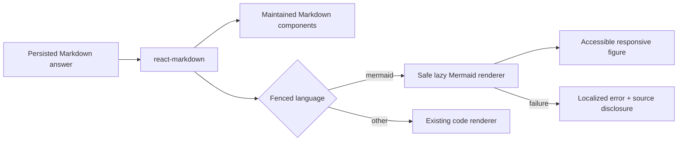
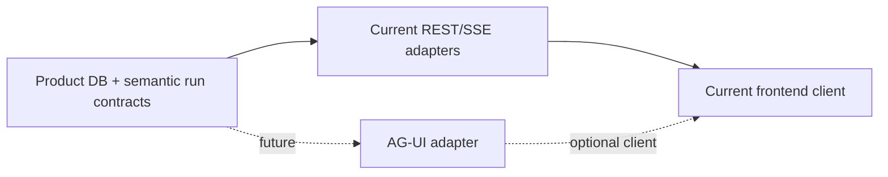

# Rich response rendering and future agent-UI boundaries

[한국어](../ko/30-rich-response-rendering-and-agent-ui-boundaries.md) | English

Status: **Proposed — second immediate cross-repository task managed from the backend roadmap.**
The first milestone is safe Mermaid rendering inside assistant Markdown. AG-UI and A2UI are future
adapter decisions, not dependencies for that milestone.

## Why this is needed

Assistant answers already use Markdown and the frontend renders common Markdown through
`react-markdown`. A fenced `mermaid` block, however, remains source code rather than a diagram.
This prevents architecture, request-flow, state, sequence, and data-relationship explanations from
using the visual form the model intentionally produced.

The immediate goal is not unrestricted generative UI. It is a reliable renderer catalog where
known answer parts have maintained, secure, accessible components and every enhancement has a
durable text fallback.

## Milestone 1: Mermaid inside Markdown answers

### Rendering contract

- Detect fenced code blocks whose normalized language is `mermaid` through the existing
  `react-markdown` component boundary. Other code blocks keep the current renderer.
- Render only after the closing fence is available, or after the answer settles. Do not repeatedly
  parse incomplete Mermaid syntax on every token.
- Load Mermaid lazily only when an answer contains a diagram; record the production bundle impact
  before accepting the dependency.
- Initialize at the application boundary with `startOnLoad=false` and `securityLevel="strict"`.
  Never use `loose` or `antiscript` for model-authored content, enable diagram click handlers, or
  allow a diagram to override secure site configuration.
- Enforce source length, edge, render-time, and rendered-size limits. One malformed or expensive
  diagram must fail locally without losing the surrounding answer.
- Generate collision-safe render IDs and cancel stale renders when streamed content, theme, route,
  or message identity changes.

### User experience

- While the fenced block is complete but rendering, show a compact diagram skeleton without moving
  the surrounding answer unpredictably.
- On success, render a responsive `figure` that fits its message width, permits vertical reading,
  and uses an explicit zoom/open affordance only if mobile evidence shows it is necessary.
- Provide an accessible name and a text alternative or source-code disclosure. SVG alone is not an
  adequate explanation for screen-reader, copy, print, or failed-render paths.
- On parse/render failure, show localized failure copy plus the original fenced source behind a
  disclosure. Never render raw Mermaid error HTML or stack traces.
- Preserve copy-answer behavior as Markdown source rather than copying generated SVG markup.
- Re-render with theme-safe Mermaid variables when the product theme changes, and verify contrast
  at 390, 768, and 1280 pixels.

### Security and quality caveats

- Model-generated diagram source is untrusted content even when it came from our own model.
- Mermaid's default `strict` security level encodes HTML labels and disables click functionality;
  weakening it would create a materially different security review.
- A syntactically valid diagram can still be misleading, unreadable, or too dense. Rendering does
  not verify the model's claims.
- Large Mermaid distributions can materially affect initial JavaScript. Compare full Mermaid,
  Mermaid Tiny, and route-local dynamic import against the diagram types the product promises.
- Server rendering is not required for the first slice. Keep browser-only rendering inside the
  smallest client component and avoid hydration-dependent changes to the surrounding Markdown.

## Renderer architecture

Persisted assistant Markdown remains the durable source of truth. Rendered SVG, component state,
and zoom state are derived frontend artifacts and do not enter Product DB.

## Future AG-UI integration boundary

AG-UI is an event-based agent-to-application protocol covering streamed text, tool calls, lifecycle,
state snapshots/deltas, activity updates, attachments, and human interaction. If interoperability
or richer bidirectional agent events become a product need, add an adapter at the current REST/SSE
transport edge:

The adapter must map existing run, message, trace, reasoning-summary, tool, artifact, and interaction
semantics. It must not replace Product DB transcripts/audit, weaken authorization/redaction, make
AG-UI event state the persistence model, or force the Mermaid milestone to change transports.
Adoption requires a written mapping and replay/resume/cancellation parity tests.

## Future A2UI integration boundary

A2UI describes UI through streamed declarative JSON messages with structure separated from data.
Consider it only when answers need model-selected interactive components beyond the maintained
renderer catalog—for example, a comparison table with controls, a review form, or an artifact
inspection surface.

Any A2UI slice must:

- use a versioned, closed application-owned component catalog;
- validate every component, property, binding, action, and data update before rendering;
- forbid arbitrary HTML, JavaScript, URLs, event handlers, style injection, and backend authority
  claims;
- map user actions back to typed application commands with normal authorization and confirmation;
- retain a Markdown/text fallback for unsupported clients, refresh, export, audit, and accessibility;
- remain an adapter/presentation artifact rather than the Product DB conversation or HITL domain
  model.

AG-UI and A2UI solve different layers: AG-UI standardizes agent/application events; A2UI describes
constrained generated surfaces. They can coexist later, but neither is necessary to render Mermaid.

## Implementation sequence

1. Audit the current assistant Markdown renderer, streaming behavior, sanitization, copy action,
   theme tokens, and code-block tests.
2. Record a dependency/bundle comparison and approve one Mermaid loading strategy.
3. Implement a leaf Mermaid component with strict security, bounded rendering, cancellation,
   theme support, accessible fallback, and error isolation.
4. Route only completed `mermaid` fences to it from the current Markdown code-block component.
5. Add unit fixtures for supported/invalid/oversized diagrams and browser tests for streaming,
   theme, resize, copy, print/fallback, and mobile overflow.
6. Document a renderer registry seam for future maintained answer components.
7. Write—but do not implement—an AG-UI mapping only when transport interoperability becomes an
   approved milestone.
8. Write—but do not implement—an A2UI catalog/security proposal only when dynamic interactive
   generated surfaces have a concrete use case that Markdown/Mermaid cannot satisfy.

## Definition of done

- Valid flowchart, sequence, state, and entity-relationship fixtures render as diagrams after their
  fences complete.
- Invalid, unsupported, oversized, or timed-out diagrams leave the answer readable and expose a
  safe source fallback.
- Model-authored Mermaid cannot enable HTML labels, links, callbacks, scripts, or insecure config.
- Streaming Markdown does not flicker, repeatedly throw parse errors, or lose auto-scroll intent.
- Light/dark themes, reduced motion, keyboard access, screen readers, narrow mobile widths, answer
  copy, refresh, and replay are covered.
- Non-Mermaid Markdown behavior is unchanged.
- Bundle cost and lazy-loading behavior are measured and recorded.
- AG-UI/A2UI remain optional future adapters with explicit adoption gates rather than implied
  dependencies.

References: [react-markdown component overrides](https://github.com/remarkjs/react-markdown),
[Mermaid usage and security](https://mermaid.js.org/config/usage),
[AG-UI overview](https://docs.ag-ui.com/), and [A2UI concepts](https://a2ui.org/concepts/overview/).
