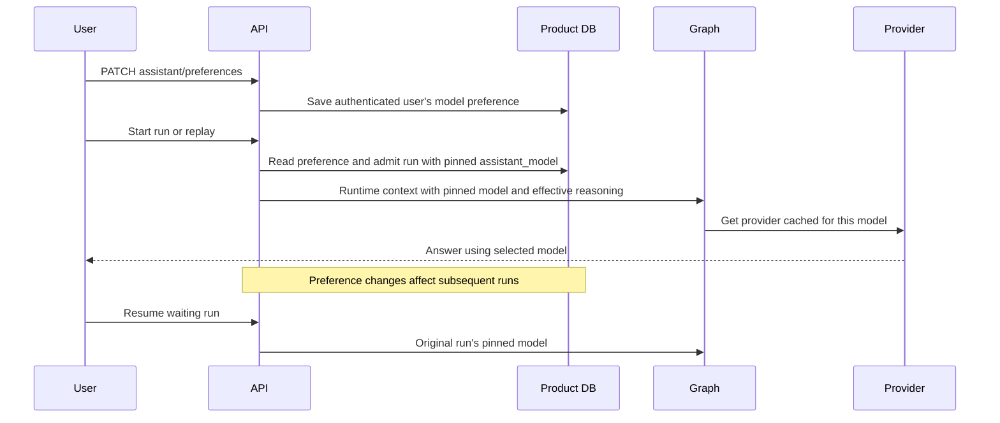

# Assistant model preferences

[한국어](../ko/35-assistant-model-preferences.md)

## Ownership and scope

Registered users can select an assistant model from the composer or settings page. Product DB
owns the preference, so both surfaces and later authenticated sessions use one value.
`MY_AGENTS_OPENAI_MODEL` remains the deployment fallback. Saving `null` resets to that fallback.
Guests cannot save a selection and always use the deployment fallback, standard mode, and its
application default effort. The backend ignores a guest preference even if a row contains one.

The preference affects ordinary assistant answer generation, including RAG and comprehensive
document answers. Temporary document-workspace attachment turns retain
`MY_AGENTS_DOCUMENT_WORKSPACE_MODEL`. Source-selection decisions, the internal RAG selector,
metadata enrichment, and embeddings retain their own server-owned configuration.

## API contract

All endpoints require authentication and the existing active-account/session checks.

- `GET /capabilities/assistant-models` returns `customizable`, `default_model`, and `models`.
  Each model has `id`, `name`, `default_reasoning_effort`, and `pro_supported`.
- `GET /assistant/preferences` returns `customizable`, `default_model`, nullable `selected_model`,
  and `effective_model`. A guest has `customizable=false`, `selected_model=null`, and the deployment
  default as `effective_model`.
- `PATCH /assistant/preferences` accepts exactly `{"assistant_model": "gpt-6.1-sol"}` or
  `{"assistant_model": null}`. The field is required; unknown fields and model IDs produce 422.
  Guests receive 403 `permission_denied`. The update targets only the authenticated user.
- `GET /capabilities/reasoning` uses the registered user's effective selected chat model.
  Its schema and seven public effort choices remain unchanged. Refetch it after changing model.

The API-supported catalog remains exactly:

`gpt-5.6-luna`, `gpt-6-luna`, `gpt-5.6-sol`, `gpt-6-sol`, `gpt-6.1-sol`, `gpt-6-astra`.

`EXPOSED_ASSISTANT_MODELS` must be a subset of `SUPPORTED_ASSISTANT_MODELS`; module loading
fails early for any unsupported exposed ID. It separately controls the `models` array served to the frontend:
`gpt-6.1-sol`, `gpt-6-luna`, `gpt-6-astra`, in that order. The frontend offers these three
explicit model choices; the API continues accepting all six supported IDs. Visibility is a
presentation policy, not an authorization boundary. Existing supported preferences and the
deployment fallback remain effective even when unadvertised; they are not reset or rejected.
The picker must still work when its current/default model is outside the advertised list,
without adding that model as a selectable option or treating a saved preference as a reset.
Default/current model IDs in preference metadata remain truthful. `null` still resets to the
actual deployment fallback, which may be an unadvertised model.

This is an application catalog, not account-specific provider access discovery. API credentials
and model access remain deployment prerequisites. Other operator-configured model IDs may still
serve as the deployment fallback; users cannot save arbitrary provider strings. A saved preference
that is no longer in the catalog falls back to the deployment model without rewriting the row.

Model IDs are public choices on this surface. This does not expose credentials, other users'
preferences, provider traces, or internal model inventory.

## Default effort and lifecycle

`my_agents/model_defaults.py` contains editable application default efforts. Luna/Sol seeds are
`medium` from their official model documentation; Astra retains the application `medium` seed.
Recommendations do not enforce application policy. Explicit registered reasoning choices and
replay inheritance remain available. GPT-6.1 Sol and Astra map `none`/`minimal` to `low`; the other
four models map `minimal` to `low` and preserve `none`.

Sync, stream, and replay resolve the current saved preference before admission. Changing a model
does not change the transcript or an existing run. Replay continues the existing transcript
replacement behavior and creates its replacement run using the current preference. HITL resume
uses the admitted run's model even after preference or deployment-default changes.

Run results, waiting/detail responses, summaries, and `run_started` expose nullable
`assistant_model`, the configured model ID actually used for that run's answer surface. Legacy
rows/events remain `null`; they are not backfilled with a guessed model. A legacy unpinned resume
uses the deployment fallback. The model ID is runtime context, not an ORM object in a checkpoint.
Provider instances are cached by model; no global Settings mutation switches users' requests.
The system prompt's model identity and request model are derived from the same selected settings.

## Migration and verification

Migration `20260930_0035` adds nullable `users.assistant_model_preference` and
`agent_runs.assistant_model`. Apply it before starting the updated application against an existing
database using the [migration runbook](./14-render-migration-and-rollback-notes.md).
Rollback drops these new columns and their preference/model-provenance data.

Offline coverage includes authenticated access, guest enforcement, catalog validation, user
isolation, reset, model defaults, six-model run/event metadata, replay, streaming, resume pinning,
provider cache/identity isolation, and SQLite upgrade/downgrade plus PostgreSQL offline SQL.
Live provider access, model quality, and deployment rollout need separate verification.

Verification on 2026-09-30: backend 745 passed / 13 skipped; Ruff lint/format passed. Claude
verified the frontend's served OpenAPI/Zod contracts and authenticated real-BFF flows against an
isolated deterministic backend. Frontend lint/typecheck/build and 388 unit tests passed; 17 targeted
browser tests passed. Full browser suite: 202 passed, 2 skipped, and 2 failures also reproduced on
clean develop (workspace file drop and transcript autoscroll). Temporary servers were stopped;
Implementation is tracked on develop. These checks do not establish live OpenAI access or model quality.

Exposed-catalog refinement: backend 747 passed / 13 skipped; lint/format passed. Claude reported
390 frontend unit tests and 21 targeted browser tests passing, plus typecheck/build. Existing
unexposed preferences/default reset are covered; no new migration or forced model change.
