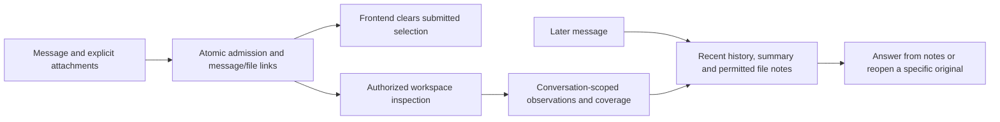

# Conversation continuity and temporary file recall

English | [한국어](../ko/36-conversation-continuity.md)

## Ownership and context policy

Product DB owns transcripts, explicit message/file associations, run provenance, and rebuildable
conversation summaries. These summaries belong to one conversation, including guest text
conversations; they do not enable user-global long-term memory or change its consent policy.
LangGraph checkpoints remain bounded to `run_id`.

The default policy uses up to 16,000 estimated recent-history tokens and a 64-message defensive
ceiling, with up to 32,000 estimated tokens at the assembled **text** boundary. Recent causal turns
remain verbatim. Older history compacts as needed before an answer, targeting roughly 8,000 recent
tokens afterward; summary bodies are bounded to 3,000 tokens and relevant file notes to 4,000.
Mandatory instructions and the current question are protected. Oversized current messages are
refused before admission. Native file/image token processing remains governed by provider limits
and existing attachment byte/count limits; text estimates are not exact provider token counts.

Tokenization uses the existing local `o200k_base` cache. If unavailable, a conservative UTF-8 byte
estimate avoids a network download during offline execution. Context estimates include rendered
prompt overhead. Summarization uses at most two bounded calls, each with a 30-second timeout.
Failures retain valid summaries and bounded recent text, mark omitted history, and continue
without inventing a replacement summary. Cancellation prevents installing the result.

Summaries record their exact covered prefix, digest, policy version, model, and source-message
references. Replay invalidates summaries when it changes their covered prefix. Source-derived
details are filtered when their supporting file is removed or document authorization is revoked.
Historical preparation, current delivery, and claim correctness remain separate. Existing legacy
delivery is unknown; the absence of current excerpts is not proof of an earlier grounding failure.
Private input manifests record counts/references, not raw prompts in general logs. Jev remains on
its existing human/assistant-only four-message, 4,000-character-per-message boundary.

## Models, public interfaces, and activity

`MY_AGENTS_SUMMARIZATION_MODEL` defaults to `gpt-6-luna`. Registered users can override it through
`GET/PATCH /summarization/preferences`; PATCH requires `{ "summarization_model": <supported ID or
null> }`, where null follows the deployment default. The four response fields match assistant
preferences: `customizable`, `default_model`, `selected_model`, `effective_model`. Guest GET is
locked and PATCH is 403. `GET /capabilities/summarization-models` serves the three exposed assistant
models as `{id,name}`, plus `recommended_model=gpt-6-luna`; all six supported IDs remain API-valid.
Luna is strongly recommended in Settings, not enforced. Standard reasoning uses the editable
model-default map independently of the answer's requested reasoning preferences.

Admission captures model choices. Automatic file access can leave `run_started.assistant_model`
unknown until `run_model_resolved` supplies the actual answer model and effective reasoning.
Compaction emits persisted/SSE `context_compaction_started`, `context_compaction_completed`, or
`context_compaction_failed` before retrieval/answering. Payloads contain policy, model, count and
fallback metadata; they never expose summary bodies. Terminal counts describe messages compacted.
Cancellation remains a terminal run state, not a continuing fallback answer.

An optional UUID `client_request_id` correlates the request, started event, and run list. It is
unique per user and cannot be reused to create another run (409). It is a correlation mechanism,
not automatic replay: after a lost admission acknowledgement the UI finds that exact ID and never
automatically resends. Legacy runs without an ID remain ambiguous.

## Attachments and retention

The original bytes remain in OpenAI Files, with a seven-day fixed upload-relative expiry for new
uploads. Existing uploads keep their recorded expiry. Workspaces retain the 20-minute idle lifetime
and can be recreated from an available original. Unsubmitted uploads become unavailable after
24 hours and enter cleanup. Compact notes survive normal original expiry until conversation
deletion. They describe provider-reported findings/coverage, not independently verified facts or a
complete copy of the original. Failed runs do not supply notes to future context.

Registered-user recall uses only submitted files owned by this conversation. Explicit current
attachments take precedence. Ordinary discussion uses the selected assistant; exact checking or
editing reopens authorized originals through the separately configured workspace model. Praise or
unrelated requests do not reopen files. V2 `attachment_selection` resolves ambiguity using offered
IDs; `access=notes` can use retained discussion after expiry, while `access=original` requires an
available source. Options include filename, category, availability, and optional size/date.
If exact work needs an expired file, explain the limitation rather than guessing its contents.
Workspace file storage, notes, and recall are forbidden to guests.

`MessageResponse.attachments` contains explicit user-message associations, with empty lists for
legacy/unattached/guest messages. Run attachments also record automatic reuse. A queue owns its
snapshot; acknowledgement clears only that submission's IDs. Pre-admission failures preserve the
draft/selection, and failures after admission do not silently resubmit. Capability fields declare
the original TTL, abandoned-upload TTL, conversation note retention, and automatic-recall support.

Removing a file immediately revokes application access, removes its notes, invalidates derived
summaries, and schedules original/container-copy/derived-artifact erasure. Historical chat text is
still visible; affected source replies are excluded from future context. Conversation deletion
removes the transcript and derived records and schedules provider cleanup before losing IDs.
Active runs must be stopped before file/conversation removal. Cleanup is a durable leased outbox
with a minute-period sweeper and retries; provider outages can delay physical deletion. No raw
uploaded bytes are stored in Product DB. Unselected input copies are removed before workspace
reuse, while unrelated generated outputs retain their existing short lifetime.

## Rollout and verification

Apply Alembic `20260930_0036` before starting an existing DB. Drain/cancel old V2 waiting runs before
deploying graph version `general-assistant-checkpoint-v3`; incompatible checkpoints use the existing
safe failure contract. `MY_AGENTS_CONTEXT_CONTINUITY_ENABLED=false` restores bounded legacy history
and disables automatic recall; existing explicit workspace inputs remain supported.

Offline tests cover context packing, prefix reuse/failure, preferences, guest boundaries,
admission correlation, automatic recall, semantic selection/resume, cleanup and transaction failure
recovery. Verification adapters and the live frontend proxy prove contracts/workflows, not model
fidelity. Actual summary quality, cost, and latency require representative provider evaluation.
The existing request-bound SSE execution limitation remains; this change does not add a durable
background answer executor. Generated-file durability and attachment-free artifact generation
remain separate work.

Implementation-time evidence (2026-09-30): backend full suite 786 passed / 13 skipped; final
affected checks 48 passed / 1 skipped; lint/format passed. Frontend 425 unit tests and final
browser suite 229 passed / 2 skipped / 2 independently confirmed baseline failures. Real
BFF/UI stand-in checks include original/notes selection and refresh recovery. No real provider
fidelity or deployed-release claim is made. The owner subsequently reported browser testing and
approved commit/push. Publication evidence is preserved in the
[completion record](../../completed/conversation-continuity.md).
