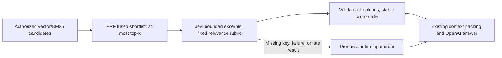

# Jev evidence reranking

[한국어](../ko/37-jev-evidence-reranking.md)

ContextForge defaults to Jev as its second-stage reranker. Vector/BM25 candidate gathering,
permission filtering, RRF fusion, context packing, answer composition, and citations retain
their existing responsibilities. Jev changes candidate order; it cannot authorize, invent,
or remove candidates. Cross-encoder and deterministic modes remain alternatives, not a cascade.

## Configuration and provider boundary

| Setting | Default | Meaning |
| --- | --- | --- |
| `MY_AGENTS_RERANKER_MODE` | `jev` | `jev`, `deterministic`, or `cross_encoder` |
| `MY_AGENTS_RERANKER_TOP_K` | `40` | Existing shortlist limit, applied before reranking |
| `MY_AGENTS_JEV_RERANKER_BATCH_SIZE` | `8` | Maximum candidates per request, 1–40 |
| `MY_AGENTS_JEV_RERANKER_MAX_INPUT_BYTES` | `24000` | Entire serialized request UTF-8 budget, 4096–24000 |
| `MY_AGENTS_JEV_RERANKER_MAX_EXCERPT_BYTES` | `3000` | Per-excerpt UTF-8 budget, 256–8000 |
| `MY_AGENTS_JEV_TIMEOUT_SECONDS` | `10` | Shared elapsed budget across reranking batches |

Set `OPENROUTER_API_KEY` locally. Reranking is independent of `MY_AGENTS_DECISION_PROVIDER`.
An existing explicit reranker environment value overrides the new default. Deterministic
response mode builds an offline deterministic reranker instead of Jev. Explicit cross-encoder
mode retains its lazy model loading. No dependency or database migration is added.

The score adapter in `my_agents/decisions.py` calls
`https://openrouter.ai/api/alpha/decisions` with pinned `typesafe/jev-1.13`, one `score` question
per candidate and a shared state. State contains only the rewritten query, synthetic candidate
IDs, clipped authorized excerpts, and clipping flags. IDs are named explicitly in question
instructions. Application IDs, filenames, titles, KB identities, conversations, summaries,
file notes, and long-term memory are not added to this state. Excerpt text itself can contain
sensitive document content; authorized excerpts now cross the OpenRouter/TypeSafe boundary.

## Ranking and failure semantics

The five-level rubric runs from unrelated/unusable evidence (`0`) to direct support matching
the question's identifiers and constraints (`4`). Fractional provider scores are valid. They
are ranking signals, not calibrated confidence, retrieval similarity, or authorization.
All questions use the same rubric; stable ties retain input order. Original chunk identity,
text, citations, and retrieval scores remain intact. Answer-mode relevance thresholds continue
to use original retrieval scores. Truncated judgments add `jev:excerpt_truncated` evidence.

Batches shrink to fit the serialized UTF-8 budget. A query over 4096 UTF-8 bytes or a candidate
that cannot fit causes whole-pass fallback. Byte limits are conservative request bounds, not
model-tokenizer windows; useful tail evidence may be absent from clipped excerpts.

Every response must contain exactly the requested IDs and finite numeric scores in `0..4`.
Missing credentials, malformed output, HTTP/provider errors, or deadline exhaustion discard
all partial scores and preserve the complete original order. There are no retries or automatic
cross-encoder downloads. Each HTTP phase uses the remaining shared timeout; results arriving
after the deadline are discarded, but this is not an interruptible hard wall-clock limit for
an in-flight synchronous request. Errors log only safe reasons/exception classes.

Existing retrieval evidence/timing report `jev` or `jev_fallback_deterministic`. Fallback
diagnostics are local to the calling request. No frontend contract or preference API changes.

## Verification and remaining evidence

`tests/test_jev_reranking.py` uses fake credentials and mocked HTTP to verify wire shape,
reordering, identity preservation, stable ties, Unicode/request budgets, partial failures,
deadlines, no retries, offline behavior, redacted diagnostics, and permission-first shortlist
handoff. Existing permission-aware retrieval tests remain part of the full offline suite.
Live Jev quality, latency, cost, batch consistency, and superiority to a cross-encoder have
not been established. Compare Korean, English, code, identifier/date/version constraints,
and evidence beyond the clipped prefix before treating the new default as a quality result.

Provider contract: [Jev decision types](https://openrouter.ai/blog/insights/what-is-jev/).
