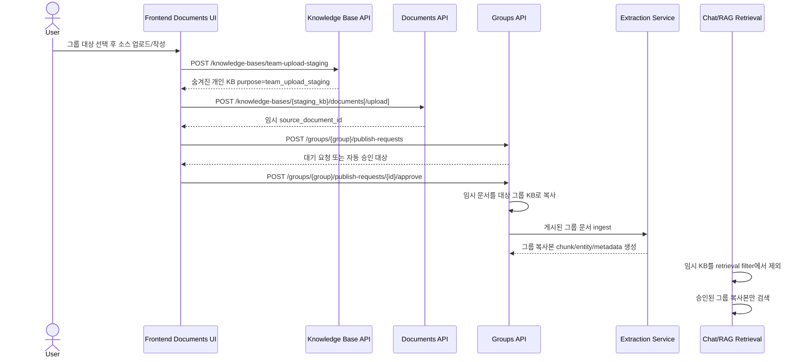
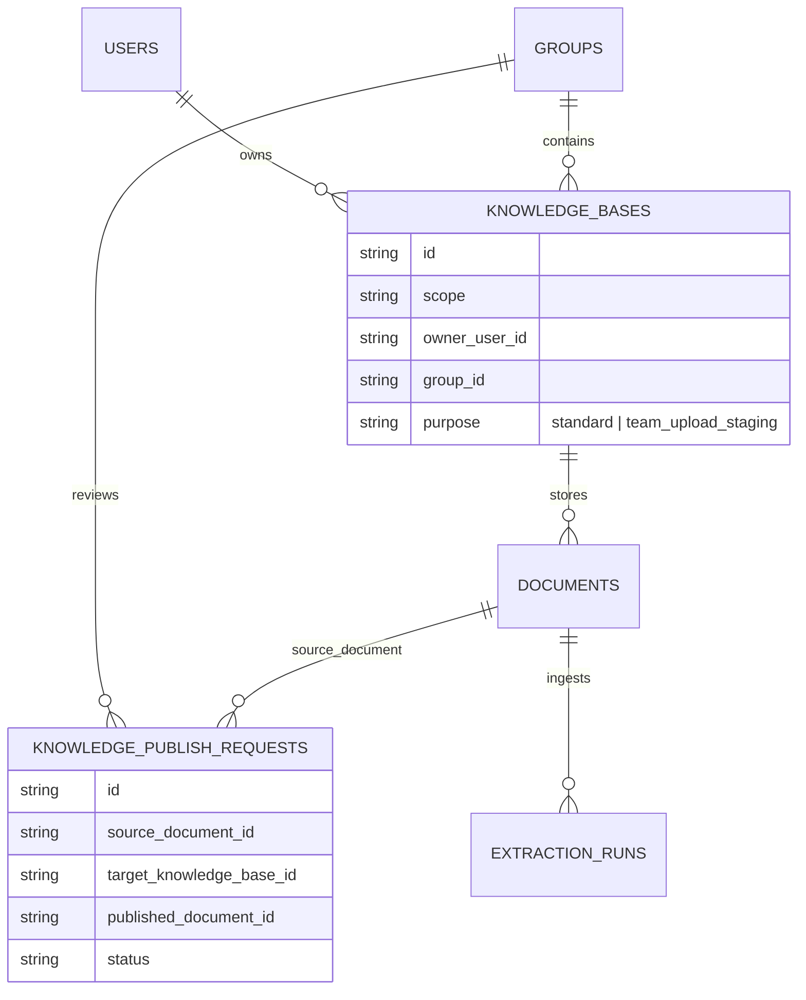

# 그룹 업로드 임시 저장 흐름

이 문서는 그룹 문서 업로드에 대한 아키텍처 결정을 기록합니다. 사람과 AI agent가 나중에 읽어도 서비스 흐름과 RAG 경계를 빠르게 이해할 수 있도록 작성했습니다.

## 결정

그룹 업로드는 숨겨진 개인 `team_upload_staging` 지식 베이스를 비공개 임시 저장소로 사용합니다. 이 임시 KB는 직접 ID로 문서 작성/업로드를 받을 수 있지만, 일반 지식 베이스 목록, 채팅 출처 선택, RAG retrieval에서는 제외됩니다. 공유 요청이 승인되면 backend가 임시 문서를 대상 그룹 지식 베이스로 복사하고, 그 그룹 복사본을 ingest합니다. Retrieval에서 인용되는 정식 출처는 승인된 그룹 복사본입니다.

## 이유

그룹 KB에 직접 업로드하면 승인 경계를 우회합니다. 반대로 일반 개인 KB에 업로드한 뒤 그룹 KB로 복사하면 업로더가 개인 원본과 그룹 복사본을 모두 retrieval할 수 있어 citation 중복과 RAG 혼선이 생깁니다. 숨겨진 임시 KB는 승인 흐름을 유지하면서 임시 원본이 Ask retrieval에 섞이지 않게 합니다.

## 서비스 흐름

## 저장 구조

## 불변 조건

- `purpose=team_upload_staging`은 개인 전용, owner-scoped이며 `GET /knowledge-bases`에서 숨깁니다.
- 임시 KB는 KB-scoped document create/upload path에서 직접 ID로 작성할 수 있습니다.
- 채팅 selected-mode는 임시 KB ID를 거부합니다.
- 채팅 all-mode와 retrieval filter는 `purpose=standard` KB만 count/select합니다.
- 전체 KB 공유 요청은 standard 개인 KB만 허용합니다. 임시 문서는 document-copy 공유 요청의 source document로만 사용할 수 있습니다.
- 그룹 승인 시 source document를 대상 그룹 KB로 복사하고, 그 그룹 복사본을 ingest합니다.
- 임시 문서는 비공개 audit/source buffer로 남을 수 있지만 Ask retrieval에서 citation으로 노출되면 안 됩니다.
- 요청자는 pending publish request를 `cancelled`로 취소하고 나중에 새 요청을 보낼 수 있습니다.
- 승인 전에 임시 source를 삭제하면 pending publish request는 withdrawn이 되고 source snapshot은 보존됩니다. 승인 후 source 삭제는 group copy를 삭제하지 않습니다. 승인된 group copy 삭제는 foreign key 오류를 내지 않고 이력 request의 `published_document_id`를 비웁니다.

## 코드 맵

- `my_agents/knowledge/models.py`: `KnowledgeBasePurpose`, `KnowledgeBaseModel.purpose`.
- `my_agents/api/knowledge_bases.py`: `POST /knowledge-bases/team-upload-staging`, 숨김 목록 동작.
- `my_agents/knowledge/auth.py`: retrieval/selectability filter, 채팅 선택 거부.
- `my_agents/knowledge/retrieval.py`: RAG scope filter에서 standard KB purpose 요구.
- `my_agents/api/groups.py`: 승인 시 임시 문서를 그룹 KB로 복사, 전체 KB 공유는 standard-only.
- `alembic/versions/20260607_0017_knowledge_base_purpose.py`: production schema migration.
- `tests/test_kb_nested_document_routes.py`: 숨김 임시 저장, retrieval 제외, publish 가능성 regression coverage.
