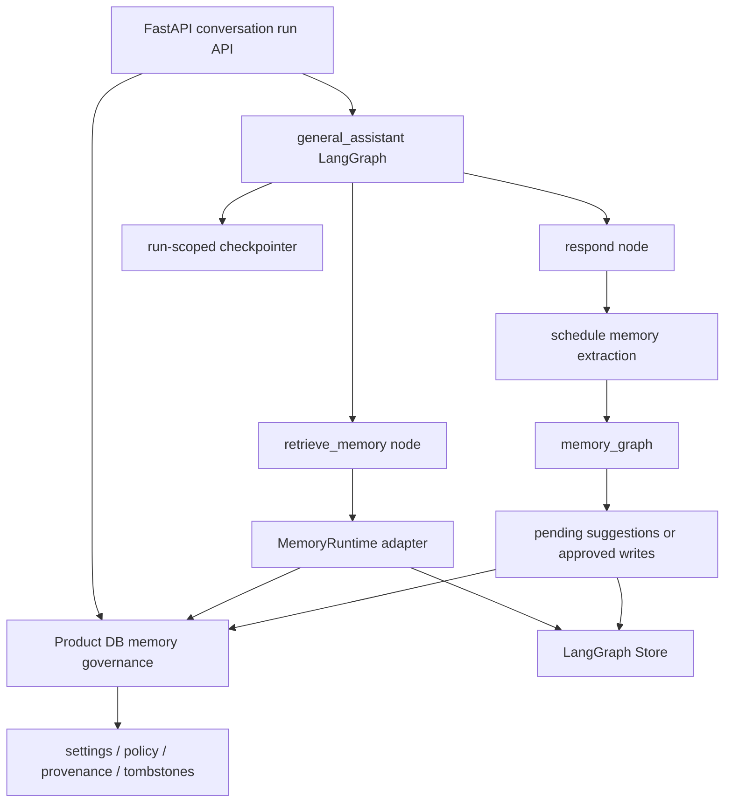

# LangGraph-native memory migration note

상태: Store/checkpointer runtime은 opt-in flag 뒤에 구현됨, memory graph는 계획 단계

날짜: 2026-06-10

이 문서는 현재 `my-agents` memory 구현을 LangChain `memory-template` 패턴과 비교한 뒤 정리한
memory architecture 방향입니다.

## 결정 요약

현재 memory 구현은 안전한 V1 governance layer입니다. 하지만 이 프로젝트가 LangGraph 기반 agent
backend를 목표로 한다면, long-term memory recall/extraction runtime은 점진적으로 LangGraph native
primitive에 가까워져야 합니다.

목표 역할 분리는 다음과 같습니다.

| Concern | 장기 owner | 이유 |
| --- | --- | --- |
| visible conversation, final assistant message, citation, run event | Product DB | frontend/product/audit source of truth입니다. |
| opt-in, setting, delete/deactivate, provenance, source-staleness policy | Product DB governance layer | user control, compliance, product safety 영역입니다. |
| active memory storage/search runtime | LangGraph Store 또는 compatible adapter | memory runtime을 LangGraph pattern에 맞춥니다. |
| memory extraction/update workflow | 별도 LangGraph `memory_graph` | memory formation을 답변 hot path에서 분리합니다. |
| HITL/resume/interruption state | run-scoped LangGraph checkpointer | checkpointer는 execution state이지 transcript/history/memory store가 아닙니다. |

요약하면:

```text
Product DB = product truth + memory governance ledger
LangGraph Store = long-term memory runtime
LangGraph memory_graph = extraction/update workflow
LangGraph checkpointer = run-scoped execution/HITL state
```

2026-08-17 구현 업데이트: `general_assistant`에는 graph-owned memory recall, Product DB
governance로 항상 재검증하는 PostgresStore semantic projection, document-selection interrupt를
위한 run-scoped PostgresSaver가 있습니다. 두 persistence surface는 setup/reconciliation이
성공하기 전까지 기본적으로 꺼져 있습니다. 별도 extraction/update `memory_graph`는 이후 phase입니다.

## 왜 migration이 필요한가

현재 V1은 SQLAlchemy table에 memory record를 저장하고 service layer에서 필터링한 뒤
`memory_context`를 general assistant graph에 주입하던 구조였습니다. 이는 의도적으로 보수적인 구현입니다.
Opt-in, confirm/reject suggestion, deletion scrub, transcript/document source invalidation이 명확합니다.

첫 migration slice에서는 Product DB governance를 유지하면서 recall orchestration을 graph 안으로 옮겼습니다.
이제 graph는 FastAPI가 완성해서 넘긴 memory context를 받는 대신 runtime adapter를 호출합니다.

하지만 이 상태가 최종 구조가 되면 다음 문제가 생깁니다.

- FastAPI/service layer가 memory runtime이 됩니다.
- memory retrieval이 graph node가 아니라 graph invocation 이전 preprocessing이 됩니다.
- memory extraction이 debounced/background graph로 분리되어 있지 않습니다.
- recall이 LangGraph Store semantic search가 아니라 deterministic token relevance에 가깝습니다.
- memory schema가 configurable memory type이 아니라 고정 product category에 묶입니다.

따라서 현재 구현은 안전한 첫 milestone으로는 적절하지만, 최종 endpoint로 보지는 않습니다.

## `langchain-ai/memory-template`에서 가져올 패턴

Reference: [`langchain-ai/memory-template`](https://github.com/langchain-ai/memory-template).

Template은 chat graph와 memory graph를 분리합니다.

1. chatbot graph가 답변하고 LangGraph Store에서 user memory를 검색합니다.
2. chat turn 이후 scheduled/debounced memory run을 enqueue합니다.
3. memory graph가 configured memory type을 extract/update합니다.
4. schema는 patch-style profile document와 insert-style event note를 지원합니다.

`my-agents`도 이 모양을 점진적으로 채택하되 그대로 복사하지는 않습니다. 이 제품에는 template에 부족한
explicit consent, provenance, source invalidation, user-facing review API가 필요합니다.

## 유지해야 하는 V1 동작

아래는 migration 이후에도 유지해야 하는 product/governance guarantee입니다.

- memory는 user별로 기본 disabled입니다.
- user는 memory/suggestion을 review, deactivate, delete, confirm, reject할 수 있습니다.
- public API write는 arbitrary provenance, value payload, TTL을 주장할 수 없습니다.
- sensitive memory candidate는 deterministic policy gate에서 reject됩니다.
- deleted memory content/value는 minimal tombstone으로 scrub됩니다.
- confirmed/rejected/expired suggestion도 proposed content를 scrub합니다.
- document-derived memory는 `source_document_id`가 필요하고 source document 삭제 시 stale 처리됩니다.
- conversation replay/delete는 source row 삭제 전에 transcript-sourced memory를 stale 처리합니다.
- provider prompt는 memory/document snippet을 instruction이 아니라 untrusted context로 취급합니다.
- 최신 conversation은 conflicting stored memory보다 우선하고, document-grounded claim은 authorized document가 우선합니다.
- completed/failed run은 내부 audit용 redacted memory-source snapshot을 저장할 수 있지만,
  frontend-visible run event에는 memory count/category/provenance type만 노출합니다.

## Target architecture



핵심 변경 방향:

- `general_assistant`는 FastAPI가 완성해서 넘긴 `memory_context`를 받기보다 graph 안에서 memory를 retrieve해야 합니다.
- 별도 `memory_graph`가 turn 이후 memory candidate를 추출해야 합니다.
- 첫 memory-graph milestone은 active memory를 조용히 저장하지 말고 pending suggestion을 생성해야 합니다.
- approved/explicit memory는 LangGraph Store에 쓰고 Product DB governance ledger에 mirror합니다.
- checkpointer는 run-scoped execution/HITL resume 용도이며 conversation history나 long-term memory store가 아닙니다.

## Migration phases

### Phase 0 — 현재 V1 governance layer

이미 merged된 상태:

- settings, memories, suggestions, lifecycle metadata, source ID, stale/delete state SQLAlchemy model;
- settings, memory CRUD, suggestion confirm/reject API;
- 초기 service-layer recall/conflict detection. 현재는 같은 governance filter를 유지한 채 Phase 2의
  graph-owned recall node가 대체합니다;
- redacted run snapshot;
- document deletion과 transcript replay/delete의 source invalidation.

Known limitation: LangGraph-native runtime memory가 아니라 product-owned runtime memory입니다.

### Phase 1 — memory runtime boundary 추가

시작되었습니다. Persistence를 바꾸기 전에 작은 recall interface를 둡니다.

```python
class MemoryRuntime(Protocol):
    def search(self, *, user_id: str, query: str, limit: int) -> list[MemoryItem]: ...
```

초기 adapter는 기존 Product DB table을 `UserMemoryService`를 통해 감쌉니다. 중요한 것은 graph/API code 전반에
direct table/service assumption이 퍼지지 않게 하는 것입니다. Write/delete runtime method는 `memory_graph`나
Store-backed write를 도입할 때 추가합니다.

### Phase 2 — recall을 graph node로 이동

시작되었습니다. Response generation 이전에 graph node가 추가되었습니다.

```text
classify_request -> retrieve_memory -> respond_general/respond_research
```

Node는 LangGraph runtime context에서 `user_id`와 `MemoryRuntime`을 받고, latest user text는 graph state에서 읽습니다.
그 뒤 `MemoryRuntime.search`를 호출해 compact `memory_context`와 `source_conflicts`를 출력합니다.

### Phase 3 — extraction용 `memory_graph` 추가

`memory-template`에서 영감을 받은 별도 LangGraph workflow를 `my_agents/agents/memory_graph/`에 둡니다.

- input: recent conversation/run context와 authorized source metadata;
- output: candidate memory suggestions;
- default behavior: auto-activate가 아니라 suggest-confirm;
- persistence 전 deterministic policy gate 적용;
- candidate는 source conversation/message/run/document provenance 유지.

### Phase 4 — active memory runtime을 LangGraph Store로 이동

Active memory storage/search를 LangGraph Store 또는 compatible adapter로 이동합니다. Product DB는 governance metadata를
유지하고 다음 중 하나를 담당합니다.

1. store namespace/key와 status/provenance/stale/delete state mirror;
2. Store result를 prompt에 넣기 전 filtering하는 authorization/provenance index.

Namespace는 LangGraph example에 가까운 다음 모양을 선호합니다.

```text
("memories", user_id, memory_type)
```

전환 중 기존 SQL namespace shape을 유지한다면 mapping을 명시적으로 문서화하고, Store-backed search가 활성화될 때
migration합니다.

### Phase 5 — HITL/resume용 run-scoped checkpointer 추가

`MY_AGENTS_CHECKPOINTER_ENABLED` 뒤에 구현했습니다. Assistant workflow는 `run_id`를 thread
boundary로 사용하고, 제한된 최근 6개 message window와 primitive retrieval/interaction snapshot만
checkpoint합니다. Terminal run의 checkpoint는 삭제합니다. 모호한 document request는
`waiting_for_input`으로 멈추고 authorized document selection을 노출한 뒤, 현재 permission을 다시
확인하고 같은 run을 재개할 수 있습니다.
Public waiting/resume payload는 [Agent와 frontend 사이의 interaction 계약](./27-agent-frontend-interaction-contract.md)의
versioned semantic contract를 따릅니다.

## Non-goals

- LangGraph checkpointer를 conversation-history store로 쓰지 않습니다.
- LangGraph Store가 opt-in/delete/deactivate/source-staleness policy를 우회하게 두지 않습니다.
- 별도 제품 결정 전에는 chat에서 memory를 조용히 auto-store하지 않습니다.
- Store/checkpointer가 들어와도 Product DB run/citation/event/source-snapshot record는 제거하지 않습니다.

## 이 문서가 해결하는 충돌

- “LangGraph checkpointer를 app-owned conversation memory source of truth로 쓴다”는 오래된 표현은 폐기합니다.
  Checkpointer는 run resume/HITL을 위한 execution-state artifact입니다.
- 현재 Product DB memory table은 V1 governance/runtime scaffolding이며 최종 LangGraph-native memory runtime이 아닙니다.
- 앞으로 문서는 Product DB와 LangGraph Store를 competing persistence가 아니라 complementary layer로 설명해야 합니다.
