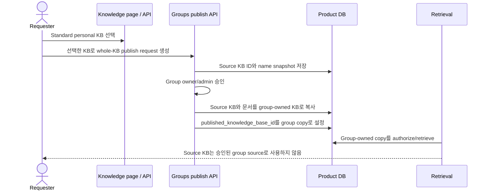

# 지식 관리 lifecycle와 publish copy 계약

[English](../en/24-knowledge-lifecycle-and-publish-copy-contract.md) | 한국어

이 문서는 Knowledge management UX 작업 이후의 지식 공간 이름 변경/삭제, 문서 preview, publish request copy semantics를 제품 계약으로 기록합니다.

## 사용자에게 보이는 계약

- Knowledge 페이지가 생성과 source 관리의 중심 surface입니다. 사용자는 선택한 지식 공간이나 문서에서 이름 변경, 삭제, 문서 detail, 문서의 Markdown/internal representation preview, 공유 요청 생성을 수행합니다.
- Groups 페이지는 review/status 중심입니다. 그룹 owner/admin은 여기서 publish request를 승인, 거절, 검토합니다. 요청 생성 과정에서 사용자가 document ID나 knowledge-base ID를 직접 입력하면 안 됩니다.
- 공유 요청 생성은 UI에서 선택된 entity를 사용합니다. 필요한 값은 group selector, target group knowledge space selector, 그리고 현재 선택된 source document 또는 source knowledge space입니다.
- 삭제는 즉시 수행됩니다. 이 계약에는 trash/restore workflow가 없습니다.

## Backend 불변 조건

- 일반 API로 이름 변경/삭제할 수 있는 대상은 lifecycle-manageable standard knowledge base뿐입니다. 숨겨진 `team_upload_staging` KB는 내부 buffer로 남고 일반 관리 흐름에서 제외됩니다.
- 이름 변경 input은 저장 전에 trim되며, 빈 이름은 거부됩니다.
- 문서 목록 response는 가볍게 유지하고 full source content를 포함하지 않습니다. 권한 있는 문서의 전체 display/internal Markdown representation이 필요하면 KB-scoped preview endpoint를 사용합니다.

```text
GET /knowledge-bases/{knowledge_base_id}/documents/{document_id}/preview
```

- Pending publish request는 source 삭제 이후에도 이력을 이해할 수 있도록 source snapshot을 보존합니다. 승인 전 source document나 source KB를 삭제하면 요청은 withdrawn 상태가 됩니다.
- Approved publish request에서는 group-owned published copy가 retrieval의 정식 source of record입니다. 승인 후 원본 source를 삭제해도 published group copy는 삭제되지 않습니다.
- 나중에 group manager가 승인된 group copy를 삭제하면 publish-request 이력은 남기고 live `published_document_id` 또는 `published_knowledge_base_id` pointer를 비웁니다. published-name snapshot은 유지됩니다.

## 전체 KB publication flow



전체 KB approval은 requester의 personal KB 자체를 group-readable source로 열지 않고 group-scoped KB copy를 만듭니다. 그래서 requester는 나중에 개인 원본을 수정/삭제할 수 있고, group owner/admin은 published group copy를 독립적으로 관리할 수 있습니다.

## Legacy backfill

과거 approved whole-KB publication row는 아직 personal source KB를 published target처럼 가리킬 수 있습니다. 새 retrieval 계약에 의존하기 전에 이런 row를 group-owned copy로 migration해야 합니다.

먼저 migration 요약을 확인합니다.

```bash
uv run python -m scripts.backfill_kb_publication_copies --dry-run
```

JSON summary를 검토하고 환경에 맞는 backup/snapshot을 준비한 뒤에만 적용합니다.

```bash
uv run python -m scripts.backfill_kb_publication_copies --apply
```

현재 retrieval path는 legacy personal-KB publication row를 권한으로 사용하지 않습니다. Backfill은 새 group-owned-copy 경계를 지키면서 historical row를 계속 유용하게 만듭니다.

## 코드와 테스트 맵

- `my_agents/api/knowledge_bases.py` — KB 이름 변경/삭제, lifecycle guard, publish-request detachment, document preview.
- `my_agents/api/groups.py` — publish-request 생성, whole-KB approval copy, response snapshot.
- `my_agents/knowledge/publication_copies.py` — 재사용 가능한 copy/backfill helper.
- `scripts/backfill_kb_publication_copies.py` — legacy row용 dry-run/apply operator script.
- `tests/test_kb_nested_document_routes.py` — preview scoping, blank-name rejection, KB lifecycle/delete guard.
- `tests/test_publish_requests.py` — source 삭제, hidden-source bypass 방지, whole-KB copy semantics.
- `tests/test_kb_publication_backfill.py` — legacy publication backfill behavior.
